# 角度交会 rjs:高阶可观测值

> 原文：<https://javascript.plainenglish.io/angular-meets-rxjs-higher-order-observables-632e560ce2d0?source=collection_archive---------5----------------------->

Photo by [David Reger](https://unsplash.com/@regeris?utm_source=medium&utm_medium=referral) on [Unsplash](https://unsplash.com?utm_source=medium&utm_medium=referral)

# 介绍

本文属于一个名为**Angular meeting RxJS**的系列，在这个系列中，我尽我所能在“Angular”的上下文中解释使用“RxJS”的反应式编程。

# 目录

[基本概念](/angular-meets-rxjs-basic-concepts-f178d8fe0e02)
[RxJS 科目](/angular-meets-rxjs-rxjs-subjects-32cac1b2c8d3)
RxJS 运算符(第 1 部分)
RxJS 运算符(第 2 部分)
[RxJS 运算符(第 3 部分)](https://ssougnez.medium.com/angular-meets-rxjs-rxjs-operators-e64caa5f72e7)[【take 直至】和【async】pipe](/angular-meets-rxjs-takeuntil-and-the-async-pipe-4d9c6e3d5c2d)
高阶可观测值
T21【错误处理】RxJS 调度器(即将到来)【T2

# 在本文中

正如我们在关于[“rjs”运算符](/angular-meets-rxjs-rxjs-operators-part-1-9e9751a9373e)的文章中看到的，“JavaScript”中的高阶函数是接受参数中的另一个函数或返回一个函数。可观测性也存在同样的概念。在本文中，我们将了解为什么理解它们是绝对重要的，以及如何使用它们来简化和保护管道。

# 形势

让我们以一个常见的情况作为本文的基础。假设您正在构建一个“中型”克隆，以允许人们写一些文章。“中”的一个很好的特性是它定期自动保存您的文档。

为了模拟 REST API，我将使用“[JSON-server](https://www.npmjs.com/package/json-server)”NPM 包。如果您不知道，它是一个非常有用的包，提供了一个基于“JSON”文件的 REST API。

下面是设置它所需的步骤，如果您不想在您的计算机上复制本文的示例，您可以跳过这些步骤。

通过运行以下命令，从全局安装“json-server”开始:

> 纱线全局添加 JSON-服务器

完成后，创建一个名为“db.json”的文件，其内容如下:

接下来，在您创建上述文件的文件夹中打开一个终端，并运行以下命令:

> json-server db.json - watch

这将启动“JSON”服务器，并允许您在 URL“http://localhost:3000”访问 REST API。它会根据“db.json”文件的结构自动生成路线。例如，您可以通过浏览 URL“[localhost:3000/documents](http://localhost:3000/documents)”来获取所有文档，也可以通过浏览 URL“[localhost:3000/documents/1](http://localhost:3000/documents/1)”来按 id 获取文档。

为了能够调用这个 REST API，要执行的最后一步是在我们的“app.module”文件中导入“HttpClientModule ”:

# 问题是

现在，我们已经设置了项目，让我们实现 autosave 特性。为了简单起见，REST API 调用将简单地更新字段“lastUpdate ”,而不是文档的内容。

根据我们到目前为止所学的一切，我们可以试着像这样编写 autosave 函数:

> 如果你想知道什么是“BaseComponent”和“this.destroy$”，可以看看[这篇文章](/angular-meets-rxjs-takeuntil-and-the-async-pipe-4d9c6e3d5c2d)。

这里的想法是使用" [interval](/angular-meets-rxjs-rxjs-operators-part-1-9e9751a9373e) "操作符创建一个可观察对象，以便每秒发出一次值(在现实生活中，您可能希望不那么频繁地保存文档)。我们使用“ [takeUntil](https://ssougnez.medium.com/angular-meets-rxjs-takeuntil-and-the-async-pipe-4d9c6e3d5c2d) ”操作符，以便在组件被销毁时取消订阅可观察对象。最后，我们简单地将每个值映射到 HTTP 客户机的“put”函数返回的可观察值，该函数用于更新“db.json”文件中的文档。

让我们执行这段代码，几秒钟后调用 URL "[localhost:3000/documents/1](http://localhost:3000/documents/1)"来查看文档是否得到了更新。

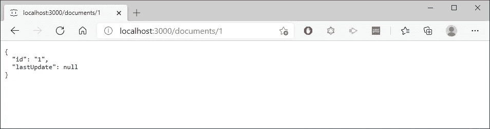

嗯，它没有，但是，如果你看看控制台，你会看到两个“文件保存！”日志已经写好了，那么这里发生了什么呢？

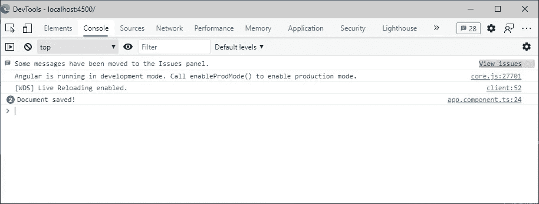

理解发生了什么的一个好方法是记录在“subscribe”方法中收到的值，而不是消息“Document saved！”也许这能给我们一些线索。

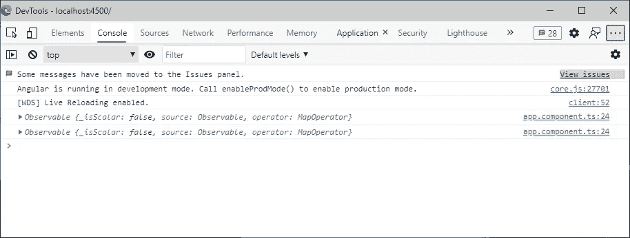

这很有意思……通常情况下，当你使用“json-server”调用一个“PUT”路由时，这个会返回更新后的对象，那么为什么我们会收到一个 observable 而不是这个对象呢？嗯，这很简单，" [map](https://ssougnez.medium.com/angular-meets-rxjs-rxjs-operators-60d8b2140d20) "操作符发出由源可观测值发出的值的投影，所以在这里，对于由"[区间](/angular-meets-rxjs-rxjs-operators-part-1-9e9751a9373e)"发出的每个值，" [map](https://ssougnez.medium.com/angular-meets-rxjs-rxjs-operators-60d8b2140d20) "操作符返回由" HttpClient "的" put "函数返回的可观测值。

然而,“HttpClient”返回的 observables 是[冷的](/angular-meets-rxjs-basic-concepts-f178d8fe0e02),这意味着它们不会做任何事情，直到您订阅它们，在这种情况下，我们不做，所以对 REST API 的调用实际上从未被触发。你可以通过查看“谷歌开发者控制台”中“网络”部分的“XHR”标签很容易地确认这一点:

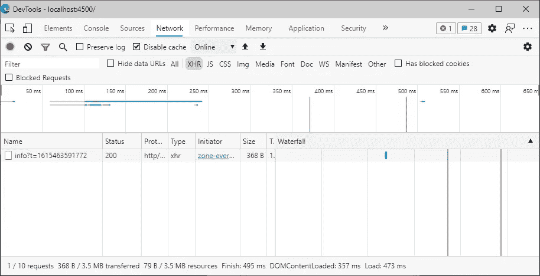

除了“ng serve”发出的自动刷新你页面的调用之外，我们没有看到任何其他调用。

# 穷人的解决方案

这很烦人，但这真的是个问题吗？事实上，我们可以很容易地解决这个问题:

我们简单地更新了代码，在内部可观察对象上调用“subscribe ”,如果你运行你的代码，它就会工作。“db.json”文件中的文档每秒都会更新，每个人都很高兴。

然而，不要被愚弄，这是一种暴行，你绝不能使用它。实际上，在上面的例子中，这样做还是很安全的，因为一旦从服务器返回响应，由“put”函数返回的可观察对象就完成了。

现在，想象你订阅了一个不完整的内在可观察物。使用上面的解决方案将意味着每次“区间”发出一个值，对一个新的内部可观察对象进行新的订阅。更糟糕的是，订阅对象没有被存储，所以即使您想取消这个订阅，也无法取消。现在，您可以通过使用某种订阅数组来解决这个问题，您可以在需要的时候清理它，但是这样您就开始有一个非常复杂的代码来管理内部订阅，您需要确保正确地执行它以避免内存泄漏。此外，每当您想要使用这种模式时，拥有这种逻辑会非常麻烦(相信我，这是非常常见的……)。

下面的代码可以说明上面的解释:

在这里，我们首先创建一个每秒可观测的发射值。然后，每次发出一个值，我们将它映射到另一个每秒发出的可观察值，并在控制台中显示“foo ”,我们订阅它。我们还在控制台中记录“bar ”,每次输出观察值发出一个值。最后，3.5 秒后，我们通过在订阅上调用“unsubscribe”来取消订阅输出 observable。几秒钟后这段代码的结果是这样的:

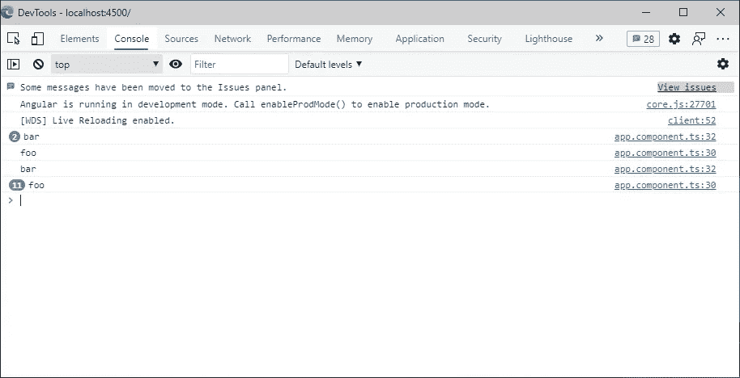

当发出源可观测值的第一个值时，在控制台中记录第一个“柱”。在那一刻，创建了对内部可观察对象(第二个间隔)的订阅，这就是为什么一秒钟后，我们在控制台中记录了另一个“bar”(通过源可观察对象)和一个“foo”(通过内部可观察对象)。一秒钟后，我们得到第三个“bar”和另外两个“foo”(因为现在有两个活动的内部订阅)。然后,“setTimeout”触发并终止对输出可观察对象的订阅，然而，一些“foo”继续记录在控制台中。这仅仅是因为杀死源订阅并没有杀死内部订阅，因为我们没有存储它们，我们甚至不能这样做，所以只要您的应用程序运行，这三个创建的内部订阅就会一直发出。欢迎内存泄漏…

# 合并地图

既然我们已经看到了如何不正确地解决这个问题，我们将看看本文的第一个高阶映射操作符:“mergeMap”。在解释它如何工作以及如何使用它来实现我们的 autosave 特性之前，让我们使用它来更新前面的代码:

我们在这里所做的唯一更改是用“mergeMap”替换“map ”,并删除了对“subscribe”方法的调用。让我们看看输出中的差异。

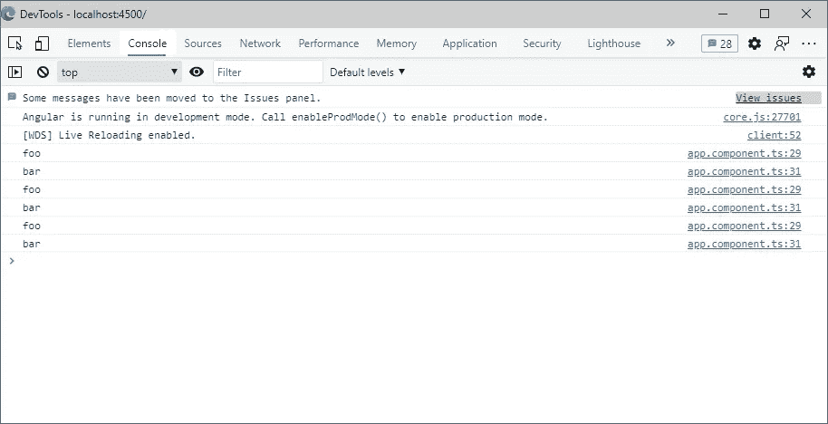

这里需要注意两件重要的事情:

1.  这些值不会按照相同的顺序发出。
2.  一旦主订阅被终止，就不再发出值。

第二点非常重要，因为这正是我们想要的:**不必手动管理内部订阅**。但现在的问题是:

> 为什么“foo”值已经被发出，因为我们没有订阅内部可观察值？

而答案是“mergeMap”。以下是该运算符的工作方式:

基本上，当你将一个可观察对象返回到“mergeMap”时，它会自动订阅它，并在后台管理结果订阅。然后，它简单地将内部可观察对象发出的值发送到输出对象上。“mergeMap”的主要特点是，它将处理所有内部订阅，并在其中一个内部 observables 发出时立即发出值。让我们逐步分解上面的代码，以真正理解发生了什么，并确保我们相互理解，让我们定义三个术语:

*   **源可观察对象**:这是主要的可观察对象，你调用“管道”方法来返回…
*   **输出可观测值**:这是“管道”函数返回的可观测值。
*   **内部可观察对象**:通过“mergeMap”等操作符从“pipe”函数中订阅的可观察对象。

那么，前面的代码是如何执行的呢…

*   一秒钟后，源可观测值发出它的第一个值。
*   “mergeMap”操作符接收该值并订阅内部可观察值。每当它刚刚订阅的内部可观察对象发出一个值时，它还调用“管道”函数在控制台中记录值“foo”。

> **重要的是要明白，源可观测值发出的值被“合并映射”丢弃。事实上，操作符将只发出它所订阅的内部可观察对象发出的值。这意味着在输出可观察对象上发出的第一个值不是在一秒钟之后，而是在两秒钟之后，因为源可观察对象的第一个值是在一秒钟之后发出的，但是内部可观察对象的值(实际上是在输出可观察对象上发出的值)是在一秒钟之后发出的。**

*   “mergeMap”订阅内部可观察对象一秒钟后，这个发出一个值，于是“tap”被执行(这也是“foo”出现在控制台的原因)，然后，这个值在输出可观察对象上发出(这也是“bar”出现的原因)。

> 此时,“mergeMap”有一个活动的内部订阅，它每秒发出一个值。

*   在内部可观察对象发出第一个值的同时，源可观察对象发出第二个值。这一个没有记录在控制台上，因为发生了与前面相同的过程:“mergeMap”丢弃了该值，但是订阅了第二个内部可观察对象，该对象在一秒钟后发出一个值。并且一秒钟后，还有第一个内部可观察对象发出一个新值，这就是为什么“foo”和“bar”在控制台上被记录了两次。
*   到目前为止，代码执行了三秒钟，因此当“setTimeout”在 500 ms 后执行并终止订阅时，“mergeMap”操作符也终止了其内部订阅，这就是控制台中不再记录任何内容的原因。

如果你更喜欢大理石图而不是解释，这里有一个解释上面的代码。注意，我在这里没有考虑取消订阅，所以从图中可以观察到的源是不完整的。

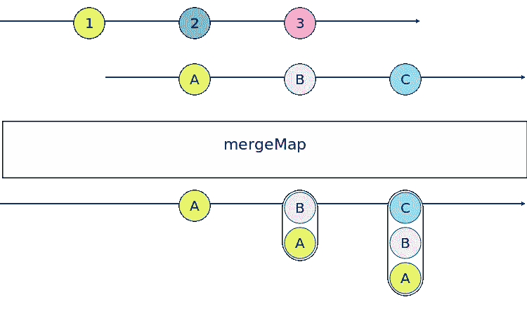

请注意，在图中，这些值似乎是作为数组发出的，但事实并非如此，它们是独立发出的。只是我无法用图表正确地说明这一点。

如果您理解了以下解释，您应该能够预测以下代码的输出:

如果您不希望看到记录的值事件，尽管三秒钟后由“ [take](/angular-meets-rxjs-rxjs-operators-60d8b2140d20) ”操作符完成了源可观测性，您可能应该再次阅读上面的解释:-)

# 回到自动保存功能

既然我们已经解释了高阶可观测量背后的思想，那么让我们看看如何使用下面的操作符来实现我们的 autosave 特性:“mergeMap”、“switchMap”、“concatMap”和“exhaustMap”。

这些操作符基本上服务于相同的目的，它们唯一的区别是管理内部订阅的方式以及何时取消订阅。

为了清楚地解释区别，我们将以稍微不同的方式启动“json-server ”:

> JSON-server db . JSON-watch-delay 1500

我们添加了“延迟”参数来模拟服务器延迟。基本上，所有的调用都会以 1.5 秒的延迟返回它们的答案。

## 合并地图

嗯，我们已经谈了很多了。我们唯一没有提到的是内部订阅的处理方式。实际上，这并不复杂，“mergeMap”维护着它订阅的所有内部观测值。这是非常重要的一点，因为如果不考虑的话，它可能会导致内存泄漏。

使用此运算符的 autosave 功能的版本如下:

查看这段代码发生了什么的一个有趣方法是查看 Google 开发人员控制台中的 network 选项卡。

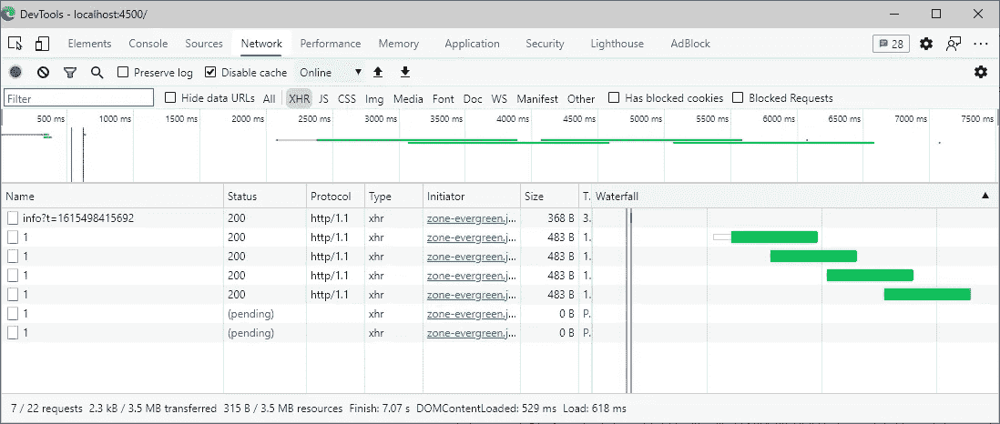

在这里，我们可以看到，无论另一个调用是否正在进行，对 REST API 的调用每秒都在进行。我在一个特定的时刻拍摄了这个截图，以说明即使一个调用当前处于挂起状态(由于服务器延迟)，下一个调用仍然会被触发。

总之，“合并映射”只是订阅内部的可观察对象，并在它们到来时在输出对象上发出它们的值。

该操作符的通用大理石图如下:

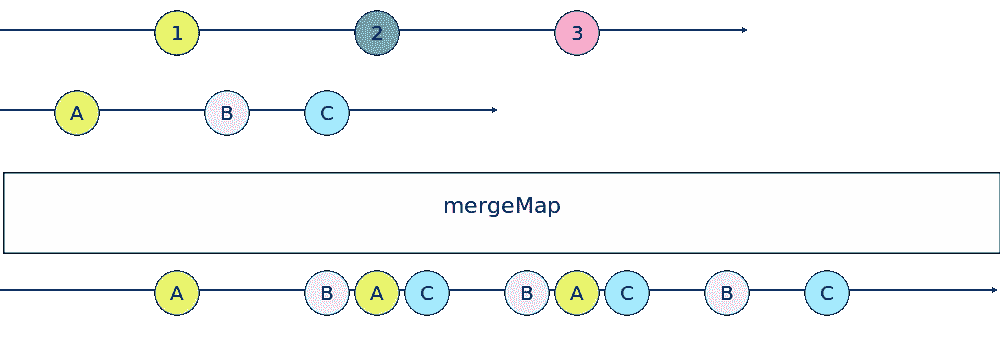

## 开关图

“switchMap”和“mergeMap”的区别在于**在给定时间**只能存在一个内部订阅。事实上，当“switchMap”订阅一个内部可观察对象时，它会在订阅新的内部可观察对象之前取消订阅之前的内部订阅(如果有的话)。让我们看看如果在上面的代码中用“switchMap”替换“mergeMap”会发生什么。

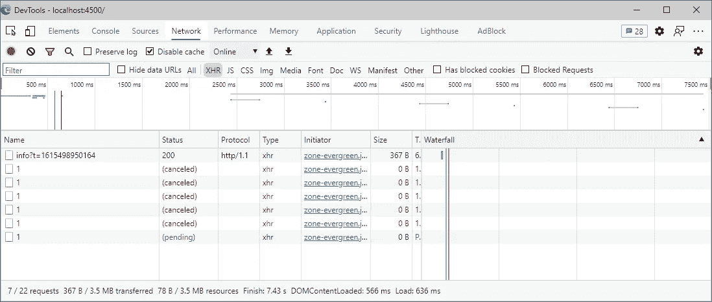

如您所见，没有请求通过，因为它们在结束前就被取消了。事实上，当源可观察对象的第一个值发出时，“switchMap”订阅由“HttpClient”的“put”函数返回的内部可观察对象。然后，一秒钟后，当源可观察对象发出第二个值时，第一个内部可观察对象尚未完成，因为请求至少需要 1.5 秒，因此，“switchMap”取消了内部订阅，这实际上取消了 HTTP 请求，这就是控制台显示“(已取消)”的原因。

这是一个非常好的解决方案，可以确保输出的可观察值总是对应于最后一个内部可观察值。该运算符的图表如下所示:

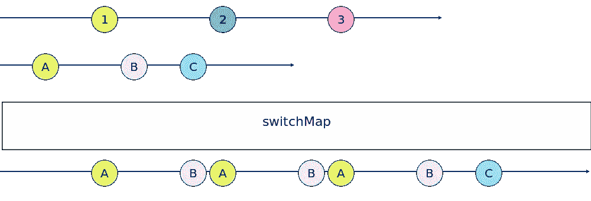

## 耗尽图

这个其实就是“switchMap”的翻版。事实上，当在源可观察对象上发出新值时，只要当前的内部订阅没有完成，“穷举映射”就忽略新发出的值，而不是取消当前的内部订阅(如果有的话)。这意味着在一个给定的时间内总是只有一个内部订阅，但是在订阅一个新的内部 observables 之前,“exhaustMap”总是等待它完成。

在我们的示例中，将“switchMap”替换为“exhaustMap”会产生以下结果:

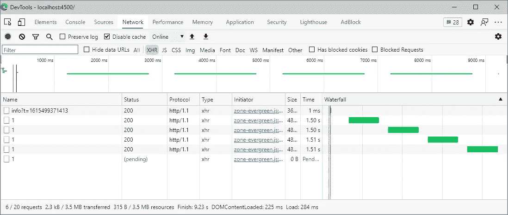

您可以在“Time”列中看到，每个请求需要 1.5 秒，并且在执行另一个请求时没有其他请求。请求之间半秒钟的间隔表明发出请求时发出的值被丢弃。这将给出下图:

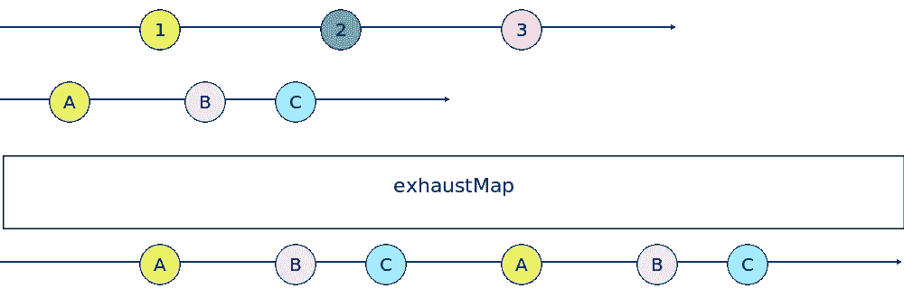

## 串联图

我把“concatMap”留到了最后，因为它是一个非常复杂的操作符…开个玩笑(我知道，我很搞笑…)。“concatMap”只是在订阅新的内部可观察对象之前等待当前内部可观察对象完成。在我们的代码中使用它会产生一个几乎类似于“exhaustMap”的结果。

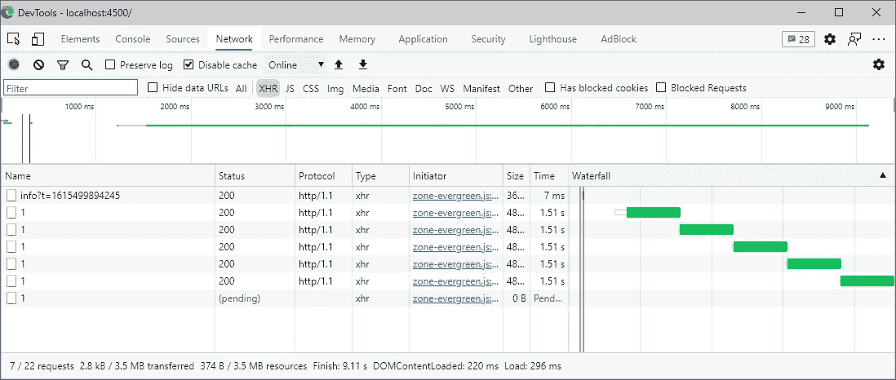

这种行为与前一种行为的唯一区别是，前一种行为一完成，请求就开始。使用“穷举法”，当一个请求正在进行时，内部的可观察对象被忽略，我们在每个请求之间有一个间隙。有了“串联图”，不同的内部可观测量被简单地排队并尽快发出。

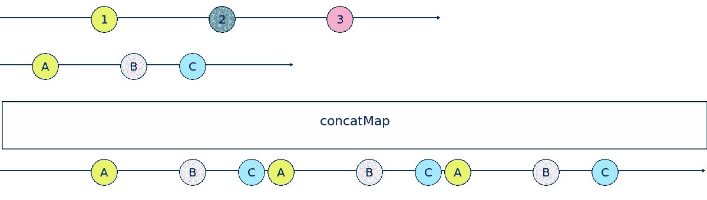

# 最后的想法

唷！这是一个漫长而复杂的问题…高阶可观测量是一个非常复杂的话题，如果你想在使用“RxJS”时真正感到舒适，你必须掌握这个话题，所以如果你没有完全理解它，不要犹豫，发表评论，要求一些澄清，我会更新文章，让它更清楚。

[下一篇文章](https://ssougnez.medium.com/angular-meets-rxjs-error-handling-8fad48721e49)将关注使用“RxJS”管理错误的方法。

