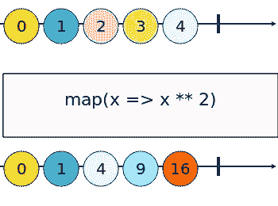
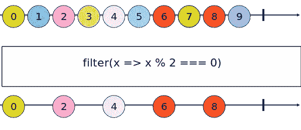
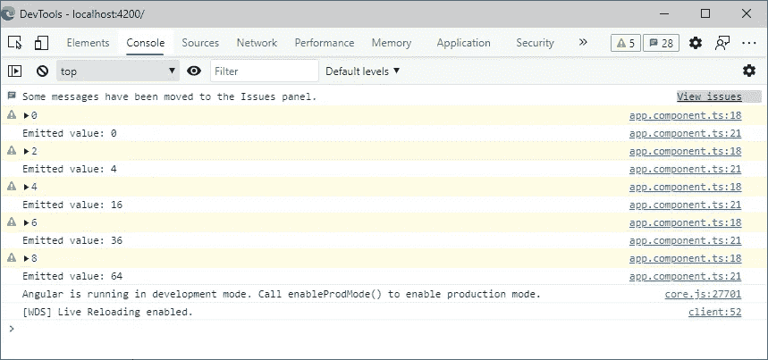
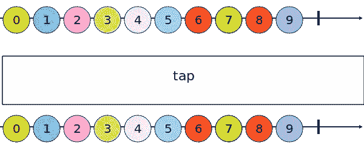
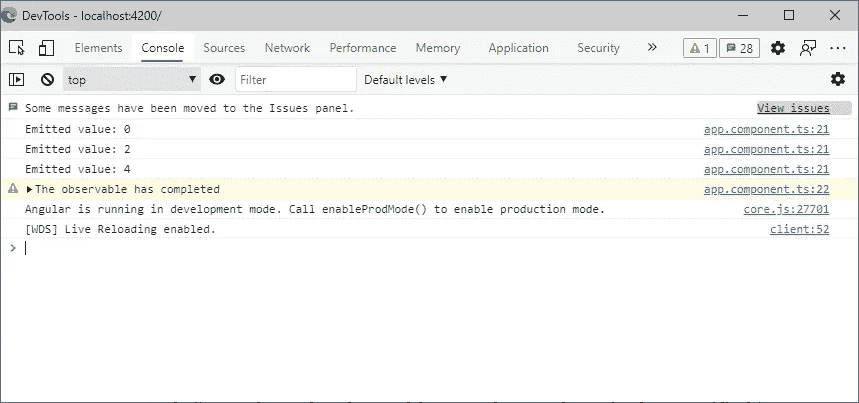
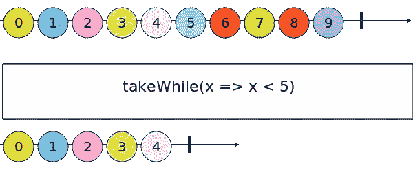
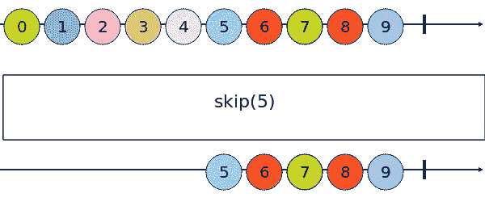
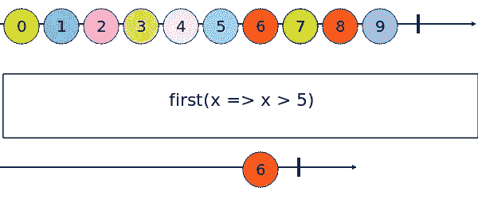
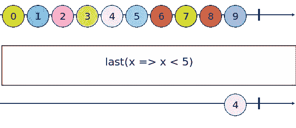
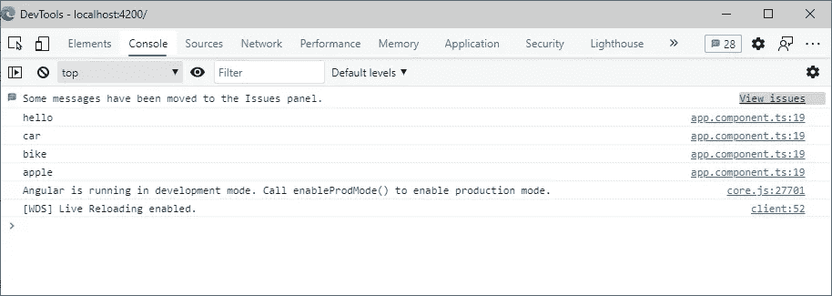

# Angular 符合 RxJS: RxJS 运算符(第 2 部分)

> 原文：<https://javascript.plainenglish.io/angular-meets-rxjs-rxjs-operators-60d8b2140d20?source=collection_archive---------12----------------------->

Photo by [Mitchell Kmetz](https://unsplash.com/@mitchkmetz?utm_source=medium&utm_medium=referral) on [Unsplash](https://unsplash.com?utm_source=medium&utm_medium=referral)

# 介绍

这篇文章属于名为“ **Angular meets RxJS** ”的系列文章，在这篇文章中，我尽我所能在“Angular”上下文中使用“RxJS”来解释反应式编程。

# 目录

[基本概念](/angular-meets-rxjs-basic-concepts-f178d8fe0e02)
[RxJS 科目](/angular-meets-rxjs-rxjs-subjects-32cac1b2c8d3)
[RxJS 运算符(第 1 部分)](/angular-meets-rxjs-rxjs-operators-part-1-9e9751a9373e)
RxJS 运算符(第 2 部分)
[RxJS 运算符(第 3 部分)](https://ssougnez.medium.com/angular-meets-rxjs-rxjs-operators-e64caa5f72e7)
[“take until”和“async”管道](https://ssougnez.medium.com/angular-meets-rxjs-takeuntil-and-the-async-pipe-4d9c6e3d5c2d)
[高阶可观察量](https://ssougnez.medium.com/angular-meets-rxjs-higher-order-observables-632e560ce2d0)
[错误处理](https://ssougnez.medium.com/angular-meets-rxjs-error-handling-8fad48721e49)
RxJS 调度器(即将推出)

# 在上一篇文章中…

…我们讨论了函数式编程、大理石图和创建运算符。我们用它们从常规值中或通过组合其他可观察值来创建可观察值。现在，我们将看到另一种类型的操作符:可管道操作符。这些算符用于将一个可观测值转换成另一个可观测值。

有一百多个操作符，所以很明显，我不会一一列举。事实上，我将把重点放在最流行和最有用的方面。然而，如果你有任何问题，或者如果你认为我忘记了一个重要的问题，请在评论中告诉我，我会更新文章。

# 管

“管道”是一个函数，您可以在一个源可观察对象上调用它来应用操作符。理解“pipe”函数返回一个与源不同的**可观察值**很重要，称为**输出可观察值**。换句话说，这些操作符获取一个源可观察对象，对发出的值执行一些操作，并返回一个将发出转换后的值的输出可观察对象。您不需要像操作符那样多次调用“pipe ”,您可以在一次“pipe”调用中链接它们。如果还不清楚也不用担心，会在“地图”操作员的解释之后。

# 地图

“map”操作符获取一个源可观测值，并通过对源可观测值发出的每个值应用投影来返回另一个可观测值。让我们以下面的代码为例:

在这里，我们使用“pipe”函数对源可观察对象应用“map”操作符，以便返回另一个可观察对象,它发出源可观察对象的每个值的投影。这样做的结果是“subscribe”实际上是在输出可观察对象上调用的，而不是在源可观察对象上调用的，所以 subscribe 实际上不是对“observable$”的订阅，而是对“pipe”函数返回的可观察对象的订阅。

执行这段代码会产生以下结果:

所以基本上，这段代码的执行可以分为以下几个步骤:

*   源可观察值被创建为从“0”到“4”的范围。
*   另一个可观察对象是通过在源可观察对象上应用“映射”操作符而创建的。
*   创建对输出可观察对象的订阅。
*   源可观察对象发出第一个值:“0”。
*   “map”操作符为这个值执行，并在输出可观察值上发出投影值。在这种情况下，投影函数简单地将该值乘以自身，因此结果为“0”。
*   源可观察对象发出第二个值:“1”。
*   “map”操作符为这个值执行，并在输出可观察值上发出投影值。在这种情况下，投影函数简单地将该值乘以自身，因此结果为“1”。
*   如此等等…

这段代码的大理石图如下:

所以，最后一次，**这里需要理解的重要一点是，创建的订阅关系到底层的可观察对象，而不是顶层的**。

# 过滤器

“filter”操作符可能是与“map”操作符一起使用最多的操作符之一。该操作符过滤源可观察值，以确定输出可观察值是否发出它们。例如，它可用于过滤所有值，以便只保留偶数值:

上面的代码对源可观察对象应用了一个过滤器，只保留能被“2”除的值。这段代码的结果是:

这段代码的大理石图如下:

还可以通过使用传递给“filter”的函数的第二个参数来获取当前值的索引:

# 链接运算符

到目前为止，我们一个接一个地使用操作符，但是“RxJS”的一个优势是能够链接操作符。例如，我们可以将刚才看到的两个操作符结合起来，以过滤值并映射通过测试的值:

因此，在这种情况下，由源可观察对象发出的值由“过滤”条件评估，如果它返回“真”，则该值乘以自身并由输出可观察对象发出。

# 轻敲，水龙头

“tap”操作符是最简单的操作符，用于对发出的值“做点什么”。这是一个非常有用的操作符，可以通过在控制台中记录不同的输出值来调试可观察的对象。例如，我们可以更新上一个示例，记录“filter”运算符后面的值:

上面的代码和前面的代码的区别在于，在执行“map”操作符之前，我们在控制台中记录过滤后的值。

正如您所看到的，最终结果是相同的:“0”、“4”、“16”、“36”和“64”，但是，我们也看到一些值被“tap”操作符记录(用黄色表示)。这些值是在被“映射”操作符投影之前通过“过滤”操作符的值。

值得注意的是，“tap”并不更新发出的值，它主要用于调试发出的值或应用副作用。然而，正如我们在上一篇文章的[中看到的，在反应式编程中不建议使用副作用，所以尽量只在调试时使用这个操作符。](/angular-meets-rxjs-rxjs-operators-part-1-9e9751a9373e)

# 拿

“取”算子取可观测源发出的第“n”个值，然后**完成**输出一个值。可观察对象已完成这一事实非常重要，可以用来避免存储订阅和取消订阅。

上面的代码过滤了范围的值，只保留偶数，并且只取前三个值。同样,“take”操作符应用于由“filter”操作符返回的可观察值，换句话说，所有“take”操作符甚至不会考虑的值。我们还定义了“complete”回调，以表明一旦达到参数中指定的值的数量,“take”就完成了可观察对象。

这段代码的大理石图如下:

# 抓紧时间

操作符“takeWhile”的行为就像“take”一样，只是它使用一个谓词来确定是否应该继续获取值。

在本例中，只要这些值小于“5”，运算符就会取这些值。一旦发出大于或等于“5”的值，可观察性就完成了。

您还可以使用“takeWhile”的第二个参数来指定您还希望发出不满足谓词的第一个值。例如，如果您为上面的代码在该参数中指定“true ”,则结果会稍有不同:

第一版代码的大理石图如下:

# 跳跃

“skip”操作符在开始发出源可观察值之前跳过一定数量的发出值。

在本例中，“skip”忽略第一个发出的 5 个值，然后开始发出其他值。

# 滑雪时

“skipWhile”操作符与“skip”操作符的目的相同，只是它是一个条件，决定何时停止忽略发出的值。

在这种情况下，只要源可观测物发出的值小于“5 ”,它们就会被忽略。只要一等于或大于“5”，输出可观察值就开始发出值。

大理石图如下:

# 第一

“first”操作符发出匹配谓词的第一个值，然后完成可观察值。

在这种情况下，满足谓词的第一个值是“6”，因此在输出可观察完成之前只发出这个值。

如果源可观察对象在任何值满足谓词之前完成，就会抛出一个错误。如果在源可观察性完成之前没有值满足谓词，您可以通过指定一个缺省值来避免。

在这种情况下，由于在源可观察对象完成之前没有满足谓词的值，所以发出默认值(“0”)。

第一个示例的大理石图如下:

# 最后的

有“第一”，就有“最后”。这个操作符只是在源观察完成之前发出最后一个匹配条件的值。

这将产生:

对应的大理石图如下:

# distinctUntilChanged

操作符“distinctUntilChanged”非常好，可以帮助减少代码执行的操作数量。如果先前发出的值相同，它实际上会跳过这些值。让我们举一个简单的例子:

在上面的代码中，我们从包含重复连续值的数组中创建了一个可观察对象。使用“distinctUntilChanged”可以保证两个相同的值不会相继发出。上面代码的结果是:

如您所见，所有重复的连续值，如["2 "、" 2"]或["4 "、" 4"]，都只发出过一次。默认情况下，该操作符使用“===”操作符来比较值，但是，您可以向它提供一个参数来改变这一点。下面的示例比较这些值的绝对值。

在这段代码中，我们通过绝对值来比较这些值，这就是为什么值["2 "，"-2"]被认为是相等的。

第一个示例的大理石图如下:

# distinctUntilKeyChanged

该运算符的作用与“distinctUntilChanged”相同，只是您必须提供 value 属性的名称。例如，您可以使用它仅发出长度不同的单词:

在这种情况下，只有当先前发出的值的“长度”属性不同时，才会发出值，这就是为什么有些单词没有出现的原因:

至于“distinctUntilChanged”，可以使用第二个参数定义一个比较器函数。

这个例子的大理石图是:

# 最后的想法

在这篇文章中，我们看到了大约十几个非常受欢迎的运营商。我决定在这里停止这篇文章，不要用太多的信息淹没你，但是如果你喜欢它，检查下一篇文章[，在那里我介绍了其他有用的操作符。](https://ssougnez.medium.com/angular-meets-rxjs-rxjs-operators-e64caa5f72e7)

