# Angular 符合 RxJS: RxJS 运算符(第 1 部分)

> 原文：<https://javascript.plainenglish.io/angular-meets-rxjs-rxjs-operators-part-1-9e9751a9373e?source=collection_archive---------11----------------------->

Photo by [Jon Flobrant](https://unsplash.com/@jonflobrant?utm_source=medium&utm_medium=referral) on [Unsplash](https://unsplash.com?utm_source=medium&utm_medium=referral)

# 介绍

这篇文章属于名为“ **Angular meets RxJS** ”的系列文章，在这篇文章中，我尽我所能在“Angular”上下文中使用“RxJS”来解释反应式编程。

# 目录

[基本概念](/angular-meets-rxjs-basic-concepts-f178d8fe0e02)
[RxJS 科目](/angular-meets-rxjs-rxjs-subjects-32cac1b2c8d3)
RxJS 运算符(第一部分)
[RxJS 运算符(第二部分)](https://ssougnez.medium.com/angular-meets-rxjs-rxjs-operators-60d8b2140d20)
[RxJS 运算符(第三部分)](https://ssougnez.medium.com/angular-meets-rxjs-rxjs-operators-e64caa5f72e7)
[“take until”和“async”管道](https://ssougnez.medium.com/angular-meets-rxjs-takeuntil-and-the-async-pipe-4d9c6e3d5c2d)
[高阶可观察量](https://ssougnez.medium.com/angular-meets-rxjs-higher-order-observables-632e560ce2d0)
[错误处理](https://ssougnez.medium.com/angular-meets-rxjs-error-handling-8fad48721e49)
RxJS 调度器(即将推出)【t2js

# 在本文中…

到目前为止，我们所学的相当不错。能够随着时间的推移发出一些数据并能够对其做出反应是很好的，但说实话，如果“RxJS”仅限于此，它就不会像现在这样受欢迎。

让“RxJS”真正强大的是它的运营商。算符是一个函数，用于创建一个可观察对象或“操纵”一个对象接收到的数据。让我们从谈论函数式编程的一点理论开始。

注意，下一节相当理论化，并不超级好玩。你可以跳过它，如果你想，但我强烈建议阅读它。

# 函数式编程

反应式编程可以被视为具有异步数据流的函数式编程。对于那些不知道什么是函数式编程的人，我将简要地解释一下，但不会太详细，因为这是一个非常广泛的主题，可能是整个系列文章的主题。

## 功能

并非所有语言都像“JavaScript”那样对待函数。的确，在“JavaScript”中，函数就是我们所说的“一等公民”。基本上，这意味着你可以用一个函数做和普通值一样的事情:

*   你可以在变量中存储一个函数。
*   您可以在另一个函数的参数中传递一个函数。
*   你可以从一个函数返回一个函数。

JavaScript 函数的这一特性使得使用“高阶函数”进行函数式编程成为可能。

## 高阶函数

在这个漂亮的科学术语背后隐藏着一个非常简单的概念。高阶函数只是一个期望参数中有另一个函数和/或返回一个函数的函数。让我们看一个基本的例子…

假设你有一个数组，你想对它所有的偶数值求和。你可以这样用一种非功能性的方式来做:

这段代码非常好，可以将值“30”放入“n”中。然而，通过使用函数式编程，还有另一种方法可以获得相同的结果。上面的代码可以重写如下:

这里，我们使用了两个高阶函数:

*   filter:根据条件过滤数组的值。
*   reduce:将数组值缩减为单个值。

这两个函数期望另一个作为第一个参数，分别确定值是否匹配标准，并计算所有值的总和。

就个人而言，我有点喜欢函数式编程，但是，这里有一些事情你必须记住。尽管两个版本的结果相同，但它们的表现并不完全相同。在代码的第一个版本中，所有事情都在一个循环中完成。你循环遍历这些值，在循环中过滤它们，在循环中更新“n”的值。然而，在代码的第二个版本中，需要几个循环。事实上,“filter”函数对数组的所有值进行循环，而“reduce”函数对“filter”返回的数组的所有值进行循环。这意味着在性能方面，这两种方法不会完全相同。现在… JavaScript 是一种高度优化的语言，我不认为这些性能差异在大多数情况下值得担心。不要误解我的意思，我并没有说它没有任何影响，但是除非你正在处理数百万个条目的列表，否则在性能方面的差异应该是可以忽略的。

## 副作用和纯功能

函数式编程范例的另一个特点是没有副作用。事实上，我们都写过一些代码，其中函数出于某种原因更新了类变量。当使用函数式编程时，必须不惜一切代价避免这些副作用，您可以通过使用纯函数来做到这一点。

一个函数可以称为纯函数，如果:

*   它没有副作用，这意味着它不会更新函数范围之外的变量。
*   给定相同的参数，它应该返回相同的值。

下面是两个不纯函数的例子:

函数“getRandom”不是纯的，因为如果你用相同的值调用它两次，比如说“0”和“10”，你不会得到两次相同的结果。

函数“next”也不纯，因为调用它有更新类变量“_counter”的副作用。

尽管这可能看起来有点太严格，但尽可能使用纯函数将通过避免变量意外更新的奇怪情况来提高代码的质量。

## 不变

函数式编程的另一个特点是不变性。如果你考虑前面的例子:

数组的值永远不会改变，每个函数都返回一个特定的值。这些函数从不改变它们的输入并返回新值。我可以继续谈论 JavaScript 中的不变性，但是这是一个非常宽泛的话题，现在，知道建议不要在函数式编程中改变数据就足够了。

# 回到反应式编程

反应式编程与函数式编程有很多共同的特征，最明显的区别是它处理异步数据流(所以…可以观察到…)。因此，与数组原型有一个用于过滤数组值的“filter”函数一样，“RxJS”有一个过滤运算符，可用于过滤由可观察对象发出的值。

我相信你非常想学习如何使用这些操作符，但是在此之前，我需要说最后一件事…

## 大理石图

如果你已经在互联网上阅读了其他关于“RxJS”的文章，毫无疑问你已经看到了一个大理石图。基本上是这样的:

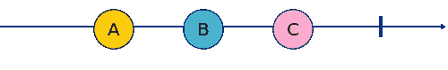

此图有助于说明在完成之前，一个可观察的发射三个值:“A”、“B”和“C”。这是说明可观测量的标准方法，有助于理解它们，这也是我将在本文的其余部分使用的方法，所以这里是主要符号的简短解释:

*   圆圈只是发出的值。在上面的例子中，可观察对象发出三个值:“A”、“B”和“C”。
*   竖线代表可观察的完成。在上面的例子中，在垂直线之后的这个可观察对象上不会发出任何值。
*   一个红色的叉号代表一个由可观察对象抛出的异常。在下面的例子中，在“C”发出后发生了一些事情，打破了可观测的。

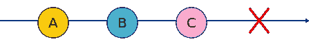

*   也有可能在同一张图上表示多个可观测量。在下面的例子中，我们有两个可观测量。发出值“A”、“B”和“C”的一个然后完成，并且另一个在第一个发出“B”并且发出“D”、“E”和“F”的同时开始发出，然后完成。

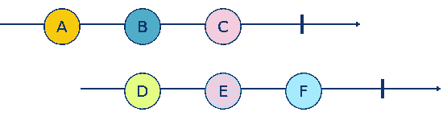

还存在一些其他的符号，但是上面的符号是主要的，足以理解后面的内容。

本文中使用的图表是由[这个令人敬畏的大理石图生成器(Rx 大理石图)](https://rx-marbles-online.herokuapp.com/)生成的，当我在使用它时，我还发现了这个[非常好的可视化工具](https://rxviz.com/)(注意，它似乎不是在所有情况下都工作得很好，但这个想法非常酷)。

# 操作员类型

据我所知，有两种类型的运营商:

*   创建运算符:用于从不同的源类型或通过组合其他可观测量来创建可观测量的运算符。
*   可管道化运算符:用于将一个源可观测性转换成另一个源可观测性的运算符。

本文的其余部分将集中讨论最流行的创建操作符。我们将在本系列的下一篇文章中讨论可管道化的。

# 创建运算符

以下是最流行的创建操作符列表。对于它们中的每一个，我都会给出一段代码来展示它的用法和代码的大理石图。

## 关于

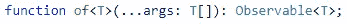

该运算符将一个或多个值转换为可观察值:

所以这段代码只是简单地取值“2”、“4”和“6”，并把它们转换成一个接一个发出的可观察值。乍一看，这个操作符似乎没什么用，但是你会发现在某些情况下它会变得有用。

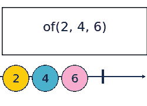

## 从

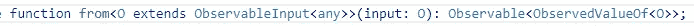

该运算符转换比“of”更复杂的数据类型:

*   数组和类数组
*   承诺
*   可迭代对象
*   可观察的类似物体

大多数情况下，你会用它来转换一个数组的可观测值，如下所示:

在本例中，我们有一个包含从“1”到“5”的值的数组，我们使用“from”操作符将该数组转换为可观察值，这意味着我们可以对结果调用“subscribe”函数来获取所有值。输出的可观察值将简单地获取数组的所有值，并一个接一个地发出它们。

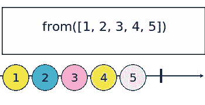

请注意，这是一次性的，所以如果您在转换后将一个值压入数组，可观察对象不会发出新值。

## 来自事件

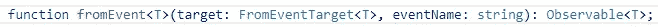

该操作符在特定的“DOM”事件发生时发出值。例如，当鼠标在页面上移动时，您可以使用它来获取值:

该代码将产生以下输出(取决于鼠标的移动):

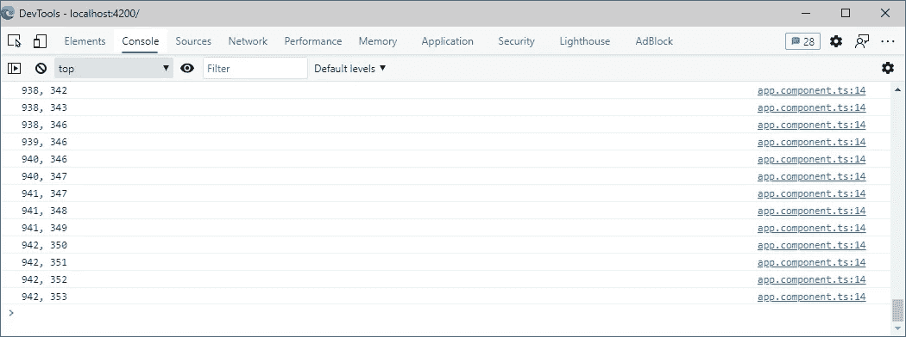

## 间隔

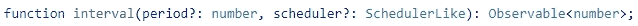

“interval”运算符每隔“X”毫秒创建一个可观察的发射值，其中“X”可以在创建过程中指定:

这段代码创建了一个每 500 毫秒发出一个新值的可观察对象。第一次发射值为“0 ”,每次发射后增加。

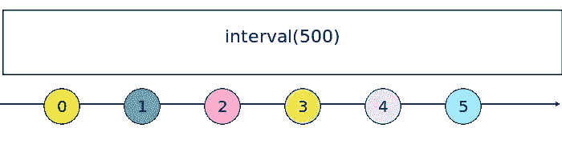

## 计时器

“计时器”操作符的作用与“间隔”相同，但允许指定第一个间隔值。我的意思是，如果您使用“interval”创建一个间隔，并将持续时间设置为 1000 毫秒，则第一个值将在 1000 毫秒后发出。但是，您可能希望立即发出第一个值，然后每隔 1000 毫秒发出一次，在这种情况下，您可能希望使用“timer”。

操作符的第一个参数是第一个值发出后的时间段，而第二个参数是下一次发出的时间段。下一个示例将在半秒钟后发出第一个值，然后每两秒钟发出一个新值:

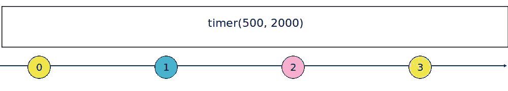

## 串联

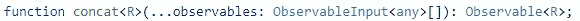

“concat”操作符在参数中接受两个或更多的观察值，并创建一个连接它们的观察值。

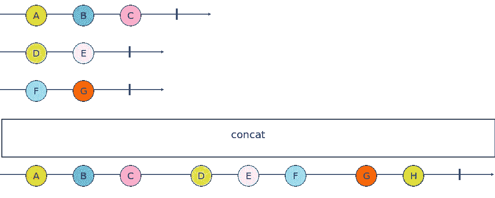

如果您希望“concat”像预期的那样工作，那么知道 observables 必须完成是很重要的。事实上，在上面的例子中，如果第二个可观测值没有完成，值“F”和“G”将永远不会被发出。

只有当最后一个源可观察对象完成时，输出可观察对象才完成。下面是该运算符用法的一个示例:

正如预期，该代码的输出是:

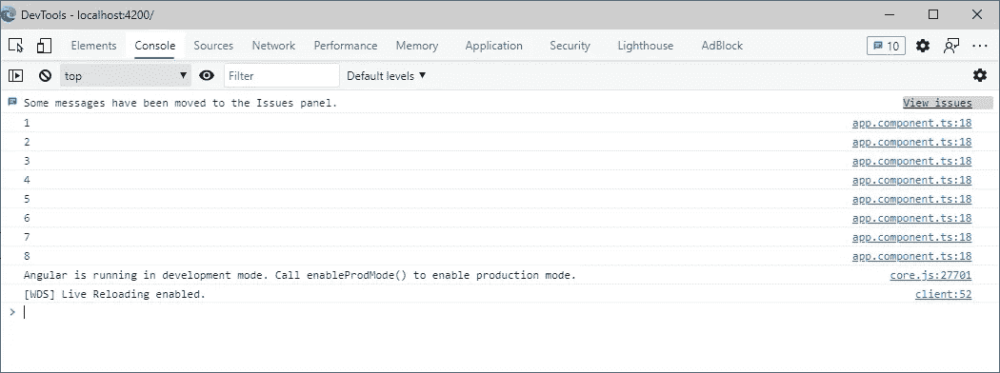

这三个可观测值已正确连接。

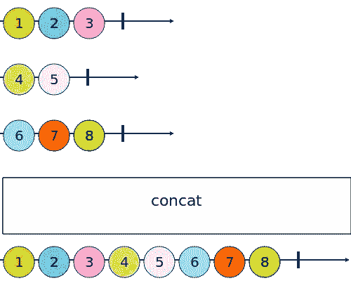

## 合并

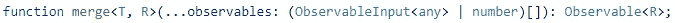

“合并”的工作有点像“concat ”,除了它不会在发出下一个可观测值之前等待源可观测值完成，相反，只要任何源可观测值发出，输出可观测值就会发出值。

在上面的例子中，我们创建了三个观察点，每三秒钟发出一个值，但是所有的值都在不同的时间开始。第二个可观察到的在第一个后一秒开始，第三个在第一个后两秒开始。最终结果是:

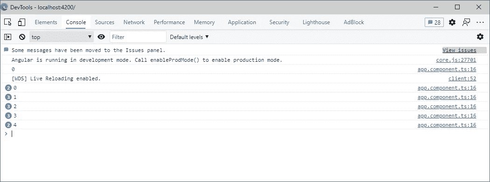

这里需要注意的重要一点是，每个值每秒都会发出，这证明了只要任何可观察到的源发出一个值，“合并”就会发出。

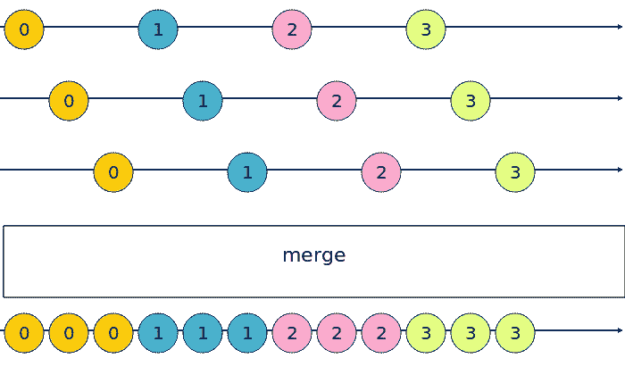

## 范围

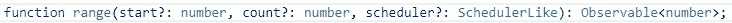

这个运算符创建一个可观察到的发射一个连续的数字范围。如果只定义了第一个参数，则范围将包含在“0”和该参数的值之间。例如:

将产生以下结果:

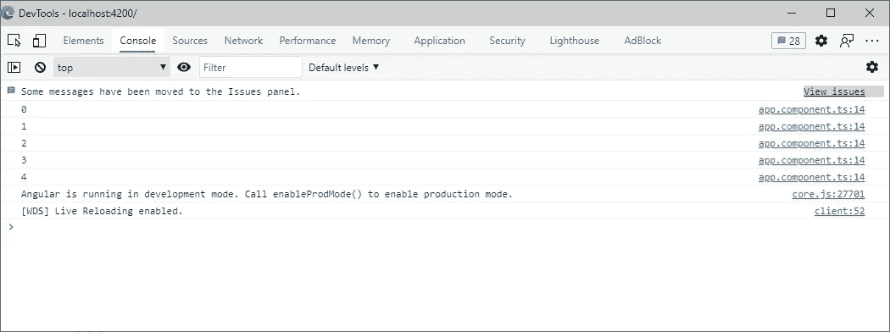

但是，您可以通过指定第二个参数来稍微改变这个运算符的行为。如果定义，范围从第一个参数定义的值开始，长度由第二个参数定义。因此，我们可以生成从“5”到“14”的范围，如下所示:

这可以理解为“从 5 开始生成 10 个连续数字的范围”。

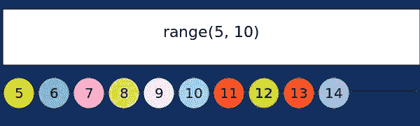

## 组合相关测试

“combineLatest”操作符将多个可观测值组合在一起，一旦所有可观测值发出至少一个值，就开始发出。输出可观测值的发射值是所有可观测值的最新值的数组。

哇。这个图表看起来很复杂，尽管事实并非如此。正如我所说的，“combineLatest”操作符在所有源可观测值都发出至少一个值时开始发出。在上面的例子中，这是当第二个可观察到的源发出“D”时。事实上，在那之前，两个可观察到的源中只有一个(第一个)发出至少一个值(“A”和“B”)。

一旦所有源可观测值发出至少一个值，输出可观测值就开始发出所有源可观测值最后发出值的分组(数组),因此在我们的示例中，当第二个可观测值发出“D”时，“组合相关”发出源可观测值最近发出值的数组:

*   第一个是 B。
*   第二个是 D。

所以我们得到了一个包含“B”和“D”的数组。发出的下一个值是第一个可观测值的“C”，因此下一组值是“C”(对于第一个可观测值)和“D”(对于第二个可观测值)等等，直到所有可观测值都完成。

以下是该运算符的示例:

此示例的输出如下:

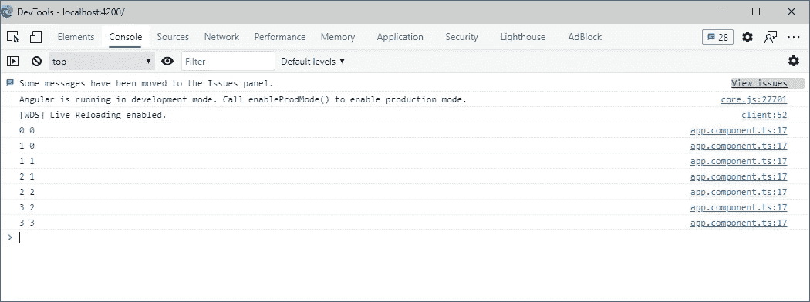

两秒钟后记录第一个值，因为此时两个可观测值将发出至少一个值(第一个值在一秒钟后，第二个值在两秒钟后)。此时，两个可观测量的最后发射值都是“0”。然后，两秒钟后，第一个可观测值发出一个新值(“1”)，这就是为什么“combineLatest”发出一个包含“1”和“0”的数组。最后，一秒钟后，第二个源可观测值发出它的值“1 ”,产生包含“1”和“1”的数组。

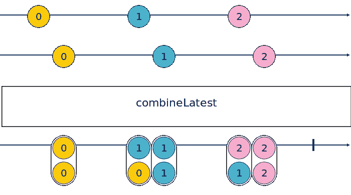