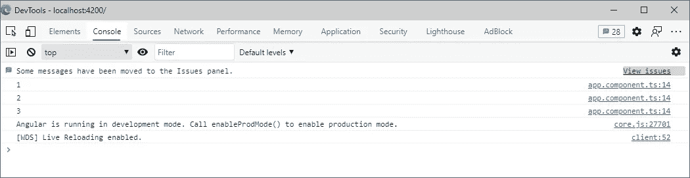
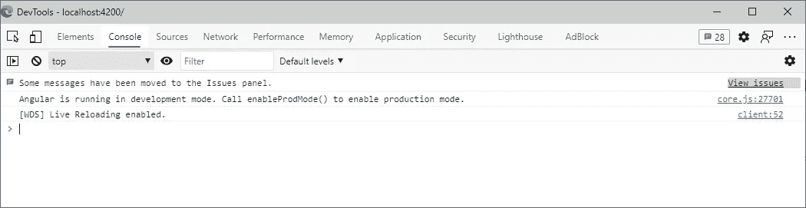
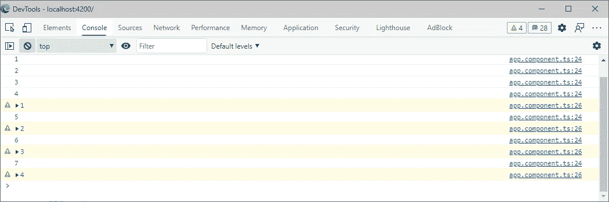
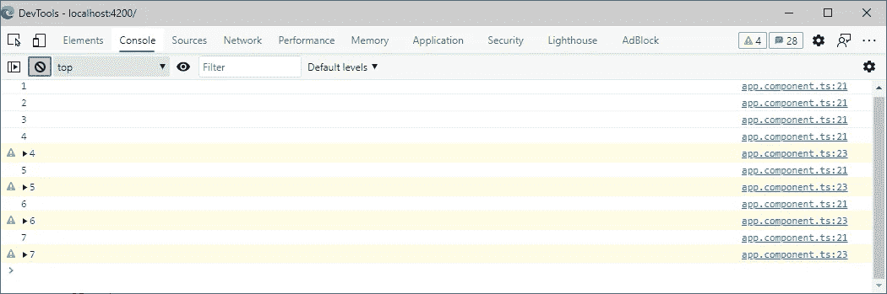
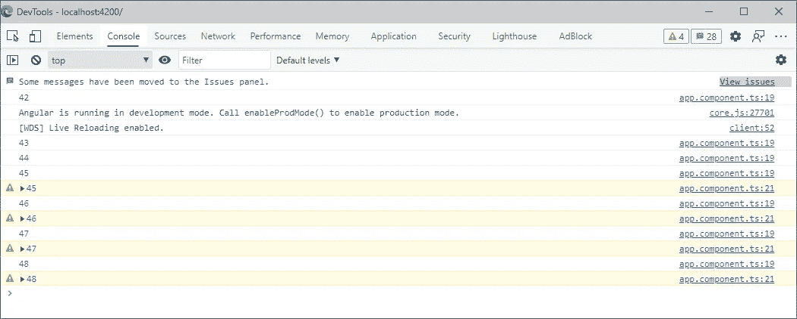
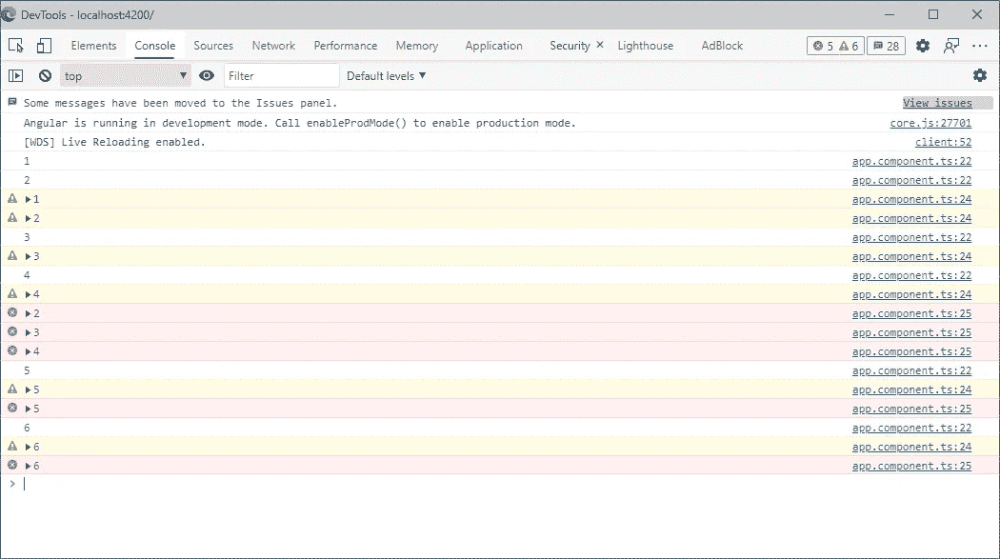
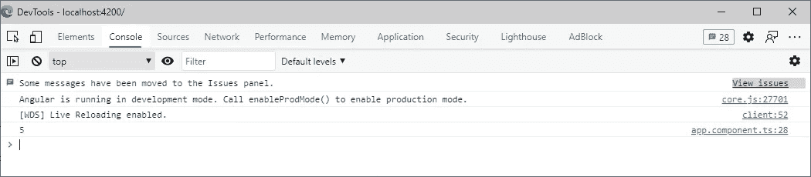
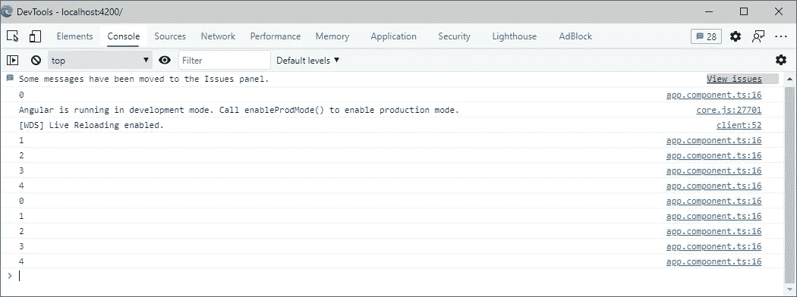

# neAngular 遇到 RxJS: RxJS 主题

> 原文：<https://javascript.plainenglish.io/angular-meets-rxjs-rxjs-subjects-32cac1b2c8d3?source=collection_archive---------4----------------------->

Photo by [Cam Adams](https://unsplash.com/@camadams?utm_source=medium&utm_medium=referral) on [Unsplash](https://unsplash.com?utm_source=medium&utm_medium=referral)

# 介绍

这篇文章属于名为“ **Angular meets RxJS** ”的系列文章，在这篇文章中，我尽我所能，尝试在“Angular”上下文中使用 RxJS 来解释反应式编程。

# 目录

[基本概念](/angular-meets-rxjs-basic-concepts-f178d8fe0e02)
RxJS 科目
[RxJS 运算符(第一部分)](/angular-meets-rxjs-rxjs-operators-part-1-9e9751a9373e)
[RxJS 运算符(第二部分)](https://ssougnez.medium.com/angular-meets-rxjs-rxjs-operators-60d8b2140d20)
[RxJS 运算符(第三部分)](https://ssougnez.medium.com/angular-meets-rxjs-rxjs-operators-e64caa5f72e7)
[“take until”和“async”管道](https://ssougnez.medium.com/angular-meets-rxjs-takeuntil-and-the-async-pipe-4d9c6e3d5c2d)
[高阶可观察量](https://ssougnez.medium.com/angular-meets-rxjs-higher-order-observables-632e560ce2d0)
[错误处理](https://ssougnez.medium.com/angular-meets-rxjs-error-handling-8fad48721e49)
RxJS 调度器(即将推出)

# 在本文中…

在上一篇文章中，我们重点介绍了有效使用“RxJS”必须知道和理解的基本概念。在这一篇中，我们将讨论“RxJS”主题。主题是一种特殊的可观察对象，因为它们允许将相同的值发送给多个观察者。

这个简短的解释可能会有一点误导，因为我们在上一篇文章中看到，所有连接到一个可观察对象的观察者都会接收到这个可观察对象发出的值。这是真的，但是，在上一篇文章中创建的可观察对象都是“冷的”，所以这意味着，如果你有三个观察者连接到同一个可观察对象，他们都会收到一组不同的值。然而，使用“RxJS ”,所有的观察者实际上会接收到相同的一组值。

不要担心，这听起来可能有点令人困惑，但是在本文中，您会发现相同代码的两个不同版本清楚地显示了差异。

# 创建新主题

为了在“RxJS”中创建新主题，要做的第一件事是添加以下导入:

然后你可以简单地创建一个这样的主题:

这里，我们简单地创建了一个新主题，它将发出“number”类型的值。现在，我们将使用这个主题:

上面的代码强调了一些非常有趣的事情。在前一篇文章中，我们唯一能做的是调用“subscribe”函数，以便将一个观察者连接到它并接收值。上面代码的第一行显示，对于一个主题，这仍然是可能的，但是接下来的 3 行也显示，可以像对观察者一样调用“next”方法。这是“rjs”的一种特异性；他们是可观察的，但也是观察者。

执行上面的代码将产生以下结果:

基本上，我们从订阅主题开始，接收这个主题发出的值。然后，我们使用这个主体(也是观察者)通过调用“next”函数来发出新的值，这就是为什么我们在控制台中看到“1”、“2”和“3”。

请注意，线条的顺序在这里非常重要。事实上，让我们这样改变它:

如果您执行这段代码，结果将会非常不同:

代码的第一个版本可以按以下步骤分解:

*   我们订阅主题以在控制台中显示发出的值
*   我们发出值 1
*   我们发出值 2
*   我们发出值 3

在这个序列中，很明显这些值是在订阅之后**发出的。所以基本上，就像在**你摘下降噪耳机后，有人开始和你说话**。**

现在，代码的第二个版本可以按照以下步骤分解:

*   我们发出值 1
*   我们发出值 2
*   我们发出值 3
*   我们订阅主题以在控制台中显示发出的值

这里的问题是，这些值是在订阅之前从**发出的，所以就像在**您摘下降噪耳机之前有人在跟您说话一样。你什么也没听到…

# 让我们回到热与冷的可观察点

上一篇文章中关于热与冷的解释是不完整的，因为我们还没有学到所有需要的概念。但是，现在您已经了解了什么是主题，我们可以回到它们并完成它们。

提醒一下:冷可观察值是为每个订阅创建数据生产者的可观察值，而热可观察值是独立于订阅创建数据生产者的可观察值。

因此，例如，下面的代码说明了冷可见性的创建:

我们首先创建一个每秒发出一个值的可观察对象(看起来很像上一篇文章中的那些)。由于数据生产者(“setInterval”)是在每个观察者的“可观察的”构造函数内部创建的，我们知道这是一个冷可观察的。然后我们两次订阅这个可观察的，一次是直接订阅，第二次是 3 秒后订阅。第一个订阅将值“记录”到控制台，而第二个订阅将“警告”它们(突出显示哪个订阅记录什么)。冷可观测量的一个特征是它们不共享相同的值，因此该代码的结果如下是正常的:

正如所料，第一个订阅的值会立即记录到控制台，而第二个订阅的值会在 4 秒钟后开始记录(3 秒钟的“setTimeout”加上第二秒钟的“setTimeout”)。然而，这里需要注意的重要一点是，黄色值与白色值不同。事实上，当第一个订阅在控制台中记录“4”时，第二个订阅记录“1”。这证明观察者之间并不共享价值观。

现在，让我们使用一个“RxJS”主题来创建一个热门观察对象:

那么，这里有什么区别呢？首先，我们不使用“可观察”构造函数来创建可观察对象，而是使用“主体”构造函数。然后，我们将“setInterval”**称为可观察对象的创建之外的**，如果你有好的记忆力，你会记得我已经提到过 10 次，热可观察对象的一个特征是数据生产者是独立于可观察对象而创建的。这里的情况就是这样。观察对象在第 7 行创建，而数据生产者在第 11 行创建。这条线还显示了数据生产者与可观察对象的关系。事实上，“setInterval”函数的回调使用可观察值来发出新值(“++x”)。

此外，由于数据生产者是在可观察对象之外创建的，因此不属于可观察对象来释放分配的资源，这就是为什么我们将区间存储在私有变量中，我们在“ngOnDestroy”钩子中清除该变量。

执行这段代码会产生与以前不同的结果:

尽管顺序是相同的:在第一个订阅上发出三个值，然后在第二个订阅上发出值，但是我们注意到记录的值与前面的示例不同。事实上，这一次，即使第二个订阅在第一个订阅之后 3 秒开始接收值，当它开始接收它们时，它接收到与第一个订阅相同的值**。这突出了热观测的两个重要特征:**

*   **被观测者发出的数据被所有观测者共享。它们都接收相同的数据！**
*   **无论对可观察对象进行了多少次订阅，都会执行数据生成器。事实上，在 cold observable 的情况下,“setInterval”函数只在有新订阅时执行。然而，在热可观察的情况下，无论订阅数量多少，都会执行函数“setInterval”。**

# **主题类型**

**它存在不同类型的主题:**

*   **科目**
*   **行为主体**
*   **重播主题**
*   **async 主语**

**我们已经看到了什么是“主题”,现在我们来看看其他的主题。它们之间的区别实际上是关于当一个新的观察者订阅可观察时会发生什么。在常规主题的情况下，什么都不会发生。在订阅时建立连接，然后在发出值时接收这些值。**

## **行为主体**

**“行为主体”和普通“主体”的区别在于，“行为主体”总是在订阅时发出一个值:**

*   **如果还没有发出任何值，则发出一个缺省值**
*   **如果值已经发出，则发出最后一个值**

**让我们举下面的例子:**

**这段代码与带有结果主题的代码非常相似，但是:**

*   **我们现在用“行为主语”来代替“主语”**
*   **我们不使用“x”变量，而是使用可观察值**

**第二个区别很重要，因为不可能使用“主题”的属性“值”,因为它不存在。事实上，有了“行为主体”,您就可以确定可观察对象可以返回最后一个发出的值，就像定义了一个缺省值一样。在“Subject”的情况下，可能没有发出任何值，因此“value”属性没有意义，因为没有默认值。**

**执行此代码会产生以下结果:**

****

**正如你所看到的，这个结果有一个重要的区别。**

**值“42”会立即记录在控制台中，而不是在一秒钟之后。这是因为“BehaviorSubject”是用默认值“42”创建的，并且“BehaviorSubject”的主要特征是在订阅时向观察者发出最后发出的值(如果没有发出值，则为默认值)。所以基本上，当我们订阅第 11 行的可观察值时，值“42”会立即发出。**

**需要注意的是，默认值(“42”)仅在之前没有发出其他值时才会发出。事实上，当在第 13 行创建第二个订阅时，第一个收到的值不是“42”，而是“45”。这是因为在创建第二个订阅时，最后发出的可观察值是“45 ”,所以这是它收到的值。**

# **重播主题**

**“ReplaySubject”是在订阅时发出“X”个最后发出的值的主题。让我们看看下面的例子:**

**这段代码创建了一个新的“ReplaySubject ”,并定义最后 3 个发出的值必须发送给任何新的观察者。第一次订阅是在可观察的创建之后立即进行的，因此，由于还没有发出任何值，控制台中不会显示任何内容，只有在 1 秒钟之后，控制台中才会开始记录值。**

**第二次订阅是在 2 秒钟后进行的，此时，2 个值已被观察对象发出(“1”和“2”)，正如我们定义的那样，我们希望获得最后发出的 3 个值，第二个观察对象将收到值“1”和“2”。**

**最后，5 秒钟后，我们创建第三个订阅，它将接收最后 3 个发出的值。6 秒钟后，控制台中的结果将如下所示:**

****

**两条连续的黄线显示第二个订阅在订阅时接收最后两个发出的值，而三条连续的红线显示第三个订阅接收最后三个发出的值。**

# **async 主语**

**“AsyncSubject”是另一种我从来没有真正理解过的主题。事实上，一个“异步主体”总是在完成后发出由可观察体发出的最新值。**

**这里，我们在第 8 行创建了一个“AsyncSubject”，并在第 13 行定义了当变量“x”达到值“5”时，我们完成了可观测性并清除了区间。在第 20 行，我们订阅了“AsyncSubject ”,并将发出的值记录到控制台。该代码在 5 秒钟后的结果是:**

****

**所以正如我所说的,“AsyncSubject”只在完成之前发出最后一个发出的值。在这种情况下，最新发出的值是 5，这就是它被记录到控制台的原因。**

**就我个人而言，我从未遇到过需要“AsyncSubject”的情况，但是很高兴知道它的存在和它的作用。**

# **可观察的**

**我希望在这一点上，你明白了“RxJS”主题有多强大。然而，就这一点而言，使用它们有点冒险。事实上，正如您可能知道的，在一个“有角度的”组件中做太多事情并不是一个好的做法，所以大多数时候，您会将应用程序的逻辑卸载到一个服务中。假设我们想要一个“Angular”中的“LifeTimeService ”,它提供了一个我们可以订阅的可观察对象，以便获得自应用程序启动以来经过的秒数。**

**请注意，这是一个非常愚蠢和无用的服务，我们不会在这里使用最好的方法，但它只是为了说明这个问题的主题。这样的服务可能如下所示:**

**这里没什么复杂的。我们只是将主题存储在私有变量中，以防止组件重新定义它。对于其余的，我们只是在类构造函数中创建数据生产者，并每秒发出一个递增的值。我们可以在这样的组件中使用该服务:**

**这将按预期工作，但这也非常危险。实际上，假设在上面的组件中有一个按钮调用下面的函数:**

**如果我们在 4 秒钟后点击按钮，这将是控制台的结果:**

****

**正如您可能理解的那样，风险在于这样一个事实:将这样一个主题暴露给一个组件会让他发出不同于预期的另一个值。实际上，服务有责任确保发出的值是一致的，然而，在这里，我们很容易混淆这个责任。**

**解决这个问题实际上非常简单，我们只需要这样更新我们的访问者:**

**每种类型的主体都有一个称为“可观察”的函数，可以用来将主体转换成“简单的”可观察对象，正如你所知道的，仅仅用一个“可观察的”对象来阻止我们的组件调用其上的“下一个”函数是不可能发出新值的。**

# **子链接**

**订阅管理可以通过多种方式进行。最佳实践实际上在于尽可能减少订阅数量。虽然有很多方法可以做到这一点，但这是您在使用“RxJS”时会学到的东西，因此您可能需要一些时间才能最终摆脱几乎没有订阅需要退订的状况。**

**然而，在您达到这种对“RxJS”的掌握水平之前，我想介绍一个小的“npm”包，在您需要管理多个订阅时非常有用。让我们看看下面的代码，这是前面例子中显示的一个例子:**

**你必须承认“ngOnDestroy”钩子的所有“xyz”都很难看？。取消订阅()”。更优雅的管理方法是使用包“子链接”，所以从安装它开始:**

**`yarn add subsink -S`**

**然后，您可以像这样更新代码:**

**因此，我们没有将订阅存储在单独的变量中，而是创建了一个类型为“SubSink”的变量。然后，我们只需要调用“add”函数向接收器添加订阅，最后，我们调用“ngOnDestroy”钩子中接收器的“unsubscribe”函数来清理所有订阅。**

**正如我所说的，尽管您通常不需要这个包，因为您应该有最少的存储订阅，但它是一个非常好的包，可以让您的代码更加清晰。**

# **最后的想法**

**科目是“RxJS”非常强大的“T2”特性，它给了你很多灵活性来实现你想要的。然而，“rjs”的真正力量在于它的运算符，这正是我们将在下一篇文章中看到的。请注意，它存在于 100 多个运算符中，因此我们可能不会仔细查看所有运算符，但我们将尝试覆盖最流行和最有用的运算符。**

**在[的下一篇文章](/angular-meets-rxjs-rxjs-operators-part-1-9e9751a9373e)中，我们将了解“RxJS”运算符。**

****