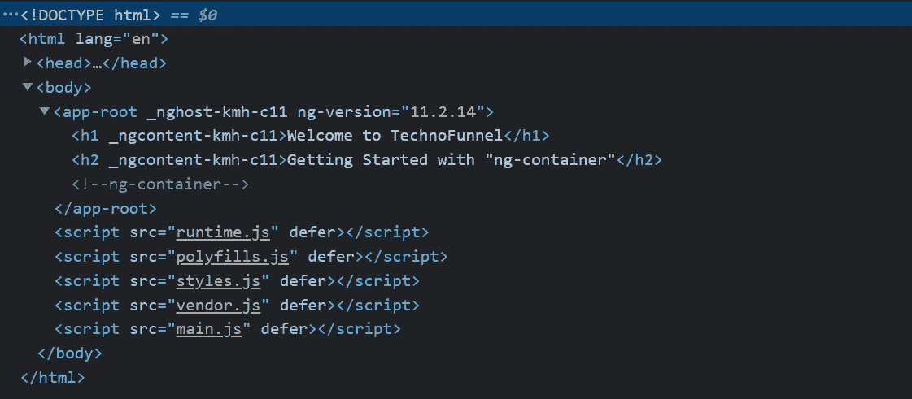
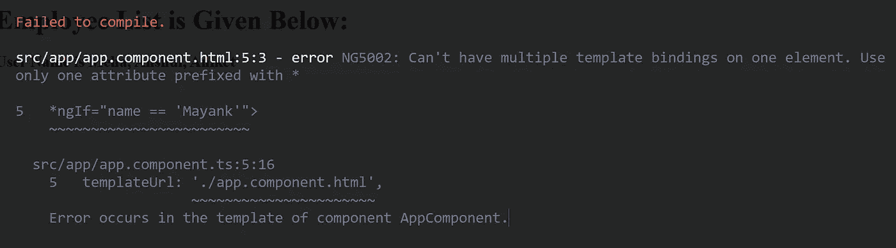

# 棱角分明的“ng 容器”:开发人员的必备知识

> 原文：<https://javascript.plainenglish.io/angular-ng-container-must-learn-for-developers-2aba04e7661b?source=collection_archive---------4----------------------->

## 如何在 Angular 中使用“ng-container”

[TechnoFunnel](https://www.youtube.com/channel/UCo-h1M-5M6Y5D4Lgut8ge4w) 提供了另一篇文章来学习和理解**“ng-container”**的用例。“ng-container”可以在多个地方使用，可以解决多个问题。让我们看看“ **ng-container** ”在开发过程中非常有用的用例场景。

ng-container in Angular

## Angular 中的 Ng-container 是什么？

**“ng-container”是一个逻辑容器**，其中可以包含多个元素。 **ng-container 不作为元素呈现在屏幕**上，而是作为 HTML 中的注释被替换。我们可以**在 ng-container 中对组件进行分组，**因为它没有被呈现为 HTML 标签，所以它**不与组件**的样式和布局接口。它充当虚拟组件，充当其他组件的父组件。

[https://gist.github.com/Mayankgupta688/6867db135282b5c9c3a867373e41c73d](https://gist.github.com/Mayankgupta688/6867db135282b5c9c3a867373e41c73d)

上述代码的输出如下所示:

在上面的输出中，我们可以看到没有为 H1 和 H2 标签呈现容器。相反，我们可以看到一个注释“ng-container”。

## angular 中 Ng-container 的用途是什么？

“ng-container”可用于以下情况:

1.  它可以**作为没有实际呈现在屏幕上的其他元素的容器**。因此它可以作为其他元素的父元素呈现
2.  我们可以使用“ng-container”，其中需要多个结构指令。按照设计，Angular 不能在同一个元件上有多个结构指令。我们可以对“ng-container”做同样的事情
3.  **“ng-container”可用于显示条件模板**。我们可以根据特定条件选择要显示的模板。

## 使用“ng-container”作为父元素

顾名思义，“ng-container”可以作为容器元素来封装其他元素。它充当本身不显示在屏幕上的父节点，然后呈现应用程序。

[https://gist.github.com/Mayankgupta688/6867db135282b5c9c3a867373e41c73d](https://gist.github.com/Mayankgupta688/6867db135282b5c9c3a867373e41c73d)

上面给出的例子表明,“ng-container”可以用作其他元素的父元素，而无需呈现。

## 当我们需要多个结构指令时可以使用

我们可以使用“ng-container”来满足需要多个结构指令的场景。在下面的代码中，我们在同一个元素中使用了“*ngIf”和“*ngFor”。这个场景将抛出一个错误，因为我们不能在同一个元素中有多个结构指令。

以下内容的错误指定如下:

为了解决这个问题，我们可以使用“ng-container”，在这里我们可以放置一个结构指令，而另一个结构指令可以放在元素本身上。这样我们就不会在同一个元素上有两个结构指令。

[https://gist.github.com/Mayankgupta688/8208bb885030e58094a07cd02b6422a5](https://gist.github.com/Mayankgupta688/8208bb885030e58094a07cd02b6422a5)

[https://codesandbox.io/embed/gifted-tdd-xutq1?fontsize=14&hidenavigation=1&theme=dark](https://codesandbox.io/embed/gifted-tdd-xutq1?fontsize=14&hidenavigation=1&theme=dark)

## 可用于显示条件模板

“ng-container”可用于根据条件显示模板。在 angular 中，我们有“ng-template ”,我们可以使用“ng-container”来决定渲染哪个模板。这是条件模板渲染。下面给出了一个使用“ng-template”和“ng-container”的例子。

[https://gist.github.com/Mayankgupta688/aa9ab54b86ed130f054ae6cfb26c517a](https://gist.github.com/Mayankgupta688/aa9ab54b86ed130f054ae6cfb26c517a)

下面的代码编辑器可用于进一步操作

[https://codesandbox.io/s/great-wood-fspg9?file=/src/app/app.component.html](https://codesandbox.io/s/great-wood-fspg9?file=/src/app/app.component.html)

在上面的代码中，我们可以看到，在*ngIf 中有一个条件，它决定是否需要显示内部 HTML，或者如果条件不为真，将呈现指定的模板。" emptyEmployeeList "

*更多内容看*[***plain English . io***](http://plainenglish.io/)