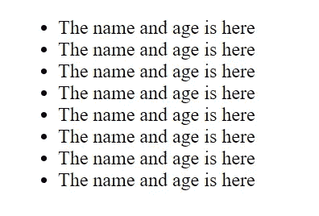
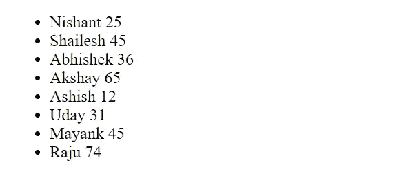
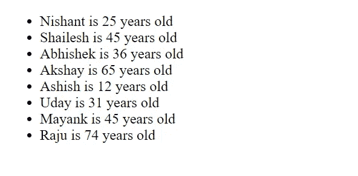
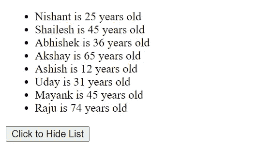

# Angular *ngFor 和*ngIf 指令

> 原文：<https://javascript.plainenglish.io/angular-ngfor-and-ngif-directives-30a97051554b?source=collection_archive---------10----------------------->

## ngIf 和*ngFor 可以帮助你保持角度代码的整洁、简单和有效。那么，让我们来了解一下*ngFor 和*ngIf 是怎么一回事。

# *ngFor 是什么？

先说*ngFor。使用*ngFor 指令遍历数组对象并在 UI 中显示数据。

让我举一个例子来说明它是如何工作的:

```
import { Component } from '@angular/core';

@Component({
  selector: 'app-root',
  templateUrl: './app.component.html',
  styleUrls: ['./app.component.css']
})
export class AppComponent {
  title = 'angular-project';
  friendslist = [
    {
      name: 'Nishant',
      age: 25
    },
    {
      name: 'Shailesh',
      age: 45
    },
    {
      name: 'Abhishek',
      age: 36
    },
    {
      name: 'Akshay',
      age: 65
    },
    {
      name: 'Ashish',
      age: 12
    },
    {
      name: 'Uday',
      age: 31
    },
    {
      name: 'Mayank',
      age: 45
    },
    {
      name: 'Raju',
      age: 74
    },
  ]

}
```

我这里有一个包含人们姓名和年龄的对象数组。

现在，我们将使用*ngFor 在界面中显示这些名称。

首先，创建一个无序列表标签，并在其中创建一个列表标签，如下所示:

`<ul> <li> </li> </ul>`

无序列表

然后，我们将在列表标签中使用*ngFor，就像下面的例子一样:

```
<ul>
  <li *ngFor="let item of friendslist">
	The name and age is here
  </li>
</ul>
```

在这个例子中，我们使用`friendlist` 数组的`let`关键字创建一个条目。它将遍历数组中的每个项目，并打印出项目名称和项目年龄，或者数组对象中的任何其他对象键。



保存时，您将看到上面的输出。这是因为数组中有 8 个元素。所以我们在列表标签中有 8 个项目。但它是静态数据，我们就改成动态吧。

```
<ul>
  <li *ngFor="let item of friendslist">
    {{ item.name }} {{ item.age }}
  </li>
</ul>
```

这里，我们在两个花括号中使用了`item.name`和`item.age`。这叫做插值，这就是我们在 HTML 模板中显示数据的方式。

保存文件，您将看到以下内容:



我们也可以这样做:

```
<ul>
  <li *ngFor="let item of friendslist">
    {{ item.name }} is {{ item.age }} years old
  </li>
</ul>
```

因此，在本例中，我们以不同的格式显示列表。如果保存，您将看到以下输出:



# 什么是*ngIf？

您可以在 Angular 中使用*ngIf 指令来根据某些条件显示某些数据或项目。

假设我们正在调用一个 API。当应用程序从 API 获取数据时，我们显示一些消息，说明数据正在加载，因为这可能需要一些时间，具体取决于服务器。当 API 调用完成时，我们显示数据。

在这种情况下，我们可以使用*ngIf。

让我举一个例子来说明这是如何工作的:

```
<ul>
  <li *ngFor="let item of friendslist">
    {{ item.name }} is {{ item.age }} years old
  </li>
</ul>
```

这里，我们显示了模板中的数组数据。


现在，让我们创建一个按钮，并给它一个标题*点击隐藏列表。*

```
<ul>
  <li *ngFor="let item of friendslist">
    {{ item.name }} is {{ item.age }} years old
  </li>
</ul>

<button>
  Click to Hide List
</button>
```

现在，在 TypeScript 文件中，创建一个名为`isVisible`的布尔变量:

```
isVisible: boolean = true;
```

最初，isVisible 的值为 true。此外，创建一个名为`hideList()`的函数，如果被触发，它会将`isVisible`的值更改为 false。

```
hideList(){
    this.isVisible = false;
}
```

单击我们创建的按钮，我们将运行此功能:

```
<button (click)="hideList()">
  Click to Hide List
</button>
```

所以，每次点击按钮，这个函数都会运行。这将使`hideList`的值从真变为假。

现在，让我们使用*ngIf 来显示当`isVisible`为真时我们的数组列表。

```
<ul *ngIf="isVisible">
  <li *ngFor="let item of friendslist">
    {{ item.name }} is {{ item.age }} years old
  </li>
</ul>

<button (click)="hideList()">
  Click to Hide List
</button>
```

如果您单击“隐藏列表”按钮，列表将会隐藏，您将只能看到该按钮。

我们还可以将该值更改为如下形式:

```
hideList(){
    this.isVisible = !this.isVisible;
}
```

所以，如果值为 true，它将变为 false。如果值为 false，它将变为 true。换句话说，该功能将切换`isVisible`的值。



# 结论

恭喜你！现在我们已经学会了如何在 Angular 中使用*ngFor 和*ngIf。

*更多内容尽在* [***说白了. io***](https://plainenglish.io/) *。报名参加我们的* [***免费周报***](http://newsletter.plainenglish.io/) *。关注我们关于* [***推特***](https://twitter.com/inPlainEngHQ) ，[***LinkedIn***](https://www.linkedin.com/company/inplainenglish/)*，*[***YouTube***](https://www.youtube.com/channel/UCtipWUghju290NWcn8jhyAw)*，* [***不和***](https://discord.gg/GtDtUAvyhW) ***。***

***对缩放您的软件启动感兴趣*** *？检查* [***电路***](https://circuit.ooo/?utm=publication-post-cta) *。*