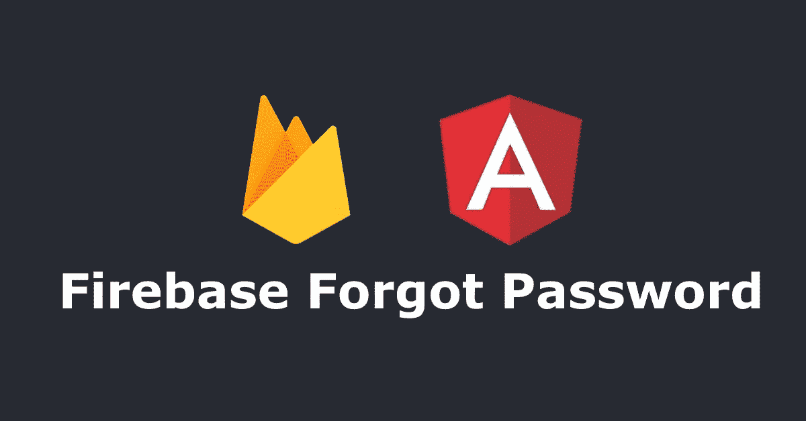
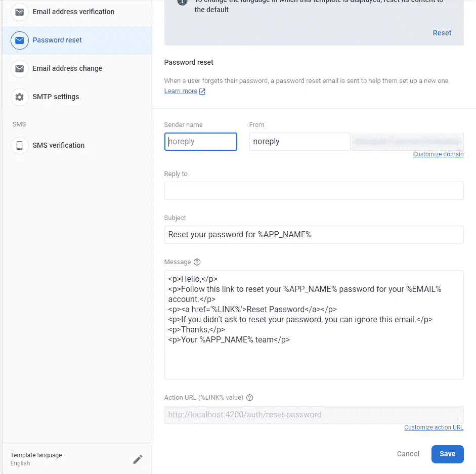
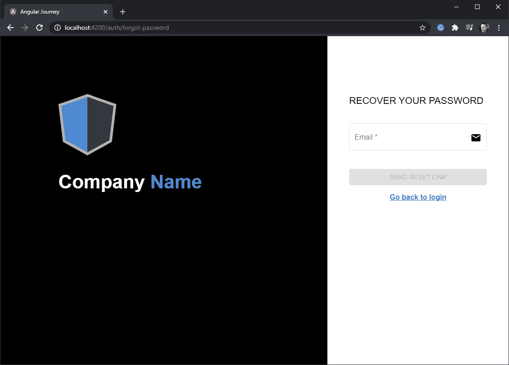
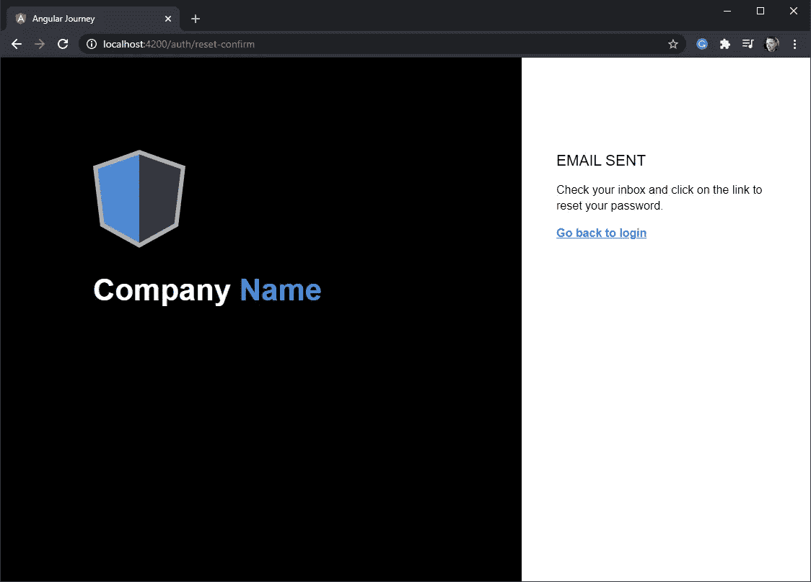
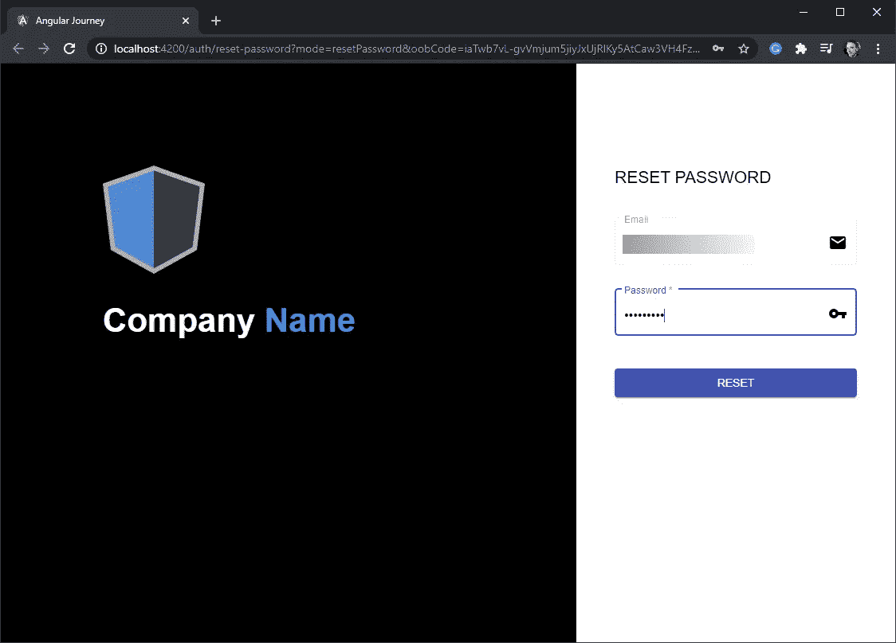
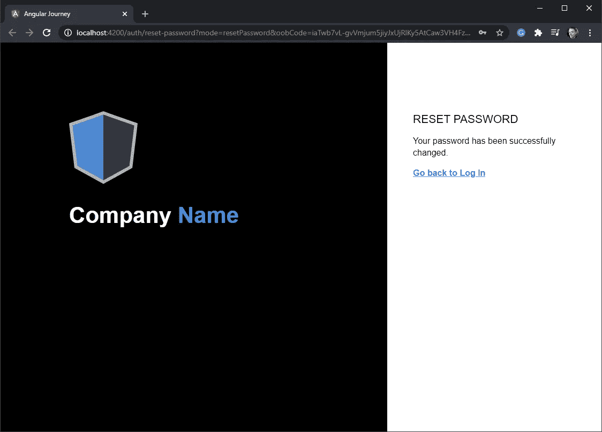
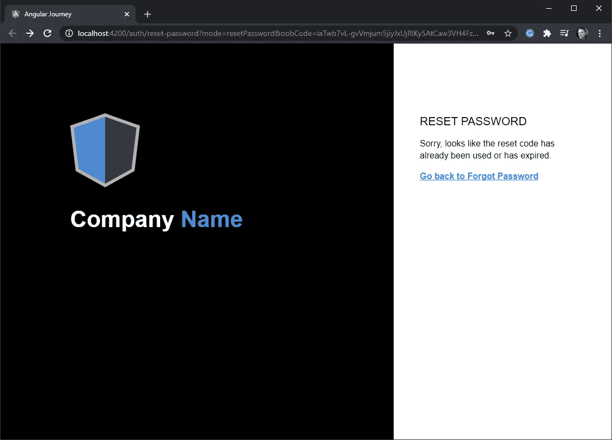

# 如何用 Angular 和 Firebase 处理忘记密码

> 原文：<https://javascript.plainenglish.io/angular-node-and-postgresql-forgot-password-a1a104c3795a?source=collection_archive---------4----------------------->



## Angular、Node 和 PostgreSQL:忘记密码

# 先决条件

您应该能够遵循这个故事，并利用 Firebase 建立自己的忘记密码工作流。然而，如果你好奇的话，这是以下先前故事的延续:

[](https://medium.com/swlh/angular-node-and-postgresql-4a07d597be07) [## 角度、节点和 PostgreSQL

### AngularJS 到 Angular 和更多…我的个人旅程❤️☕️

medium.com](https://medium.com/swlh/angular-node-and-postgresql-4a07d597be07) [](https://medium.com/swlh/angular-node-and-postgresql-registration-61abd1751bb4) [## 角度、节点和 PostgreSQL:注册

### AngularJS 到 Angular 和更多…我的个人旅程❤️☕️

medium.com](https://medium.com/swlh/angular-node-and-postgresql-registration-61abd1751bb4) 

今天的故事将展示我们如何使用 AngularFireAuth 创建一个密码恢复工作流程。

# 页面/表单设计

我们将要设计的网页就像登录和注册。所以我们可以重用我们已经设置好的 CSS🎉！我们唯一要做的改变是在我们的能力范围内。我们将有共享相同的`font-weight`和`color`的导航链接。将 CSS 行`.form-section .register .link`修改为`.form-section .link`。

# 忘记密码服务方法

在`authentication.service.ts`中，我们想要创建三个新方法来处理忘记密码的工作流。这些方法中的每一个都将使用 *AngularFireAuth* 来完成工作。我们的第一种方法将处理向用户发送密码重置电子邮件:

```
async resetPassword(email: string): Promise<void> {
   await this.afAuth.auth.sendPasswordResetEmail(email).then(() => {
      this.router.navigate(['auth/reset-confirm']);
   }).catch((error) => {
      this.notifier.showError(error.message);
   });
}
```

一旦用户收到电子邮件，他们将点击提供的链接，这将引导他们到我们的自定义重置密码页面。在 URL 中，将传递一个查询参数`code`,我们需要验证它是否仍然有效:

```
async verifyPasswordResetCode(
    code: string
): Promise<any> {
    return await this.afAuth.auth
      .verifyPasswordResetCode(code)
      .then((email) => {
          return email;
      }).catch((error) => {
          console.log(error.message);
      });
}
```

一旦代码通过验证，用户就可以用新的密码重置他们的密码。我们向该方法传递`code`和`newPassword`，该方法将返回它是成功了`true`还是遇到了错误`false`:

```
async confirmPasswordReset(
    code: string, 
    newPassword: string
): Promise<boolean> {
    return await this.afAuth.auth
      .confirmPasswordReset(code, newPassword).then(() => {
          return true;
      }).catch((error) => {
          this.notifier.showError(error.message);
          return false;
      });
}
```

# Firebase —密码重置模板

我在 Firebase 设置中做了一个小小的调整，将动作 URL 值改为指向我们的自定义路径 http://localhost:4200/*auth/reset-password。*我还修改了 href 链接中的文字说:重置密码。见下图。



Password Reset Template

现在我们将能够在本地测试我们的工作流。

> ⚠️只是不要忘记在部署到生产环境时将这个值更改为指向您的托管地址

# 页面/表单组件

这些组件遵循我们其他身份验证页面中的大量设计和编码实践。我们新的只是有不同的形式和验证。下面是它们的图像:

## 忘记密码

首先，用户需要能够输入他们的电子邮件，这样我们就可以给他们发送一个重置链接。下面是我们的表单的外观:



Forgot Password

## 发送的电子邮件

输入他们的电子邮件后，Firebase 将发送我们的重置密码。我们想通知用户检查他们的电子邮件。下面是我们的表单的外观:



Email Sent

## 重置密码

用户点击电子邮件中的链接后，他们将被引导至下图所示的屏幕，在那里他们可以重置密码:



Reset Password

## 重置密码—成功

成功完成更改用户密码后，将出现以下屏幕提示:



Reset Success

## 重置密码—失败

如果密码已过期或已被用于重置密码，用户将收到以下屏幕提示:



Reset Expired

像我之前的故事一样，我正在努力编写代码，当另一个开发人员阅读时，他们可以很容易地知道它在做什么。也就是说，您可以通过点击本文末尾的 repository 分支链接来阅读代码。

😃如果有些事情仍然没有意义或者需要进一步解释，请不要犹豫，我可以将细节融入这个故事。

# 知识库分支

[](https://github.com/zo103181/angular-journey/tree/angular-node-postgresql-forgot-password) [## zo 103181/角度-旅程

### 棱角到棱角更多...我的个人旅程❤️☕️-zo 103181/角度-旅程

github.com](https://github.com/zo103181/angular-journey/tree/angular-node-postgresql-forgot-password) 

# 结论

这是休息的好地方。随意拿点小吃或一杯☕️.如果你对我的故事有任何问题、意见或建议，请告诉我。

感谢你花时间阅读我的故事，如果你是一个追随者，我很感激❤️