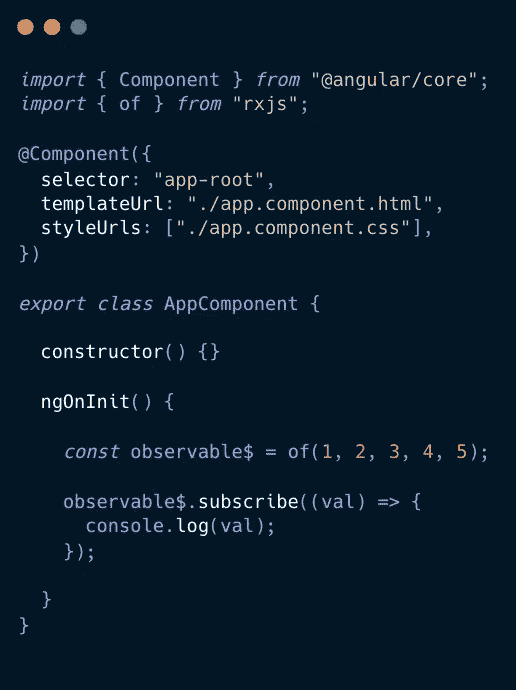
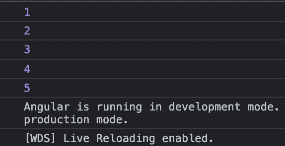
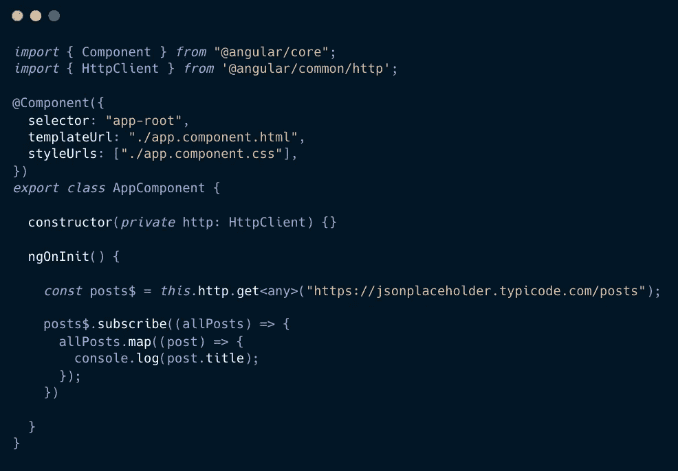
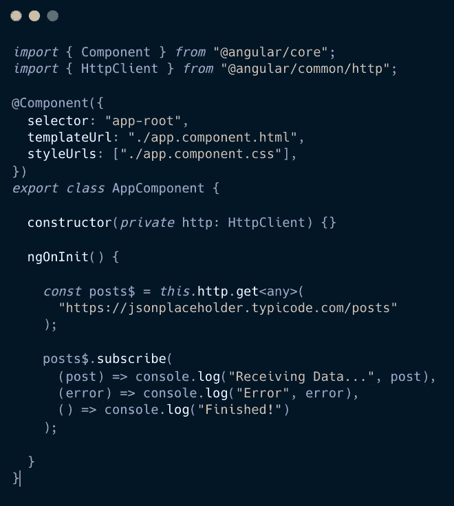
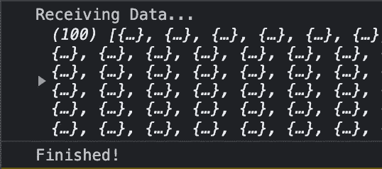
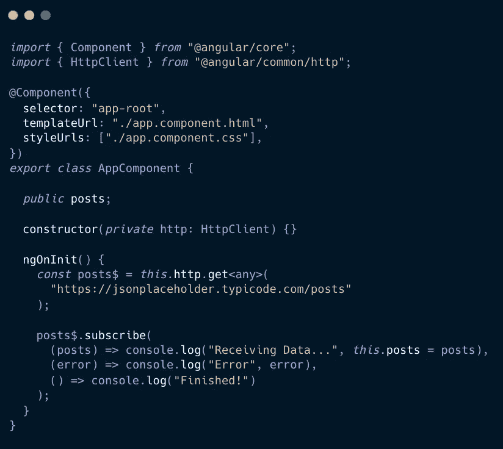
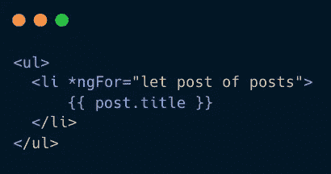
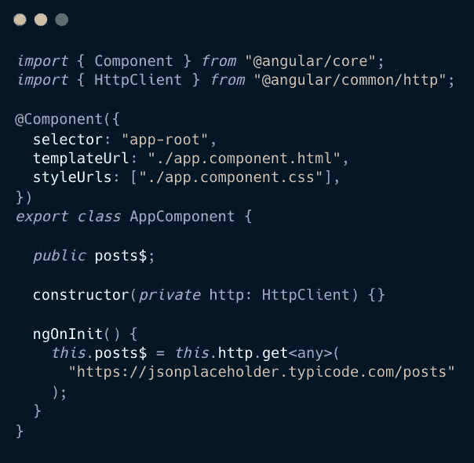
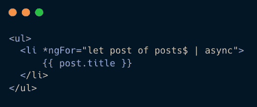

# 角度可观测量:初学者完全指南

> 原文：<https://javascript.plainenglish.io/angular-observables-for-complete-beginners-8dff19b37e97?source=collection_archive---------1----------------------->

大家好！通过这篇文章，我们将试图理解 Angular 最重要的话题之一，即**可观测量**。

为了理解这篇文章，我们将使用多个例子。我的方法是尽量少用技术术语，这样你就可以理解可观察到的现象，而不会被其他术语分散注意力。

此外，由于我们现在是朋友，我不会让你只是复制粘贴代码。我需要你和我一起编码，以便你可以正确理解这个概念。为此，我将把代码截图放在文本编辑器中，而不是放在文本编辑器中，这样可以迫使你实际编写代码，并从中学习一些东西。这将极大地帮助你，相信我。😊现在我们已经进行了初步的讨论，让我们来看看可以观察到的现象

## 什么是可观测的？

> Observables 为在应用程序的不同部分之间传递消息的**提供支持。它们经常在 Angular 中使用，是一种用于事件处理、异步编程和处理多个值的技术。**
> 
> — [棱角分明的文档](https://angular.io/guide/observables)

## 简单的观察

传递信息，嗯。那是什么意思？嗯，把可观察的事物想象成时事通讯，其中我们有一个发送者和一个接收者。为每个接收者(订户)创建一份时事通讯(订阅)。让我们借助一个简单的**例子**来了解一下。

我们来讨论一下这里发生了什么。

1.  的**是一个[rxjs](https://www.learnrxjs.io/)运算符**，它发出一个**值流**。将其视为新闻简报订阅提供商。值 1、2、3、4、5 可以被认为是时事通讯。
2.  将 **observable$** 视为简讯订户。注意，我们在这个变量的末尾使用了一个美元符号？在一个可观测的名字后面加上一个**美元符号**是一个很好的做法，这样人们第一眼就可以认为它是可观测的。
3.  为了执行我们已经创建的可观察值&为了开始接收值，我们调用**。subscribe()** 方法，传递一个观察者。把它当作订阅时事通讯。

现在，如果我们去检查浏览器的控制台，我们会得到预期的输出:

很顺利，对吧？现在，让我们通过使用一个简单的 **HTTP** 请求来进一步挖掘。

## HTTP 请求

那么，让我们来看看这里发生了什么。如果您正在跟进，请确保在 **app.module.ts** 文件中添加 **HttpClientModule** ，这将使我们能够在组件文件中使用 **HttpClient** 。

如果你仔细观察，你会注意到我们已经按照上一个例子的相同方式实现了，比如，我们有-

1.  对公共 API 的 HTTP 请求。这个请求返回一个可观察的。(订阅提供商)
2.  向**岗位$** 提供此可观察值的参考。(订户)
3.  使用**订阅这个可观察对象。subscribe()** 方法。(订阅)
4.  然后执行常规的 javascript 操作，比如映射数组。

现在，在浏览器控制台中，您将看到预期的帖子列表。

既然我们已经对订阅的整体概念有所了解，那么让我们看看我们还可以用**订阅**做些什么。

在这里，你会注意到我们使用了处理程序从 observable 接收值。观察对象可以发送三种类型的通知:

*   **next():** 这是每个**传递的**值的处理程序。每当我们从 observable 收到通知(新数据)时，它就会被调用。
*   这是一个处理任何**错误**的处理程序。
*   **complete():** 这是**执行完成**的处理程序。它在收到所有通知后被调用。

现在，如果我们检查浏览器控制台，我们将看到以下输出-

似乎很合理，对吧？既然我们已经对 **HttpClient** 进行了一些操作，让我们与**模板** **文件** &进行交互，看看我们可以使用什么策略来显示数据。

## 使用。subscribe()方法

这里，我们只是将整个结果放入一个变量 **posts** 中，我们可以在模板文件中使用它。现在，在模板文件中，我们可以像这样循环数据—

使用这种方法的好处是，我们可以在实际显示数据之前用我们想要的方式操作数据。然而，对于**缺点**——

1.  我们必须手动管理订阅**。**
2.  **增加了**组件**侧**的复杂性**，这进一步导致了**测试**的复杂性。**
3.  **如果我们不好好管理订阅，可能会导致**内存泄漏**。**

## **2.使用异步管道**

****异步管道**订阅一个可观察的&返回它发出的**最新值**。当发出一个新值时，异步管道标记要检查**变化**的组件。当组件**被破坏**时，异步管道**自动取消订阅**以避免**内存泄漏**。让我们来看看这个例子-**

****

**在这里，我们没有订阅组件本身的可观察性。我们将在模板文件中使用**异步管道**,如下所示**

****

**这里， **| async** 就是这里所说的**异步管道**。除了异步管道之外，还有其他几种管道，我们将在其他文章中讨论。使用异步管道有以下优点**

*   **负责**自动**订阅&退订可观测。**
*   **异步管道的特性防止应用程序出现潜在的**内存泄漏**。**

**总而言之，可以有把握地推断，与**相比，我们应该更多地使用**异步管道**。subscribe()** 方法，由于其自动处理订阅的性质。**

# **结论**

**我希望你们都喜欢这篇文章。我已经尽我所能让初学者学会它变得简单。请随时对任何改进建议发表评论。**

**如果你喜欢这篇文章，请按下鼓掌按钮，跟随[心灵泡泡](https://medium.com/@mindbubble)。**

**感谢您的阅读。**

**如果你喜欢阅读这样的故事，并想支持我们，考虑[注册成为一个媒体成员](https://medium.com/@mindbubble/membership)。每月 5 美元，你可以无限制地阅读媒体上的故事。如果你[使用我们的链接](https://medium.com/@mindbubble/membership)注册，我们将获得一小笔佣金。**

***更多内容请看*[***plain English . io***](https://plainenglish.io/)*。报名参加我们的* [***免费周报***](http://newsletter.plainenglish.io/) *。关注我们关于*[***Twitter***](https://twitter.com/inPlainEngHQ)*和*[***LinkedIn***](https://www.linkedin.com/company/inplainenglish/)*。查看我们的* [***社区不和谐***](https://discord.gg/GtDtUAvyhW) *加入我们的* [***人才集体***](https://inplainenglish.pallet.com/talent/welcome) *。***