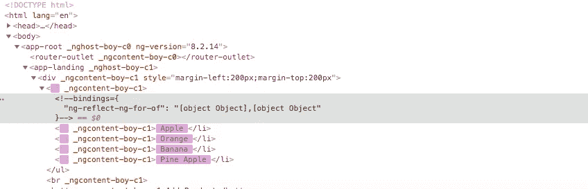
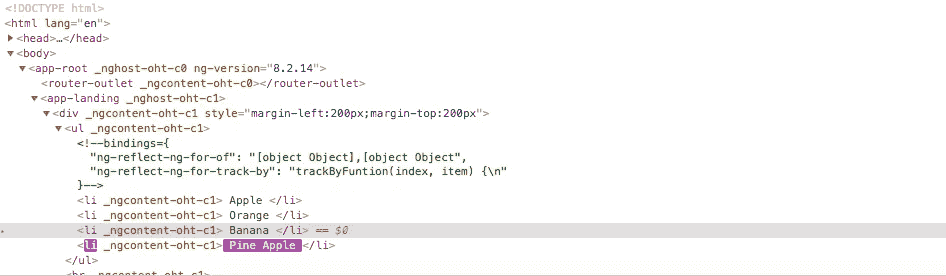

# 利用跟踪函数优化角度性能

> 原文：<https://javascript.plainenglish.io/angular-performance-optimization-using-trackby-function-bd2cad4acee?source=collection_archive---------9----------------------->

## ngFor 的问题以及如何解决

在本教程中，我们将看到一个优化技术在**角度**。我们要关注的部分是一个数据数组。我们总是使用 **ngFor** 来迭代 Angular 中的数据数组。ngFor 循环遍历数组，并将单个数据显示为输出。

我们不担心 ngFor 如何工作？。为什么？因为大多数时候，我们只使用阵列中较少的数据。如果我们使用 ngFor 迭代数据，数组中的一些数据不会在 Angular 中产生**性能** **问题**。但是如果你使用更多的数据，比如 1k 或者更多的行，那么你肯定会感觉到输出的缓慢。

首先，我们将了解 ngFor 是如何工作的？。然后我们将学习如何使用 **trackBy** 功能解决速度慢(性能问题)的问题。

**ngFor 如何工作？:**

假设我们有以下数据。

呈现数组值的 HTML 代码。

当我们使用 ngFor 迭代数据时，每次，整个

*   标签将被**删除**，并且它将**再次重新创建**Li>。当我们添加新数据时，每次都会动态创建 DOM。这是渲染输出的问题。ngFor 删除所有的< li >并重新创建< li >标签，而不是给新数据添加一个新的< li >标签。这是一个耗时的过程。这导致了角度的性能问题。

如前所述，我们从未注意到 Angular 使用 ngFor 的性能问题。为什么因为我们总是用**少用** **数据只用**。因此，如果数组中有更多的数据，那么实现 trackBy 来避免这个问题是更明智的。

**无跟踪功能:**

我们将模拟每次如何重新创建

*   标签。将以下代码放入您的 ts 文件中。

将下面的代码放到你的 HTML 文件中。

现在点击**添加产品**按钮，新产品将被添加到列表中并显示出来。现在，如果你在**检查元素模式**中查看代码，你可以看到<李>标签是如何重新创建的，如下图所示。

inspect element mode for without trackby

所以每当添加新数据时，它会删除所有的

*   标签并重新创建*   标签。

**带跟踪功能:**

为了避免这个问题，我们可以在 ts 文件中创建一个如下所示的函数。

在 HTML 文件中使用 trackBy 将函数添加到 NGF。

现在如果你点击添加产品按钮，它**不会重新创建**所有的<李>标签。相反，它只会在最后添加一个< li >标签。这怎么可能？。原因是 trackBy 函数使用索引值跟踪新记录。

在检查元素模式下渲染输出:

## **结论**

在本教程中，我们学习了，Angular 中的 **ngFor** 有什么问题，以及如何使用 **trackBy** 函数解决这个问题。如果数据较少或数据较多，请始终使用 trackBy 函数。这是 Angular 开发人员推荐的方法。

希望这篇文章有所帮助。感谢您花时间阅读它！