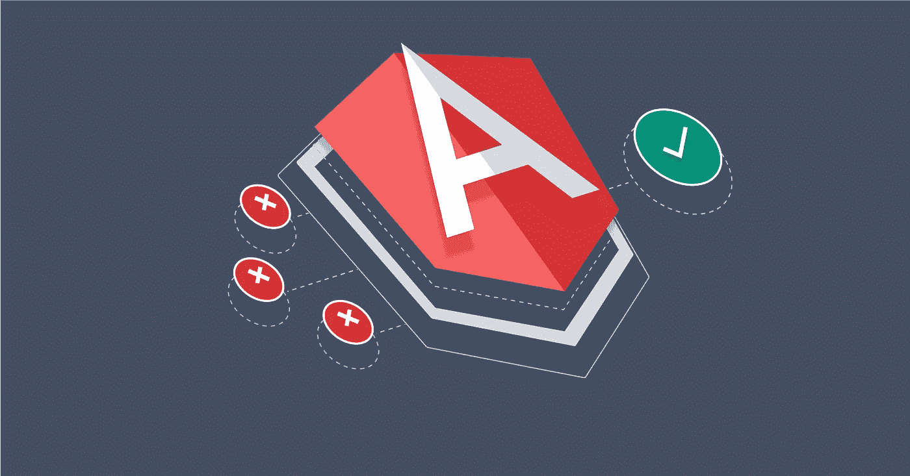

# 角度预加载策略

> 原文：<https://javascript.plainenglish.io/angular-preloading-strategies-what-are-they-and-how-are-they-used-fb8a92e9d158?source=collection_archive---------6----------------------->

## 它们是什么？它们是如何使用的？



想要深入了解延迟加载模块和[预加载策略](https://angular.io/api/router/PreloadingStrategy)？

这是完整的指南，将教你一切你需要知道的关于 Angular 的预加载策略。

Angular 有一个非常酷的功能，叫做[角度模块](https://angular.io/guide/architecture-modules)。

但这是什么呢？

角度模块是可以导入应用程序不同部分的代码块。一个模块可以包含成组的组件、服务和其他功能，每一个都专注于一个功能领域、特定的领域、工作流等

还有他们为什么**酷**？

[](https://school.danielk.tech/course/unleash-your-angular-testing-skills?utm_source=medium&utm_medium=banner&utm_campaign=unleash_testing_skills)

它们很酷，因为角形模块给网络应用带来了模块化的超能力。据我所知，没有其他前端框架或库能像 Angular 做得这么好。

随着 Angular 应用的增长，模块特性变得越来越重要。它允许您将 web 应用程序的各个部分分割成可以在以后加载的片段。

现在，当您的 Angular 应用程序的核心被加载到浏览器中时，这些延迟加载的模块将不会被加载，直到被请求。这意味着当用户点击一个需要你的一个惰性加载模块的链接时，他们将不得不等待直到那个模块被下载和初始化。

这就是**预加载策略**可以帮助你的角度应用闪闪发光的地方。

预加载策略指导 Angular 如何加载你的懒惰模块。

你想马上装货吗？

还是在用户需要的时候？

或者等到用户将鼠标悬停在一个还没有加载的懒加载模块上，又如何呢？

我的意思是，嘿伙计，你是老板，你可以在这种偷懒的事情上发号施令。

# 内置角度预加载策略。

有两种基本预载策略的角船。

策略表明你不能预加载任何懒惰加载的模块。

`PreloadAllModules`采用完全相反的方法，立即加载所有模块。

对于小角度应用，这两个选项中的一个可能有效。但是我的经验是，一旦 Angular 应用程序超出了任何小的范围，你就会想要一个更具战略性的预加载策略。

那么我们还有其他选择吗？

# 其他角度预加载策略。

还有其他预加载策略可以使用，由社区建立。

该软件包是一个[预加载策略](https://angular.io/api/router/PreloadingStrategy)，当用户将鼠标悬停在相应的路由器链路上时，该软件包将预加载一个惰性加载的路由。它是由[明科·格切夫](https://github.com/mgechev)建造的。

你知道吗？他恰好是 Angular 团队的一员。

要安装 [ngx-hover-preload 软件包](https://www.npmjs.com/package/ngx-hover-preload)，请运行以下命令。

```
yarn add ngx-hover-preload
```

或者如果你使用 npm。

```
npm install --save ngx-hover-preload
```

在您的应用程序模块和延迟加载的模块中导入悬停预加载模块，以确保所需的指令可用:

```
import { HoverPreloadModule } from 'ngx-hover-preload'; @NgModule({ 
   declarations: [ // ... ], 
   imports: [ // ... HoverPreloadModule ], 
   bootstrap: [AppComponent] 
}) export class AppModule { }
```

接下来，您将把悬停预加载模块导入到所有延迟加载的模块中。

最后，将悬停预加载策略设置为您的预加载策略:

```
import { HoverPreloadStrategy } from 'ngx-hover-preload'; @NgModule({ 
   // ... 
   imports: [RouterModule.forRoot(routes, { preloadingStrategy: HoverPreloadStrategy })], 
}) export class AppModule {}
```

这个包是由同一个天才构建的另一个预载策略。它提供了一个预加载策略，自动下载与屏幕上所有可见链接相关的惰性加载模块。

这是为了让后续页面导航更快。是这样的。

*   首先，它检测视口中的 routerLinks。
*   第二，等待，直到浏览器空闲，页面完全加载并呈现。
*   第三，确保用户没有慢速连接或启用了数据保护。
*   最后，它使用 Angular 的预取策略预取延迟加载的模块。

以下是如何在您的 Angular 应用程序中安装和使用它。

```
npm install --save ngx-quicklink
```

然后将快速链接模块导入应用模块，并在路由器配置中使用快速链接策略作为预加载策略。就像这样。

```
// ... 
import { QuicklinkModule, QuicklinkStrategy } from 'ngx-quicklink'; @NgModule({ 
   declarations: [...], 
   imports: [ // ... 
     QuicklinkModule, 
     RouterModule.forRoot(routes, { preloadingStrategy: QuicklinkStrategy }),
    ], 
   bootstrap: [...] }) export class AppModule {}
```

最后，您将把悬停预加载模块导入到所有延迟加载的模块中。

# 您应该为您的 Angular 应用程序使用哪种类型的策略？

我的朋友，这是每个角度应用程序独有的决定。您必须分析您的场景，并决定什么策略最适合您的用户。

如果用户是商业光纤连接的雇员，则使用预载全部策略。Juz 拿起那些文件，把它们塞住！

但是如果你的 Angular 应用程序有移动用户，我建议采取保守的方法。

[](https://school.danielk.tech/course/unleash-your-angular-testing-skills?utm_source=medium&utm_medium=banner&utm_campaign=unleash_testing_skills)

*最初发布于*[*https://danielk . tech*](https://danielk.tech/home/the-complete-guide-to-angular-preloading-strategies)*。*