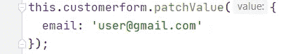
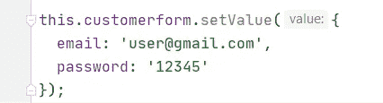
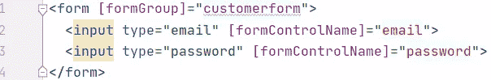

# 带验证和自定义验证的角度反应式表单

> 原文：<https://javascript.plainenglish.io/angular-reactive-forms-create-simple-form-with-validations-1dfff3d84fa6?source=collection_archive---------12----------------------->

> 一大类前端应用程序是非常表单密集型的，尤其是在企业开发的情况下。许多这样的应用程序基本上都是复杂的表单，有多个标签和对话框，有不同的验证逻辑。

*呈现了几种可供选择的创作形式。 ***反应式表单*** (也称模型驱动表单)和 ***模板驱动表单*** 是常用的构建角度表单的方法。反应式表单比模板驱动的表单好得多，模板驱动的表单功能更强大，测试也更容易，因为所有的逻辑都组合到了组件类中。*

*在反应式表单中，创建表单的大部分繁重工作发生在组件类而不是模板中。*

## ***首先，我们需要设置模块***

*在这一步，我们需要从***@ angular/forms***中导入***ReactiveFormsModule***到应用模块中。为此，为了简单起见，我将在 ***AppComponent*** 中编写。下面的代码片段展示了如何做。*

## *接下来，我们将**创建一个反应式表单***

*在创建一个反应式表单时，我们要处理两个重要的概念:表单组 和表单控件 *。*表单控件是可以处理任何表单元素的数据值和验证状态的类。*表单组*包装一组表单控件。表单控件可以表示用户的名字、姓氏、电子邮件或密码等。*

***有两种方式**在角度反应表单中启动表单组。*

*   *对于第一种方式，我们通过传递一组子控件作为第一个参数来启动一个表单组。该子控件的 ***键*** 注册控件的名称，每个控件都应该是 FormControl 的对象类型。下面的代码片段展示了这个实现。*

*   *当表单变得更复杂时，第二种方式**很有用。在这里，我们注入了`FormBuilder` 类并调用了`group` 方法。***

*作为 group 方法的参数，我们通过 ***键*** 将控件的名称和值定义为一个空数组。*

*在特殊情况下，我们需要为表单控件提供默认值。例如，如果我们想要默认的电子邮件为 user@gmail.com，我们可以这样做，如下所示。*

## *接下来，让我们看看 *setValue* 和*patch value**方法的**用途****

**在某些情况下，我们需要在表单控件中设置或修补默认值，以应对用户在编辑表单中编辑细节的情况。**

**为此，我们使用 setValue 和 patchValue 方法。两者的区别在于，当我们使用`setValue()`时，我们必须在`FormGroup`中设置所有的表单控件，而当我们使用`patchValue()`时，则可以设置选中的表单控件。**

****

**patchValue method**

****

**setValue method**

**到目前为止，我们已经完成了组件类的基本步骤。接下来，我们继续模板中的步骤。**

**在模板中，您需要用一个`<form>.`包装表示表单控件的输入字段，然后将`FormGroup` 指令添加到表单标签中，并在组件类中传递实例化的表单组。**

**完成上述步骤后，将`FormControlName`指令添加到输入字段，并将表单控件的名称作为组件类中使用的字符串进行传递。**

****

**现在，我们已经介绍了表单的所有基本实现，但还没有完成提交。**

## **让我们继续表单提交**

**下一步，我们将添加类型为`submit`的提交按钮。此外，我们需要在`form` 标签中添加`NgSubmit` 处理程序。**

**当我们考虑表单提交时，有两种可能的方法可以发现它:**

*   *****提交*** :这是一个 HTML 默认表单提交事件，当表单提交时会调用底层方法。**
*   *****ngSubmit****:*如果处理程序代码抛出并导致实际的 HTTP post 请求，这将阻止表单被提交。**

## **验证表单控件**

**在验证之前处理输入字段值可能会产生严重的后果。你最终可能会存储无效的数据，如无效的电子邮件、年龄、日期等。在这种情况下，Angular 提供了很少的内置验证器:**

*   **`**required**` -验证表单控件必须有一个值，并根据需要标记它。**
*   **`**email**` -验证表单控件是否具有有效的电子邮件地址。**
*   **`**minLength**` -验证表单控件中文本的长度是否大于或等于值。**
*   **`**maxLength**` -验证表单控件中文本的长度小于或等于值。**
*   **`**Max**` -验证表单控件中的数字小于或等于值。**
*   **`**Min**` -验证表单控件中的数字是否大于最小值或等于值。**
*   **`**Pattern**` -验证表单控件中的文本是否匹配特定的正则表达式。**
*   **`**email**` -验证用户提供的电子邮件地址的正确性和完整性。**

**现在让我们看看如何将验证器添加到表单控件中。**

**我们需要将`@angular/forms`中的`Validators`类导入组件类。例如，这里我们将根据需要创建电子邮件和密码字段，电子邮件控件应该有一个有效的电子邮件。我们可以这样做，将`Validators.required` 添加到两个控件的数组中，只将`Validators.email` 添加到电子邮件控件的数组中，如下所示。**

**如上例所示，一个控件可以有多个验证器。**

**验证的有趣部分是我们可以将 ***自定义验证器*** 组合到我们的控件中。**

**假设您想要将登录的默认密码设置为“admin123 ”,并需要根据用户输入对其进行验证。如果输入密码不同于默认密码，则密码字段应该无效。为此，您必须编写自己的函数并传递一个对象类型`AbstractControl.`**

**然后将`ValidatorPassword` 函数添加到所需验证器旁边的密码控件数组中，如下所示。**

**接下来，我们看看如何将这个自定义验证器应用到模板中。**

**这里我使用了 ***bootstrap*** 中的 ***无效反馈*** 类来显示输入字段*的验证错误消息。*或者，您可以使用`hasError` 方法，在那里您需要传递错误的名称。**

## **接下来，我们前进到获取关于表单状态的知识**

**角度形式及其控制可以有不同的状态，例如:**

**-*:用户没有更改表单控件的值。***

***——*:与质朴相反。****

****- ***触摸*** :用户已经访问并退出表单控件。****

***- ***未动*** :已动相反。***

***这些状态帮助您增强表单的行为方式。下面的示例显示了如何对控件应用上述状态。***

***此外，在不久的将来，我们将在一篇单独的文章中详细解释表单状态是如何工作的。***

***我们到了本文的目的地。我希望你喜欢这篇文章，并充分利用它来提高你对**角反应式**的了解。***

****多内容于* [***中***](http://plainenglish.io/)***