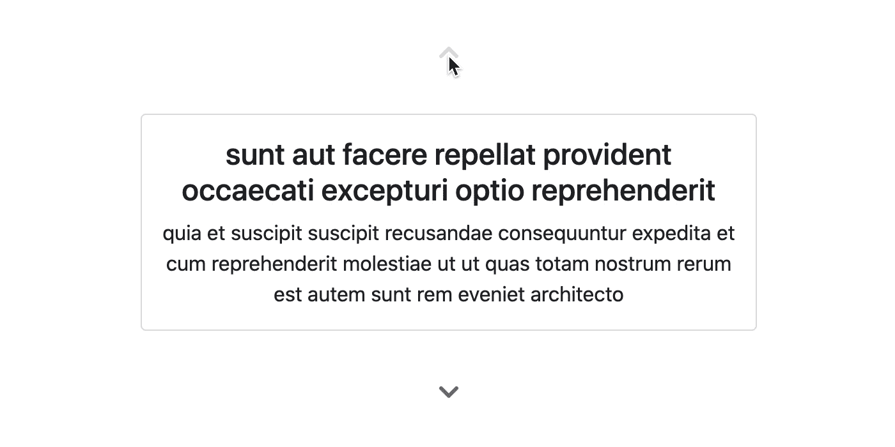

# 如何简化角反应性

> 原文：<https://javascript.plainenglish.io/angular-reactivity-streamlined-831754b60a11?source=collection_archive---------0----------------------->

角拥抱 RxJS 可观。路由器、HTTP 客户端和反应式表单等主要功能公开了使用或返回 RxJS 可观察对象的接口。角度示意图和生成器可以处理可观测量来执行异步操作。common 包提供了著名的`AsyncPipe`，用于从组件模板的可观察值中提取值。文档中甚至有一节专门讨论 RxJS 和 observables 。

考虑到一切，Angular 可能是与 RxJS observables 最全面的集成。然而，一旦观察到组件类中发出的值，事情就变得有点复杂了。让我们创建一个组件，它将路由数据和参数一起引用，以逐个浏览帖子列表。它看起来会像这样:

为了访问路由数据和参数，我们将注入`ActivatedRoute`实例。数据和参数都是可观察的，所以如果我们想在组件类中使用发出的值，我们需要订阅它们。

Using route data and params in an Angular component

我知道我可以用管道将路线数据和参数传输到单独的`prev$`和`next$`流中，并在模板中使用`async`管道，但是我在这里试图说明一点，所以请原谅我。

正如你所看到的，它已经开始感觉不那么被动了，一旦我修复了我在这里故意犯的几个错误，它会感觉更不被动。您可能已经注意到了第一点:在组件销毁之后，任何打开的订阅都是潜在的内存泄漏。因此，当组件被销毁时，让我们通过存储它并调用它的`unsubscribe`方法来清除订阅。

Clearing RxJS subscriptions in an Angular component

调用`unsubscribe`方法还有其他选择。我们可以通过`takeUntil`操作符来传输流，并用`Subject`来通知它。我们可以将令人惊叹的 [@ngneat/until-destroy](https://github.com/ngneat/until-destroy) 库付诸行动，这样就不需要`ngOnDestroy`了。我们甚至可以使用一个类似于[的服务，一个 ABP Angular UI 提供的服务](https://docs.abp.io/en/abp/latest/UI/Angular/Subscription-Service)来收集订阅并避免破坏钩子。然而，这并没有消除本质上的缺陷:订阅一个可观察的感觉并不被动。

还有第二个问题是上面没有解决的:变化检测。这个组件工作是因为 **zone.js** 会触发变化检测，Angular 会在每次检测周期运行时检查这个组件。在真实的应用程序中，这个组件可能会被检查太多次。我们可以应用`OnPush` [变更检测策略](https://angular.io/api/core/ChangeDetectionStrategy)来避免这种情况，但是我们的流发出的值不会导致重新呈现，除非手动触发变更检测。

嗯，`ChangeDetectorRef`的`markForCheck`方法没有安排新的变更检测周期，但是它会注册这个要检查的组件。因此，流将发出一个新的值，`prev`和`next`将被更新，在下一个变更检测周期中，我们的组件将有一个部分重新呈现。然而，如果您不必进行显式的变更检测调用，那不是很好吗？

# 输入 ng-观察

你一定累得翻白眼:*“不！不是另一个订阅库！”是的，这个简单的库为你订阅和取消订阅 observables。但是，它也为您提供了一个反应性对象，并标记您的组件，以便对每个发出的值进行更改检测。这导致了一种反应性的成分/方向性的感觉。本库名为[**NG——观察**](https://github.com/ngbox/ng-observe) ，我是其背后 **NG 盒子**团队的一员。*

让我们看看当我们应用 ng-observe 时，我们的组件是什么样子的。

Using ng-observe to observe and react to emitted values

首先，我们提供了组件级的`OBSERVE_PROVIDER`。然后，使用`OBSERVE`标记，我们在组件中注入了一个函数(`ObserveFn`)。使用这个函数，我们可以观察发出的值，并将它们存储为`Observed`对象。引用这些对象的`value`属性总是会给我们当前值，所以我们可以很容易地在两个简单的 getters 中为`prev`和`next`构建逻辑。

此外，ng-observe 允许您将`count`和`id`组合在一个集合中，从而去掉`Observed`对象。我们可以这样做:

Using ng-observe to observe a collection of emitted values

很可爱，不是吗？不过，有一个问题:析构`state`属性在这里有效，因为它发生在 getter 内部。如果想获得 ng-observe 集合道具派生的反应属性，就要把它们转换成`Observed`对象。为此有[实用函数](https://github.com/ngbox/ng-observe#tovalue)，你甚至可以得到计算的观察值。

Mapping reactive collections to reactive values with ng-observe

感谢`toMappedValue`功能，我们已经将反应状态集合映射到`prev`和`next`道具。我们不再需要吸气剂了。我们也没必要把收藏当道具。另一方面，模板上的绑定发生了变化，以反映出`Observed`类的形状。

# 结论

这些示例演示了 ng-observe 在组件中的用法，但是这个库在指令中也同样适用，因为它是独立于模板的。然而，这是一个附带的好处。作为一名开发人员，您获得的真正优势是当您使用可观察的流时，组件或指令的反应性如何。我们希望它也能提高你的 DX。你可以在这里找到游乐场。

最后一句话，如果可以的话:请通过与他人共享该库来显示您对我们的支持(或许[在 GitHub](https://github.com/ngbox/ng-observe) 上给我们一颗星)。我们是 NG Box，作为一个团队，这是我们的第一个但希望不是最后一个 Angular 库。

感谢您的阅读。祝您愉快！

*更多内容请看*[*plain English . io*](http://plainenglish.io/)