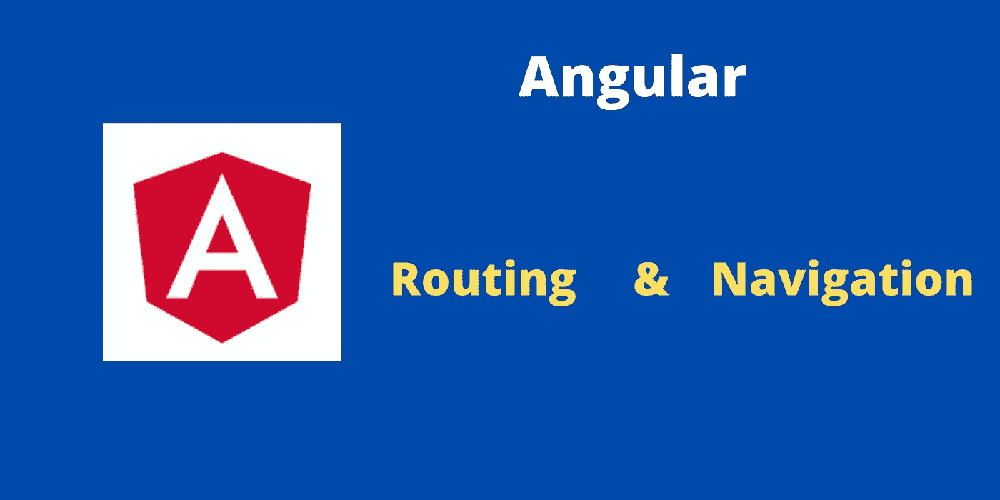

# 角度路由和导航示例

> 原文：<https://javascript.plainenglish.io/angular-routing-and-navigation-example-998d14c01f8e?source=collection_archive---------13----------------------->

## 创建组件并创建路线，然后导航到路线



在本教程中，您将学习如何创建路线(页面)以及如何使用 **Angular** 中的超链接和事件(点击事件)导航到路线。

在本帖中，我们将讨论以下主题:

1.  创建新的角度项目并预览该项目。
2.  如何更改默认根页面？。
3.  如何创建新页面？
4.  如何为新创建的页面创建路由？。
5.  导航到新创建的页面。

我们将一个一个地看到他们。

# **创建棱角分明的项目:**

使用下面的命令创建一个新的角度项目。

```
ng new demo-project
```

它会从网上下载需要的文件。下载完成后，您可以使用下面的命令预览应用程序。

```
cd demo-projectng serve — open
```

上述命令将在您的默认浏览器中打开应用程序。每当您保存更改时，上面的命令会自动为更改重新加载浏览器页面。无需手动刷新页面。

# **更改默认根页面:**

所有路线都在 **app-routing.module.ts** 文件中定义。只需查看 app.routing.ts 文件中的以下代码。

1.  **路径** —用于定义页面/组件的路径。
2.  **组件** —用于链接路径中提到的路由的组件。

要在 Angular 中创建新页面，首先需要创建一个组件，并在 **app.routing.ts** 文件中为该组件创建一个路由。

**空路径**代表默认根页面。如果你想改变默认的登录页面，那么你必须改变空路径的组成部分。所有路由都在 app.routing.ts 文件中定义。

# **创建新组件(页面):**

您可以使用 Angular 中的 below 命令创建一个新页面。在这里，组件将作为一个页面。

```
ng g c about-us
```

上述命令将在 app 文件夹中创建一个包含所需 HTML、ts 和 CSS 文件的新文件夹。这里 **about-us** 是组件名。

# **为组件创建路线:**

之前我们创建了一个名为 **about-us** 的新组件。现在我们需要在 **app.routing.ts** 文件中为组件定义路由。

1.  这里的路径是**关于我们。**

2.然后我们将**about us 组件**链接到路径。

# **超链接导航:**

我们为“关于我们”组件创建了一条新路线。您可以使用超链接中的 **routerLink** 属性导航到新组件。

当您点击上面的链接，它将加载“关于我们”页面。

# **程序化导航:**

之前，我们使用超链接导航到“关于我们”组件。我们可以使用**路由器**类以编程方式做同样的事情。

所以在 **home.component.ts** 文件中导入路由器类。

在构造函数中为路由器创建一个引用变量。

调用路由器的 **navigateByUrl** ()函数，传递路由导航到组件。

将上述函数绑定到**home.component.html**文件中的一个按钮点击事件中。

# **定义 404 页:**

服务器不处理 Angular 应用程序中的 404 错误页面。所以在 Angular 中，我们必须定义 404 错误页。要定义 404 页，请在路径中使用双星号。

要检查 404 错误页面，请尝试浏览器上的以下链接。

```
[http://localhost:4200/ksksjsjs](http://localhost:4200/ksksjsjs)
```

**完整代码:**

```
[https://github.com/bharathirajatut/angular-examples/tree/master/angular-routing-navigation](https://github.com/bharathirajatut/angular-examples/tree/master/angular-routing-navigation)
```

**总结:**

在本教程中，您学习了以下内容。

1.  创建新的角度项目并预览该项目。
2.  如何更改默认根页面？。
3.  如何创建新页面(组件)？
4.  如何为新创建的页面创建路由？。
5.  导航到新创建的页面。
6.  如何创建一个 404 页面？。

如果您正在创建一个企业级的 Angular 应用程序，那么必须在您的应用程序中实现延迟加载。许多初学者在创建 Angular 应用程序时没有实现延迟加载。我在刚接触 Angular 的时候也犯过同样的错误。要了解延迟加载，请访问下面的链接。

[](https://medium.com/javascript-in-plain-english/how-lazy-loading-impacts-angular-app-performance-9c1ee0cb11ea) [## 惰性加载如何影响 Angular 应用性能

### 角形部件有什么问题？

medium.com](https://medium.com/javascript-in-plain-english/how-lazy-loading-impacts-angular-app-performance-9c1ee0cb11ea) 

仅此而已。希望你喜欢这个教程。

敬请关注更多文章。

感谢您阅读这篇文章。