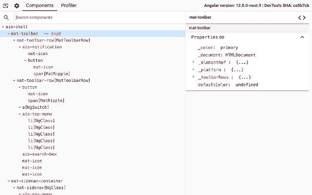
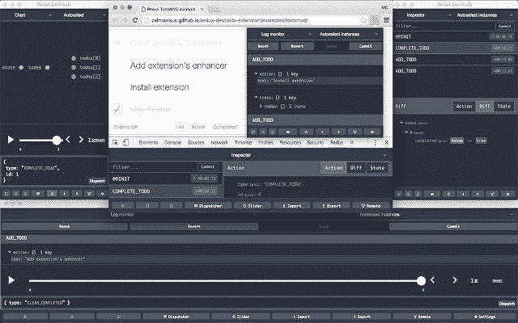
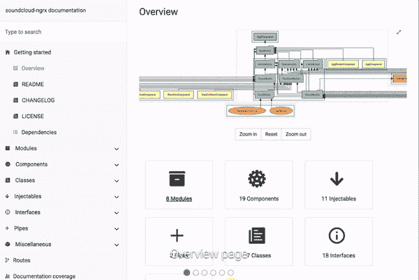
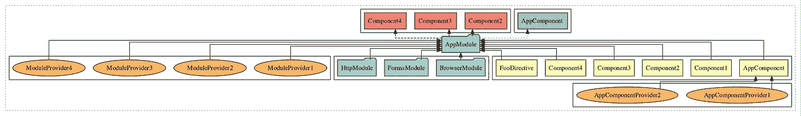
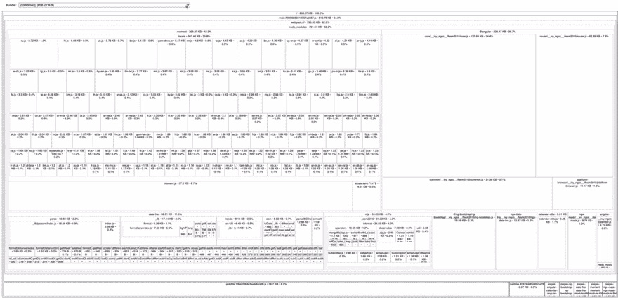

# 角度工具:项目开始前如何装备

> 原文：<https://javascript.plainenglish.io/angular-tooling-how-to-equip-before-starting-a-project-6712b835bc8b?source=collection_archive---------17----------------------->


自从上一篇关于“[如何最大限度地利用角度配置](https://medium.com/acadevmy/how-to-get-the-most-out-of-angular-configuration-e45b44500c3c)的文章以来，已经过去了几个星期，我们只剩下一个承诺:在着手一个角度项目之前，一起探索**用来“装备”的工具。**


# 角度开发工具

最后，除了 React 和 Vue，Angular 还有其官方的 DevTools，它作为一个简单的 Chrome 扩展安装，并为 Angular 应用程序提供调试和分析功能。安装后，该扩展将出现在“开发人员工具”中，并将由两个选项卡组成:

*   **组件:**允许您查看组成页面的组件的结构，并编辑组件的状态。
*   **Profiler:** 允许您分析应用程序，了解变更检测阶段的性能瓶颈。



Angular DevTools

## 链接

*   [角度 DevTools Chrome 扩展](https://chrome.google.com/webstore/detail/angular-devtools/ienfalfjdbdpebioblfackkekamfmbnh)
*   [角度开发工具文档](https://angular.io/guide/devtools)

# Redux 开发工具

如果你使用 Angular 和 NgRx 来管理应用程序的状态，另一个重要的工具是 Redux DevTools。这个工具也是作为 Chrome 扩展安装的，允许你在运行时检查应用程序存储中的变化。屏幕分为三个部分:

*   **动作检查器:**允许您可视化应用程序分派的动作序列。可以在动作列表中进行过滤和导航，有可能执行“跳转”到应用程序在给定时刻所处的状态。
*   **状态检查器:**点击单个动作，通过适当的按钮，可以看到:分派动作的细节(类型和有效载荷)，悬挂物的当前状态(在树、图表或原始视图中)，以及前一个动作的悬挂物状态和所选动作的悬挂物状态之间的差异。
*   **State Recording Navigator:**允许您“播放”对商店状态所做的更改，同时遵守已调度操作的时间线。



Redux DevTools

## 链接

*   [Redux DevTools Chrome 扩展](https://chrome.google.com/webstore/detail/redux-devtools/lmhkpmbekcpmknklioeibfkpmmfibljd)
*   [Redux DevTools 文档](https://ngrx.io/guide/store-devtools)

# Compodoc

无论何时开发需要文档的应用程序或库，Compodoc 都是您的合适工具。此工具允许您通过编写的注释自动生成角度项目的文档。Compodoc 还允许您生成所创建路线的映射，并创建导航菜单，以便在应用程序中的各种组件、防护和拦截器之间导航。



Compodoc

## 装置

*   通过命令安装软件包

```
npm install — save-dev @compodoc/compodoc
```

*   使用以下配置创建文件 *tsconfig.doc.json*

```
{
 “include”: [“src/**/*.ts”],
 “exclude”: [“src/test.ts”, “src/**/*.spec.ts”, “src/app/file-to-exclude.ts”]
}
```

*   在 *package.json* 中添加脚本

```
“compodoc”: “npx compodoc -p tsconfig.doc.json”
```

*   运行前面的脚本来生成文档

```
npm run compodoc
```

## 链接

*   [Compodoc 文档](https://compodoc.app)

# Compodoc 依赖关系图(NGD)

这个工具由 Compodoc 的作者开发，允许您生成和查看 Angular 应用程序的依赖关系树。这有助于我们清楚地了解模块、组件、指令、管道等是如何相互连接和依赖的。



Compodoc Dependency Graph (NGD)

## 装置

*   通过命令安装软件包

```
npm install -g @compodoc/ngd-cli
```

*   在 *package.json* 中添加脚本

```
“ngd”: “npx ngd -p tsconfig.doc.json -o”
```

*   运行前面的脚本来生成依赖关系图

```
npm run ngd
```

## 链接

*   [Compodoc NDG 文档](https://github.com/compodoc/ngd)

# 源地图浏览器

随着我们代码库规模的增长，您可能会在最初加载应用程序时遇到性能下降的问题。这可能是由几个因素造成的(可能需要一篇单独的文章)，但其中一个原因可能与安装了大量过于“沉重”的依赖项有关。Source Map Explorer 允许您查看一个映射，该映射以字节表示应用程序中安装的每个依赖项的大小。通过这种方式，我们清楚地知道哪些依赖项对我们的代码库有过度的影响，因此，我们可以评估用一个“更轻”的库来替换它们。



Source Map Explorer

## 装置

*   通过命令安装软件包

```
npm install — save-dev source-map-explorer
```

*   在 *angular.json* 文件中编辑以下配置属性

```
“sourceMap”: true,
“namedChunks”: true,
```

*   运行构建命令

```
npm run build
```

*   在 *package.json* 中添加脚本

```
“source-map-explorer”: “source-map-explorer dist/your-angular-app-name/**/*.js”
```

*   运行前面的脚本来生成源映射图

```
npm run source-map-explorer
```

## 链接

*   [源地图浏览器文档](https://github.com/danvk/source-map-explorer#readme)

# VS 代码扩展

如果使用 Visual Studio 代码作为代码编辑器，安装以下扩展有助于提高 Angular 应用程序的工作效率:

*   [**Angular 语言服务:**](https://marketplace.visualstudio.com/items?itemName=Angular.ng-template) 该扩展在通过自动完成、AOT 诊断消息(记得激活 *tsconfig.json* 文件中的 *strictTemplates* 选项)和快速信息编辑 Angular 模板时提供了很大的帮助。
*   [**Angular snippet:**](https://marketplace.visualstudio.com/items?itemName=johnpapa.Angular2)**这个扩展添加了 snippet 来快速生成:组件、指令、守卫、模块、管道等。**
*   **[**deep code:**](https://marketplace.visualstudio.com/items?itemName=DeepCode.deepcode)**deep code 可以让你通过一个复杂的基于 AI 的系统来发现 bug、漏洞和性能问题。****
*   ****[**quo kka . js:**](https://marketplace.visualstudio.com/items?itemName=WallabyJs.quokka-vscode)**quo kka . js 是一款快速 JavaScript / TypeScript 原型开发的开发者生产力工具。当您键入时，运行时值会更新并显示在 IDE 中您的代码旁边。******

# ******结论******

******用正确的工具处理一个有角度的项目可以在项目的早期产生影响。在本文中，我们向您介绍了每个 Devmy 项目的“工具箱”中的一些工具。在下一篇有角度的文章中，我们将讨论任何优秀开发者的最大盟友之一:ESLint 和 Prettier。我们将一起了解如何在 Angular 上配置它们，以及如何从 TSLint 迁移到 ESLint。******

******关注 [**Devmy**](https://devmy.it/) **—软件工厂&学习**关于[媒体](https://medium.com/acadevmy)， [Twitter](https://twitter.com/DevmyFactory) ，[脸书](https://www.facebook.com/Devmy.it/)和 [YouTube](https://www.youtube.com/c/devmy) 联系我们或让您了解前端、移动和 DevOps 开发的最新动态。******

*****更多内容请看*[***plain English . io***](http://plainenglish.io/)****