# Angular:使用@angular/localize 翻译应用程序语言，并将其部署到 Firebase

> 原文：<https://javascript.plainenglish.io/angular-translating-the-application-language-using-angular-localize-and-deploying-it-to-firebase-d2b127e64496?source=collection_archive---------2----------------------->


Photo by [Etienne Girardet](https://unsplash.com/@etiennegirardet?utm_source=medium&utm_medium=referral) on [Unsplash](https://unsplash.com?utm_source=medium&utm_medium=referral)

@angular/localize 可以非常容易地将应用程序的语言翻译成您选择的任何语言。在本地 DEV 服务器上实现它并不困难，但是在 Firebase 上部署它并让它工作对我来说是一项相当艰巨的任务。

所以我想我应该分享我创建一个简单的应用程序的经验，这个应用程序提供了在英语和法语之间切换的能力。这可以扩展到更多的语言。

如果你有兴趣知道 **ngx-translate** 如何帮助翻译你的应用语言，你可以看看下面的故事。

[](https://ramya-bala221190.medium.com/using-ngx-translate-to-switch-the-language-of-a-form-in-your-angular-application-d3e2ebd469d7) [## 使用 ngx-translate 在 angular 应用程序中切换表单的语言

### 您可能遇到过这样的应用程序，它们提供了以您喜欢的语言查看它的选项。这种功能不会…

ramya-bala221190.medium.com](https://ramya-bala221190.medium.com/using-ngx-translate-to-switch-the-language-of-a-form-in-your-angular-application-d3e2ebd469d7) 

在我们开始之前，一个**地区 ID** 由语言标识符、破折号(`-`)和地区扩展名组成。下面是几个例子。

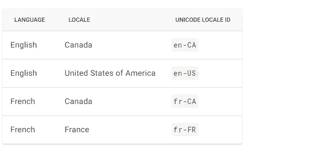

这些是我们的目标:

1.  [http://server _ name:port/en-US/](http://server_name:port/en/)以英语(美国)呈现应用程序。
2.  [http://server _ name:port/FR-FR/](http://server_name:port/en/)用法语(法国)呈现应用程序。
3.  [http://server _ name:port/en-CA/](http://server_name:port/en/)用英语呈现应用程序(加拿大)。
4.  提供了一个下拉菜单来动态更改应用程序的语言。

我们实现这一目标的策略是什么？

1.  将每种语言与唯一的**基本 HREF** 相关联。我们用 **/en-US/** 表示英语(美国)，用 **/en-CA/** 表示英语(加拿大)，用 **/fr-FR/** 表示法语(法国)。
2.  在该语言的区域设置 ID 例如:en-US 代表英语(美国)和**基地 HREF** 例如:/en-US/代表英语之间建立链接。在这个例子中，我们将确保两者对于一种语言来说是相同的。
3.  利用 **LOCALE_ID 注入令牌**来检索应用程序中当前使用的 locale ID 的值。

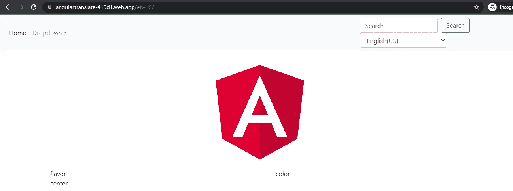

Application in English(US)

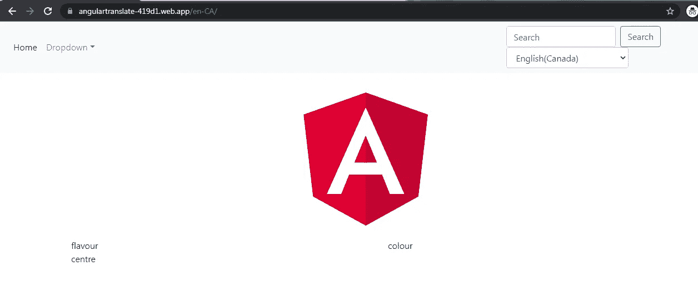

Application in English(Canada)

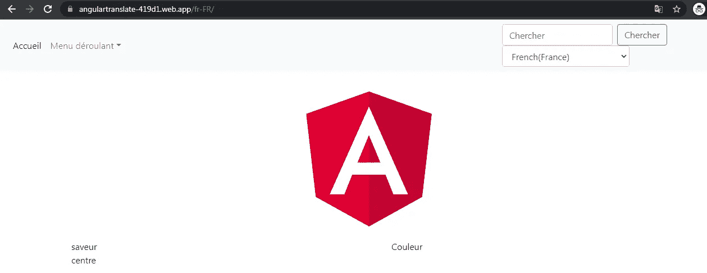

Application in French(France)

让我们从设置开始。

**第一步**。为了使用 **@angular/localize** 包，我们点击下面的命令:

```
ng add @angular/localize
```

**第二步**。如下修改 **app.module.ts** 的 providers 部分。

```
providers: [
{
provide:**LOCALE_ID**,
**useValue**:"en-US"
}
]
```

我们正在 providers 数组中注册 LOCALE_ID 注入令牌。这个令牌将保存值**“en-US”。**这是令牌的默认值。这也意味着应用程序的默认语言是英语(美国)。

因此，我们将执行以下翻译:

= >英语(美国)->英语(加拿大)和

= >英语(美国)->法语(法国)

**第三步**。我没有在 UI 上下太大功夫。我只是拿了一个引导导航条，它有一个链接，2 个下拉菜单和一个搜索框。最右边的第二个下拉菜单负责切换应用程序的语言。

我们也有角标志，后面跟着几行随机文本。

**AppComponent 模板:**

我们已经创建了 2 个组件: **HeaderComponent** 和一个 **MainComponent** 。

```
<app-header></app-header>
<router-outlet></router-outlet>
```

每当路径为空时，我们就在<router-outlet>中加载 MainComponent。</router-outlet>

```
const routes: Routes = [{
**path:””,
component:MainComponent**
}
];
```

**HeaderComponent 模板:**我不会显示整个模板。相反，让我展示如何翻译标题中各种元素的文本。

我们的标题看起来是这样的:

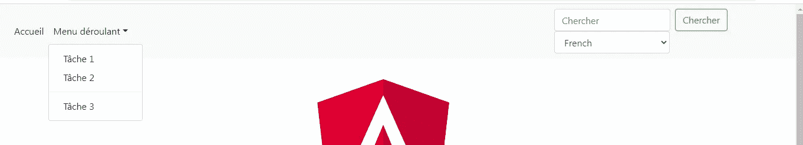

HeaderComponent

我们将在内容需要翻译的标签上使用 **i18n** 属性和 **i18n-** 属性。

```
<ul class=”navbar-nav mr-auto”><li class=”nav-item active”>
**<a i18n class=”nav-link” href=”#”>Home</a>**
</li><li class=”nav-item dropdown”>
**<a i18n class=”nav-link dropdown-toggle” href=”#” id=”navbarDropdown” role=”button” data-toggle=”dropdown” aria-haspopup=”true” aria-expanded=”false”>Dropdown</a>**<div class=”dropdown-menu” aria-labelledby=”navbarDropdown”>
**<a i18n class=”dropdown-item” href=”#”>Action 1</a>
<a i18n class=”dropdown-item” href=”#”>Action 2</a>
<div class=”dropdown-divider”></div>
<a i18n class=”dropdown-item” href=”#”>Action 3</a>**
</div>
</li></ul>
```

正如您所看到的，i18n 属性已经添加到了下面所有的标签中:

一.主页链接。 **Home** 已经翻译成 **Accueil** 。

```
<a **i18n** class=”nav-link” href=”#”>**Home**</a>
```

二。下拉链接。**下拉菜单**已经翻译成**菜单装饰**。

```
<a **i18n** class=”nav-link dropdown-toggle” href=”#” id=”navbarDropdown” role=”button” data-toggle=”dropdown” aria-haspopup=”true” aria-expanded=”false”>**Dropdown**</a>
```

三。下拉链接下的选项。**动作**已被翻译成 **T 切。**

```
<a **i18n** class=”dropdown-item” href=”#”>**Action 1**</a>
<a **i18n** class=”dropdown-item” href=”#”>**Action 2**</a>
<div class=”dropdown-divider”></div>
<a **i18n** class=”dropdown-item” href=”#”>**Action 3**</a>
```

类似地， **i18n** 属性也被添加到搜索框、搜索框占位符和搜索按钮中。

```
<input **i18n-placeholder** class=”form-control mr-sm-2" type=”search” **placeholder=”Search”** aria-label=”Search”><button **i18n** class=”btn btn-outline-success my-2 my-sm-0" type=”submit”>**Search**</button>
```

为了翻译搜索框的占位符，我们必须翻译<输入>标签的**占位符属性**值。我们使用 **i18n-attribute_name** 来翻译标签的属性值。

因此**i18n-占位符**属性被添加到<输入>标签中。

为了翻译

最后，我们在标题中有一个下拉菜单，以便动态切换应用程序的语言。

```
<select (**change)=”changePath(selectedLocale)”** class=”form-control” style=”width:50%;” **[(ngModel)]=”selectedLocale”** name=”selectedLocale”><option **[value]=”locale.code”** *ngFor=”let locale of locales”>**{{locale.name}}**</option></select>
```

这是一个简单的下拉菜单，它遍历数组 **locales** 来显示两种语言:英语和法语。每当我们更改语言时，就会调用 **changePath()** ，将语言的区域设置 ID 作为参数传递。

让我们看一下 **HeaderComponent 类**来理解方法内部发生了什么。

```
export class **HeaderComponent** implements OnInit {constructor(**@Inject(LOCALE_ID) private localeId: string**) {}public **selectedLocale**:string=this.localeId;
public **locales**:any=[
 {name:"French(France)",code:"**fr-FR**"},
{ name:"English(US)",code:"**en-US**"},
{ name:"English(Canada)",code:"**en-CA**"}]ngOnInit() {}**changePath(code:string){**
location.replace(`/${code}/`);
}
}
```

我们将 LOCALE_ID 标记的值赋给了 **selectedLocale** 变量，以便在下拉列表中选择所选语言。

如前所述，我们正在遍历一个包含 2 个对象的数组 **locales** 。每个对象都有一个显示在下拉列表中的**地区名**和一个**地区 ID** 。当我们更改下拉菜单中的语言时，change 事件被触发，调用 **changePath()** 将所选语言的区域设置 ID 作为参数传递。

```
**changePath(code:string){**
location.replace(`/${code}/`);
}
```

我们正在使用 **location.replace()更改应用程序的 **base href** 。**如果您还记得，我们在 index.html 有<碱基>标记。<基>标签的 **href** 属性默认设置为“/”。我们希望将此更改为:

=>"/fr-FR/"即[**http://server _ name:port/FR**](http://server_name:port/fr)**-FR**/如果是法语

=>"/en-US/"即[**http://server _ name:port/en**](http://server_name:port/en)**-US**/如果是英语(美国)和

=>"/en-CA/"即[**http://server _ name:port/en**](http://server_name:port/en)**-CA**/如果是英语(加拿大)

基本 href 的变化对于切换应用程序的语言至关重要。这是因为我们将每种语言与不同的基础 href 相关联。

当我们在浏览器窗口中点击[http://server _ name:port/FR](http://server_name:port/fr)-FR/时，这意味着我希望应用程序以法语呈现。应用程序如何知道这一点？我们将很快在 angular.json 配置中看到这一点。

现在让我们转到**主组件模板**。这是我们主要组件的样子。

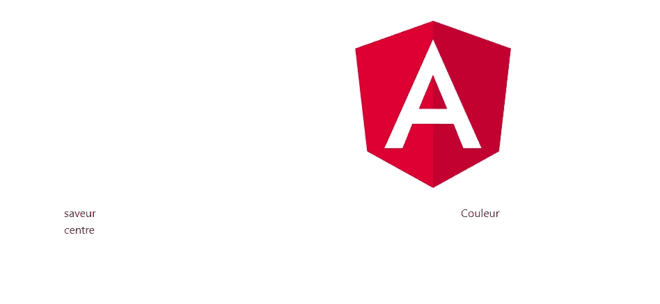

MainComponent in French

首先，我们有一个棱角分明的标志。这里我们已经使用 **i18n-alt** 属性翻译了< img >标签的 **alt** 属性。 **Angular Logo** 已翻译成 **Logo angulaire。**

```

```

二。在 logo 之后，我们有 2 行随机文本，我们使用 **i18n 属性**对其进行了翻译。添加该文本的目的是为了强调从英语(美国)转换到英语(加拿大)时文本拼写的变化，反之亦然。

```
<div class=”row”>
<div **i18n** class=”col-md-6">flavor</div>
<div **i18n** class=”col-md-6">color</div>
</div><div class=”row>
<div **i18n** class=”col-md-6">center</div>
</div>
```

**第 4 步**。现在让我们看看翻译是如何通过 i18n 属性实现的。

一、配置 angular.json。

我们在 angular.json 的**构建部分**的配置属性下添加了 3 个额外的属性: **fr-FR、en-US 和 en-CA**

configurations property under build section of angular.json

**translate.fr-FR.xlf** 文件将把语言从英语(美国)翻译成法语。

将语言从英语(美国)翻译成英语(加拿大)。

**translate.en-US.xlf** 将把语言从英语(美国)翻译成英语(美国)。

**baseHref** 属性决定应用程序以英语(美国)、英语(加拿大)和法语呈现时的基本 Href。

**outputPath** 属性表明我们的 dist 文件夹将在构建后生成，将包含 3 个文件夹: **fr-FR 和 en-US 和 en-CA:** 每个文件夹对应一种我们希望应用程序服务的语言。

请看看下面的截图，看看 dist 文件夹的结构，以及 index.html 的基本 HREF 在 dist 下的每个文件夹中有什么不同。

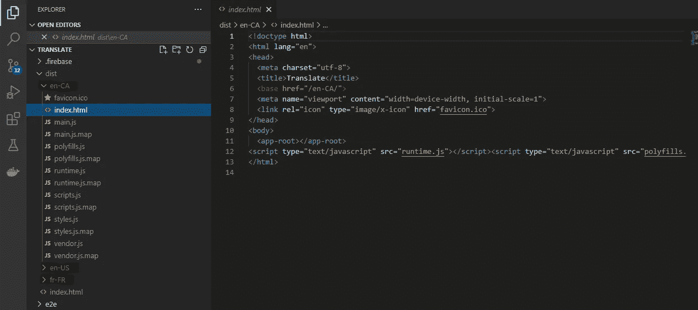

en-CA folder under dist with base HREF as /en-CA/

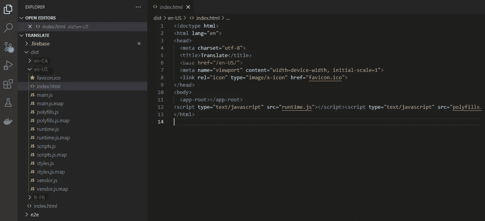

en-US folder under dist with base HREF as /en-US/

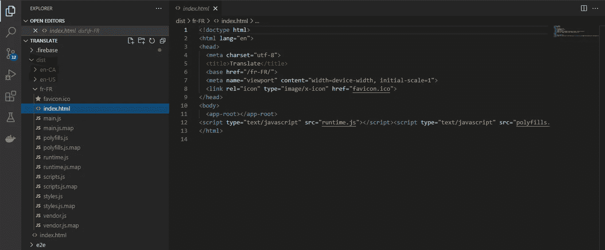

fr-FR folder under dist with base HREF as /fr-FR/

现在让我们回到我们在 HeaderComponent 的构造函数中注入的 LOCALE_ID 注入令牌。这个令牌包含下面提到的属性 **i18nLocale** 的值。我们还在配置中将区域设置与基本 HREF 链接起来。

例如，当我们在浏览器窗口中直接点击[http://server _ name:port/en](http://server_name:port/en)-US/或通过下拉菜单进行更改时，会发生以下情况:

= >由于 baseHREF **/en-US/** 被映射到语言环境 ID **en-US，**LOCALE _ ID 注入标记将带有值 **en-US。**

=>LOCALE_ID 会将英语(美国)设置为下拉列表中的选项。

=> **translate.en-US.xlf** 将是用于执行翻译的翻译文件。

在 angular.json 的 **serve 部分**中，我们再次在 configurations 属性下添加了 3 个属性 **en-US、en-CA 和 fr-FR** 。为什么这是必要的？您可以使用仅一种语言的 **ng serve** 来提供应用程序。使用 **ng serve 无法切换应用程序的语言。**

configurations property under serve section of angular.json

为了进一步理解这一点，我们来看看 **package.json** 。

package.json

如果我运行 **npm run start** ，将执行以下命令:**ng serve—configuration = FR-FR**

```
“**fr-FR**”: { “browserTarget”: “**translate:build:fr-FR**” }
```

这将使用在**服务部分**的配置属性下定义的 **fr-FR 配置**。这将依次使用在**构建部分**的配置属性下定义的 **fr-FR 配置**。

```
"fr-FR": {
"aot":true,
"outputPath": "dist/fr-FR/",
"i18nFile": "src/src/translation/translate.fr-FR.xlf",
"i18nFormat": "xlf",
"baseHref": "/fr-FR/",
"i18nLocale": "fr-FR",
"i18nMissingTranslation": "error"
}
```

因此，这将在浏览器窗口中加载 http://localhost:4200/FR-FR/

请注意，从下拉列表中更改语言为英语不起作用，您会在控制台中注意到以下错误。

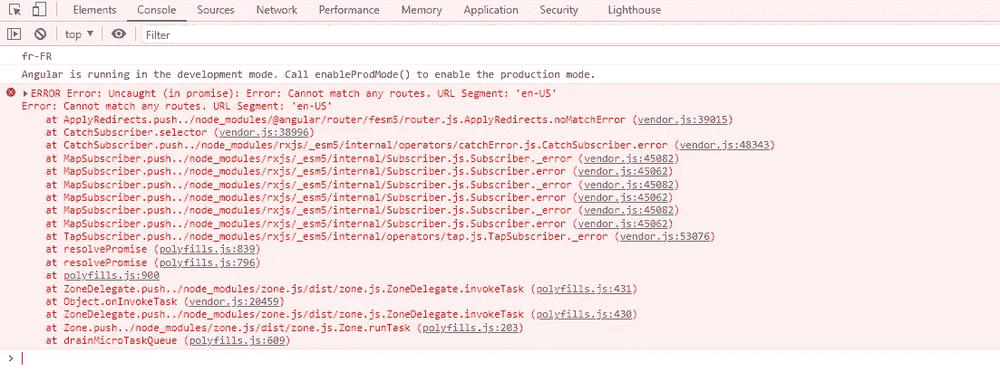

Error on switching language using dropdown

如果您想使用 **ng serve** 加载英语(美国)或英语(加拿大)的应用程序，您需要修改 package.json 的 start 属性，如下所示:

```
“start”: “ng serve **— configuration=en-US**”OR“start”: “ng serve **— configuration=en-CA**”
```

二。现在让我们继续创建 angular.json 文件中提供的翻译文件。

您需要执行以下两个命令来在 src/translation 文件夹中生成 **translate.xlf 和 translate-fr.xlf 文件**。

```
ng xi18n --i18n-format=xlf --output-path src/translation --out-file translate.en-US.xlfng xi18n --i18n-format=xlf --output-path src/translation --out-file translate.fr-FR.xlfng xi18n --i18n-format=xlf --output-path src/translation --out-file translate.en-CA.xlf
```

这些文件包含整个应用程序的翻译细节，即本例中的 HeaderComponent 和 MainComponent。

文件夹结构如下所示:

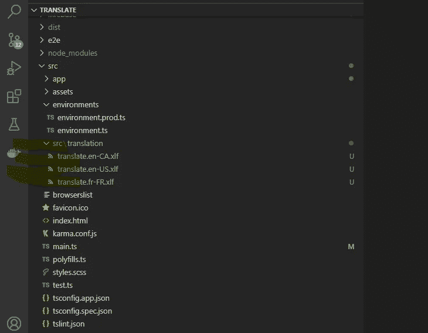

Translation files

下面我给出了一个关于 **translate.fr-FR.xlf** 的例子。

在每个标签下，您需要添加<target>标签来说明标签下的内容需要如何翻译。</target>

在 **translate.en-US.xlf** 中，<源>和<目标>包含相同的英文(美国)内容。

在 **translate.fr-FR.xlf** 中，<源>为英语(美国)<目标>为法语。

在 **translate.en-CA.xlf** 中，<源>为英文(美国)，而<目标>为英文(加拿大)。

请确保只有在确定了需要翻译的标签和属性之后，才执行这些命令。因为每次执行这些命令时，文件都会被创建时的内容覆盖。

三。最后，我们将这个应用程序部署到 Firebase。

在部署到 firebase 之前，我们首先需要构建项目。

让我们重新检查一下 package.json 是什么样子的。

package.json

我们需要执行 **npm run build-localeCode** 来构建项目。当我们运行这个命令时，我们正在执行下面的另外 3 个命令。

```
"build-localeCode:en-US": "ng build --prod --configuration=en-US",    "build-localeCode:fr-FR": "ng build --prod --configuration=fr-FR",    "build-localeCode:en-CA": "ng build --prod --configuration=en-CA"
```

第一个命令将使用 angular.json 的**构建部分的配置属性下的 **en-US 配置**在 dist 文件夹**中生成一个 **en-US 文件夹。**

第二条命令将使用 angular.json 的**构建部分的配置属性下的 **fr-FR 配置**在 dist 文件夹**内生成一个 **fr-FR 文件夹。**

第三个命令将使用 angular.json 的**构建部分的配置属性下的 **en-CA 配置**在 dist 文件夹**中生成一个 **en-CA 文件夹。**

在执行以下命令之前，请确保您已经在 Firebase 中创建了一个项目。

```
npm install — save firebasenpm install -g firebase-tools
```

按顺序执行上述命令。第一个命令安装 Firebase CLI，第二个命令全局安装 Firebase 工具。

```
firebase login
firebase init
```

第三个命令让您登录 Firebase。第四个命令在项目的根目录下创建两个文件:**。firebasec 和 firebase.json** 。

修改 **firebase.json** 文件如下。

**公共属性**包含构建文件夹。

将**重写属性设置为[]** 以避免意外错误。

最重要的属性是 **i18n 属性**，它告诉 Firebase 每个地区的文件夹在 dist 文件夹中的位置。由于 en-US、en-CA 和 fr-FR 文件夹都在 dist 文件夹的根目录下，所以我们只简单提到了“/”。

现在，让我们在将它部署到 Firebase 之前，在本地测试一下这个设置。Firebase 提供了在部署前本地访问所有 Firebase 资源进行测试的功能。执行下面的命令，在浏览器中打开 [http://localhost:5000](http://localhost:5000) 。

```
firebase emulators:start
```

您现在可以测试应用程序了。经过全面测试后，您可以使用以下命令将其部署到 firebase:

```
firebase deploy — only hosting
```

您可以在下面的 URL 查看这个应用程序，上面的示例项目是由 Firebase 托管的。

https://angulartranslate-419d1.firebaseapp.co 米

你可以通过下面的链接查看完整的代码。

[](https://github.com/ramya22111992/angularTranslate.git) [## GitHub-ramya 22111992/angular translate

### 此项目是使用 Angular CLI 7 . 0 . 6 版生成的。为开发服务器运行 ng serve。导航到…

github.com](https://github.com/ramya22111992/angularTranslate.git) 

*更多内容请看*[***plain English . io***](http://plainenglish.io/)*。报名参加我们的* [***免费周报这里有***](http://newsletter.plainenglish.io/) *。*