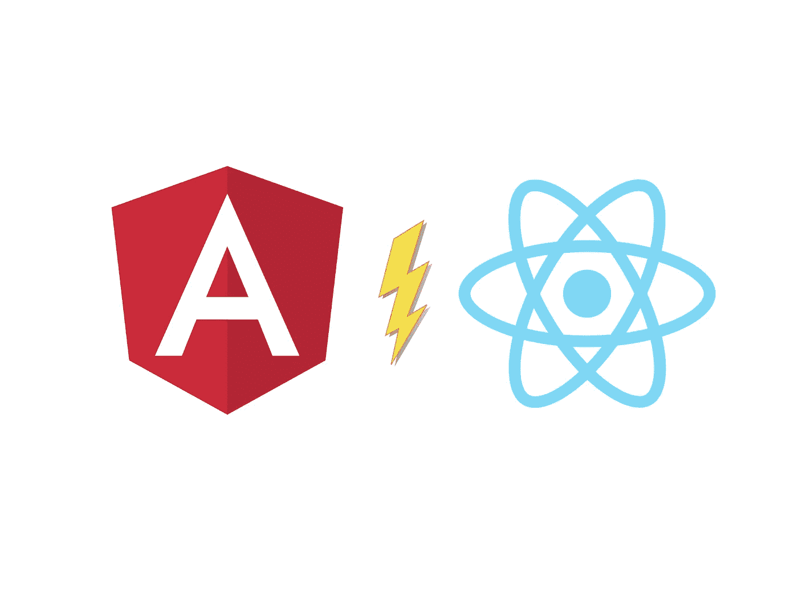
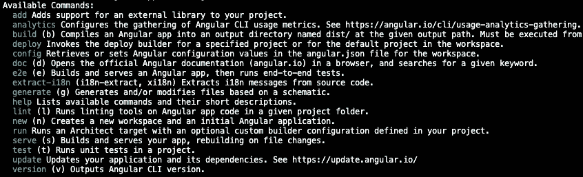

# 作为一名 React 开发者，我尝试过 Angular。以下是我喜欢它的 6 点

> 原文：<https://javascript.plainenglish.io/angular-vs-react-8125a541dd2a?source=collection_archive---------0----------------------->

## #4 是的，这是一个框架

Source: the author

Angular 是我尝试的第一个框架。我很快就离开了。相反，我在 React.js 上有了个人突破。

当然，我可能会有偏见。我承认我对 Angular 的记忆有点创伤。

然而，这不是 Angular 的错。当时我对 JavaScript 几乎一无所知。现在我知道得更多了。多得多。是时候挑战我的过去，给 Angular 一次机会了——作为一个有反应的人。

在我再次尝试后，我很惊讶:Angular 其实挺酷的。这就是我，作为一个有反应的人，喜欢它的原因。

# 1.嵌入式服务器端渲染及更多

React 对 Angular 的 CLI 的挂件是什么？嗯，我会说是创建-反应-应用程序命令行界面。然而，有趣的是我很少使用 CRA。为什么？因为 React.js 更多地存在于它的几十个框架和站点生成器中。好名字在这里有 Next.js，Gatsby，甚至 Astro。为生产 react 应用程序使用 create-react-app？不太可能。

当我学习 React.js 的基础时，这是一个巨大的失望。我认为可以用这个库来构建生产就绪的应用程序。然而，我感觉每个人都在说不同的语言。Next.js 和盖茨比已经占据了主导地位——而我对他们一无所知。

另一方面，棱角分明很好地勾勒出了你可能需要的一切。

# 2.实际上，它并没有那么大

完成的应用程序是 145 千字节。React.js 中相同的应用程序的大小是 135 千字节——也不算少。我真的对这个结果感到惊讶，因为 Angular 有明显肥胖的形象。

当然，Angular 中的简单计数器与 React.js 中的计数器相比，并不是最好的比较。当我们导入越来越多的框架/库特性时，包的大小明显增加。然而，有一个老生常谈的问题，Angular 的必要包大小要比 React 的大得多。我刚刚证明了它是错的。

# 3.做任何事情都有一种方法

这个很难解释。但是，当我开始使用 React.js 时，我犯了很多错误。在创建了一个新的 React 应用程序后，我看到的只是奇怪的 JSX 结构——我被理解代码中从 HTML 到 JavaScript 的过渡所淹没。

这是导致许多 React.js 初学者遇到问题的原因。这是 React 自由的代价。另一方面，Angular 要严格得多，似乎需要更多的学习才能迈出第一步。

这是一个零和游戏。我可以让这看起来像是 Angular 的一个好处，但也是 React.js 的好处。

尽管如此，我终于理解了 Angular 的粉丝对 Angular 的严格性的争论。尤其是在更大的团队中，你不能期望每个人都坚持最佳实践。这就是为什么有一个更严格的框架可能有助于避免问题，特别是从长期来看。

# 4.是的，这是一个框架

我过去常常嘲笑“一个框架比一个库更好”的论点。然而，在尝试了 Angular 之后，我更好地理解了这一点。

是的，Angular 是一个框架。另一方面，React 只是一个库。区别很明显。在查看 Angular 文档时，您会看到:Angular 在其官方环境中提供了您可能需要的一切。

路由、服务器端渲染、HTTP 客户端，甚至是一个国际化应用的工具。对于所有这些，您需要 React.js 世界中的第三方库。

我不认为这是一个很大的缺点。第三方代码本身并不差。

然而，很高兴知道 Angular 团队维护你的应用程序的所有组件——同样，弃用或危险代码的风险也因此降低了。

另一个优势可能是社区更有可能以这种方式使用相同的技术。

我经常从 React.js 的粉丝那里听到库更好——仅仅是因为你不想默认拥有表单处理、HTTP 请求等工具。随着时间的推移，我意识到这不是一个好的论点。大多数人认为这将使包的大小更大——不管你是否使用内置特性。

在 Angular 中，大多数不经常需要的 API 都可以作为单独的导入获得。如果您的应用程序不使用 HTTP 客户端，它将不会包含在生产捆绑包中。

# 5.完整而有用的 CLI

角随着它的气候起伏。它也很好地符合“凡事只有一种正确的方法”的哲学，并有助于制造几乎所有你需要的东西。从添加组件到使用服务器端渲染完成应用程序，CLI 提供了一切。

我是说，看看那些命令！

source: the author

# 6.文档太棒了

我不太喜欢它的设计。或许，这就是反应点。

然而，Angular 的官方文档却闪耀着它的内容。

一个很好的例子是我在服务器端渲染 React.js 时遇到的问题。

React 的文档对这个话题说的不多。为什么要有？毕竟，像 Next.js 这样的框架是独立的，并没有正式隶属于 React。

在 Angular 的文档中，你可以找到你需要的关于服务器端渲染的所有东西。

除了精彩的介绍和解释之外，Google 制作的关于这个主题的详细内容通常会链接到 Angular 文档中。

我记得的另一个好处是伟大的介绍。第一次尝试 Angular 的时候，传说中的《英雄之旅》帮了大忙。

感谢您的阅读！

**如果你想同时加入 Medium 和支持我:
你可以在这里** ***购买订阅** [**。**](https://louispetrik.medium.com/membership)

**附属链接。如果你使用这些链接购买东西，我会赚取佣金，但没有额外的费用给你。非常感谢！*

*更多内容看*[***plain English . io***](http://plainenglish.io)