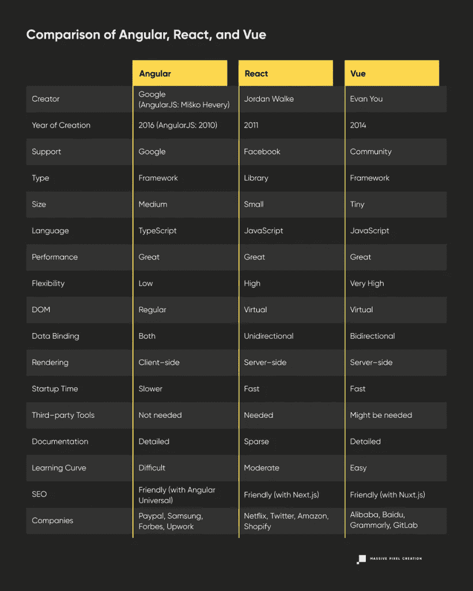

# 角度 vs .反应 vs Vue:发现各自的价值

> 原文：<https://javascript.plainenglish.io/angular-vs-react-vs-vue-finding-value-in-each-5fa58c9f8a41?source=collection_archive---------5----------------------->

**先说坏消息。**

在这三者之间，没有明确的赢家应该在你的下一个项目中使用，以实现令人惊叹的成功。

另一方面呢？**这也可能是好消息。**

如果你已经选定了一个框架或一个库——作为一个渴望学习新的、有利可图的技能的开发人员，或者一个计划创新产品的产品所有者——你不必害怕你的选择是错误的。尽管来自世界各地的人们不断地争论这三种技术中哪一种是最好的，但事实是，大多数都取决于个人偏好。

尽管如此，我们还是小心翼翼地指出了每种技术的优点和缺点，并在文章结尾的表格对比中进行了总结。**对于那些没有足够时间全部阅读的人，可以一路向下滚动。**

# 有角的

## **定义**

[Angular](https://angular.io)——不要与 AngularJS 混淆——是一个健壮的、**成熟的基于 TypeScript 的 web 应用框架**，免费且开源。它最常用于开发**单页应用程序(SPA)** ，但它也能出色地完成**渐进式 Web 应用程序、企业 Web 应用程序、**和 **ERP 系统。最重要的是，它适合于由许多不同团队同时进行的复杂项目。**

Angular 提供了开发人员创建成功的 web 应用程序可能需要的所有内置功能。这是一个强大的框架，可以独立使用，不需要任何外部工具。缺点——角度总是决定了步骤。但这不一定是件坏事。

## 起源

Angular-也被称为 Angular 2-是谷歌在 2016 年 9 月发布的，距离其前身 AngularJS 发布已有六年。

AngularJS 由 miko he very 创建，他是一名谷歌员工，只是想开发一个可以帮助构建其他项目的副业项目，自 2010 年发布以来一直表现良好。但仅仅用了四年时间，网络就发生了足够的变化，需要对 AngularJS 进行新的修改。最终，[被认为是不可能的](https://medium.com/the-startup-lab-blog/the-history-of-angular-3e36f7e828c7)——无论如何，AngularJS 都无法有效地处理移动应用程序开发或大型企业应用程序。

就在这个时候，谷歌宣布了 AngularJS 的伟大改写，简称 Angular。重写是非常基本的，主要的区别从语言开始——Angular 是基于 TypeScript 的，而它的前身是基于 JavaScript 的。正因为如此，AngularJS 的一些粉丝无法习惯它的新版本，因为它是如此彻底地不同。

但是还是有很多声音提倡 AngularJS，就像[很多公司都在用它](https://stackshare.io/angularjs)。像“安古拉杰死了吗”这样的问题得到了否定的回答。但是唉，目前 AngularJS 正处于[长期支持期](https://blog.angular.io/stable-angularjs-and-long-term-support-7e077635ee9c)，应该持续到 2021 年 12 月。此后，将不会部署任何未来的版本、修复或升级。

对谷歌来说幸运的是，Angular 这些年来一直很受欢迎，在 Stack Overflow 2021 调查中被 55.82%的受访者选为最受欢迎的框架。Paypal、桑坦德银行、福布斯、Upwork、三星和德意志银行都使用它。当然，还有谷歌。

## 强项

**经得起未来考验的**

由于谷歌支持和使用 Angular**，所以不用担心它会被其他技术搁置。你可以指望 Angular 长期保持下去，所有的问题都会随着时间的推移而得到解决。**

除了在谷歌的虚拟翅膀下，一个活跃的开发者社区也负责照顾 Angular。这就是为什么很容易找到大量有用的开发工具、插件、插件和软件包。当然，如果你遇到了问题，社区总能帮你解决。

**平台不可知**

无论你是想开发渐进式网络应用程序、原生移动应用程序，还是桌面安装应用程序，你都可以在 Angular 的帮助下完成这三项工作，无需任何额外的帮助。怎么会这样

Angular 是[灵活且独立于平台的](https://indepth.dev/posts/1027/angular-platforms-in-depth-part-1-what-are-angular-platforms)，这意味着代码是可重用的，并且概念在所有平台上非常相似，如果不是相同的话。这反过来导致更快的 web 开发过程和节省资金。

**自给自足**

Angular 是一个具有集成特性的成熟框架，这意味着不需要外部库或工具。数据绑定、路由、项目生成和表单验证已经是 Angular 包的一部分。

在所有框架中，Angular 被认为是最健壮的，它提供了最复杂项目所需的一切。

**可扩展**

由于 Angular 的架构是既**可预测又固执己见的**——代码是**高度可读的**以及**一致的**——很容易让许多团队参与同一个项目，无论是一个小型的网络应用还是企业规模的庞然大物。如果中间发生任何变化——应用程序需要更多的增长空间或者必须压缩——这很容易实现，不需要担心打乱整个结构。

**证据充分**

尽管 Angular 以其陡峭的学习曲线而闻名，但它附带了非常详细的文档**,以清晰、简洁的方式解释了框架的每个方面。此外，每个解释都有**代码示例支持。**遇到任何问题或难题，找到快速的解决方案基本上不费吹灰之力。**

尽管它相当复杂，如果不理解基本原理，可能会导致理解其余部分有困难。

**基于打字稿**

[微软开发的编程语言 TypeScript](https://www.typescriptlang.org/) ，在处理大型代码库时特别有用，JavaScript 就不可同日而语了。这是从 AngularJS 转向 Angular 的原因之一——使企业级应用程序的开发更容易，特别是当工作被分配给许多团队时。

TypeScript 带来[额外的好处](https://www.altexsoft.com/blog/typescript-pros-and-cons/)。它是可预测的，代码是干净的和可理解的，错误是容易发现的，导致相当容易的调试。快速重构、良好的自动完成和导航也是显著的特性。

## 弱点

**陡峭的学习曲线**

棱角分明不适合弱者。它需要通读文档，以掌握适用于 Angular 的规则集。这个框架非常固执己见，这意味着它有自己的做事方式，没有提供很多灵活性。

除此之外，还有许多复杂的原理需要掌握。学习 Angular 独特的语法，组件和指令，面向对象编程，NgModules，templates，双向绑定，[和许多其他东西](/the-hardest-parts-of-learning-angular-5b9ba1a4bbb6)是必不可少的。对于初学者来说，这个框架可能会让人不知所措——了解 HTML、CSS 和 JS 不会有太大帮助。但是对于后端开发者来说肯定更容易。

**捆大小**

最终产品的捆绑大小是影响性能的一个关键因素，捆绑越小，页面速度越快。不幸的是，**棱角分明的倾向于笨重的一边**。在很多情况下，这意味着很多很多的兆字节，这对很多开发者来说是一个令人沮丧的点。

这种差异在小型应用中尤为明显——角度投影总是比 React 或 Vue 投影重。但是对于大型应用程序，这三种技术的权重应该差不多。

# 反应

## 定义

[React](https://massivepixel.io/services/react-development-services/) 不是一个 web 框架，但这并不能阻止它与他们竞争——而且[实际上赢了](https://insights.stackoverflow.com/survey/2021#technology-most-loved-dreaded-and-wanted)。因此，React 经常被误认为是一个框架，而事实上，**它是一个 JavaScript 库。**可以在 [React 官网](https://reactjs.org/)确认。就像 Angular 一样，是免费开源的。

React 的主要目的是创建动态的、交互式的用户界面，通常用于单页应用程序(T21)。它的主要优势在于相当轻量级，使用声明性组件，以及极快的开发速度。

## 起源

React 是脸书在 2011 年创造的。它的作者[乔丹·沃克](https://twitter.com/jordwalke/status/1413966542786621440)受 [XHP](https://github.com/phplang/xhp) 的启发，首先创造了一个名为 [FaxJS](https://github.com/jordwalke/FaxJs) 的原型。它的目的在于用 JavaScript 定义样式表，这成为 React 的起点。

2011 年，React 接管了脸书的新闻订阅，并在一年后在 Instagram 上获得成功后部署。在 2013 年 5 月的 JSConf US 期间，React 被宣布为开源，迄今为止， [9836 家公司报告使用了它](https://stackshare.io/react)——像 Twitter、网飞、Airbnb、优步、Shopify、亚马逊等公司。

## 强项

**可重用和声明性组件**

React 拥有基于组件的架构，鼓励开发人员尽可能多地重用代码。所有组成优秀用户界面的部分都可以在其他地方使用，大大加快了开发过程。这怎么可能呢？每个组件都是独立的，有自己的逻辑，因此“一次编写，随处使用”的原则很容易遵守。

此外，基于组件的架构促进了**内聚设计**，确保了整个项目中差异的减少。

除了组件之外，逻辑也可以以两种方式重用:或者借助 [React 钩子](https://reactjs.org/docs/hooks-intro.html)或者使用[高阶组件](https://reactjs.org/docs/higher-order-components.html)。

此外，所有组件本质上都是声明性的。编写组件应该如何运行的确切步骤是不必要的，因为 React 会为您处理这些。您只需要描述期望的结果，并相信库会完成它的工作。

**虚拟 DOM**

React 高度赞扬了它的**快速性能，**这是使用**虚拟 DOM** 而不是常规 DOM 的直接结果。

一个**文档对象模型**是一个网页的表示，它清楚地呈现了网页的结构和所有内容。它充当一个应用程序编程接口(API ),允许访问页面来操作它。

但是因为 DOM[是为静态 UI 页面](https://medium.com/devinder/react-virtual-dom-vs-real-dom-23749ff7adc9)而创建的，所以每当它更新时，它就用它的所有对象(也称为节点)更新整个结构，这是一种不必要的过度行为，降低了性能。

虚拟 DOM 以一种优雅的方式解决了这个问题。它确保在计算出最佳和最有效的方法之前，不会对树进行任何更改。在此之前，所有的更改都存储在虚拟 DOM 的内存中。这样一来，必要的更新数量就会减少，从而提高应用程序的性能。

**单向数据流**

为了实现**代码稳定**，也为了保证**易于调试和维护**，引入了单向数据流。所有数据都可以单向传输，因此子组件不能影响父组件。正因为如此，任何问题都很容易追踪——跟上潮流就足够了。它还能让开发者更好地控制应用程序中发生的事情。

**充满活力的社区**

由于 React 非常受欢迎，到处都有可用的帮助。许多开发人员渴望分享他们的经验，互联网上充满了有用的提示、技巧和成熟的解决方案。如果你有问题，可能已经有人回答了。

你还可以指望免费获得许多综合教程和指南，这对初学者尤其有价值。也有许多专注于 React 的 [web 开发博客](https://massivepixel.io/blog/web-development-blogs/)，就像播客和 Youtube 频道一样。

此外，由于 React 是开源的，并且欢迎任何贡献，因此有许多工具、外部库、框架、插件和开发过程中可能需要的任何东西。

**SEO 友好型**

由于**的快速性能**，在 React 帮助下制作的项目有更好的机会在搜索引擎中排名靠前。轻量级的**和有意义的**结构**也有帮助，就像**服务器端渲染**(通常借助 [Next.js](https://nextjs.org/) )。它确保了网页的快速加载，并且每一条内容都会被搜索引擎的机器人编入索引。**

## 弱点

**极简主义**

上面提到的工具丰富其实是有原因的——React 没有太多内置功能，这是一把双刃剑。对于一些人来说，这种简单性可能是一个额外的好处——特别是在较小的项目中——但是对于其他人来说，必须找到、安装和学习使用外部工具可能太麻烦了。

此外，与 Angular 相比，过多的不同工具可能会导致代码不够干净和一致。

最后要记住的是，React 只处理任何 web 应用程序的视图部分。这就是为什么有必要加入其他技术来获得完整的体验。

**快速发展的步伐**

另一个危险是发展的快速步伐，这乍一看似乎是一个巨大的好处。React 加快了这个过程，有时可能很难跟上，尤其是在还没有实现良好沟通的大型团队中。环境也不知道如何休息，左吐右吐地更新。对于一些开发人员来说，这可能是完全无法承受的。

**文件质量差**

由于更新出现得如此之快，它们通常缺乏适当和完整的文档。通常，开发人员必须编写他们自己的说明，但是首先，他们必须努力弄清楚新版本或工具的来龙去脉。

# 某视频剪辑软件

## 定义

[Vue.js](https://vuejs.org/) ，通常简称为 Vue，是一个**模型-视图-视图模型(MVVM)渐进式 JavaScript 框架**用于前端开发。与 React 类似，它用于**构建用户界面**和**单页应用程序(SPA)** 。

如果 Angular 和 React 可以被认为是两个极端，那么 Vue 正好位于中间。它比 React 拥有更多的功能——比如状态管理或路由器——但它仍然是轻量级的、简单的、灵活的，也是三者中最容易学习的。

## 起源

Vue 的出身有点特别，相比其他两个。这是尤雨溪的一个个人项目，他当时在谷歌工作。Evan 不得不每天使用 AngularJS(不要与 Angular 混淆),他很欣赏它的一些特性——比如[数据绑定和 DOM 的数据驱动方法](https://web.archive.org/web/20170603052649/https://betweenthewires.org/2016/11/03/evan-you/)——但是认为它是一个过于沉重的框架。因此，他创建了一个轻量级的模板库，并于 2014 年 2 月开源，官方名称为 Vue.js。

在热心社区的帮助下，Vue 很快获得了新特性，并成为一个成熟的框架。目前，它得到了一个国际团队的支持和进一步开发。

Vue 是所有三种技术中最年轻和最不受欢迎的，但它仍然被 3232 家公司使用，其中包括阿里巴巴、Gitlab、Glovo、Grammarly 和 TrustPilot。

## 强项

**简单性**

Vue 的**简单结构和定义良好的架构**带来了几个好处。首先，**开发过程简单、快速、有效**——仅仅几行代码就足以取得好的结果。其次，掌握并不困难，只需要 JavaScript、HTML 和 CSS 的基础知识。第三，它的简单性反映在 Vue 的大小上——整个包重约**18–21KB，**这对 SEO 也有积极的影响。

让它准备好工作也是快速和毫不费力的。

**灵活性**

Vue 的适应性非常强，为开发者提供了大量的创作自由。他们不局限于一种做事方式，他们可以随心所欲，利用手头的资源，提出最适合他们需求和环境的新解决方案。此外，Vue 很容易与其他库或现有项目集成，这是可能的，因为 Vue [只关注视图层](https://vuejs.org/v2/guide/)。

此外，Vue 具有高度的**可扩展性**。无论是创建用户界面的小型交互式部分，还是开发单页应用程序，在这两种情况下，它都能很好地完成工作。但由于 Vue 是轻量级的，它有其局限性，所以有时 Angular 可能是更好的选择。

**性能**

在 Vue 的帮助下完成的任何网络应用程序都将是**轻量级的**，导致**快速的时间加载**和很小的带宽压力。它还有很好的启动时间和内存分配。

此外，没有必要担心优化问题，因为 Vue 自己已经做得足够好了。它在渲染过程中跟踪组件的依赖关系，因此每当状态改变时，只有必要的组件才会重新渲染。

**丰富的生态系统**

国家管理？检查— [Vuex](https://vuex.vuejs.org/) 。

单元测试？检查— [Vue 测试工具](https://vue-test-utils.vuejs.org/)。

客户端路由？检查— [Vue 路由器](https://router.vuejs.org/)。

项目脚手架和插件管理？检查— [Vue CLI](https://cli.vuejs.org/) 。

调试浏览器扩展？检查— [vue-devtools](https://chrome.google.com/webstore/detail/vuejs-devtools/nhdogjmejiglipccpnnnanhbledajbpd?hl=en) 。

Vue 为您提供了各种各样的工具和库，让开发过程变得轻而易举。最好的部分——因为 Vue 是渐进的，所有这些东西都可以在需要的时候逐渐添加到项目中。

**易于维护**

由于用 Vue 制作的应用程序的大小和重量，以及代码的清晰和简单，**的维护相对容易。称调试具有挑战性也是一种严重的夸张。**

说到更新，Vue 提供了尽可能多的**向后兼容性**，所以担心新功能或修复是否会以多米诺骨牌式的方式打乱整个结构是没有根据的。

此外，**重构**不需要太频繁，节省了项目中每个人的时间和资源。

**从错误中学习**

Vue 是三种技术中最新的技术，有更多的时间分析竞争对手，欣赏他们的最佳价值，并从他们的错误中学习。这就是为什么已经熟悉 Angular 和 React 的人可能会有一种似曾相识的感觉——看到类似 Angular 的语法和指令或类似 React 的虚拟 DOM。

## 弱点

**不确定的未来**

在这三家公司中，只有 Vue 没有得到大公司的支持。到目前为止，这个社区一直在努力(并且成功地)维护它，但是如果 Vue 的受欢迎程度下降，贡献者可能会失去兴趣。或者甚至完全转向另一种技术，一旦另一个技术巨头提出一个足够好的竞争对手。这就是为什么对一些人来说，将时间和精力投入到一个可能被证明是一种短暂趋势的框架中，从长远来看是没有好处的。

**太多自由**

虽然我们一直在称赞 Vue 的灵活性，但这是一种变相的祝福。当团队中有太多的人使用他们自己独特的解决方案，而这些解决方案与其他人不太合拍时，可能会导致大量的 bug、错误和奇怪的代码补丁，这可能会使未来的维护更加困难。有些人可能会说 Vue 开发有时是不可预测的，尤其是当开发人员觉得没有必要进行试验的时候。

**语言障碍**

由于 Vue 在中国越来越受欢迎——小米、百度和阿里巴巴等巨头将 Vue 添加到他们的技术堆栈中——社区的很大一部分仅限于中文。这就是为什么 Vue 的很多元素只有中文才能找到，就像很多讨论、描述、说明一样。在寻找某些问题的解决方案时，这种语言障碍尤其成问题。

# 角度对比反应对比 Vue:关键要点

# 结论

所有的库和框架都应该让生活变得更容易，所以仅仅因为它是一种趋势就选择一种会阻碍你努力的技术是没有意义的。如果你是一名开发人员，明智的做法是学习在你所从事的行业中有价值的技能，并且这些技能与你已经知道的知识相吻合。如果你是产品所有者，考虑你的资源、已经使用的技术栈和你的团队的能力是有好处的。

*最初发布于*[*https://massie pixel . io*](https://massivepixel.io/blog/angular-vs-react-vs-vue/)*。*

*更多内容请看*[***plain English . io***](http://plainenglish.io/)