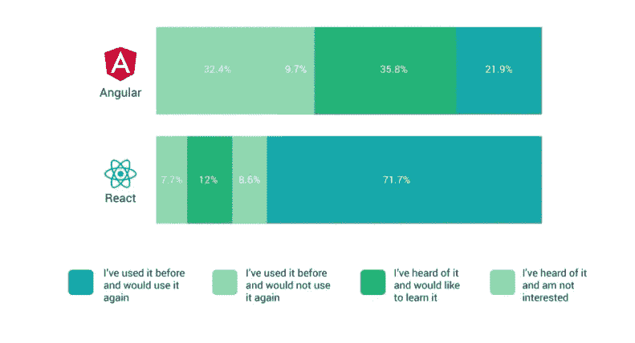
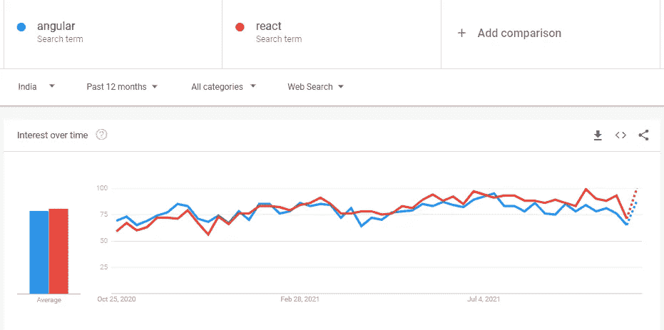
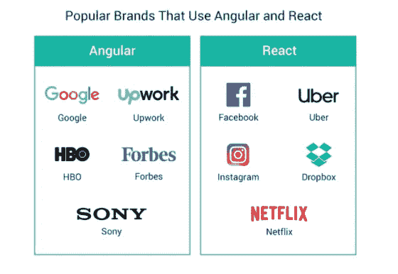
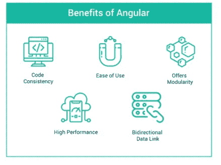
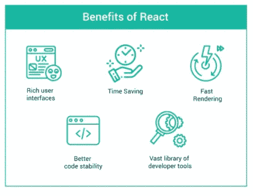

# Angular vs. React:谁赢了？

> 原文：<https://javascript.plainenglish.io/angular-vs-react-who-is-winning-e9b482879e6a?source=collection_archive---------1----------------------->

Photo by [Filiberto Santillán](https://unsplash.com/@filisantillan?utm_source=medium&utm_medium=referral) on [Unsplash](https://unsplash.com?utm_source=medium&utm_medium=referral)

如今，前端开发框架和库的市场竞争非常激烈。Angular 和 React 可以说是所有 JavaScript 框架和库中最受开发者欢迎的。

这就是为什么总是有关于在两者之间选择哪一个以及何时选择的争论。好吧，我们开始吧。

## 简史

Angular 是一个基于类型脚本的开源 JavaScript 框架。它是由谷歌创建和提供动力的。第一个版本名为“AngularJS”，于 2010 年发布。2016 年，AngularJS 的第二个版本和完全重写的“Angular”发布。

React 是一个由脸书开发的开源 JavaScript 库。它基于 JSX(PHP 的扩展)和 JavaScript。React 是在 2012 年开发的，当时用简单的 HTML 编码管理脸书广告变得很困难。它在 2013 年开源，从那时起，它已经被数百万开发者使用。

## 流行

## 堆栈溢出

Angular 一直流行到 2016 年，而从那以后，React 一直在快速普及。根据 Stack Overflow，Angular 和 React 在 2018 年同样受到开发者的欢迎。从那以后，React 在用户基础方面已经超过 Angular，成为最受欢迎的开源 JavaScript 库。2021 年 React 排名第一，Angular 在最想要的框架榜单上排名第三。根据栈溢出调查，更多的开发者表示他们更喜欢 React 而不是 Angular，这也是 React 受欢迎的原因之一。

## 谷歌趋势

Google Trends 没有显示使用情况，但是它显示了哪些框架是讨论最多的。它展示了人们对哪些框架感兴趣。目前，React 是人们谈论最多的框架，而 Angular 的受欢迎程度并没有太大的增长。

## 框架成熟度

这些框架的成熟度可以通过 GitHub 社区的反应来判断。据统计，Angular 的恒星数约为 59k，React 的恒星数约为 146k。

这表明反应和角度都很发达。这两个框架都有相当大的用户群体。随着时间的推移，熟练的开发人员已经适应了这两种框架，在社区支持的帮助下，任何问题都很容易解决。

## 学习曲线

任何框架的学习曲线考虑的不仅仅是编码的容易程度。它还考虑了调试和测试的容易程度。这对于需要大量编码的项目尤其重要。

角度的学习曲线比反应的学习曲线更陡。有必要学习一些基本概念，比如模块、指令、装饰器、服务和模板。一旦掌握了基础知识，就可以继续学习更高级的概念，比如 AoT 编译、Rx。Js，等等。Angular 是一个流行的框架，因为它提供了一个清晰的错误消息，并帮助开发人员快速修复错误。

要开始使用 React，您必须首先学习如何使用 JS。您还必须擅长编写组件、处理内部状态和配置道具。您还应该熟悉 Redux 等状态管理框架。

## 开发速度和生产率

Angular 框架的 CLI 提供了出色的开发体验。它创建了一个出色的工作空间，只需几行代码就可以快速设计组件。有很多内置的流程可以轻松解决你的问题。

第三方库的使用影响了 [React 开发](https://www.cuelogic.com/product-development)的速度和生产力。React 中有各种工具。工具的使用因项目而异，这意味着如果将应用程序交给新的开发人员进行更新，就需要投入更多的时间。

## 灵活性和性能

就灵活性而言，Angular 和 React 之间存在显著差异。开发人员可以在使用 React 时从各种工具、库和架构中进行选择。一个熟练的 React 团队可能从一开始就挑选他们需要的工具，从而产生一个高度定制的应用程序。

Angular 提供的灵活性不如 React。只有其他框架可以使用 Angular 组件，并且代码必须插入到 HTML 应用程序中。这种僵化对于需要近乎实时更新的应用来说是不方便的。此外，在 Angular 中您会注意到的最令人兴奋的事情是，每个组件都有一个生命周期

Angular 在应用程序中使用了 real DOM。对于偶尔更新的单个页面，real DOM 是完美的。此外，图书馆的大小是巨大的，这使得应用程序使用 Angular 较慢。例如，UpWork 是使用 Angular 的最受欢迎的应用程序之一，因为用户订阅源的频繁更新需求很低。

React 使用虚拟 DOM，最适合需要定期更新内容的页面。库的大小也很小，这使得它更加轻量级和动态的。例如，Instagram 使用 React，因为它需要用户订阅源频繁更新。

## 热门公司

## 结论

现在得出结论——什么时候选择什么？

**棱角分明**

当创建一个具有各种特性的大型应用程序时，您应该使用 Angular 框架。它为您提供了一个安全且可扩展的平台。Angular 框架简化了实时消息应用的创建。此外，精通 TypeScript 的团队发现 Angular 更容易使用。

**反应过来**

React 使创建单页面和跨平台应用程序变得简单。它们可以用来增强应用程序的当前功能。React 使开发人员能够在短时间内创建具有当前特性的轻量级应用程序。React 的众多好处之一是可以使用工具来轻松个性化您的网页。

希望这对您有所帮助，感谢您的阅读！

*更多内容看*[***plain English . io***](http://plainenglish.io/)