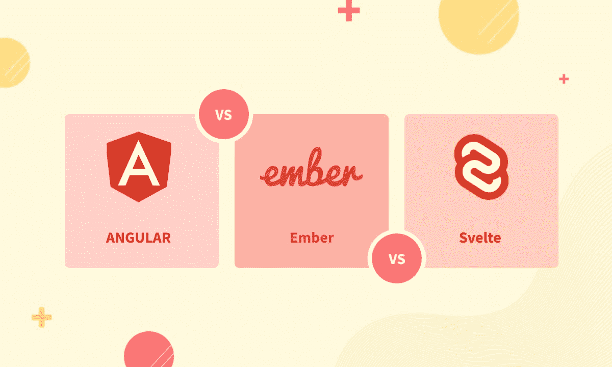
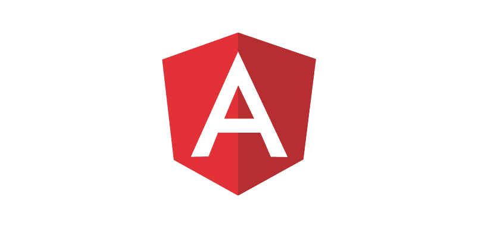
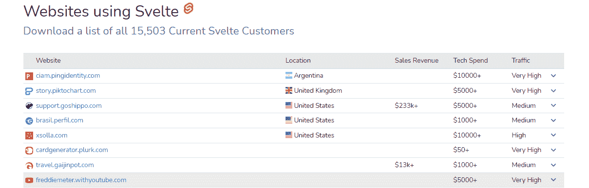
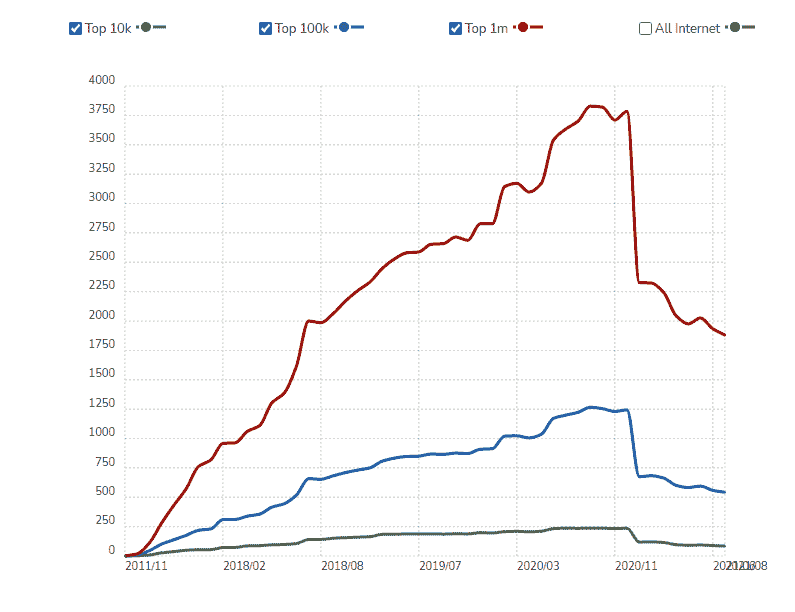
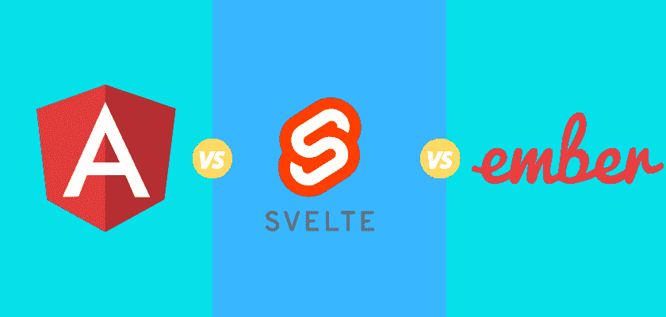
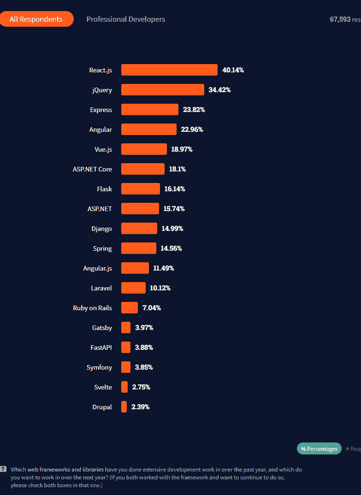
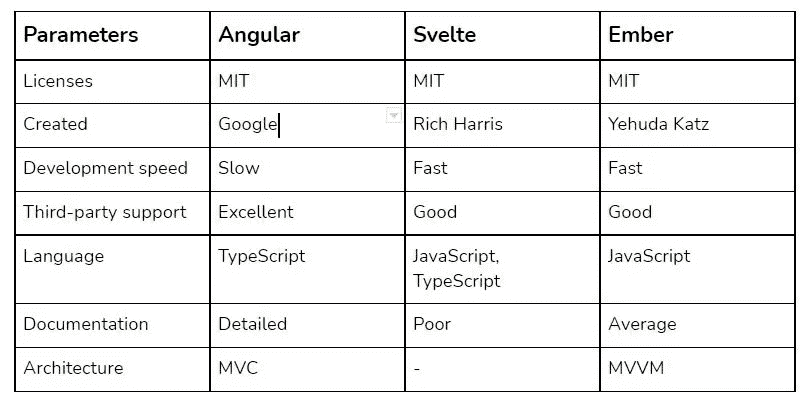

# 棱角分明的 vs .苗条的 vs .烬:哪一个前端框架是最好的？

> 原文：<https://javascript.plainenglish.io/angular-vs-svelte-vs-ember-which-frontend-framework-comes-out-on-top-9e7b80671a18?source=collection_archive---------4----------------------->

> JavaScript 社区正处于战争状态。你知道为什么吗？

有很多优秀的前端框架旨在解决同一个问题，但大多数都以同样的方式解决。所以，很明显他们是对抗无聊的竞争者，对吗？

不完全是。有些更适合移动优先的项目，有些更适合有很多页面的 web 应用，还有一些旨在加快初始加载时间。这就是为什么很难确定他们真正的排名(意思是哪个是最好的前端框架)。

*但是如果你还是新手呢？如果你只想知道哪一个最适合你的下一个项目呢？*那么这篇文章正是你想要的——因为我们将比较三种最流行的前端框架: **Angular、Svelte 和 Ember** 。这三者有一个共同点——它们都是用来构建用户界面的。但是他们是如何相互竞争的呢？我们将深入挖掘，找出答案！

**在这里，我们将讨论以下内容:**

**每个框架的基本要素是什么？*

**这些框架各擅长什么？(强项)*

**谁在使用它们？(社区)*

**他们的缺点是什么？(弱点)*

**最后，需要注意的最重要事实列表*

所以，言归正传吧！

# #1.有角的

**首次发布:**2010 年 10 月 20 日

**最新(稳定)版本:**2021 年 9 月 12 日 2 月 8 日/ 30 日

**框架类型:**开源前端 JavaScript 框架

**谁在用 Angular** :微软、麦当劳、思科解决方案合作伙伴计划、苹果、AT & T、Adobe、Upwork、谷歌、Telegram、Crunchbase 等。

Angular 是三个竞争者中最古老的前端框架——但也是最受欢迎的一个。为什么呢？嗯，Angular 是在谷歌的帮助下创建的，正因为如此，它有很多特性对构建企业应用程序特别有帮助。例如，它被设计为在多种设备和浏览器上运行——为桌面用户提供流畅的渲染，为移动用户提供优化的速度。

Angular 的受欢迎程度在过去十年中一直稳步增长，在我们所知的 JavaScript 库网站中，有 0.4%的网站使用它——这意味着今天互联网上有超过 1 亿个 Angular 支持的网站！

让我们来看看 Angular 最大的优点和缺点是什么。

> **优势**

* **广泛的社区** —谷歌在背后支持，这意味着你将有机会接触到许多愿意提供帮助的有经验的人。

* **大量资源和教程** — Google、Firebase、Udemy 和许多其他公司都有大量关于 Angular 的信息，作为其官方文档的一部分。

* **众多特性—** 如前所述，速度是 Angular 在移动设备上表现出色的一个关键特性。但是还有更多:数据绑定、依赖注入、构建可重用组件的指令等等。

* **使用 TypeScript —** Angular 是基于这种语言构建的，它提供了一些优于其他语言的优势。TypeScript 提供静态代码检查和更好的自动完成功能。

* **有效的跨平台开发—** 由于其模块化的架构，一个 [**Angular 开发公司**](https://www.pixelcrayons.com/javascript-development/angularjs-development) 可以用相同的代码库构建几个 app，针对不同的平台(即 web、移动应用、桌面)。

> **弱点**

* **陡峭的学习曲线** —这个框架有很多特点。你必须花时间和精力去理解他们，然后再开始和他们一起做项目。

*   **Angular 很容易拖累你的应用**——这就是为什么仅仅在你的项目中添加许多功能而不考虑它们会如何影响渲染速度是不明智的。

# #2.苗条的

**首次发布**:2016 年 11 月 26 日

**最新(稳定)版本**:2021 年 5 月 3.38.2 / 3

**框架类型**:开源前端 JavaScript 框架

谁在使用苗条身材:live.bilibili.com、chess.com、templatemonster.com、squareup.com

Svelte 是一个相对较新但非常有前途的框架。它可用于构建 web、移动应用程序和桌面应用程序。Svelte 的伟大之处在于它的库只有 5kb 的 gzipped——所以你可以把它放在任何网站上，而不用担心页面加载速度。Svelte 是由 Rich Harris 开发的，他还创建了另外两个流行项目 Rollup 和 Heist。

对于团队规模相对较小的项目，Svelte 是一个不错的选择。很好学；其 API 简单等。也正因为这些原因，Svelte 在小企业中很受欢迎。

根据最近的技术专家和 web 开发者的说法，Svelte 是热门的新框架，有望降低 JavaScript 开发的门槛！另外，目前有 15，500 多名苗条的顾客。

[Image Source](https://trends.builtwith.com/websitelist/Svelte)

让我们来看看苗条身材最大的优点和缺点是什么。

> **强项**

* **易学**——像大多数 JavaScript 框架一样，Svelte 附带了许多优秀的文档和易于理解的示例。

* **体积小—** 这个框架很轻；它的重量是 5kb。这就是为什么 Svelte 非常适合移动应用。它甚至可以用于嵌入式设备，如手表、智能电器等。

* **速度**——苗条身材是以速度为理念打造的。这个框架可以比其他框架更快地呈现内容，这意味着它非常适合移动应用程序。

> **弱点**

* **功能不多** —对于团队规模很小的项目来说，苗条可能是个不错的选择。但是这个框架只有很少的功能，所以它可能不是更重要项目的最佳选择。

*   **未被广泛采用—**另一个缺点是没有多少开发人员使用这个框架开发大型应用程序。所以可能很难找到有这方面经验的人。

# #3.余烬

**首次发布:12 月**2011 年 12 月 8 日

**最新(稳定)版本**:2021 年 6 月 3.27.5 / 10

**框架类型:**开源前端 JavaScript 框架

**谁在用 Ember** : Twitch、LinkedIn、埃森哲、Square 等。

Ember 是第二古老的前端框架，也是最流行的一个——尤其是在初创公司中。它是以速度为主要关注点的，所以 Ember 团队从第一次发布开始就一直致力于让它变得更快。

Ember 如此之快，是因为这个工具并不在页面上加载整个组件，而只是呈现你所看到的内容。这包括模板、路线、模型等。

*截至 2020 年，36，095 个网站使用 Ember，另外 94，992 个网站在历史上使用过；印度 365！*

[Source](https://trends.builtwith.com/javascript/Ember)

让我们来看看 Ember 的一些优点和缺点。

> **优势**

* **开源社区** — Ember 是由那些想要为开源项目做贡献的人建立的。

* **良好的文档** —由于 Ember 被许多 web 开发公司使用，它在 web 上有很好的可用资源，因此开发人员可以自学如何使用该工具。

* **有条理** — Ember 有一个模块化的架构，也就是说你只能拉你项目需要的组件。Ember 的 MVVM(模型-视图-视图模型模式)架构帮助您在构建 web 应用程序时保持专注。

* **良好的性能&加载时间** —使用 Ember 开发大型项目的开发人员可以从他们的硬件中获得更多价值，因为它的渲染系统非常少。当你为大型团队构建 web 应用程序时，这一点尤其正确。

* **Ember CLI** —该工具可帮助您更高效地创建、开发和测试您的应用。它还允许您添加社区创建的附加组件，从而加快开发速度。

> **弱点**

* **难以掌握**——Ember 是一个强大的框架，但它也有一个陡峭的学习曲线。在这里，我们的意思是成为一名专业人士并不容易，但如果你愿意学习 Ember，你的投资将会得到回报。

*   **小而忠诚的社区** —因为学习 Ember 太难了，很少有人能用这个工具工作。因此，当您遇到问题时，您可能会发现支持有限。

# 对比:棱角分明、苗条、灰烬

Source: [**Coders Daddy**](https://www.codersdaddy.com/)

让我们快速而翔实地了解一下 Angular、Svelte 和 Ember 框架之间的一些差异:

# 棱角分明的与苗条的与灰烬的对比:学习曲线

这三个框架都有相对较高的学习曲线。但是在学习难度上还是有差异的:

* **Svelte** —它是三者中最容易的，我们可以说它的学习曲线最低。不出一天，您很可能会觉得使用这个工具很舒服，因为它的 API 非常直观。

* **Ember** —这个框架的学习曲线比 Svelte 略高。不过还是比较好学的，因为它有很好的文档，社区里很多人可以回答你的问题。

* **Angular** -这个工具比 Ember 有更大的学习曲线。如果您在一个资源有限的小团队中工作，这可能是一个不利因素——因为这将花费您更多的时间来学习如何使用这个框架。

# 棱角与苗条与灰烬:性能和加载时间

对于小规模的应用程序来说，性能通常不是问题，但是大型应用程序呢？这就是事情变得有趣的地方:

* **Ember** —这个工具在渲染应用程序时非常快。这也减少了加载时间，使其成为具有复杂用户界面的应用程序的绝佳选择。

* **纤薄的**——它是在考虑到性能&加载时间的情况下从头开始构建的。我们可以说这个框架有着出色的性能和一个小而忠诚的社区。

* **Angular** — It 工具在渲染速度上表现不算太差，但也不是最快的。简而言之，在用 Angular 构建复杂的应用程序时，你可能需要投资更多的硬件。

# 棱角分明的 vs .苗条的 vs .灰烬:社区和支持

像大多数开源项目一样，这些框架也有社区支持。但是这些社区之间有什么区别呢？

***——它的社区很小，但我们可以说它相当忠诚。这意味着大多数使用这个工具的人也喜欢它，并且会更乐意支持你。**

*** **Ember** —作为最流行的 JavaScript 框架之一，Ember 有一个令人难以置信的社区支持它。此外，这在构建应用程序时是一个很大的优势，因为你可以很容易地找到任何问题的帮助。**

*** **Angular** 是三者中最强大的工具，它有一个庞大的社区支持它。这意味着您的大多数问题可能会很快得到社区中某个人的回答。此外，有成千上万的 Angular 开发者，所以雇佣 Angular 开发者来满足你的网络需求是相当容易的。**

# **棱角分明的与苗条的与灰烬的:流行与稳定**

**说到受欢迎程度，烬和 Angular 是属于他们自己的联盟。很明显，这两个工具拥有最突出的社区，这意味着它们将在未来几年继续出名:**

*** **Ember** —从 2011 年就有了，可以说非常稳定&安全。**

*** **Angular** —这个工具已经存在很多年了，也很受开发者欢迎。就像 Ember 一样，Angular 也相当稳定。**

*****Svelte**——由于这个框架相对较新，我们不能说它非常流行或者在稳定性方面使用了已有的框架。有迹象表明，该框架是稳定的，但这可能会在未来迅速改变。**

**此外，根据 [Stack Overflow 2021 调查](https://insights.stackoverflow.com/survey/2021#web-frameworks)，Angular 在顶级 web 框架中排名第四。**

****

# **棱角分明的与苗条的与灰烬的:第三方支持**

**在选择框架时，第三方支持也是必不可少的。显然，Svelte 的社区最小，因此很难找到第三方库的帮助:**

*** **Ember** —它的工具拥有出色的第三方支持，这意味着无论你想做什么，你都会找到适合你需求的库。**

*****Angular**——同样，我们可以说 Angular 有很好的第三方支持。另外，你几乎可以找到任何你需要的东西。**

*** **Svelte** —作为三者中最小的工具，显然 Svelte 也有最小的库大小。另外，如果你构建一个需要第三方库的 app，Ember 或者 Angular 可能是更好的选择。**

# **棱角与苗条与灰烬:建筑艺术**

**说到架构，Angular 是三者中最受欢迎的框架。这个工具也是在考虑 MVC(模型视图控制器)的情况下构建的:**

*** **Ember** —遵循 MVVM(模型视图视图-模型)架构。**

*** **苗条**——不遵循既定的架构；相反，它有自己的设计模式。**

*** **Angular** —这是目前最流行的 JavaScript 框架之一，它是在考虑 MVC 的情况下构建的。最重要的是，如果你正在用 Angular 构建一个应用程序，那么你可以确保你的数据将一直保持有序。**

# **棱角与苗条与灰烬:测试与调试**

**当你在构建一个应用时，测试和调试是不可避免的。这里，好消息是所有的工具在进行健全性检查时都工作得很好:**

*** **Ember** —有一个名为 Ember Inspector 的测试插件，它提供了出色的调试功能。**

*****Angular**——也有一个测试工具，叫做 Karma。不幸的是，调试选项可能非常慢。**

*** **苗条**——它没有自己的测试工具，但它确实能很好地与 Mocha 和 Sinon 一起工作。**

# **棱角与苗条与灰烬:速度**

**如果使用得当，这三个框架相对较快，这意味着您可以快速启动新的应用程序。但是最流行的 JavaScript 框架之一也是最慢的:**

*** **Ember** —使用名为 Glimmer 的渲染引擎，它可以相当快。**

*** **苗条**——在某些情况下可以很快，但相对来说还是比较新的。我们不能说苗条是一个缓慢的工具。**

*** **Angular** —这个流行的框架使用 Ivy 的渲染引擎，有时会让应用程序变慢。**

# **棱角分明的对比苗条的对比灰烬:文件**

**在文档部门，Angular 占据首位，Ember 和 Svelte 紧随其后:**

*** **Angular** —有非常详细的文档，包括 JavaScript 和 TypeScript 示例。**

**官方指南很容易理解，但你可以在 YouTube 或网上找到更好的教程。**

*****—它是最新的框架之一，这意味着仍然缺少一些文档。****

# ****棱角分明的对比苗条的对比灰烬:比较表****

****以下是您在使用这些框架之前需要考虑的一些基本特性:****

********

# ****结论:棱角分明 vs 苗条 vs 余烬？****

****在本文中，我们比较了三种最流行的前端框架。我们比较了速度、测试和调试、第三方支持和其他重要因素。****

****虽然我们并不意味着您不能使用其他工具，但我们的动机是让您深入了解吸引印度 [**web 开发公司**](https://www.pixelcrayons.com/web-development/) 在他们的项目中使用它们的三个最流行但又最重要的框架。****

****谢谢你的阅读，如果你觉得有用，别忘了分享给你的朋友和同事。****

# ****常见问题****

******Q1:哪个前端框架最适合 2022 年？******

****A1:很难判断哪个前端框架最适合 2022 年，因为每天都会弹出很多前端框架。但是，2022 年可以考虑的一些最佳前端框架有:****

*   ****有角的****
*   ****余烬****
*   ****苗条的****
*   ****反应****
*   ****vue . j****
*   ****提前****

****Angular、React 和 Ember 之间有什么区别？****

****这三个框架都是基于客户端 JavaScript 的开源前端 web 应用框架。它们(web 框架)都有各自的优点和缺点，比如:****

****Angular 是一个平台，它使得用 web 构建应用程序和为你的应用程序扩展 HTML 词汇变得容易。****

****Ember 是一个框架，它允许开发人员通过整合像 MVVM 这样的模式来创建可伸缩的单页面 web 应用程序，这种模式将用户界面与数据和模型层分开。****

****Svelte 是一个新的框架，它将几乎纯粹的 vanilla-JS 代码编译成小型、高效的产品化 web 组件。****

******Q3:哪些公司在用 Angular？******

****像谷歌、Weather.com、自由职业者、查尔斯·施瓦布、美国卫生与公众服务部这样的公司都使用 Angular 来驱动他们的网络应用。****

******Q4:雇佣专门的 Angular 开发者的成本是多少？******

****雇佣专门的 Angular 开发人员的平均成本在每小时 25 美元到 150 美元之间。此外，成本取决于几个因素，如:****

******经验**:经验越丰富，工资越高。****

****项目类型:与初创公司或自由职业者相比，一个 n 企业应用程序花费更少。****

******使用期**:完成一个项目的时间越长，雇佣棱角分明的开发人员的花费就越多。****

****Q5:网页开发最好的公司是哪家？****

****这取决于你的项目。你到底在找什么？你是想要一个提供全方位服务的网络开发公司，还是只是想找一个自由职业者？****

****然而，一般来说，如果你希望有人从头开始做所有的工作，我们建议找一家代理公司。如果现有的开发人员在工作流程的某些部分需要更多的带宽，那就去找自由职业者吧。以下是几个推荐的网络开发机构:****

******1。价值编码员:******

****ValueCoders 是印度最好的网络开发机构之一，它的客户来自世界各地的 200 多家最好的公司。他们有一大堆满意的客户和一个伟大的专家团队。****

****2.**像素蜡笔******

****PixelCrayons 是一家全栈服务提供商，提供由 300 多名员工执行的开发、设计和营销服务。它拥有出色的产品组合和致力于为客户提供高质量结果的团队。****

******3。印度语:******

****IndiaNIC 是一家实力雄厚的公司，提供网页设计、开发、数字营销和数据分析服务。此外，它已经成功地为世界各地的客户完成了 500 多个项目。****

******4。7EDGE:******

****7EDGE 是一家知名公司，提供高端、高价值的 web 开发服务。它已经成功地为世界各地的客户完成了 500 多个项目，也为 Adobe Systems 和 Cisco 等知名客户完成了项目。****

******5。A3logics:******

****A3logics 是一家全栈服务提供商，专注于定制 web 开发和移动应用。它已经为世界各地的客户成功完成了 80 多个项目。****

*****更多内容请看*[***plain English . io***](http://plainenglish.io/)****

******检查我们的服务:******

## ****[Web 应用程序开发服务](https://www.codersdaddy.com/website-app-development-company-agency)、[移动应用程序开发服务](https://www.codersdaddy.com/mobile-app-development)、[印度 UI UX 设计服务](https://www.codersdaddy.com/ui-ux-design-service-company)、[印度 IT 员工扩充服务](https://www.codersdaddy.com/it-staff-resource-augmentation)、[网站维护&支持服务](https://www.codersdaddy.com/website-app-maintenance-support)、[雇佣专门的软件程序员](https://www.codersdaddy.com/hire-developer-engineer-programmer/)、[雇佣印度 Android 应用程序开发人员](https://www.codersdaddy.com/hire-developer-engineer-programmer/android-app)、[雇佣印度 iPhone 应用程序开发人员](https://www.codersdaddy.com/hire-developer-engineer-programmer/ios-iphone-app)、[雇佣印度 PHP 开发人员](https://www.codersdaddy.com/hire-developer-engineer-programmer/php-web)、  [雇佣印度. Net 开发者](https://www.codersdaddy.com/hire-developer-engineer-programmer/dot-net)，[雇佣印度 Laravel 开发者](https://www.codersdaddy.com/hire-developer-engineer-programmer/laravel)，[数字营销服务](https://www.codersdaddy.com/digital-marketing-agency-company-firm)，[印度 SEO 服务](https://www.codersdaddy.com/seo-service-company-agency-firm)，[印度 ORM 服务](https://www.codersdaddy.com/online-reputation-management-service-company)，[印度 SEO 内容写作服务](https://www.codersdaddy.com/content-writing)，[雇佣印度 WordPress 开发者](https://www.codersdaddy.com/hire-developer-engineer-programmer/wordpress-web)，[雇佣印度 Drupal 开发者](https://www.codersdaddy.com/hire-developer-engineer-programmer/drupal)，[雇佣印度 Angular 开发者](https://www.codersdaddy.com/hire-developer-engineer-programmer/angular-js)，****