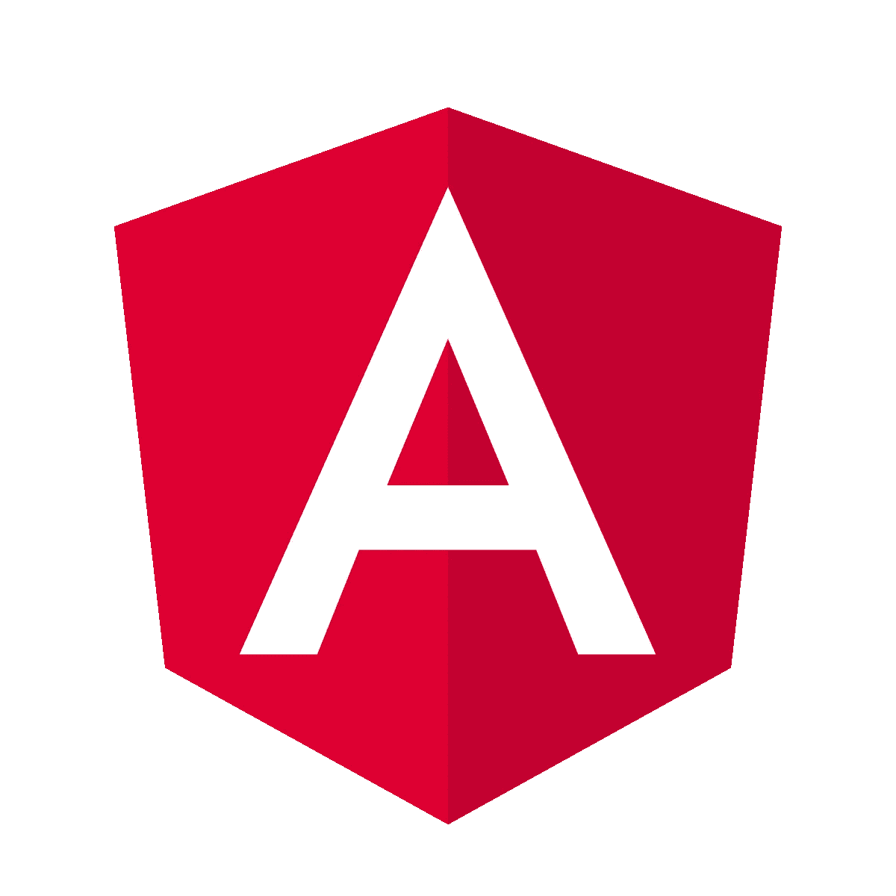

# 如何创建有角度的包装组件

> 原文：<https://javascript.plainenglish.io/angular-wrapper-component-e56859b6d69c?source=collection_archive---------4----------------------->

*先决条件:Angular，Typescript，ng-template，ng-container*

当我第一次开始一个 Angular 2+项目时，我首先查找的是一个组件库。我测试一些，然后我选择一个赢家。一切都很好，我现在可以专注于我的业务逻辑，只使用一些已经构建的组件，如表、工具、选项卡、向导，以及许多内置功能。

通常，我会在项目中多次使用一个组件，有些甚至会使用数百次。但是，在某个时候，我意识到我正在使用的组件不再满足我的需求，并及时找到了一个新的组件，这正是我所需要的。

现在，问题来了。我该怎么办？在我的项目中添加新的组件，这意味着使它看起来与旧的组件相似，并且有两个相同功能的组件，或者只是用新的组件替换旧的组件。显然，选择是用新的替换旧的。但是如果我已经使用这个组件几百次了会怎么样呢？替换它的工作量将是巨大的。

这就是为什么，在我选择了最好的库组件之后，我做的第一件事就是为应用程序中最常用的组件创建包装器。这样，改变库组件真的很容易，我也只需要在一个地方工作，一切都会随之改变。此外，创建一个包装器将给我很大的灵活性。假设我需要设计应用程序中所有选项卡的样式，或者在每个选项卡标题上添加一个新图标。这很容易，因为我必须在一个地方改变，而且它会在我使用组件的每个地方改变。

我们将介绍一个基于 NGXBootstrap 创建标签包装组件的例子。

我们首先安装 ngx-bootstrap 库并导入 TabsModule(【https://valor-software.com/ngx-bootstrap/#/tabs】T2)。

NgxBootstrap 选项卡组件如下所示:

正如你所看到的，我们使用了一个带有标题模板的标签集，因为有时我们可能需要设置一个定制的标签标题。

我们想要创建一个组件 app-tab-wrapper，它将封装 tabset 并公开我们需要的输入和方法。

我们的最终组件 html 应该如下:

为此，我们需要创建 2 个指令，一个是选项卡(选项卡-项目)的容器，另一个表示选项卡(选项卡-项目)。

第一个，标签-项目应该看起来像:

第二个，标签项目:

最后，我们的包装组件 ts 是:

和 html:

当然，这是一个非常简单的例子，在一个真实的项目中，我们会从包装器中得到更多的输入和输出。

但是，使用这种技术，我们在未来的组件库方面将有很大的灵活性，并且在不影响我们的代码库或业务逻辑的情况下，更改整个组件库将非常容易。当然，这在开始会花费一些时间，但是从长远来看，这对每个公司来说都是一个很好的投资，因为你降低了改变组件库的未来成本。

完整的项目库和 stackblitz 项目可以在这里找到[https://stackblitz.com/edit/ngx-bootstrap-tab-wrapper](https://stackblitz.com/edit/ngx-bootstrap-tab-wrapper)。如果您对包装器有任何疑问，或者在创建包装器时需要帮助，请随时提问。

**PS:** 如果你曾经需要一个正常运行时间监控工具，只需检查 [RoboMiri](https://robomiri.com) 。最好的免费正常运行时间监测服务。

*阅读更多尽在* [***说白了. io***](https://plainenglish.io/)