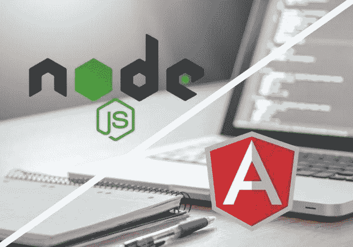

# AngularJS vs Node.js:你该选哪个？

> 原文：<https://javascript.plainenglish.io/angularjs-vs-node-js-which-one-you-should-choose-9d8ed2529c50?source=collection_archive---------22----------------------->

如今，技术已经取得了显著的进步，是时候以正确的方式实现这些技术了。它有助于创建更智能的 web 应用程序，并熟悉所有积极的方面。AngularJS 和 Node.js 是开发定制 web 应用程序的两个流行平台。开发者更喜欢使用这些平台。然而，了解两个平台之间的细微差异并实时利用技术选项的优势非常重要。

在这篇博客中，我们给出了 AngularJS 与 Node.js 的概念，并分享了有助于了解哪个平台符合项目要求的见解。

# 节点。Js Vs AngularJS:知道区别吗

现在，我们来了解一下这些差异，这将有助于轻松地简化 web 开发过程。当你比较 AngularJS 和 Node.js 时，你会了解到技术是如何以不同的方式实现的。

AngularJS 是一个开源的结构框架，用于开发动态网页。开发者可以使用 HTML 作为模板语言，你可以使用 [HTML](https://www.w3schools.com/html/) 语法来突出应用程序的组件。AngularJS 利用 JavaScript 框架，用于构建客户端和服务器端应用程序。然而，Node.js 是用 C、C++以及 JavaScript 编写的。

AngularJS 被广泛用于开发高度交互的 web 应用程序，因此理解现代技术的真正重要性是很重要的。而 Node.js 用于开发小型应用程序。很容易添加 AngularJS 文件，以有效的方式开发 web 应用程序。AngularJS 基于模型-视图-控制器设计模式，您现在可以熟悉这些有益的解决方案。

Node.js 是一个跨平台的运行时库，它帮助您在浏览器之外运行 JavaScript 应用程序。这是一个开源工具，可以免费使用。它用于创建支持 Linus 和 Windows 操作系统的服务器端 JS 应用程序。该库由不同的 JavaScript 模块组成，它使 web 开发过程变得简单。因此，现在可以使用 Node.js 创建定制的 web 应用程序。

使用 Node.js，您可以轻松地创建数据库查询以及为 MongoDB、CouchDB 等数据库编写查询。它帮助开发人员有效地处理开发过程，并且不需要记住语法差异。另一方面，AngularJS 实现了 MVC 模型，并将应用拆分成 MVC 组件。

Node.js 用于开发高可伸缩性和更快的应用程序。因此，如果你想让你的应用程序运行得更快，你可以使用 Node.js. AngularJS 是用来创建实时应用程序，如即时消息。

很容易选择 [Node.js 开发服务](https://www.hiddenbrains.co.uk/node-js-development.html)并以自己的方式探索技术。简单来说，你需要找到一个有经验的专业人士，他可以开发出你想要的所有功能的应用程序。

总的来说，您对这些差异有了一个清晰的概念，您需要选择一个理想的平台来帮助您创建一个完美的 web 应用程序。确保应用程序运行完美，你可以探索更好的技术形式。是时候以正确的方式实现这项技术了，这样完成开发工作就变得容易了。一旦你对角度和节点有了清晰的认识。你会发现很容易得到一个定制的应用程序。

# 是时候雇佣一个专业开发人员了

企业需要雇佣一个在处理平台方面有丰富经验的专业开发人员。这给了他们信心，让他们知道你可以轻松地开发应用程序。了解开发人员的工作方式并确保您获得定期更新非常重要。因此，组织可以实时探索技术如何带来好处。开发人员必须知道如何使用 AngularJS 和 Node.js，并理解平台如何工作。通过这种方式，开发者可以开发出提供最佳体验的定制应用。确保开发商按时完成工作，保证项目按时交付。

# 寻找专业开发人员的技巧

以下是一些提示，帮助您轻松找到专业开发人员:

*   首先，了解开发人员的经验，确保专业人员能够胜任工作。
*   其次，始终坚持获得免费报价，这有助于了解服务的细节以及价格。它最大限度地减少了未来沟通失误和超额计费的可能性。
*   重要的是要知道开发人员分析详细的需求，并相应地做出正确的方法。
*   开发者必须知道 AngularJS 和 Node.js 之间的区别，从而选择一个合适的平台。

因此，公司可以获得最好的 AngularJS 开发服务，并且基于业务需求开发定制应用变得容易。

*更多内容看* [***说白了. io***](http://plainenglish.io/) ***。*** *报名参加我们的**[***免费每周简讯点击这里***](http://newsletter.plainenglish.io/) ***。****