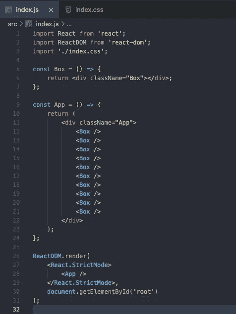
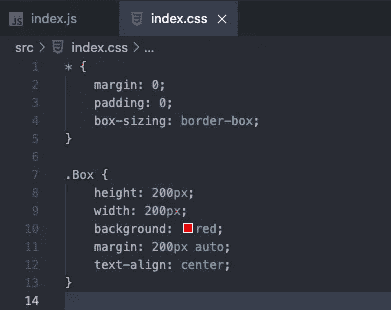
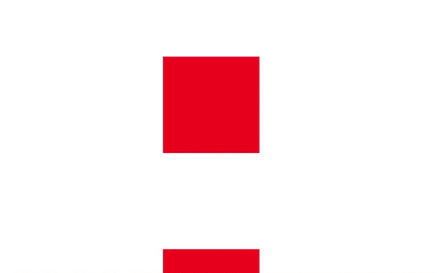
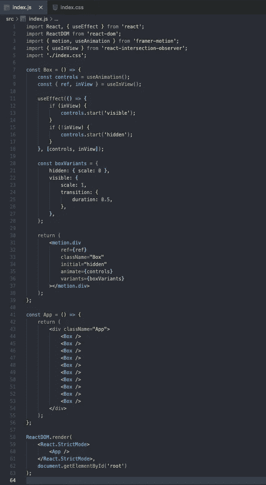

# 当元素出现在视图中且有帧运动时，制作动画

> 原文：<https://javascript.plainenglish.io/animate-when-element-is-in-view-with-framer-motion-63b254403bf?source=collection_archive---------0----------------------->

## 一个简单的解决方案，动画反应元素时，在视图中使用帧运动


Photo by [Cassidy Kelley](https://unsplash.com/@cassidykelley?utm_source=medium&utm_medium=referral) on [Unsplash](https://unsplash.com?utm_source=medium&utm_medium=referral)

我最近一直在探索不同的动画库，并开始喜欢我的 React 应用程序的 framer motion。Framer Motion 被描述为一个生产就绪的 React 动画和手势库。看看他们的网站，看看你能做些什么。

[](https://www.framer.com/motion/) [## React |成帧器动作的生产就绪动画库

### Framer Motion 是一个生产就绪的 React 动画和手势库。

www.framer.com](https://www.framer.com/motion/) 

前几天在构建网页时，我想给一个元素添加一个动画，但是我在时间上遇到了一些麻烦。

问题是，当组件在页面加载时出现动画。听起来没什么大不了的，对吧？然而，由于该元素在页面上的位置较低，所以在我向下滚动查看它之前，动画就已经开始了。我需要找到一种方法让动画在元素进入屏幕视图时开始。我检查了文档，但是我找不到我正在寻找的确切解决方案。

这时候我问了我最好的朋友谷歌，我在 [Stack Overflow](https://stackoverflow.com/questions/58958972/framer-motion-animate-when-element-is-in-view-when-you-scroll-to-element) 上发现了这个线程。它帮助我实现了我正在寻找的功能，我想在这里分享这个解决方案。我希望它能对将来遇到同样问题的人有所帮助。如果你知道实现这个功能的其他方法，请告诉我。我总是渴望看到其他解决方案。

在我们开始之前，我假设您了解 React，并且有一些使用 framer motion 或其他动画库的经验。我不会太深入地研究帧运动，因为本文将只关注元素进入屏幕视图时动画的开始。

# 入门指南

为了演示这一点，我们将使用 React 创建一个简单的应用程序，当红框进入屏幕视图时，它会显示红框的动画。在本次演示中，我们将使用 create-react-app。如果你想克隆这个应用程序，你可以在下面我的 GitHub 库查看代码。

[](https://github.com/chadmuro/framer-motion-inview) [## chadmuro/framer-motion-inview

### 当元素在视图中时动画，使用帧运动-Chad muro/帧运动-在视图中

github.com](https://github.com/chadmuro/framer-motion-inview) 

让我们从清理项目中的一些未使用的文件开始，并清理 index.js 文件。请注意，在我们的示例中，我们将只处理 index.js 文件。通常，您会希望为每个组件创建单独的文件。

在您的 src 文件夹中，我们将有一个 index.js 文件和一个 index.css 文件，如下所示。



index.js



index.css

在我们的 index.js 文件中，我们的 App 组件显示了 10 个 Box 组件。正如您在我们的 index.css 文件中看到的，每个 Box 组件都是一个 200px x 200px 的红色正方形。目前，我们的应用程序应该是这样的；只是一堆红盒子。很无聊吧？让我们给我们的应用程序添加一些动画！



# 具有帧运动的动画

在我们的例子中，当红色方块出现在屏幕上时，我们希望将它们动画化。为了实现这一点，我们将使用 framer motion 来添加动画，以及一个名为 react intersection observer 的包来跟踪元素何时进入视图。让我们通过运行以下命令来安装这两个包。

```
npm install framer-motion react-intersection-observer
```

第一步是当组件装载到页面时，让动画在所有的盒子上工作。我们将首先从成帧器运动库中导入运动。

```
import { motion } from 'framer-motion';
```

然后，我们将为我们的 box 组件创建一个变体。我们将用 0.5 秒的时间将我们的盒子从 0 放大到 1。要了解更多关于变体的信息，请看这里的文档。

```
const boxVariants = {
  hidden: { scale: 0 },
  visible: {
    scale: 1,
    transition: {
      duration: 0.5
    }
  }
}
```

接下来，我们将动画设置为 div 组件。

```
<motion.div className="Box" initial="hidden" animate="visible" variants={boxVariants}></motion.div>
```

如果我们现在看一下我们的应用程序，我们应该有如下所示的内容。在页面加载时，所有的框将在 0.5 秒内放大。但是，如果我们向下滚动，您会看到所有的框都已经显示出来。这是因为所有盒子的动画都是在初始组件挂载时发生的。当我们向下滚动时，动画已经完成。


# 使用 React 交叉点观察器

这是我们将使用 react 交叉点观察器包的地方。这个 API 可以告诉我们元素何时进入或离开视口。你可以看看他们的文件[这里](https://react-intersection-observer.vercel.app/?path=/story/introduction--page)了解更多。在我们的例子中，我们将使用 useInView 钩子。我们还将从帧运动中抓取动画钩子，从反应中抓取效果钩子。我们的进口现在应该如下。

```
import React, { useEffect } from 'react';
import ReactDOM from 'react-dom';
import { motion, useAnimation } from 'framer-motion';
import { useInView } from 'react-intersection-observer';
import './index.css';
```

我们将使用动画钩子来控制动画的开始。从 useInView 钩子，我们将使用对象析构来访问 ref 和 InView 属性。

```
const controls = useAnimation();
const { ref, inView } = useInView();
```

然后，我们将使用 useEffect 钩子来检查元素是否在屏幕视图中。如果是这样，我们将启动动画来显示该框。如果元素不在屏幕视图中，我们将启动动画来隐藏该框。

```
useEffect(() => {
  if (inView) {
    controls.start('visible');
  }
  if (!inView) {
    controls.start('hidden');
  }
}, [controls, inView]);
```

最后，我们将更新 motion.div 组件上的道具。首先，我们需要设置对每个 box 组件的引用。然后，将动画道具更新为 controls 变量。这将允许我们引用每个框，并在它进入屏幕视图和离开屏幕视图时启动动画。

```
<motion.div ref={ref} className="Box" initial="hidden" animate={controls} variants={boxVariants}></motion.div>
```

最终的 index.js 文件应该如下所示。



# 包扎


你最终的应用应该是这样的。我相信你可以开发出比这个程序更有趣的东西。

我希望你能把这些知识应用到你的网页动画中。这只是我们可以用成帧器运动库做的一件小事，我建议你自己去看看。在你的网页上添加动画确实有助于你的网站脱颖而出，吸引用户的注意力。

感谢阅读！如果你想看另一个正在运行的动画库 Anime.js，可以看看下面的文章。

[](https://medium.com/javascript-in-plain-english/build-a-bouncing-basketball-app-with-anime-js-90eb5b4630d1) [## 用 Anime.js 搭建弹跳篮球 App

### 用 Anime.js 创建弹跳效果

medium.com](https://medium.com/javascript-in-plain-english/build-a-bouncing-basketball-app-with-anime-js-90eb5b4630d1)