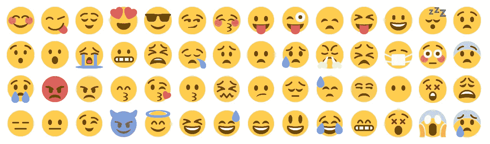

# 使用 Unicode 表情字符为您的网站标题设置动画

> 原文：<https://javascript.plainenglish.io/animate-your-website-title-with-unicode-emoji-characters-d4aa35fb0eeb?source=collection_archive---------19----------------------->

## 如果你曾经想知道如何使用 Unicode 表情符号和 JavaScript 来制作你的网站标题的动画，这篇短文非常适合你。



这个示例可能对任何实际的用例都没有用处，但是它仍然很有趣，并且应该很容易适应像 WhatsApp Web 提供的消息计数器或类似的东西。

首先，你应该检查一些你想在标题中作为动画旋转的表情符号，你可以使用[http://www.unicode.org/emoji/charts/full-emoji-list.html](http://www.unicode.org/emoji/charts/full-emoji-list.html)找到适合你的表情符号。

找到所需的表情符号后，就可以在现有的 HTML 页面中添加一些 JavaScript 了。作为示例，我使用了如下所示的 HTML。

```
<!DOCTYPE html>
<html lang="en">
  <head>
    <meta charset="UTF-8">
    <meta name="viewport" content="width=device-width, initial-scale=1.0">
    <title>Demo</title>
  </head>
  <body>
  </body>
</html>
```

在这个结构中，我们添加了一个脚本标记和 window onload 方法，一旦 DOM 被加载，这个方法就会被执行。

```
<!DOCTYPE html>
<html lang="en">
  <head>
    <meta charset="UTF-8">
    <meta name="viewport" content="width=device-width, initial-scale=1.0">
    <title>Demo</title>
    <script>
      window.onload = function(){
      }
    </script>
  </head>
  <body>
  </body>
</html>
```

现在是时候保存页面的旧的/当前的标题了，然后把它附加到我们的动画标题中，并定义一个我们想要使用的图标数组。

```
<!DOCTYPE html>
<html lang="en">
  <head>
    <meta charset="UTF-8">
    <meta name="viewport" content="width=device-width, initial-scale=1.0">
    <title>Demo</title>
    <script>
      window.onload = function(){
        var originalTitle = document.title;
        var animatedTitles = ['👆', '👉', '👇', '👈'];
      }
    </script>
  </head>
  <body>
  </body>
</html>
```

为了从我们的数组中选择一个特定的表情符号，我们另外定义了一个索引变量，并将文档标题设置为数组中的第一个元素。然后，指数变量增加一。

```
<!DOCTYPE html>
<html lang="en">
  <head>
    <meta charset="UTF-8">
    <meta name="viewport" content="width=device-width, initial-scale=1.0">
    <title>Demo</title>
    <script>
      window.onload = function(){
        var originalTitle = document.title;
        var animatedTitles = ['👆', '👉', '👇', '👈'];
        var index = 0; document.title = animatedTitles[index] + ' ' + originalTitle;
        index++;
      }
    </script>
  </head>
  <body>
  </body>
</html>
```

如果您现在打开页面，标题会更改为第一个表情符号+页面的原始标题。为了完成动画，我们使用了 setInterval 方法，传递一个方法，并将间隔设置为 500 毫秒。

```
<!DOCTYPE html>
<html lang="en">
  <head>
    <meta charset="UTF-8">
    <meta name="viewport" content="width=device-width, initial-scale=1.0">
    <title>Demo</title>
    <script>
      window.onload = function(){
        var originalTitle = document.title;
        var animatedTitles = ['👆', '👉', '👇', '👈'];
        var index = 0;document.title = animatedTitles[index] + ' ' + originalTitle;
        index++; setInterval(
          function(){},
          500
        );
      }
    </script>
  </head>
  <body>
  </body>
</html>
```

现在剩下的就是在该函数中再次设置标题，并将索引计数器增加 1。此外，我们需要检查一旦索引达到与 animatedTitles 数组中表情符号数量相同的计数，索引变量是否被重置。

```
<!DOCTYPE html>
<html lang="en">
  <head>
    <meta charset="UTF-8">
    <meta name="viewport" content="width=device-width, initial-scale=1.0">
    <title>Demo</title>
    <script>
      window.onload = function(){
        var originalTitle = document.title;
        var animatedTitles = ['👆', '👉', '👇', '👈'];
        var index = 0;document.title = animatedTitles[index] + ' ' + originalTitle;
        index++;setInterval(
          function(){
            document.title = animatedTitles[index] + ' ' + originalTitle; index++;
            if(index == animatedTitles.length){
              index = 0;
            }
          },
          500
        );
      }
    </script>
  </head>
  <body>
  </body>
</html>
```