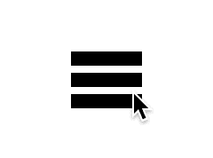

# 如何用香草 JavaScript 创建一个动画汉堡菜单

> 原文：<https://javascript.plainenglish.io/animated-hamburger-menu-in-vanilla-javascript-79bd97da00b9?source=collection_archive---------5----------------------->

## 一直想知道如何设计点击汉堡菜单时看到的那些很酷的动画？这很简单，我们可以用不到 100 行代码来完成。

How to go from burger to cross? Keep reading to find out!

让我们用一些香草 JavaScript 制作一个动画汉堡菜单吧！你知道还有烤肉串菜单、肉丸菜单和便当菜单吗？虽然我们在这一个中将集中于汉堡，但是在这篇文章中教导的概念可以应用于所有类型的菜单。

这是我们要做的:

1.  创建一个`div`标签，它将包含一个`p`标签，这又将是我们的汉堡包。
2.  给我们的`div`标签添加一个`eventListener`，这样我们就知道用户什么时候点击它，并在我们的`div`上切换类。
3.  添加 CSS，这是我们控制动画的地方。

我们开始吧！

## 1 -基础第一，创造我们的`HTML`

这个很简单。如果你在一个项目中这样做，你可能会有一些更现代的东西，但这是最基本的`html`模板。我们有一个`div`标签，我们给了它一个`id`属性，这样我们可以很容易地用一个查询和一个`p`标签来定位。两者都有一个`class`属性，但是正如你所看到的，我们只给`p`标签分配了一个实际值，我们将在下一步切换`div`标签的`class`。

## 2 -添加事件侦听器

首先需要查询我们的`hamburger-wrapper`。我们将使用`getElementById`方法来这样做，并将它绑定到一个名为`wrapper`的变量。我们给它一个`id`属性的唯一原因是确保我们只查询单个元素。如果我们给了它一个`class`属性，我们可以用`querySelector`方法查询它，但是在一个有更多元素的页面上，这会给我们带来麻烦，因为`querySelector`方法只返回第一个匹配选择器的元素。

我们给我们的`div`标签添加了一个监听器，这允许我们的用户点击整个`div`元素，而不仅仅是`p`元素，在下一步中，这个元素将变成三条相当细的线，也就是说，很难点击。最后，每次点击，我们都要在我们的`div`标签上切换类别`open`。类名的选择可以归结为感觉最自然的事情，对我来说，这就是我们正在*打开*一个菜单的事实(尽管在本文中我们不会讨论如何做到这一点)。另一个选择可能是*十字*，因为这是我们希望我们的汉堡变成的样子。这由您决定，只要您对我们的 CSS 使用相同的名称—马上就来！

## 3 -添加 CSS

这是我们控制动画的地方，但是在进入实际的 CSS 之前，我们应该花点时间想想我们想要做什么。

*   我们的`div`标签就像汉堡的包装纸，因此它应该有固定的宽度和高度。
*   我们想把`p`标签做成馅饼，所以小的高度和任何宽度看起来都不错(经过一些测试，我选择了 80%)。
*   我们的汉堡肉饼的面包将是伪元素，`:before`似乎是顶部面包的合理选择，而`:after`将是我们的底部面包。从汉堡到十字的动画将通过操纵我们的包子的`margin`，然后添加一个旋转变换来制作。
*   当`div`标签具有 *open* 的`class`属性时，我们将通过定位`p`标签来创建我们的十字架的外观，如第 45 行所示。

从头开始做 UI 时，一个方便的技巧是给你的元素加上颜色，使其从页面的其余部分中脱颖而出。当我这样做的时候，我用`background-color: red`作为`div`标签，用`background-color: blue`作为`p`标签和伪元素。

请注意我们是如何根据元素共享的属性将它们分组的，例如，我们如何只需更改一行上的`background-color`就可以更改所有三行。

大多数行应该是不言自明的。然而，有一些部分很容易出错，或者对于一个好的布局是必不可少的，如果你刚刚开始使用 CSS，这些东西可能很容易被忽略。

第 3 行——在父元素中垂直居中子元素是用 flexbox 最容易做到的，因为我们想基于`margin`和`transform`创建动画，所以我们不想一开始就依赖这些值。

第 12 行——我们的伪元素，汉堡的面包，默认显示为`inline`，没有任何内容，这意味着它们没有宽度和高度。因此，我们将`position: relative`设置为`p`标签，将`position: absolute`设置为伪元素(第 31 行),这将把它们从流中取出，并呈现为块元素，以它们的宽度为准。

第 24 行——这是我们控制动画的地方。我们要告诉我们的汉堡的是，在旋转完成之前，等待转换边距。相反的是在第 53 行，当我们把汉堡变成十字架的时候。如你所见，我们在不同的时间赋予了不同的属性。这是为了创造动画“扣入到位”的感觉。这也可以通过改变过渡的缓和函数来实现。

## 决赛成绩

Animated burger menu!

现在，当你点击它的时候，你应该会看到类似上面的从汉堡到十字路口的东西！干得好！

作为对自己的挑战，尝试将汉堡重新设计成肉丸菜单或烤肉串菜单，看看它如何影响动画和我们的伪元素的属性。

*更多内容请看*[*plain English . io*](http://plainenglish.io/)