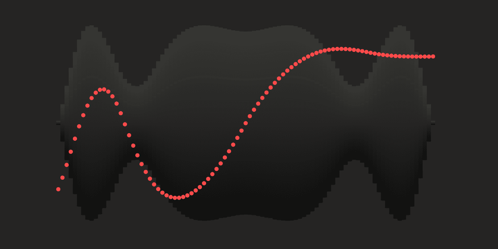
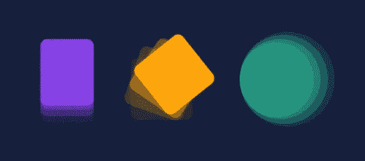

# JavaScript 中的动画

> 原文：<https://javascript.plainenglish.io/animation-in-javascript-d97f84be482b?source=collection_archive---------15----------------------->



# 介绍

创建动画有三种方法。

1.  通过使用正确命名的 CSS 动画。
2.  通过使用 CSS 过渡。
3.  通过在 [JavaScript](https://www.technologiesinindustry4.com/2021/08/javascript-yui-test-framework.html) 中写代码。

在这篇文章中，我们将看看如何用 JavaScript 做一些基本的动画。

# 描述

*   动画非常简单和容易。
*   每秒钟多次绘制不同的场景。
*   在绘制船只和小行星时，我们需要它们的位置、大小、形状等基本数据。
*   这些数据将用于翻译和旋转上下文，结果所有内容看起来都在正确的位置。
*   我们每一帧都更新数据，并随着数据的变化一遍又一遍地重绘场景，以制作场景动画。

# 使用 [JavaScript](https://www.technologiesinindustry4.com/2021/08/javascript-yui-test-framework.html) 制作动画的重要性

*   当我们在 CSS 中使用过渡或动画制作动画时，我们的浏览器为我们做了大量实际的动画制作工作。
*   我们实际上所做的只是定义过渡和动画的开始状态和结束状态。
*   如果我们的动画有关键帧，我们也定义一些中间状态。
*   我们在动画生命的某些点定义了随机属性值。
*   这是对这些点之间的值的感叹，这对于动画的工作非常重要。
*   我们的浏览器为我们做的正是这种爆发。
*   我们需要对我们的关键帧非常精确，在许多时间点上，我们希望我们的属性有一个确定的值。
*   这种精确性使得制作大量真实场景的动画变得非常困难。
*   使用 [JavaScript，](https://www.technologiesinindustry4.com/2021/08/javascript-yui-test-framework.html)大门向我们敞开，我们可以创建任何类型的动画，而不用担心技术可行性，因为我们可以更好地控制我们动画的所有特性。
*   例如，不使用 JavaScript 来创建类似下雪的效果将会非常困难。

# 处理动画

*   通过直接使用 canvas 方法和调用自定义函数将图形绘制到画布上。
*   只有当脚本在正常情况下完成执行时，我们才意识到这些结果看起来就像在画布上一样。
*   例如，它不太可能从循环的内部制作动画。
*   这意味着我们需要一个方法来执行我们的绘图功能超过一段时间。有两种方法可以控制这样的动画。



## 预设更新

为了在一段时间内调用一个特定的函数，我们使用以下函数:

*   setInterval()，
*   setTimeout()和
*   requestAnimationFrame()

**setInterval ()**

每延迟毫秒开始频繁执行 function 所述的功能。

**setTimeout()**

以延迟毫秒为单位执行 function 指定的功能。

**requestAnimationFrame(回调)**

*   向浏览器传达我们希望执行动画的信息。
*   请求浏览器[在下一次重画之前调用一个明确的函数来更新动画](https://www.technologiesinindustry4.com/)。

# 移动的圆圈

*   让我们从一个非常简单的场景开始，作为一个移动的圆圈。
*   这个圆在我们将要移动的画布上有一个 x 和 y 坐标位置。
*   以正常方式创建一个新文件夹。
*   复制 drawing.js 库和样式表。
*   用下面的代码创建一个新的文件 exercise6.html。

```
*<!doctype html>*<html><head><title>Animation</title><link rel="stylesheet" href="styles.css"><script src="drawing.js"></script></head><body><h1>Animation</h1><canvas id="asteroids" width="300" height="300"></canvas><script>var context = document.getElementById("asteroids").getContext("2d");context.strokeStyle = "white";context.lineWidth = 1.5;var x = 0, y = context.canvas.height / 2;function frame() {context.clearRect(0, 0, context.canvas.width, context.canvas.height);draw(context);update();}function update() {x += 1;}function draw(ctx) {draw_grid(ctx);ctx.beginPath();ctx.arc(x, y, 40, 0, 2 * Math.PI);ctx.fill();ctx.stroke();}setInterval(frame, 1000.0/60.0); // 60 fps</script></body></html>
```

*   代码通常是熟悉的，但是，有一些新的东西需要注意。
*   Main，我们把 x 和 y 坐标作为全局变量。
*   我们同样将代码更新为一系列函数，如 frame、update 和 draw。
*   框架函数准备了三个独立的东西。
*   它使用 context.clearRect 方法释放画布。
*   以前它调用 draw 函数在 x，y 位置画一个圆。
*   它调用 update 函数，将 x 坐标向右移动一个像素。
*   最后一个新东西是对 setInterval [的调用，它调度 frame 函数每秒被调用 60 次。](https://www.technologiesinindustry4.com/)
*   结果是每次调用框架函数。
*   它清除画布，绘制一个网格，在当前位置绘制一个圆，并将该位置向右移动。
*   对 setInterval 的调用传入要调用的函数 frame
*   呼叫之间的时间间隔(以毫秒计)为 1000.0 / 60.0。
*   因此，每隔六十分之一秒调用一次 frame 函数。
*   圆圈以每秒 60 像素的速度向右移动。
*   它不是扩展可见的，一旦圆移动到画布的末端，x 的值继续增加。

更多详情请访问:[https://www . technologiesinindustry 4 . com/2021/10/animation-in-JavaScript . html](https://www.technologiesinindustry4.com/2021/10/animation-in-javascript.html)