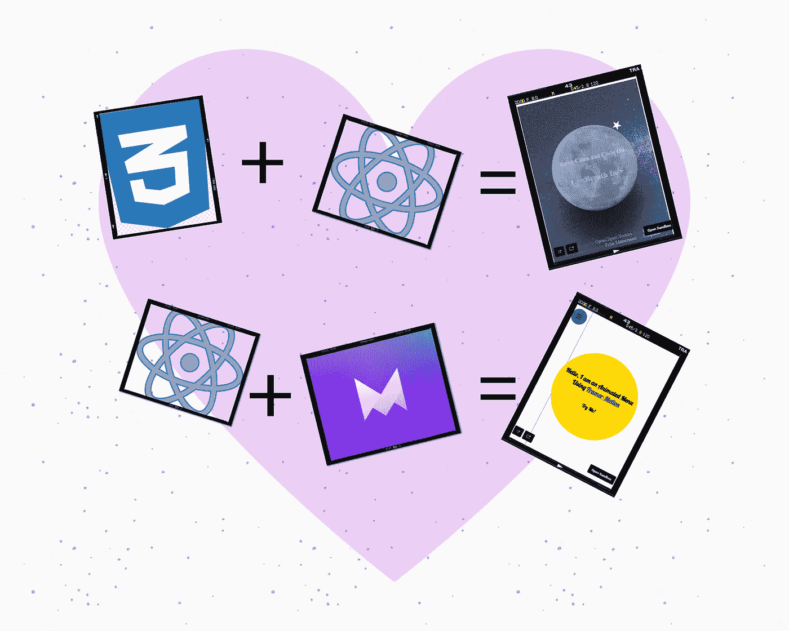

# 在“与 CSS 和成帧器反应-运动”中创建动画

> 原文：<https://javascript.plainenglish.io/animation-in-react-web-application-using-pure-css-and-framer-motion-cf48a4aece28?source=collection_archive---------10----------------------->

## 如果您喜欢使用“反应”和“动画”，您也可以这样操作。



Image Designed Using [Canva](https://www.canva.com/)

我们将从这个主题中学到什么:

*   如何在反应中使用 **CSS** 制作**动画**。
*   如何在反应中使用**成帧器-动作**制作**动画**。

## **1。如何在反应中使用 CSS 制作动画**

在本教程中，我做了一个简短的代码沙箱演示，以便您可以更容易地理解。演示是关于一个“冥想月亮”(因为我给它命名)。为此，我有三个动画元素:

*   **月亮**在无限的时间里膨胀和收缩。
*   **星**正在以无限的时间绕着月亮运行。
*   **文字**将在月亮增大或缩小时在两种状态之间切换。

首先，我们可以让月球像这样增长或缩小:

```
*.moon-container {**display: flex;**align-items: center;**justify-content: center;**margin: auto;**top: 20px;**height: 260px;**width: 260px;**position: relative;**transform: scale(1);**}**.moon-container.grow {**animation: grow 3s infinite;**}**@keyframes grow {**from {**transform: scale(1);**}**to {**transform: scale(1.5);**}**}**.moon-container.shrink {**animation: shrink 3s infinite;**}**@keyframes shrink {**from {**transform: scale(1.5);**}**to {**transform: scale(1);**}**}*
```

在上面的代码中，您可以看到类*月亮容器*作为月亮物体的占位符，所以我们需要在这个占位符上再附加两个类*生长*和*收缩*进行动画。我们将在 *@keyframs* 中增加属性*变换*的值 *scale()* 使月亮相应地变大变小。

现在，看看下面代码中的星形元素:

```
*.star-container {**position: absolute;**top: -30px;**left: 120px;**width: 20px;**height: 160px;**transform-origin: bottom center;**animation: rotate 6s linear forwards infinite;**}**@keyframes rotate {**from {**transform: rotate(0deg);**}**to {**transform: rotate(360deg);**}**}*
```

同样，我们可以制作一个类*星形容器*作为动画星的占位符，然后为属性*变换添加值 *rotate(从 0 到 360 度)*。*

现在，我们检查文本区域，文本将根据动画月亮而变化。查看 **App.js** 文件中的示例代码。为此，我使用了 Component 类，然后初始化了如下状态:

```
*state = {**text: “<Hold/>”,**count: 0,**grow: false,**shrink: false**};*
```

然后我又增加了两个功能*“呼吸()*”和*呼吸()*”，如下:

```
*breathIn = () => {**this.setState({**text: “<Breath In/>”,**count: this.state.count + 1,**grow: true,**shrink: false**});**};**breathOut = () => {**this.setState({**text: “<Breath Out/>”,**count: this.state.count — 1,**grow: false,**shrink: true**});**};*
```

此时您可以*设置状态()*为每个属性添加您想要的值。最后，按照以下顺序添加 div 元素:

```
*<div**className={`moon-container ${this.state.grow ? “grow” : “”} ${**this.state.shrink ? “shrink” : “”**}`}**id=”animation”**onAnimationIteration={**this.state.count === 1 ? this.breathOut : this.breathIn**}**>**<div className=”text-area”>**<h3>Keep Calm and Code On</h3>**<h2>**{this.state.count} : {this.state.text}**</h2>**</div>**<div className=”moon”></div>**<div className=”star-container”>**<span className=”star”></span>**</div>**</div>*
```

在上面的代码中，根据 *this.state.grow* 和*this . state . construct*(对或错)增加了类 *grow* 或 *shrink* 。*on imation iteration*事件将根据计数器的值触发函数*呼气()*和*呼气()*。

在这里观看 [**演示**](https://jg6cl.csb.app/) 了解它是如何工作的:

## **2 .如何在反作用中使用成帧器运动制作动画**

成帧器动作是*“一个现成的动作库，用于从* [*成帧器*](https://www.framer.com/) 起反应。I *t 带来了声明式动画、轻松的布局转换和手势，同时保持了 HTML 和 SVG 语义。”*他们的文档很容易理解，并且包含了很多交互式的例子，所以你不会花很多时间来实现编码。在本教程中，我将使用这项技术演示一个动画汉堡菜单切换。为此，我们将使用“*变体*”状态。正如在他们的[文档](https://www.framer.com/docs/)中所定义的那样，“*变体是组件可以处于的预定义的可视状态。通过给一个组件及其子组件* `*variants*` *匹配的名称，整个反应树可以通过改变一个单独的道具来动画化。通过使用变体，父母可以轻松地用特殊的* `*transition*` *道具(如* `*staggerChildren*` *)编排孩子的动画。变体也可以是基于传递给每个组件的* `*custom*` *属性的数据返回不同属性的动态函数。*”

使用此*变量*状态的演示将有三个主要部分:

*   如何显示**菜单切换图标**。
*   如何显示**菜单项**。
*   点击菜单图标时**导航条**如何转换。

首先，我们创建动画菜单切换图标如下:

```
*import * as React from “react”;**import { motion } from “framer-motion”;**const Path = (props) => (**<motion.path**fill=”transparent”**strokeWidth=”3"**stroke=”hsl(0, 0%, 18%)”**strokeLinecap=”round”**{…props}**/>**);**export const MenuToggle = ({ toggle }) => (**<button onClick={toggle}>**<svg width=”23" height=”23" viewBox=”0 0 23 23">**<Path**variants={{**closed: { d: “M 2 2.5 L 20 2.5” },**open: { d: “M 3 16.5 L 17 2.5” }**}}**/>**<Path**d=”M 2 9.423 L 20 9.423"**variants={{**closed: { opacity: 1 },**open: { opacity: 0 }**}}**transition={{ duration: 0.1 }}**/>**<Path**variants={{**closed: { d: “M 2 16.346 L 20 16.346” },**open: { d: “M 3 2.5 L 17 16.346” }**}}**/>**</svg>**</button>**);*
```

在这段代码中，您可能会注意到，我们利用*变量*状态来控制状态关闭或打开时的 SVG 路径。

同样，我们将为菜单中的项目设置*变量*状态，如下所示:

```
*import * as React from “react”;**import { motion } from “framer-motion”;**const variants = {**open: {**y: 0,**opacity: 1,**transition: {**y: { stiffness: 1000, velocity: -100 }**}**},**closed: {**y: 50,**opacity: 0,**transition: {**y: { stiffness: 1000 }**}**}**};**const colors = [“#fef6e4”, “#f582ae”, “#8bd3dd”, “#b8c1ec”, “#ff8906”];**export const MenuItem = ({ id, text, icon }) => {**const style = { border: `3px solid ${colors[id]}` };**return (**<motion.li**variants={variants}**whileHover={{ scale: 1.1 }}**whileTap={{ scale: 0.95 }}**>**<div className=”icon-placeholder” style={style}>**<span className=”icon”>{icon}</span>**</div>**<div className=”text-placeholder” style={style}>**<span className=”text”>{text}</span>**</div>**</motion.li>**);**};*
```

这只是一个例子，你可以根据你的需要定制这些，只要确保转换属性的值将根据其变量的状态而改变。

最后，导航栏将“ *staggerChildren* ”(本例中为菜单项)如下:

```
*import * as React from “react”;**import { motion } from “framer-motion”;**import { MenuItem } from “./Items”;**const variants = {**open: {**transition: { staggerChildren: 0.07, delayChildren: 0.2 }**},**closed: {**transition: { staggerChildren: 0.05, staggerDirection: -1 }**}**};**const Items = [**{ id: “0”, text: “Home”, icon: “🏠” },**{ id: “1”, text: “About”, icon: “ℹ️” },**{ id: “2”, text: “Projects”, icon: “💻” },**{ id: “3”, text: “Blogs”, icon: “✍️” },**{ id: “4”, text: “Contact”, icon: “📧” }**];**export const Navigation = () => (**<motion.ul variants={variants}>**{Items.map((item) => (**<MenuItem id={item.id} key={item.id} text={item.text} icon={item.icon} />**))}**</motion.ul>**);*
```

现在，我们可以设置我们的 **App.js** 文件中的所有内容，并立即看到结果:

```
*import “./styles.css”;**import * as React from “react”;**import { motion, useCycle } from “framer-motion”;**import { MenuToggle } from “./Toggle”;**import { Navigation } from “./Nav”;**const sidebar = {**open: (height = 1000) => ({**clipPath: `circle(${height * 2 + 200}px at 40px 40px)`,**transition: {**type: “spring”,**stiffness: 20,**restDelta: 2**}**}),**closed: {**clipPath: “circle(30px at 40px 40px)”,**transition: {**delay: 0.5,**type: “spring”,**stiffness: 400,**damping: 40**}**}**};**export default function App() {**const [isOpen, toggleOpen] = useCycle(false, true);**return (**<>**<motion.nav**initial={false}**animate={isOpen ? “open” : “closed”}**custom=”100%”**>**<motion.div className=”navbar” variants={sidebar} />**<Navigation />**<MenuToggle toggle={() => toggleOpen()} />**</motion.nav>**<div className=”heading”>**<h2>**Hello, I am an Animated Menu Using{“ “}**<a**target=”_blank”**rel=”noreferrer”**href=”https://www.framer.com/docs/"**>**Framer-Motion**</a>**</h2>**<h3>Try Me!</h3>**</div>**</>**);**}*
```

这里是[的**演示**的](https://3cji8.csb.app/)为此:

## 结论

今天的教程到此为止。欣赏你的作品，享受吧！我知道这是一个相当长的阅读，但其中大部分只是代码片段。感谢您的阅读，祝您度过美好的一天！

如果你喜欢**动画**主题，你可以点击这里阅读另一篇文章:

[](/make-your-site-stand-out-with-animation-4bb855c5a109) [## 用动画让你的网站脱颖而出

### 如何使用 CSS 和 JavaScript 创建动画，使你的网站更有吸引力

javascript.plainenglish.io](/make-your-site-stand-out-with-animation-4bb855c5a109) 

*更多内容尽在*[***plain English . io***](http://plainenglish.io)