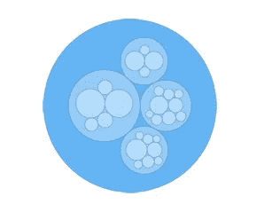

# AnyChart JS 8.10.0 发布了圆形包装和日历图表，瀑布箭头，表面图中的标记系列

> 原文：<https://javascript.plainenglish.io/anychart-js-8-10-0-released-check-out-new-chart-types-and-features-bdbe8a77943f?source=collection_archive---------14----------------------->

我们的 [JavaScript 图表库](https://www.anychart.com)的新版本现已发布，带来了一系列令人惊叹的更新！首先，我们增加了两种新的图表类型:**圆形包装**和**日历**。第二，现在非常欢迎您使用瀑布图中的预建**箭头连接器和 3D 曲面图**中的**标记系列。**

请参阅以下内容，了解 AnyChart JS 8.10.0 中的主要新特性，并在我们强大的数据可视化工具中享受这些图表和功能！

# AnyChart JS 8.10.0 的新增功能

## 圆形包装图

圆形包装图或圆形树形图是使用圆形而不是矩形来可视化分层数据的[树形图](https://www.anychart.com/chartopedia/chart-type/treemap/)的变体。圆圈打包技术可能不如传统的树映射那样节省空间。然而，前者比后者更有助于揭示层次结构。

查看我们图库中的几个[JS 圆形包装图](http://www.anychart.com/products/anychart/gallery/Circle_Packing/)示例。

## 日历图表

日历图表是一种数据可视化形式，旨在表示长时间跨度(如几年或几个月)内的活动。例如，当您需要显示可量化的值如何随季节、星期几或时间趋势而变化时，可以使用它。

在我们的图库中查看几个[JS 日历图表](https://www.anychart.com/products/anychart/gallery/Calendar_Chart/)示例。

## 瀑布图中的箭头

除了两种全新的图表类型，我们的 JavaScript 图表库中现在还提供了两个非常棒的特性。其中之一是瀑布图箭头。为了指出某些变化，可以在任何列之间快速绘制箭头形状的连接线。这样，相应的值会自动显示在附着的文本标签中。

了解 API 参考中的 [addArrow 方法](https://api.anychart.com/anychart.charts.Waterfall#addArrow)。

## 曲面图中的标记系列

我们还提供了在曲面图中以非常直接的方式创建标记系列的机会。因此，现在您可以快速将数据可视化为 3D 空间中的一组点。

在我们的图库中查看带有标记系列的 JS 曲面图的[示例。](https://www.anychart.com/products/anychart/gallery/Surface_Chart/GDP_Per_Capita.php)

# 我们计划的下一步

当你读这篇文章的时候，我们已经在进行更多的更新和改进了！例如，您可以期待横轴特性，以及在瀑布图中，在计划于九月份发布的下一个主要版本中提供的小计和外部标签。

AnyChart JavaScript 图表库中还需要哪些特性或图表类型？我们很乐意听到你这样说！请将您的建议发送给我们的[支持团队](https://www.anychart.com/support/)，我们将很乐意相应地调整我们的路线图。

**享受 AnyChart JS 8.10.0！**

*原载于 2021 年 5 月 24 日 https://www.anychart.com***。**

**更多内容请看*[*plain English . io*](http://plainenglish.io/)*