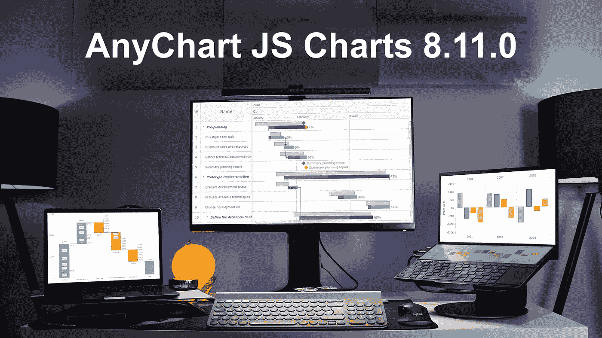
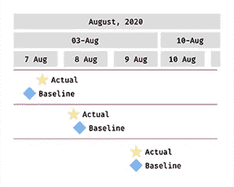
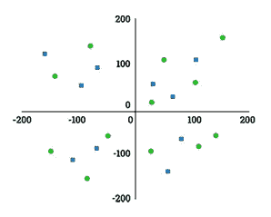
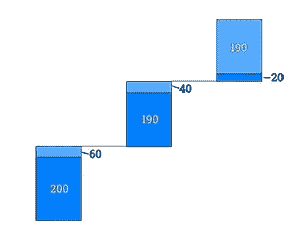

# AnyChart JS Charts 8.11.0 发布了全新的数据可视化特性

> 原文：<https://javascript.plainenglish.io/anychart-js-charts-8-11-0-released-with-awesome-new-data-visualization-features-76afa9e40081?source=collection_archive---------14----------------------->

[https://www.anychart.com/blog/2021/12/07/js-charts-8-11-0-released/](https://www.anychart.com/blog/2021/12/07/js-charts-8-11-0-released/)

很高兴地告诉你，我们刚刚推出了对我们的 [JavaScript 图表库](https://www.anychart.com)的重大更新！新推出的特性和改进使我们的核心解决方案更加灵活，增加了令人惊叹的新功能，旨在进一步帮助您的数据可视化开发之旅。好奇吗？让我们立即展示 AnyChart JS Charts 8.11.0 中的新功能！

# AnyChart JS 图表中的新功能

## **甘特图中的基线里程碑**

里程碑现在不仅可以放在实际元素上，还可以放在基线元素上，这使得使用我们的[甘特图](https://www.anychart.com/chartopedia/chart-type/waterfall-chart/)进行项目规划和跟踪更加高效和简化。因此，首先你可以安排任何重要的日期，如会议、批准、阶段完成和其他重大事件或目标。然后很容易直观地比较实际的里程碑日期和初始的基线项目计划。

在我们的图库中查看带有基准里程碑的[甘特图示例。](https://www.anychart.com/products/anygantt/gallery/Gantt_Charts/Planned-vs-Actual_Chart.php)

## **自定义轴位置**

我们增加了在图表的任意位置绘制 X 轴和 Y 轴的选项。以前，您只能将它们分别设置为固定的顶部或底部以及左侧或右侧位置。现在，您可以完全控制轴线出现的比例值，从而控制轴线相交的位置。例如，现在您可以很容易地使两个轴都通过带有负值的图形中的原点(0，0)。在我们的图库中查看带有自定义轴位置的[柱形图示例。](https://www.anychart.com/products/anychart/gallery/Column_Charts/Column_Chart_with_Negative_Values.php)

## **瀑布图中的外部标签**

在[瀑布图](https://www.anychart.com/chartopedia/chart-type/waterfall-chart/)中，现在可以轻松、优雅地为小元素添加标题。如果数据标签不适合其数据点的边界，您可以将它放在栏的外部。这种外部标签在同一绘图上显示多个系列的堆叠瀑布图中特别有用。在我们的图库中查看带有外部标签的[瀑布图示例。](https://www.anychart.com/products/anychart/gallery/Waterfall_Charts/Income_Statement_by_Region(with_auto_positioned_labels).php)

# AnyChart JS 图表的改进

这还不是新版本带来的全部！我们还对现有的制图机制进行了一些改进。

例如，现在您可以在瀑布图中轻松执行以下操作:

*   将汇总栏和分类汇总栏作为独立元素添加和配置。
*   将总条形图拆分为多个代表用户定义的值或表达式的条形图。
*   在单系列可视化中显示堆栈标签。

而在[的股票走势图](https://www.anychart.com/chartopedia/chart-type/stock-chart/):

*   通过 [API](https://api.anychart.com/) 使用绘图控件。
*   添加系列点相关事件。

检查您正在使用的 JS 图表库产品的版本历史，以保持所有最新更新:

*   [AnyChart JS 版本历史](https://www.anychart.com/products/anychart/history/)
*   [任意甘特图 JS 版本历史](https://www.anychart.com/products/anygantt/history/)
*   [AnyStock JS 版本历史](https://www.anychart.com/products/anystock/history/)

**享受 AnyChart JS Charts 8.11.0，并让我们知道您希望我们接下来添加或改进什么！**

*最初发表于 2021 年 12 月 7 日*[*https://www.anychart.com*](https://www.anychart.com/blog/2021/12/07/js-charts-8-11-0-released/)T22。