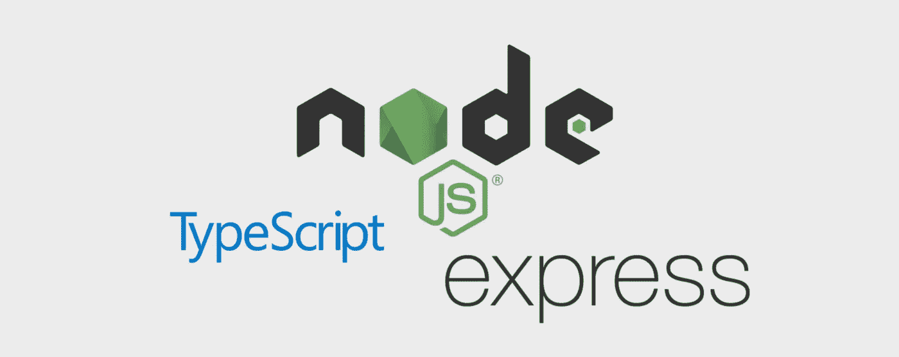
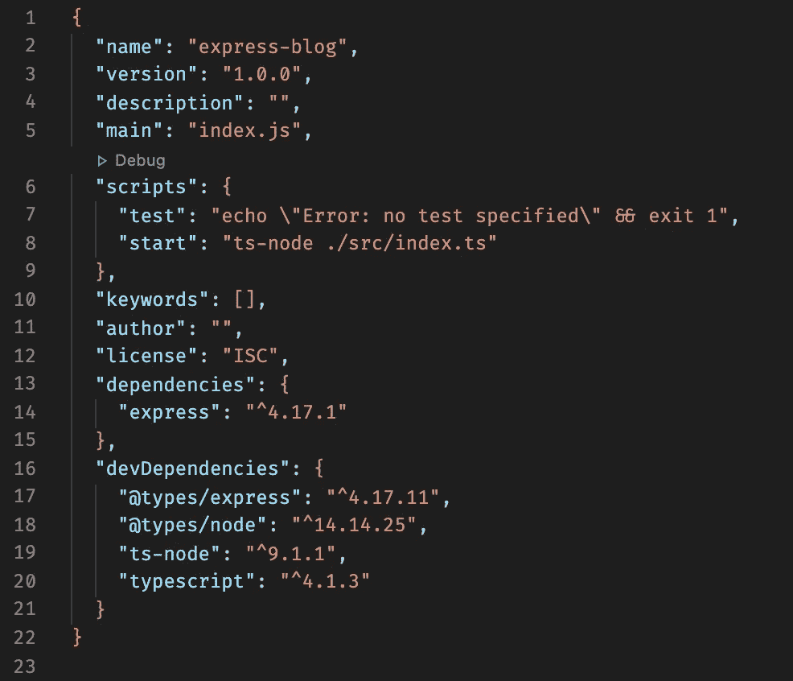

# 使用 Express.js 和 TypeScript 设置 API 服务器

> 原文：<https://javascript.plainenglish.io/api-server-setup-with-express-js-mongodb-and-typescript-part-1-bea7e4f5b526?source=collection_archive---------8----------------------->

## 第 1 部分:如何设置基本 Express API 服务器



这将快速介绍如何设置基本的 [Express](https://expressjs.com) API 服务器。

继续创建一个新目录，并在 IDE 中打开它。使用以下命令启动 npm 项目

```
$ npm init -y
```

这将使用所有默认值设置 package.json 文件。如果您希望通过提示手动填写所有字段，只需移除`-y`标志。

好吧，让我们开始工作。首先，让我们安装 express。

```
$ npm i express 
```

由于我们正在使用 [TypeScript](https://www.typescriptlang.org) 让我们将它添加到项目中，以及 express 和 Nodejs 的类型和一个用于 node 的 [TypeScript](https://www.typescriptlang.org) 编译器，但是这次我们将抛出`-D`标志，因为我们将只需要开发这些包。

```
$ npm i -D @types/express @types/node typescript ts-node
```

现在让我们初始化将在我们的项目中使用的类型脚本

```
$ npx tsc --init
```

一个名为`tsconfig.json`的新文件将被创建。因为 TypeScript 在这里，你可以设置你希望你的 [typescript](https://www.typescriptlang.org) 编译成什么版本的 JavaScript，以及你希望类型检查有多严格。详细解释请查看 [tsconfig 文档](https://www.typescriptlang.org/docs/handbook/tsconfig-json.html)。

接下来，在 IDE 中打开`package.json`文件。你应该看到一个键`"main"`，它的值是`index.js`。因为我们使用的是[类型脚本](https://www.typescriptlang.org)，所以让我们将其设置为`index.ts`。您还应该看到一个键`"scripts"`，在它的值里面是一个键`"test"`。在`"test"`值的末尾添加一个逗号，并添加一个新的键`"start"`，并将其设置为等于`“ts-node ./src/index.ts”`。这样，当我们在终端中键入`npm start`时，它将为我们运行我们的应用程序。

这不是必须的，但更多的是一种偏好。我通常会安装 nodemon，以便在发生变化时自动运行我的代码，并且已经习惯了使用`npm start`来运行我的代码。我们将在本系列教程的后续部分向该应用程序添加 nodemon。

除了版本差异之外，您的 package.json 应该类似于下面这样。



# 进口快递

现在我们准备开始建设。创建一个名为`src`的文件夹，并在该文件夹中创建一个名为`index.ts`的文件。

这个文件将首先加载。它将连接到数据库并将请求发送到路由器，然后路由器将请求发送到适当的控制器。

```
import express from 'express'
```

我们已经进口了 [express](https://expressjs.com) ，但是我们还没有使用它。创建一个名为`app`的常量，并将其设置为等于`express()`。

```
const app = express()
```

*边注:我见过一些带有*[*typescript*](https://www.typescriptlang.org)*的 express 示例明确声明了什么类型* `*app*` *是什么类型，当您用下面的代码行导入 express 时，您可以通过导入* `*Application*` *类型很容易地做到这一点。*

```
import express, { Application } from 'express'
```

现在，当你从 express 函数中声明 app 常量时，你可以简单地写。

```
const app: Application = express()
```

有些人在他们的 typescript 文件中显式声明所有内容，但是我的方法是如果类型还没有包含在包中就导入它们，并且只有当 typescript linter 对我大喊大叫时才显式声明一个类型。优势在于通过 vscode 提供的工具。Typescript 知道所有声明的内容，因此智能感知甚至比 javascript 更有用

# 设置 Express 在端口监听

让我们通过创建另一个名为`port`的常量来创建我们的服务器将监听的端口，并将其设置为我们系统中一个未使用的端口。我就用端口`3000`。

```
const port = 5000
```

告诉 express 监听这个端口非常简单。我们利用`listen`方法并输入两个参数，端口变量和一个匿名函数，该函数调用`console.log`来

```
app.listen(port, () => {
  console.log(`Server is listening on port ${port}`)
```

如果您在终端中运行命令`npm start`，它将启动应用程序，您将看到`Server is listening on port 3000`的输出。

# 你好世界端点

现在让我们测试我们是否可以通过 Postman 或我们的浏览器导航到服务器并获得响应。同样，Express 让我们轻松做到这一点。

```
app.get('/', (req, res) => {
  res.send('Hello World')
})
```

我们把它放在 app.listen 函数和两个常量之间。如果 express 在基本 url 上收到一个 get 请求，在我们的例子中是`[http://localhost:3000/](http://localhost:3000/)`,服务器将把字符串`"Hello World!"`发送回用户。

*和上面的* `Application` *类型一样，我们可以导入* `req` *和* `res` *的类型，如果我们想用下面的 import…*

```
import express, { Request, Response } from 'express'
```

*…和实施。但是为了在我们的* `*app.get()*` *函数声明中真正明确，我们需要声明函数的返回类型。在这种情况下，因为我们实际上不返回任何东西，而是将数据传递给* `*res*` *变量。返回类型为* `*void*` *。*

```
app.get('/', (req: Request, res: Response): void => {
  res.send('Hello World')
})
```

再次重申，我们不需要这么明确，因为我们已经导入了 express 数据类型。但是，如果你喜欢，请自便！

这样我们就有了一个非常基本的 [Express](https://expressjs.com) 服务器设置。您可能想知道“这看起来就像 JavaScript？我以为这应该是打字稿？”因为我们导入了将要使用的类型，所以 TypeScript 能够计算出每样东西的类型！TypeScript 在后台检查我们所有的代码，以确保类型是正确的，这样我们就可以放心，我们的代码会工作，我们犯的许多懒惰的错误不会出现。这也是允许我们使用 ES 模块`import`而不是`require`的原因。

我们能够编写更现代的代码，并且能够放心地运行我们的代码！

敬请关注下次更新。我们将增加更多的功能。

# 系列教程

第一部分:“你好，世界！”

[**第二部分:设置路由器**](https://wardprice.medium.com/api-server-setup-with-express-js-and-typescript-part-2-531f9546993c)

[**第 3 部分:连接到 MongoDB**](https://wardprice.medium.com/api-server-setup-with-express-js-typescript-and-mongodb-part-3-b02409f072e4)