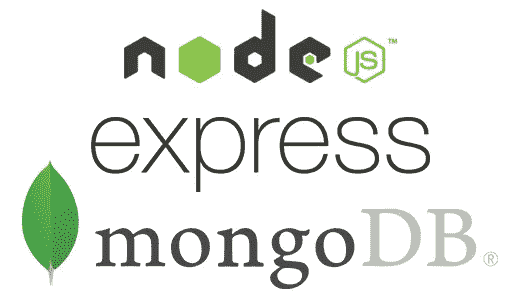

# 使用 Express.js、TypeScript 和 MongoDB 设置 API 服务器

> 原文：<https://javascript.plainenglish.io/api-server-setup-with-express-js-typescript-and-mongodb-part-3-b02409f072e4?source=collection_archive---------12----------------------->

## 第 3 部分:向我们的 API 添加 MongoDB



我们将从本教程系列的[中停止的地方继续，向我们的 API 添加 MongoDB。如果你现在刚刚开始，请随意在这里克隆上一篇教程](https://wardprice.medium.com/api-server-setup-with-express-js-and-typescript-part-2-531f9546993c)[中的所有代码。](https://github.com/woink/expressBlog/tree/8400e6a999491bc5aeb384d326dafe718f0be617)

首先我们需要下载 [MongoDB 社区服务器](https://www.mongodb.com/try/download/community)。确保为您的操作系统选择正确的下载，然后按照[说明](https://docs.mongodb.com/manual/administration/install-community/)在您的系统上安装并运行它。MongoDB 社区服务器完全免费，任何人都可以使用！

现在回到这个项目。在您的`/src`文件夹中创建一个名为`connect.ts`的文件。在这里，我们将为 express 编写连接到数据库的配置。为了连接到数据库，我们需要使用一个**对象数据建模(ODM)** 工具。使用 ODM 将允许提供一些结构和内置的业务逻辑，这将使我们的生活变得容易得多，少写多做！可能 MongoDB 最流行的 ODM 是[mongose](https://mongoosejs.com)所以让我们安装它，因为我们使用的是 typescript，它的类型。

```
$ npm i mongoose
$ npm i -D @types/mongoose
```

打开`connect.ts`文件，用命令行导入猫鼬

```
import mongoose from 'mongoose';
```

接下来，我们需要创建一个函数，该函数将获取数据库地址，并在连接成功或出现错误时执行操作。

```
export default ({ db }) => {
  const connect = () => {
    mongoose
      .connect(db, {
        useNewUrlParser: true,
        useUnifiedTopology: true, 
        useCreateIndex: true
      })
      .then(() => {
        return console.info('Successfully connected to Database');
      })
      .catch((error) => {
        console.error('Error connecting to database: ", error);
        return process.exit(1);
      });
  };
  connect() mongoose.connection.on('disconnected', connect);
};
```

使用数据库字符串，我们尝试连接到数据库。如果成功，我们将打印到数据库`Successfully connected to Database`。否则，错误消息`Error connecting to database`将与系统错误消息一起被记录，连接尝试将被退出。

然而，因为我们使用的是字体，你可能会在`db`下面看到一条红色的曲线。这是因为 typescript 不知道`db`应该是什么类型。我们知道它只会是一个字符串，所以让我们在`connect.ts`中创建一个新的类型来告诉 typescript“嘿，这个变量`db`只会是一个字符串”

```
type TDBInput = {
  db: string;
};
```

现在我们需要做的就是告诉 typescript 使用该类型。方法是在函数参数中的`{ db }`后添加`: TDBInput`。你完整的`connect.ts`应该是这样的。

现在添加我们的 MongoDB 连接到我们的服务器打开`/src/index.ts`。让我们首先通过在导入语句中添加下面一行来导入我们刚刚创建的`connect.ts`文件。

```
import connect from './connect';
```

在最底部声明常量`db`，并将其设置为应该运行的本地 MongoDB 实例。默认为`mongodb://localhost:27017`。在地址之后，您可以添加您想要创建的集合的名称，如果该集合不存在，MongoDB 将自动创建它。由于我们正在制作一个电影查找应用程序，我们将命名我们的电影

```
const db = 'mongodb://localhost:27017/movies';
```

剩下唯一要做的就是使用我们导入的`connect`函数，并将其设置为我们的`db`常量。

```
connect({ db });
```

您的`/src/index.ts`文件现在应该看起来像这样。

如果您在终端中使用`$ npm start`命令启动服务器，这将需要一分钟的时间，但是您应该会收到消息，表明您成功连接到了数据库！

[要克隆的完整代码](https://github.com/woink/expressBlog/tree/8a1592d4b963f91fe0d3fe91db6bbbcf3ef2d4a8)

下次我们创建一些数据模型并开始向 MongoDB 提交数据

快乐编码

# 系列教程

[**第一部分:“你好世界！”**](https://wardprice.medium.com/api-server-setup-with-express-js-mongodb-and-typescript-part-1-bea7e4f5b526)

[**第二部分:设置路由器**](https://wardprice.medium.com/api-server-setup-with-express-js-and-typescript-part-2-531f9546993c)

**第 3 部分:连接到 MongoDB**