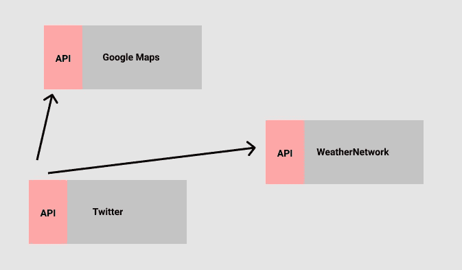
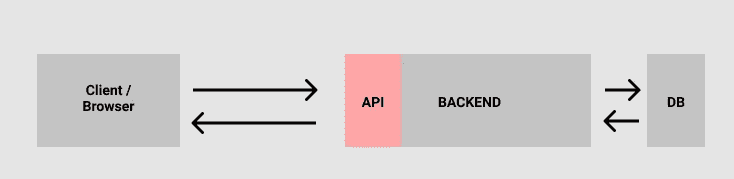

# 面向初学者的 API 和 RESTful APIs 指南

> 原文：<https://javascript.plainenglish.io/apis-restful-apis-zzzzzz-c8deb86890f6?source=collection_archive---------24----------------------->

## 什么是 API？REST APIs 的独特之处是什么？


Photo by [ThisIsEngineering](https://www.pexels.com/@thisisengineering?utm_content=attributionCopyText&utm_medium=referral&utm_source=pexels) from [Pexels](https://www.pexels.com/photo/woman-writing-on-whiteboard-3861943/?utm_content=attributionCopyText&utm_medium=referral&utm_source=pexels)

# 什么是 API，为什么我们需要 API？

一个 **API(应用编程接口)**是两个应用相互对话的解决方案。通常，一个应用程序希望利用另一个应用程序的某些东西(比如数据)。

如果没有 API，这些应用程序就无法相互通信，因为有许多障碍。例如，应用程序是用不同的编程语言编写的，或者出于安全原因，它们不能访问彼此的数据库。

如果一个应用程序周围有一个 API，这允许其他应用程序使用请求与它交互。大多数情况下，这些都是 HTTP 请求。

比方说，我们的应用程序想要在导航栏上显示本周的天气。**嗯，要是我们能黑进气象网络的数据库，并在我们的网站上显示他们的数据就好了。呵呵呵> :]**

现在这是可能的，而且不需要入侵气象网络的服务器！；)WeatherNetwork 有一个公共 API:【https://www.theweathernetwork.com/dataservices/apis】T4。API 充当从另一个应用程序接收数据的接口。

同样，如果应用程序没有 API，您可能很难访问它的数据，尤其是在没有访问数据库的情况下！谁会让公众访问他们的数据库呢？(没人 lol)。但有时应用程序会公开一个公共 API，但它仍然会限制你可以对它们的数据做什么。

API 通常位于您的后端或 web 应用程序之上，当 API 被访问时，它可能会触发对数据库的调用，并将数据返回给您。

最棒的是，您可以利用来自其他服务的数据，而不必自己收集或创建这些数据。您还可以格式化它，并在自己的应用程序上随意呈现。

在下图中，Twitter 可以利用来自 Google Maps 和 WeatherNetwork 的数据，这是一个需要天气和位置信息的特性。这是唯一可能的，因为谷歌和 WeatherNetwork 都有一个围绕他们数据的 API。



# 如何设计 API？RESTful APIs

大多数 API 都是 restful 的。这是一个描述它们是如何设计的词。这意味着它们遵循一套称为代表性状态转移的 REST 规则。REST 已经成为 API 开发的标准。在设计 API 时，遵循 REST 是一种常见的做法。

设计 Restful APIs 时需要注意几件事:

*   它们可以通过 URL、HTTP 请求来访问

```
http://yourapi.com/api/
```

*   将数据组织成资源(名词)示例:

```
User Table ->  users
Products Table -> products
```

*   每个资源都有自己唯一的 URL / URI(统一资源标识符)。这些也可以称为您的 API 端点

```
http://yourapi.com/api/**users**
http://yourapi.com/api/**user/:id**
http://yourapi.com/api/**products**
```

*   允许客户端通过 HTTP 向 API 发出请求(get、POST、PUT、DELETE)来获取有关资源的数据。这些是与你的资源交互的动词。*注意:然后后端服务器将处理调用数据库，并在确定它是什么类型的 HTTP 请求后将数据返回给用户！*
*   API 是无状态的，这意味着交互的双方不需要存储任何关于对方的信息
*   API 请求可能包含标头。有时，API 会要求在它的头中有一个令牌，以便对它的资源做某些事情，比如更新数据或让用户登录
*   API 将用一个状态代码来响应，200 级别的代码意味着请求成功
*   API 会用一个主体来响应，数据通常会被格式化为 **JSON** 。 *JSON (JavaScript 对象符号)。键值对，但带有字符串。易于人和机器阅读。JSON 用于通过 API 在计算机之间发送数据。*

```
{
"products": [ 
  { "product": "ketchup",
   "price": "3.99" },
  { "product": "mustard",
   "price": "2.99" }
]
}
```

# API 是如何在幕后工作的？

例如，API 将接收一个请求，后端将确定它是什么类型的请求(GET、POST、DELETE 等)以及您想要访问哪个资源。然后，如果需要的话，它会调用数据库来获取实际的数据。

我们来描述一个现实生活中的例子。您有一个想要显示卡特彼勒事实的应用程序。但是你不想自己研究它们并把它们复制粘贴到你的 HTML 页面上。您发现了 **cat-fact，**一个为您提供所有这些信息的网站，并意识到他们有一个 API，可以让您免费**访问这些事实**！

在关于 cat-fact 的说明中，他们说只需点击 **/facts** 资源即可获取所有事实！事实将以 JSON 格式返回。

在您的网站中，您可以使用 fetch 通过 HTTP 访问应用程序中的 API。

获取("[https://cat-fact.herokuapp.com**/事实**](https://cat-fact.herokuapp.com/facts) )"

*   我们想要的资源是/ **事实**
*   请求类型:获取请求

在幕后，cat-fact API 的后端可能会从 MongoDB 或类似的数据库中获取事实，并通过 HTTP 向我们发送一个响应，其中包含该特定资源的数据。数据将是 JSON 格式的！



然后我们解析 JSON 数据，并使用表格或其他漂亮的东西在 HTML 中显示 cat 事实！

# 创建 API 最流行的方法

有几种不同的方法可以创建自己的 API。您可以使用 web 服务器，甚至可以使用 AWS 实现无服务器。

*   Node.js + Express
*   AWS API 网关+ Lambda(无服务器)
*   回路
*   Firebase API(无服务器)

# 一旦你制作了你的 API，你应该把它部署在一个可靠的地方

如果您的 API 将被许多人(数百万用户)使用，您会希望将它部署在具有全球影响力的可扩展基础设施上，例如:

*   谷歌云
*   自动警报系统

这样它将是安全的，并且当许多用户同时访问它时可以扩展！

今晚到此为止！该休息了😅。

*更多内容看*[***plain English . io***](http://plainenglish.io/)