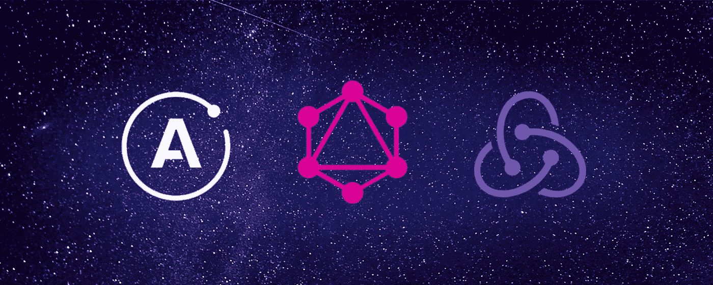

# 阿波罗客户端与 Redux:学习和经验

> 原文：<https://javascript.plainenglish.io/apollo-client-vs-redux-learnings-and-experience-c116d139ca0f?source=collection_archive---------14----------------------->



不断变化的前端开发世界继续发展，并引入了许多不同的库来解决您的问题。随着 GraphQL 越来越受欢迎，围绕它的工具和库也在变化。最近，我帮助编写了一个只与 GraphQL 后端交互的新应用程序，并在我们的 React 前端应用程序中使用 Apollo Client (AC)而不是 Redux 进行交互。我以前用 Redux 写过很多 javascript 应用，下面是我的一些经验。

*免责声明:比较这两个库假设您使用的是 GraphQL 后端。Apollo Client 不能与其他类型的后端一起工作，在这种情况下，它不是 Redux 的可行替代方案。*

## **内置生命周期管理**

AC 在其`useQuery`和`useMutation` 函数中内置了许多方便的状态，redux 要么需要手动操作，要么需要一个库来复制。

```
// Apollo's built in loading/data/error responses 
const [getData, { loading, data, error }] = useQuery(MY_QUERY)
```

虽然 redux 没有内置这些功能，但是您可以在 Redux 的 reducers 和 actions 中构建状态，或者使用 Redux 的一些插件。

## **数据的严格形状**

AC 的一个主要优势是它能非常紧密地跟踪你的 GraphQL 存储和它的形状。这意味着不需要创建减速器，也不需要定义你的商店的形状。AC 让您确信，如果不更新您的 GraphQL 类型或您的[类型策略](https://www.apollographql.com/docs/react/caching/cache-configuration/#typepolicy-fields)，您的商店形状*不会被更改*。Redux 的要求足够宽松，如果您没有遵循良好的实践，您可以随意改变状态。

由于 AC 存储的类型化性质，它还提供了一些类型安全层。在我的例子中，我们使用了 React + Javascript 前端，但是类型安全也可以通过在前端使用 Typescript 来实现。

## **插件支持差**

AC 目前不支持插件，而 redux 有一个相当健壮的插件生态系统。从我的经验来看，这个图书馆并没有留下太多需要填补的空白。redux 中的一个常见插件是 [thunk](https://github.com/reduxjs/redux-thunk) ，它提供了与你的商店异步交互的能力。通过 AC 对钩子的使用和不同的“响应状态”(加载、数据、错误，甚至[乐观 UI](https://www.apollographql.com/docs/react/performance/optimistic-ui/#gatsby-focus-wrapper) )，现代前端应用程序的许多常见需求都得到了处理。

## **到期日**

AC 是新的，这个项目出现的时间不长，它与另一项新技术(GraphQL)紧密耦合。考虑到这两个限制，整体潜在的开发者基数会因此变小。这意味着文档不再流行，社区仍在增长，最重要的是，库本身仍在经历变化。Redux 更老，使用更广泛的后端，并因此拥有强大的社区。对于刚开始从事前端开发的人来说，选择 Redux 可能是更好的途径，因为它提供了大量的支持。

AC 有更大的进入壁垒，因为它不是那么微不足道的。你不能简单地把任何前端连接到任何后端，redux 为你提供了这种自由，因为它不像 AC 那样固执己见。

## **总结**

Redux 可能不会很快去任何地方。它是一个广为人知的、在众多前端框架中普遍使用的框架。这给了它巨大的优势，但是，它确实需要更多的设置和管理才能正常工作。AC 解决了许多常见的前端问题，但是将您与 GraphQL 后端紧密耦合在一起。下次你有一个要写的应用程序时，如果你幸运地只需要一个 GraphQL 后端来交互，AC 值得一试。

感谢阅读！
帕特