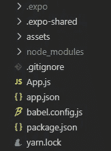

# 移动应用程序开发并不难——下面是作为编程学生如何制作一个应用程序

> 原文：<https://javascript.plainenglish.io/app-development-isnt-hard-here-s-how-to-make-an-app-as-a-programming-student-ba0671896128?source=collection_archive---------5----------------------->

*使用 React Native 和 Expo，每个人都可以创建应用程序！*


Photo by [Tran Mau Tri Tam](https://unsplash.com/@tranmautritam?utm_source=unsplash&utm_medium=referral&utm_content=creditCopyText) on [Unsplash](https://unsplash.com/s/photos/app-development?utm_source=unsplash&utm_medium=referral&utm_content=creditCopyText)

作为一名新的程序员，移动应用程序开发过去非常难进入。您需要了解诸如 Java 之类的语言、使用 XML 的样式，以及诸如适配器和单件之类的技术。你可以使用 Cordova 开发应用程序，Cordova 使用通用的 web 开发语言，但是性能不如 native。

谢天谢地，这种情况已经改变了。React Native 彻底更新了游戏环境。后来，世博会让我们创建应用程序变得更加容易。

然而，世博会也有它自己的缺点。它相当庞大，并且限制了某些库(如 Realm)的使用。**这对新开发人员来说不是问题，不应该让你害怕使用它**。

# 装置

您需要将 [Node.js](https://nodejs.org/en/) 与 [NPM](https://www.npmjs.com/) 一起安装，以安装 Expo 和 React Native 运行所需的包。当您使用 Expo 启动一个新项目时，这大部分会自动发生。

```
npm install -g expo-cli
```

全球安装 Expo CLI 工具。有了这个，你可以在你的电脑上的任何地方执行 Expo 命令。例如，在项目文件夹中创建一个新的 Expo 项目。

对于 Expo 的应用程序开发，这是您需要开始的所有设置。

通过运行 Expo 的`init`命令创建一个新项目，并选择您需要的任何选项。使用一个**空白**项目是最容易学习的，并使用 Expo 移动应用程序进行轻松开发(下一章将详细介绍该应用程序)。

```
expo init YourProjectName
```

*   空白项目是 Expo 的默认项目。这些应用程序使用了 Expo 的所有特性，并创建了一个最小的工作应用程序供您运行。它贯穿于应用程序中。
*   裸项目只使用最少的资源来创建应用程序。这些并不具备 Expo 的所有特性，但当你对应用程序开发越来越感兴趣，并希望在软件包方面有更多选择时，这些特性是很好的学习材料。
*   Typescript 版本只是使用 TypeScript 而不是普通的 JavaScript。这对于您可能想要使用 TS 的所有原因都是有用的。

# 运行应用程序

正如我之前提到的，Expo 可以通过手机上的应用程序运行。这款应用可以从 [Expo](https://expo.io/) 网站或 App Store / Play Store 下载。

当您使用您的`package.json`中的 NPM 脚本运行一个项目时，您的终端将打开一个网站，上面有一个二维码和一些其他指标，如日志。

```
npm run start
```

*   在 Android 上，这款应用内置了二维码扫描仪。
*   在 iOS 上，您需要使用本机的摄像头应用程序扫描代码。如果您扫描代码，它会弹出一个窗口或提示，您可以轻按。然后，它会将您重定向到 Expo 应用程序，并启动您的应用程序。

***注意:这需要手机和电脑连接到同一个 wifi！***

最初构建应用程序可能需要一些时间。如果它真的花了太长时间，您可能必须尝试通过再次扫描代码或重置您工作的终端来重新启动加载过程。

*对于仿真器，查看* [*单据*](https://docs.expo.io/guides/) *。几乎是一样的。*

# 发育

一个默认的世博会项目有相当多的文件。但我们只需要担心几个。



*   以点(.)开头的文件夹。)都是为了世博会，我们不需要担心它们。
*   [资产文件夹](https://docs.expo.io/versions/latest/sdk/asset/)用于图像和其他资产。这是针对反应原生`Image`元素的。
*   节点模块是一个由我们的包管理器 NPM 生成的文件夹。我们不会直接更改此文件夹中的任何内容。它将包含我们使用 NPM 添加的所有包。
*   Gitignore 用于 GitHub 和其他版本控制存储库。它将包含我们不希望在报告中出现的所有文件和文件夹名称。
*   `App.js`是我们应用的核心。当我们运行应用程序时，它会调用该文件。默认情况下，它只有一些文本、状态栏和一些样式。
*   我们现在不需要担心巴贝尔或纱。
*   `App.json`文件包含一些我们不需要担心的设置。
*   最后，`package.json`是我们包经理的心脏。它包含我们添加的所有包和库，任何希望我们的代码安装正确版本的正确包的人都可以使用它。它还包含我们的 NPM 命令。

当我们第一次打开`App.js`时，你会看到非常基本的反应代码。如果您是第一次接触反应，请访问反应和本土反应网站。

前三行从我们的节点模块导入包。我们从 Expo 中加载了一个状态栏元素，从 reactor 中加载了所有内容，并从 React Native 中加载了一些模块，这些模块将被转换为 iOS 或 Android 中的本机元素。

如果你有一些 React 的经验，你可能想知道为什么我们不像你在 web 开发中那样使用`h1`或`div`元素，我们需要使用 React Native 创建的[元素，它可以正确地转换为原生元素。这需要一些时间来适应，但它会点击相当快。](https://reactnative.dev/docs/components-and-apis)

尝试添加新的“组件”，或通过导入它来添加元素，或通过添加另一个文本组件来添加更多文本。

# 结论

这些是创建应用程序的基本步骤。如果你想将应用上传到应用商店，你仍然需要构建它并将其部署在商店上。这个过程在[博览会](https://docs.expo.io/distribution/introduction/)的文件中有描述。

非常感谢您的阅读，祝您度过美好的一天。

*更多内容请看*[***plain English . io***](http://plainenglish.io/)