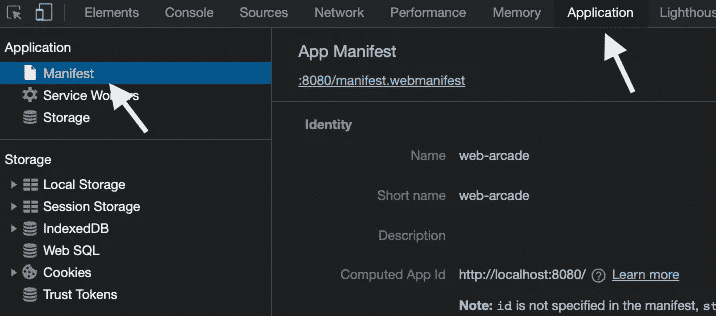

# 如何在 PWA 中创建和使用应用程序图标

> 原文：<https://javascript.plainenglish.io/app-icons-in-a-pwa-8fb775207ad7?source=collection_archive---------2----------------------->

## 探索在渐进式 Web 应用程序(PWA)中创建和使用应用程序图标。阅读关于 iOS 上 Safari 的 PWA gotcha。使用 Chrome 开发工具来简化验证和调试。

## 渐进式 Web 应用程序带来更好的用户体验


An App Icon

应用图标对品牌推广至关重要。这是用户交互的第一件事，甚至在启动你的应用之前。在移动设备上，图标放在主屏幕上。图标的高质量图形增加了用户点击打开应用程序的直觉。

对于移动应用开发者来说，在打包应用时构建和包含图标是很自然的事情。随着 PWA(渐进式 web 应用程序)的出现，图标在 Web 清单文件中是可配置的。

渐进式网络应用允许在设备上安装网络应用。您可以在移动主页屏幕上创建快捷方式。轻按“打开”图标，在自己的窗口中启动应用程序。你可以隐藏浏览器控件，提供应用程序的体验。

# 创建应用程序图标

对于应用程序图标，web 清单允许配置各种大小的图标。在本例中，您将看到八种不同的图像尺寸，适合各种设备外形和用途。您可以创建单个图形，并使用工具来生成图像。下面是一些工具的例子，这些工具可以生成 PWA 所需的所有尺寸的图标。

*   PWA 建造者—[https://www.pwabuilder.com/imageGenerator](https://www.pwabuilder.com/imageGenerator)
*   PWA 应用图标生成器—【https://tools.crawlink.com/tools/pwa-icon-generator/ 

接下来，在 web 清单中提供图标的相对路径。考虑下面的代码示例，

```
{
    "name": "Sample",
    "theme_color": "#1976d2",
    "background_color": "#fafafa",
    "display": "standalone",
    "scope": "./",
    "start_url": "./",
    **"icons": [{
            "src": "assets/icons/icon-72x72.png",
            "sizes": "72x72",
            "type": "image/png",
            "purpose": "any"
        },
        {
            "src": "assets/icons/icon-96x96.png",
            "sizes": "96x96",
            "type": "image/png",
            "purpose": "any"
        },
        {
            "src": "assets/icons/icon-128x128.png",
            "sizes": "128x128",
            "type": "image/png",
            "purpose": "any"
        },
        {
            "src": "assets/icons/icon-144x144.png",
            "sizes": "144x144",
            "type": "image/png",
            "purpose": "any"
        },
        {
            "src": "assets/icons/icon-152x152.png",
            "sizes": "152x152",
            "type": "image/png",
            "purpose": "any"
        },
        {
            "src": "assets/icons/icon-192x192.png",
            "sizes": "192x192",
            "type": "image/png",
            "purpose": "any"
        },
        {
            "src": "assets/icons/icon-384x384.png",
            "sizes": "384x384",
            "type": "image/png",
            "purpose": "any"
        },
        {
            "src": "assets/icons/icon-512x512.png",
            "sizes": "512x512",
            "type": "image/png",
            "purpose": "any"
        }
    ]**
}
```

# 使用 Chrome 开发工具进行验证



Manifest in the Chrome Dev Tools

Chrome 开发工具的调试功能非常强大。导航到开发工具中的*应用*选项卡。选择*清单*查看关于 web 清单的详细信息。

除此之外，该工具还可以验证应用程序图标图像，并显示警告和错误。考虑下面的例子。它显示图像与指定尺寸不匹配的警告。配置尺寸为 384x384 的图像引用了尺寸不正确的图像。请参见下面的代码片段和错误。

```
{
  "src": "assets/icons/icon-384x384.png",
  "sizes": "384x384",
  "type": "image/png",
  "purpose": "any"
},
```


> 在这里阅读更多关于清单文件和 Chrome 开发工具的信息— [链接](https://medium.com/nerd-for-tech/visualize-application-manifest-ebd771b325d8)

# 在 iOS 上使用 Safari


iOS 上的 Safari 尚不支持显示清单中配置的图标。它生成页面的预览并将其用于书签。

以下是 WebKit 的一个活跃 bug—[链接](https://bugs.webkit.org/show_bug.cgi?id=183937)。

但是，您可以在 Index.html 使用链接元素来显示您的图标图形应用程序图标。链接元素通常用于提供到外部或内部资源的链接。在这种情况下，它链接到一个应用程序图标。注意，图标使用了一个 *rel* value(关系) *apple-touch-icon，*表示主屏幕上的应用图标。

```
<head>
  <meta charset="utf-8">
  <title>Sample</title> <link **rel="apple-touch-icon"** sizes="120x120" href="assets/icons/icon-144x144.png" /> <link **rel="apple-touch-icon"** sizes="152x152" href="assets/icons/icon-152x152.png" /></head>
```

# 参考

*   清单上的 MDN Web 文档-【https://developer.mozilla.org/en-US/docs/Web/Manifest 
*   博客-可视化应用程序清单—[https://medium . com/nerd-for-tech/visualize-Application-Manifest-EBD 771 b 325d 8](https://medium.com/nerd-for-tech/visualize-application-manifest-ebd771b325d8)

生成应用程序图标的工具

*   PWA 建造商—[https://www.pwabuilder.com/imageGenerator](https://www.pwabuilder.com/imageGenerator)
*   PWA 应用程序图标生成器—[https://tools.crawlink.com/tools/pwa-icon-generator/](https://tools.crawlink.com/tools/pwa-icon-generator/)
*   应用程序图标的 WebKit 的一个活跃的 bug—[https://bugs.webkit.org/show_bug.cgi?id=183937](https://bugs.webkit.org/show_bug.cgi?id=183937)。

*更多内容看* [***说白了就是***](http://plainenglish.io/) ***。*** *报名参加我们的**[***免费每周简讯在这里***](http://newsletter.plainenglish.io/) ***。****