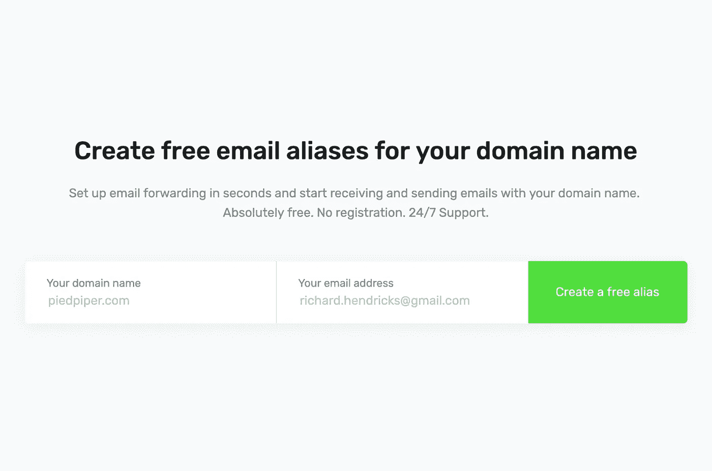
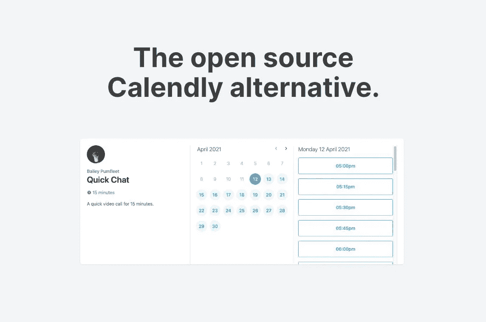
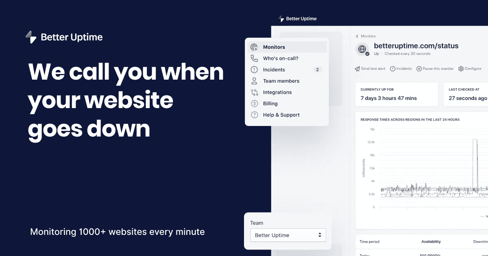

# 作为白手起家的创始人，你需要知道的应用和服务

> 原文：<https://javascript.plainenglish.io/apps-and-services-you-need-to-know-as-a-bootstrapped-founder-ebd56fdb2176?source=collection_archive---------3----------------------->

让我们面对现实吧，在有限的预算下建立一家公司是一项具有挑战性的任务。谢天谢地，有很多应用程序和服务让你的创业生活变得更加容易！今天，我要回顾一下那些让我的引导生活变得更加愉快的服务。

Photo by [Michael Longmire](https://unsplash.com/@f7photo?utm_source=medium&utm_medium=referral) on [Unsplash](https://unsplash.com?utm_source=medium&utm_medium=referral)

# [ImprovMX](https://improvmx.com/)

如果你想给客户留下良好的第一印象，自定义电子邮件地址是必须的！建立自己的电子邮件服务既困难又昂贵，但这正是 ImprovMX 的用武之地。
这是一项免费服务，可以将电子邮件从你自己的自定义域名转发到另一个电子邮件地址。

最棒的是。完全免费！
也想从自己的域名发送电子邮件吗？您可以通过在电子邮件客户端添加别名来轻松设置。

# [坎瓦](https://www.canva.com/)

一个好的公司需要更好的品牌。幸运的是，您可以使用 Canva 的拖放编辑器创建许多设计。他们为你提供数以千计的各种形状和大小的模板。从社交媒体标题到专辑封面，Canva 全都有！

对于不想花太多时间设计的创业者来说，这是一个完美的工具！

# [图玛](https://www.figma.com/)

哦，天啊，我爱死菲格玛了！一个设计工具，你的创造力是唯一的限制。使用这个神奇的工具，你几乎可以创造任何东西。从 UI 到您整个公司的品牌推广，Figma 都能做到！
即使你想和多人一起工作，Figma 也能提供帮助。使用 Figma，您可以与您的队友实时合作。

# [Splitbee](https://splitbee.io/)

你想在你的网站上获得最好的见解，这就是你绝对需要 Splitbee 的地方！多亏了这个友好的分析工具，你可以实时检查你网站的哪些部分最受欢迎。
他们甚至提供了自己的节点包，你可以将它与你的应用程序的业务逻辑挂钩，以跟踪更多的数据。通过这种方式，你可以很容易地接触到优秀的客户，并从他们那里获得反馈。

# [线性](https://linear.app/)

线性是未来的项目管理工具。提供与 Github 和 Slack 等平台的惊人集成。有了 Linear，您的团队和您可以清楚地了解需要发生什么以及谁负责这项任务。
你知道吗，Linear 甚至为 MacOS 提供了原生桌面应用程序？让您的团队保持同步，提高工作效率。

# [Cal.com(日历)](https://cal.com/)

努力管理你的时间和约会？你正在寻找 Cal.com，免费约会策划。没有人喜欢来回发邮件预约。只要把你的 cal.com 链接发给你的客户、代表，让他们直接在你的谷歌或 iCloud 日历上预约就行了。

# [更好的正常运行时间](https://betteruptime.com/)

如果你的主要业务是应用程序，那么你对用户透明是很重要的。您可以使用更好的正常运行时间来轻松创建您自己的状态页面，用户可以在其中检查您的服务是否仍在运行。
他们甚至允许你添加自己的子域，这让它看起来非常时尚和专业。

祝你今天成功💙

*更多内容尽在*[***plain English . io***](http://plainenglish.io/)