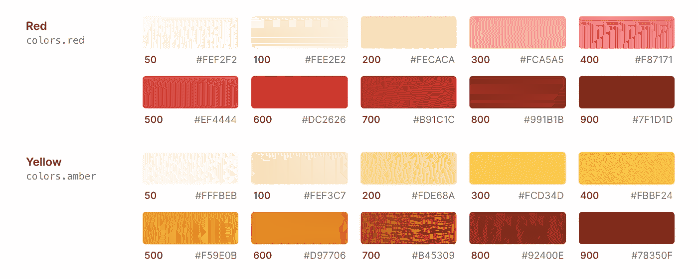
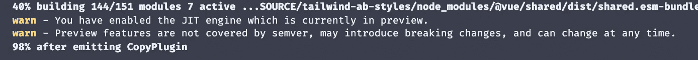

# 顺风 JIT 的任意样式

> 原文：<https://javascript.plainenglish.io/arbitrary-styles-with-tailwind-jit-1c2a87d61290?source=collection_archive---------9----------------------->

## 使用顺风 JIT 为类自定义值。


[Tailwind](https://tailwindcss.com/) 是一个实用的 CSS 框架，它让开发者**完全**控制 web 组件的样式。与组件框架或库不同，Tailwind 不限制您使用预先存在的组件，这些组件可以通过 props 和 options 进行定制，有了 Tailwind，您可以使用最小形式的实用程序类从头开始构建。

> 嘘！但是我宁愿让别人来做这项工作，我更喜欢组件库。嗯，还有[无头 UI](https://headlessui.dev/)——完全非风格化的 UI 组件，与 Tailwind CSS 很好地集成(他们的话，不是我的)。

上个月 [Adam Wathan](https://twitter.com/adamwathan) (顺风的创造者)宣布了对顺风 CSS 的最大更新— [顺风 JIT](https://github.com/tailwindlabs/tailwindcss-jit) 。

这次更新的一个主要亮点是你现在可以编写更少的自定义 CSS。让我们来理解它是如何工作的。

使用 Tailwind，我们通常从在`tailwind.config.js`文件中设置我们的主题和变体开始。大概是这样的:

```
module.exports = {
  theme: {
    colors: {
      gray: '#CFD8DC',
      blue: '#2196F3',
      red: '#EF5350',
      pink: '#F48FB1',
    },
    fontFamily: {
      sans: ['Graphik', 'sans-serif'],
      serif: ['Merriweather', 'serif'],
    },
    extend: {
      spacing: {
        '128': '32rem',
        '144': '36rem',
      },
      borderRadius: {
        '4xl': '2rem',
      }
    }
  },
  variants: {
    extend: {
      borderColor: ['focus-visible'],
      opacity: ['disabled'],
    }
  }
}
```

“主题”部分是我们定制与我们网站的视觉设计/设计系统相关的任何东西的地方。在这里，我们可以指定调色板、字体系列、边框半径大小等。

无需定制，Tailwind 为所有这些样式属性都提供了特定的值，例如[颜色](https://tailwindcss.com/docs/customizing-colors)。



看着这张图表，我们知道我们可以定制 10 种颜色的“红色”,然而，当我们需要额外的一种或两种颜色时，问题就来了(贪得无厌的人类，嗯？).当然，Tailwind 的配置文件可以帮助我们实现这一点:

```
// tailwind.config.js
module.exports = {
  theme: {
    extend: {
      colors: {
        red: {
          350: '#E53935'
        },
      }
    }
  }
}
```

如果我们只在应用程序的一两个部分需要这些阴影，并且它们对于主题化不是必需的，我们就不应该这样做。这就是使用 Tailwind JIT 编译器的任意样式的用武之地。使用任意样式，您可以在元素上指定您需要的超级特定的样式，而无需在配置文件中更新它…是的，Sam，您现在可以去掉那些内联样式属性了👀。

让我们来测试一下。我将启动一个 Vue 项目并安装 Tailwind，之后，我们将设置 JIT 模式。请注意，您可以使用任何 Javascript 前端框架来实现这一点。顺风是框架不可知的。

> 嘶！这是顺风的 [Vue](https://devjavu.space/post/how-to-setup-tailwind-css-in-vue-3/) 和[无框架](https://devjavu.space/post/getting-started-with-tailwind-css/)设置:

```
$ vue create tailwind-ab-styles
```

导航到项目目录:

```
$ cd tailwind-ab-styles
```

安装和设置顺风 CSS。以下是在 Vue 项目中设置 Tailwind CSS 的快速指南:

[](https://devjavu.space/post/how-to-setup-tailwind-css-in-vue-3/) [## 如何在 Vue 3 | Devjavu 中设置 Tailwind CSS

### 顺风 CSS 是这个街区最新最酷的孩子之一。作为一个实用程序库，Tailwind 允许您构建 UI…

devjavu.space](https://devjavu.space/post/how-to-setup-tailwind-css-in-vue-3/) 

设置 Tailwind 后，可以通过更新 tailwind.config.js 并将“mode”属性更改为“JIT”来启用 JIT。

```
*module*.*exports* = {

  mode: 'jit',  // update this line
  purge: ['./index.html', './src/**/*.{vue,js,ts,jsx,tsx}'],
  darkMode: false, *// or 'media' or 'class'

  ....*};
```

让我们启动 Vue 服务器，看看这是什么样子。

```
yarn serve
```

当您启动服务器时，您可能会从 bundler 那里得到一个类似的警告，关于当前在 preview 中的 JIT 引擎。



# 使用任意样式

我已经将 App.vue 文件更新为一个简单的带有基本顺风类的标记。

```
<template> <div *class*="justify-center flex bg-yellow-300 items-center h-screen"> <div *class*="text-4xl">
      Hello 👋🏼
    </div> </div></template><script>
export default {
  name: 'App',
};
</script>
```

结果:


在 notice 上面的标记中，我们有一个文本“Hello ”,它周围有一个类“text-4l”的 div。Tailwind 提供了 10 个我们可以使用的“字体大小”实用程序类，它们的值从 0.75 雷姆到 8 雷姆不等。假设我们只想让这个文本的大小为 9rem，对于任意样式，我们不必为这种情况配置另一个实用程序类，相反，我们这样做:

```
<div *class*="text-[9rem]">
     Hello 👋🏼
</div>
```

这就是你要的，一个 9rem 大小的巨大文本。这让我们免去了用内联样式乱丢标记的痛苦。


让我们在“hello”文本下面添加一个框，并使用任意值设置它的宽度、高度和背景颜色。

```
 <div *class*="w-[300px] h-[200px] bg-[#FFECB3] rounded-[20px] ml-[40px]"></div>
```

这应该给我们一个 20px 边框半径的浅色框。


我们也可以将它用于屏幕变体。

```
<div *class*="w-[300px] h-[200px] md:bg-[#FFECB3] rounded-[20px] ml-[40px] lg:ml-[-400px] lg:mb-[430px]"></div>
```


这也适用于网格和布局，查看[文档](https://tailwindcss.com/docs/just-in-time-mode)了解高级应用。

## 限制

> 您只能`@apply`作为核心的一部分、由插件生成或者在`@layer`规则中定义的类。你不能`@apply`没有在`@layer`规则中定义的任意 CSS 类。—文档

@apply 是一个指令，用于将现有的实用程序类内联到您的自定义 CSS 中。目前，这是唯一已知的对任意值的限制。享受摆弄它的乐趣。

干杯☕️

> [**在黑暗模式下阅读本文**](https://devjavu.space/post/arbitrary-styles-with-tailwind-jit?isDark=true) 🌙，轻松复制粘贴代码示例，在 [**Devjavu**](https://devjavu.space/) 上发现更多类似这样的内容。

*更多内容看*[***plain English . io***](http://plainenglish.io)