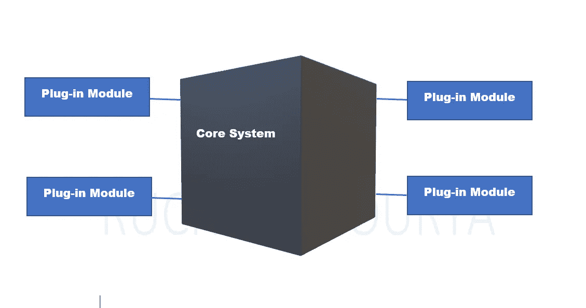
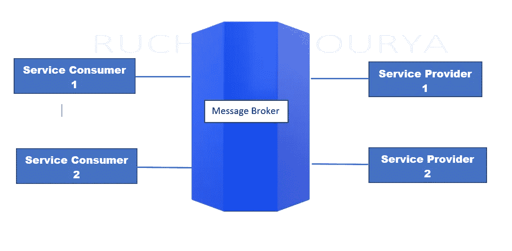
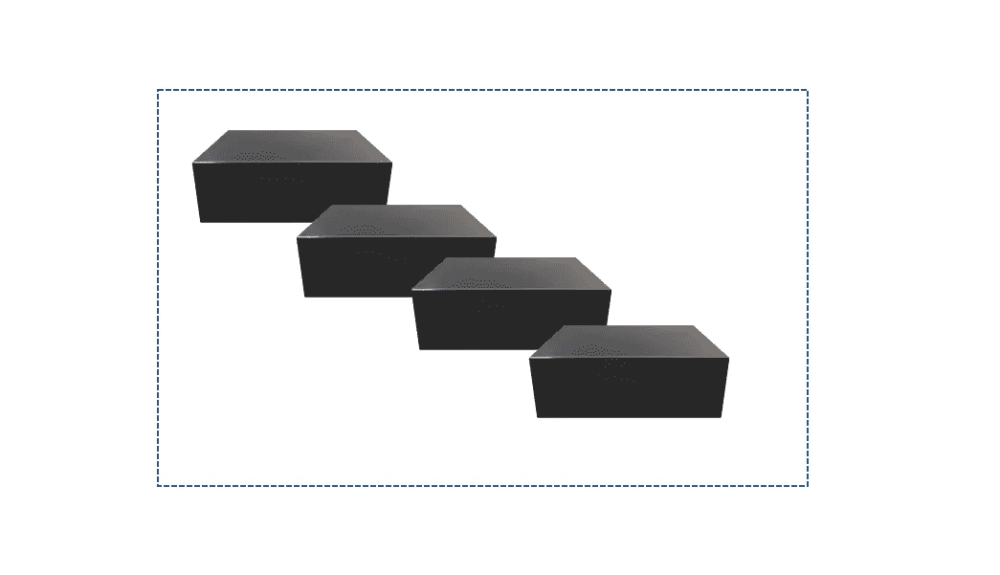

# 软件架构中的架构模式

> 原文：<https://javascript.plainenglish.io/architectural-pattern-in-software-architecture-f77bd8cb0601?source=collection_archive---------8----------------------->

Photo by [Luke Peters](https://unsplash.com/@lukepeters?utm_source=medium&utm_medium=referral) on [Unsplash](https://unsplash.com?utm_source=medium&utm_medium=referral)

根据维基百科，

“一个架构模式是一个通用的、可重用的解决方案，用于解决给定环境下软件架构中经常出现的问题。架构模式类似于软件设计模式，但范围更广。”

让我们看看一些常见的架构模式，

# **单体建筑:**

在单片架构中，**整个程序是一个大的可执行单元**。有时会指定成千上万行源代码。一个结构良好的整体可以给你需要的效率，代价是非常缓慢和痛苦的部署。

但是整块石头有一个缺点，那就是每个人都不敢碰它，甚至一个小小的变化都会在意想不到的地方引起问题。应该花几个小时的工作可能要花几个星期。

# **微内核(插件)架构:**

微内核(插件)架构**背后的主要思想是将系统的基本功能放入一个独立的可执行文件**。例如，在操作系统中，内核处理虚拟内存和文件系统。其他功能是作为独立的执行单元实现的，它们有效地插入内核来完成它们的工作。

从几个方面来看，微内核体系结构比单片系统更上一层楼。最主要的一点是这些插件在很大程度上是相互独立的。通常，插件不知道其他插件是如何工作的，或者其他插件是否存在。

插件也相对较小，易于编写、调试和维护，所以你不会有找不到东西的问题，也不会有系统复杂到你无法理解的问题。不利的一面是，内核本身，或者更准确地说，内核的 API 非常脆弱。**如果你需要对这些 API 进行必要的修改，所有的插件可能需要重新编写以使用新的 API**。

# 基于消息的架构:

这种架构通过 ***形式化元素之间的通信路径并进一步隔离它们*** 将微内核的概念向前推进了一步。

在基于消息的体系结构中，公共消息总线控制着通信流。每个应用程序都配备了一个所谓的适配器，它在一端与消息总线对话，在另一端与应用程序对话。

在称为发布/订阅模型的另一种基于消息的体系结构模型中，

***发布者发布与特定主题相关的消息*** 。 ***订阅者可以订阅某个主题，并接收来自该主题任意发布者*** 的消息。

基于消息的架构允许系统的组件以极端的方式*隔离。每个组件实际上都是一个独立的小程序，可以独立于其他程序进行维护。那个 ***解耦使得你的系统比一个整体*** 更容易维护，并且它解决了微内核系统的依赖性问题。*

*不利的一面是，消息传递系统很快变得高度复杂，管理这种复杂性非常困难。*

# *微服务和微服务*

*在微服务架构中,**更大的系统由一群非常小的独立服务组成，这些服务以对等的方式合作完成更大的工作**。*

**

*在讨论防御风暴的前一章中，您将把从该练习中出现的代理或实体实现为单独的微服务。这些服务可以分布在一个网络上，甚至是整个互联网上，冗余是内置的。例如，同一服务的许多实例可以并行运行。把这些东西放在一起，你会得到一个非常有弹性的系统，可以轻松处理你施加给它的任何压力。微服务不仅仅是微小的整体。它们必须以一种 ***支持分布式部署和复杂实时交互的方式来设计。****

*微服务应该是*

*   *可独立部署*
*   *翻译成几百行源代码*
*   *以隐藏所有实现细节的方式编写*
*   *设计用于不可靠的网络环境*
*   *非常明显，他们记录他们做的每一件事。您可以实时监控它们的运行情况。所以如果服务失败了，你知道他们失败的原因。*

*当您实现微服务时，主要的问题通常与服务如何相互通信有关。人们采取两种主要的方法。*

*第一种方法是让每个服务成为一个小型的基于 HTTP 的 web 服务，您可以使用类似 REST 的协议与之对话。基于 post 的 API 的主要缺点是，它本质上是同步的，相当笨重，并且有几种难以解决的错误模式。*

*第二种方法是消息传递，而不是 HTTP。*

*微服务有许多优势，特别是在敏捷环境中，您需要不断地对少量服务进行小的更改，并快速部署它们。*

*微服务的主要缺点是设计和运行时都很复杂 。让多步操作在整个网络中可靠地工作是一件非常困难的工作。**微服还自带速度命中**。与其他替代方案相比，网络只是速度较慢。*

# *反应式和精心设计的系统*

*在一个反应式的编排系统中，系统是发布事件而不是发出请求。它向全世界广播该事件，任何对该事件感兴趣的下游服务都可以做任何需要做的事情来处理该事件。*

*反应式和精心设计的系统比微服务架构更快。所有下游处理很容易并行完成，因此最坏情况下的延迟通常是最慢的下游处理的处理时间。*

*我们在这里讨论了一些架构模式，如果你想了解更多，你可以看看 Grady Booch、Mark Richards、Simon Brown 和 Neal Ford 的作品。*

**更多内容请看*[***plain English . io***](https://plainenglish.io/)*。报名参加我们的* [***免费周报***](http://newsletter.plainenglish.io/) *。关注我们关于*[***Twitter***](https://twitter.com/inPlainEngHQ)*和*[***LinkedIn***](https://www.linkedin.com/company/inplainenglish/)*。加入我们的* [***社区不和谐***](https://discord.gg/GtDtUAvyhW) *。**