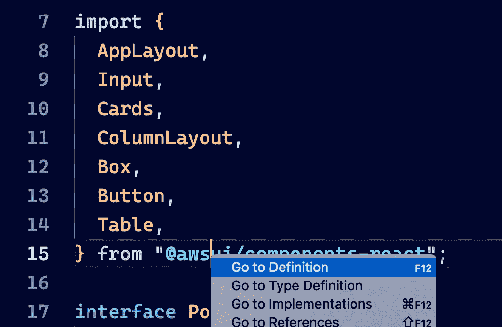

# TypeScript 类型本身是否提供了足够的文档？

> 原文：<https://javascript.plainenglish.io/are-typescript-types-alone-enough-documentation-e09a524716bf?source=collection_archive---------17----------------------->

这里有一个有趣的问题；您的 TypeScript 项目中的类型本身是否足够文档化，以允许某人学习该库？

当我看到亚马逊为 AWS 发布了 React UI 库时，我问了自己这个问题。他们只发布了代码和类型脚本类型。没有文件。没有故事书或 styleguidist。只有代码和类型。

现在我喜欢钻研 UI 库。这是一个有趣的挑战。我可以只从源代码学习库吗？所以我用`typescript`模板创建了一个 React 应用，然后安装了`@awsui/components-react`库，开始了我的侦查。

首先要意识到的是，VS Code 热爱 TypeScript，在这个旅程中，它将是你无价的伙伴。例如，您可以右键单击导入并询问定义，如下面的屏幕截图所示。



Using VS Code to navigate to the definitions

这将把您带到列出所有组件及其属性的中央定义文件。


Just a few of the fascinating components in the AWS UI toolkit

头奖！现在我知道里面有什么了。但是怎么用呢？

# 获得正确的布局

立刻吸引我眼球的是`AppLayout`,因为，实际上，在 UI 库中有两种类型的玩具；布局组件和交互组件。第一项工作是创建布局，第二项工作是把东西放到布局中。

命名很重要，对吧？`AppLayout`。听起来不错！我正在做一个`App`，检查。而且我需要一个`Layout`，双重检查。`AppLayout`正是！这也有助于它是按字母顺序排列的。

所以我在页面上放了一个`AppLayout`，马上我得到了一个三列布局，左边是一个可折叠的`navigation`面板，右边是一个`tools`面板，中间是一个`content`部分。我怎么知道的？因为类型！


The types for content, navigation and tools properties on the AppLayout component

因此，这不仅告诉我哪些部分可用，还告诉我他们期望的内容类型，在本例中是基本上可以在 React 中呈现的`ReactNode`类型。

我用以下代码替换了封装的`App`组件的全部内容:

```
function App() {
  return (
    <AppLayout
      navigation={<div>Navigation</div>}
      content={<div>Content</div>}
      tools={<div>Tools</div>}
    />
  );
}
```

然后我运行`yarn start`,马上我得到了一个看起来相当不错的响应布局，有三列和可折叠部分。我去赛马了！

# 正如所料，除了一些例外

我不是一个只玩组件的人，我想做一些真实的东西。所以我创建了一个口袋妖怪滤镜应用程序。有些事情，比如`Button`非常简单。

```
<Button onClick={() => alert("hello!")}>Say Hello</Button>
```

这是现成的，但默认情况下，按钮本身并不十分吸引人。再一次，打字稿来拯救！


The potential variants of Button styling

使用 VSCode 中的`Go To Definition`,我可以选择一个`Button`组件，并一直钻下去，直到我找到了`ButtonProps`,它向我展示了一个`variant`属性，我可以用它来选择不同风格的按钮。我最终选择了`link`。

另一个时刻发生在我使用`Input`组件的时候，正如你可能猜到的，它是一个文本输入。一切都进行得很顺利，直到我到达`onChange`，那里的活动结构与我们预期的有点不同。


Hinting on the event data from onChange

在这种情况下`event.target.value`不存在。又一次，VS Code 来拯救我，我找到了我要找的机器人`event.detail.value`。

# 寻找新的模式

最终我需要贴一张口袋妖怪的清单。我不仅找到了一个很好的`Cards`组件来做这件事，我还找到了一个定义通用 React 组件的好方法。看看这个。


TypeScript generics for React components

所以你给了`Cards`一个`items`数组，然后你提供了`content`函数来呈现每一项的内容。

无论如何，因为 TypeScript，AWS 团队将`Card`定义为泛型，当您为该`items`属性传入一个数组时，TypeScript 会自动推断该数组的类型，然后根据需要将它应用到属性定义的其他部分。在您的`content`函数中，您可以从项目数组中获得类型安全和类型提示。作为消费者，你不需要做任何额外的工作来实现这一点。它只是免费工作，正如你所期望的那样。

看到这一幕是旅途中最激动人心的发现时刻。出于这样或那样的原因，我还没有真正考虑过对 React 组件使用泛型。所以这是一个真正的“啊哈！”我从**读代码**得到的瞬间。这不是我从文档中得到的东西(很可能)。

除了泛型之外，看到这种向组件提供一些数据和一个呈现函数的模式(这是整个工具包中的一种模式)也是非常好的。我以前在像苹果的 iOS 列表组件这样的工具包中见过它。但是我很少在网上看到它，我认为这是一个很好的架构模式，值得更广泛地使用。

# **视频版**

如果你想看我对 AWS UI 工具包的探索，请查看 YouTube 版本。

Hacking with the AWS React UI Toolkit

# 结论

我从这次侦查经历中学到的两大收获是:

*   **学会阅读代码** —代码就是真理。学习如何阅读别人的代码可以成为信息、灵感、教育等所有好东西的来源。更好的是，当你建立起代码阅读能力时，你可以开始把 Github 不仅仅看作是一个“抓取代码”的地方，而是宇宙中已知的最好的代码阅读库。
*   **打字稿就是文档**——当然打字并不能回答所有的问题。但是它能很快回答很多问题，而且是免费的。所以成本/收益比是突出的。各位，打字稿是值得的。
*   **奖励:命名真的很重要** —我只是触及了这个库的皮毛。有成吨的组件。唯一让我纠结的时刻是这些组件的命名。比如说；什么是“瓷砖”？(原来是单选按钮)。这并不是 AWS 的人的错。命名很难。但是作为前端开发人员，在某种程度上，规范我们对 UI 元素的命名可能会对我们有益。