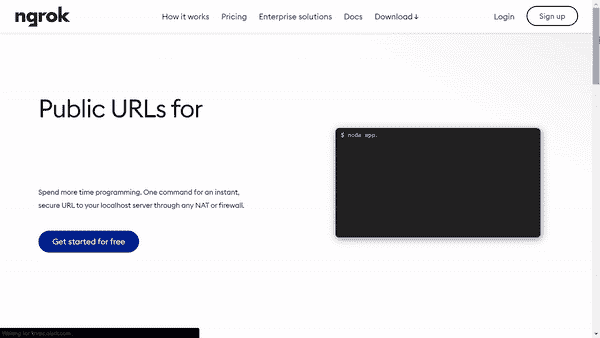
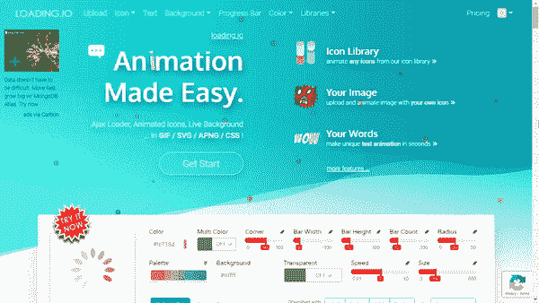
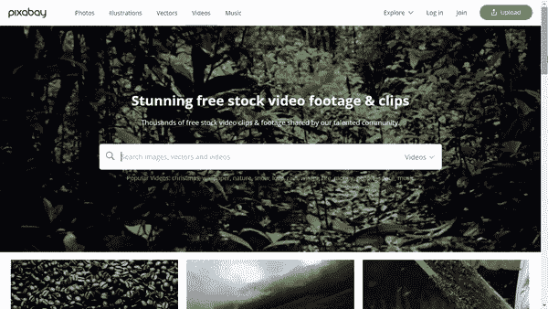
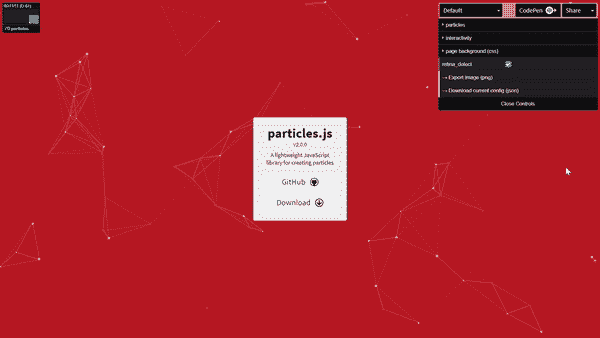
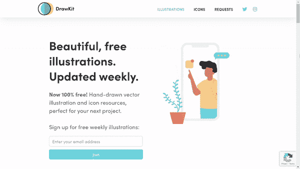

# 作为一名网站开发人员，5 种工具将提高你的工作效率

> 原文：<https://javascript.plainenglish.io/are-you-a-web-developer-here-are-5-tools-that-will-save-you-5-hours-per-week-f599755ac9bf?source=collection_archive---------24----------------------->

作为一名网页开发人员，你想提高你的工作效率吗？试试这 5 个免费资源，你现在就可以开始使用了！

Photo by [Marvin Meyer](https://unsplash.com/@marvelous?utm_source=unsplash&utm_medium=referral&utm_content=creditCopyText) on [Unsplash](https://unsplash.com/s/photos/productivity?utm_source=unsplash&utm_medium=referral&utm_content=creditCopyText)

# **1。ngrok**

[***ngrok***](https://ngrok.com/) 让你用最少的努力将运行在本地机器上的 web 服务器暴露到互联网上。

使用[***ngrok***](https://ngrok.com/)*来:*

*   *在家运行个人云服务。*
*   *不部署演示网站。*
*   *在您的开发机器上构建 webhook 消费者。*
*   *测试连接到本地运行的后端的移动应用程序。*
*   *现场部署的连接设备的稳定地址。*

# *2.loading.io*

*[***loading . io***](https://loading.io/)为动画生成提供了几种不同的格式。*

**

*用[***loading . io***](https://loading.io/)可以:*

*   *使用图标库中的动画图标。*
*   *上传图片并制作动画。*
*   *制作文本动画。*

# *3.皮沙贝*

*[***Pixabay.com***](https://pixabay.com/)提供超过 190 万+的高质量股票图片、视频和音乐。*

**

# *4.粒子. js*

*[***particle . js***](https://vincentgarreau.com/particles.js/#default)是由*Vincent Garreau 开发的用于创建粒子的轻量级 JavaScript 库。**

****

**您可以直接在网站[***particle . js***](https://vincentgarreau.com/particles.js/#default)***，*** 上配置粒子，更改粒子的数量、颜色、形状、大小、不透明度和交互性。然后，可以将定义的配置导出为 JSON 文件，并在您的项目中使用。**

# **5.绘图工具包**

**[***draw kit . io***](https://www.drawkit.io/)是一个自由矢量 SVG 插图库，可用于您的下一个项目。不需要归属！**

****

**试试这些免费资源，让我知道你对它们的想法！**