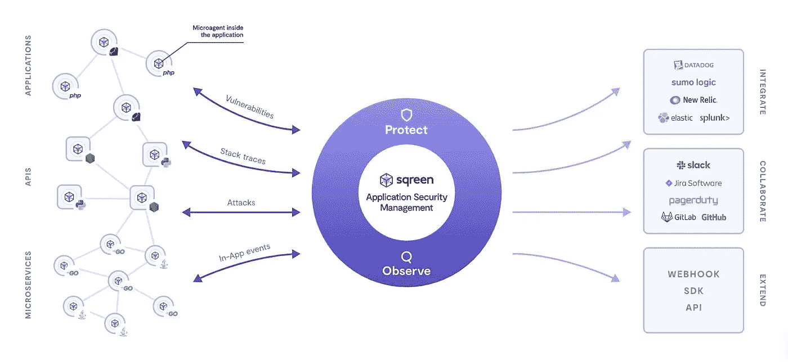

# 你做了足够的工作来保护你的网站吗？

> 原文：<https://javascript.plainenglish.io/are-you-doing-enough-to-protect-your-website-d1b952d6bdfd?source=collection_archive---------10----------------------->

Photo by [Thom Milkovic](https://unsplash.com/@thommilkovic?utm_source=medium&utm_medium=referral) on [Unsplash](https://unsplash.com?utm_source=medium&utm_medium=referral)

作为开发人员或客户，我们的主要难题是保护我们的网站。因此，为了实现这一点，我们大多数人都在使用后端，并使用认证机制、加密、令牌、访问控制等。但是我们对网站的前端安全性给予了适当的关注吗？

不是吧？所以首先让我们讨论一些可能的前端攻击。

**跨站点脚本(XSS)攻击—** 通常情况下，浏览器会运行作为 web 应用程序加载的脚本包。因此，在这些类型的攻击中，黑客会在 web 应用程序脚本包中输入恶意脚本。然后，在不知道原因的情况下，浏览器将执行它。

**跨站请求伪造(CSRF)——**这种攻击有点棘手，因为它会伪装受害者。通常，当用户通过某个网站的身份验证时，对该网站发出的所有请求都将拥有与该用户帐户相关联的凭据。例如会话 cookie、IP 地址等。因此，如果攻击者以某种方式(使用伪造的电子邮件发送给受害者)将这个请求发送到网站后端，那么服务器将无法区分这个请求。因此，攻击者将试图改变帐户的状态，如更改电子邮件或密码。

**DOS(拒绝服务)攻击—** 这种攻击只需在很短的时间内(数毫秒)向服务器发出许多请求即可实现。这将使服务器缺乏资源来平衡流量，最终服务器将对用户不可用。但是你认为，这将简单地通过用如此多的请求阻止原始 IP 来防止吗？是的，那是一个可能的解决办法。

但是如果它是由多种来源制成的呢？那就没你看的那么简单了。这些被称为 **DDOS** ( **分布式拒绝服务攻击**)攻击。

现在我们可以找到一些工具来阻止这些前端攻击，并减轻网站安全的风险。

# jscrambler

我个人推荐这样做，因为我已经在自己的工作中使用了这个工具，它很简单。这个工具在两个方面很有帮助，分别是 javascript 安全性和 web 安全性。Javascript 安全性在某种意义上，JavaScript 混淆技术结合了多态行为、密码锁、自我防御功能和威胁监控。Web security 提供对前端攻击的实时客户端监控。

**代码完整性**

*   JavaScript 保护
*   混合/本地代码保护
*   JavaScript 威胁监控

**网页完整性**

*   Magecart 缓解
*   数据泄漏
*   网页监控

source — **Jscrambler** YouTube Channel

更多详情请参考[本](https://docs.jscrambler.com/code-integrity/getting-started)。

# **JSDefender**

这是由[**PreEmptive**](https://www.preemptive.com/company)**公司提供的专业级混淆和 web app 保护系统，是智能应用程序保护的行业领导者。该解决方案将隐藏您的业务逻辑，使黑客无法对代码进行逆向工程。不仅如此，它将减少使用缩小技术的代码大小。**

**source — **PreEmptive** YouTube Channel**

**更多详情请参考[本](https://www.preemptive.com/products/jsdefender/overview)。**

# ****sqreen****

****

**source — [https://www.sqreen.com/platform](https://www.sqreen.com/platform)**

**这是一个具有实时监控系统的现代企业应用程序保护系统。它有三个主要组成部分。**

1.  ****Sqreen Microagent** —这是应用程序中的一个库，充当所有请求及其元信息的监控系统。然后它会把分析后的数据传到云中的 sqreen 平台。**
2.  ****安全引擎—** 这是 web 应用程序的安全层。**
3.  ****Sqreen Platform —** 这是与其他两个组件通信并分析数据以检测异常的云平台。**

**更多详情请参考[本](https://www.sqreen.com/platform)。**

**不仅仅是这些工具，业界还有很多其他工具可以用于 web 应用保护。但是这些工具在工业中使用了很长时间。所以这些都是非常可靠的工具。**

**但是，如果你认为，你的 web 应用程序没有太大的扩展，如果它是一个小的应用程序，因此在这个层次上没有必要使用这些类型的工具。至少在构建应用程序时，您应该尝试关注以下几个方面。**

*   **在开发应用程序时关注安全性。不要等到最后一刻。它将使您进行重大的架构更改来提高安全性。**
*   **尽量使用现代框架(Angular，React，Vue 等。)来创建应用程序，因此他们有内置的 web 保护工具。**
*   **尽量避免典型的 XSS 错误。**
*   **使用 *textContent* 而不是 *innerHTML、*，因为 *textContent* 只能输出文本，不生成任何 HTML。**
*   **使用第三方依赖关系时要小心。**

**这是几个小技巧供你参考，好好利用它们，保护你的 web 应用。**

# **资源**

*   **[https://docs.jscrambler.com/code-integrity/getting-started](https://docs.jscrambler.com/code-integrity/getting-started)**
*   **[https://www.preemptive.com/products/jsdefender/overview](https://www.preemptive.com/products/jsdefender/overview)**
*   **[https://www.sqreen.com/platform](https://www.sqreen.com/platform)**