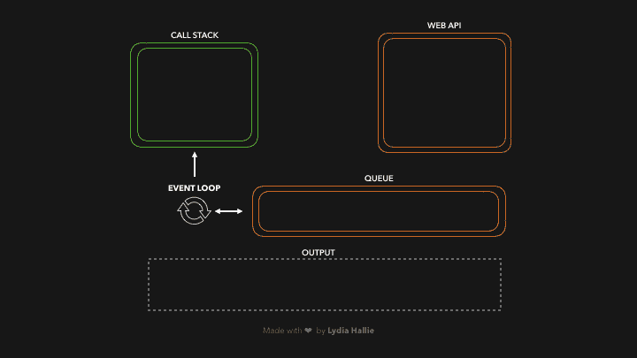

# 你准备好学习 JavaScript 框架了吗？

> 原文：<https://javascript.plainenglish.io/are-you-ready-to-learn-a-javascript-framework-5315d245800?source=collection_archive---------14----------------------->

## 为什么重要的是不要急于使用框架，而是先了解所有东西是如何在幕后工作的？

Photo by [Emile Perron](https://unsplash.com/@emilep?utm_source=unsplash&utm_medium=referral&utm_content=creditCopyText) on [Unsplash](https://unsplash.com/s/photos/javascript?utm_source=unsplash&utm_medium=referral&utm_content=creditCopyText)

我的一个朋友最近刚开始学习网络开发，他问我:“每当我在 React 中引用一个函数中的一个变量时，为什么会出现***这是未定义的*** 错误？”。我很快意识到我的朋友缺乏一些关于 Scopes 的基础 JavaScript 知识。在本文中，我将尝试解释并希望能说服你们中的一些人，为什么不像我的朋友那样急于使用框架是如此重要，并给出一些在学习框架之前需要掌握的实际例子。

# 为什么不快点？

JavaScript 框架无处不在。reactor、Angular、Vue、Svelte、Ext JS、Express、哈比神被全球数百万家公司使用，每份招聘启事都至少包含其中一项。这给了初学者开发者一个强大的 [FOMO](https://en.wikipedia.org/wiki/Fear_of_missing_out) 。人们想快速跳上框架列车，学习其中的一个，或者尝试市场上的新的酷东西，我完全理解，作为开发人员，我们总是需要跟上技术的发展。

众所周知，学习其中一个框架会让你的简历对招聘公司更有吸引力，或者帮助你为你的初创公司构建下一个网络应用程序。但是停下来想一想，如果你还没有首先掌握 JavaScript 本身，简单地*学习*会让你充分发挥它的潜力吗？
您可能已经猜到，答案是— **否**。

上述所有框架本质上都是工具，您可以使用它们来加快开发速度，并使常见操作(如 DOM 操作、循环元素以及处理业务逻辑)对您来说更容易。例如:以【反应】中的[条件渲染为例。使用 React，您可以根据布尔值轻松显示不同的信息，而在普通的 JS 中，您需要多几行代码。也许这不是最好的例子，但你明白了。](https://reactjs.org/docs/conditional-rendering.html)

如果你真的浏览了整个 reactjs.org*网站，参加了课程，并且基本上学会了独自反应，这并不意味着你是一个强大而有见识的 JavaScript 开发人员，因为你可能知道该做什么，但是不知道为什么以及如何在你的框架的**罩下工作。有时我们会花上几个小时(如果不是几天的话)试图弄清楚为什么某件事情的工作方式和它应该的完全不同，尤其是在调试现代框架的时候。这时，对语言本身的扎实理解可以为您节省大量时间。***

# *超文本标记语言*

*我想快速解决专门针对前端开发人员的 HTML。前端的 JavaScript 主要用于 DOM 操作，这意味着你需要很好地理解语义 HTML，不同类型的元素，如图像，iframes，特定的表单元素，还要学习浏览器实际上采取什么步骤来呈现和绘制你在屏幕上看到的元素。这篇常青树[文章](https://www.html5rocks.com/en/tutorials/internals/howbrowserswork/)会给你很多关于步骤的见解，从解析开始，到在屏幕上画像素结束。此外，检查[这个](https://developers.google.com/web/fundamentals/performance/rendering)来学习优化整个过程。*

# *JavaScript 引擎*

*解析，事件循环，调用堆栈，垃圾收集，承诺，继承。
深入探究 Chrome 的 V8 等 JS 引擎，不仅对真正喜欢探索的书呆子来说很有趣，还会给你一个更大的画面，帮助你理解为什么 JavaScript 中的某些东西是这样的。再一次，学习浏览器如何解析 JavaScript 代码，以及[事件循环](https://youtu.be/8aGhZQkoFbQ)是如何工作的:在某种程度上，看到有一个与调用堆栈一起工作的永无止境的循环，然后学习什么是[垃圾收集](https://javascript.info/garbage-collection)，以便尽可能避免内存泄漏，这肯定会令人兴奋不已。*

**

*Image by [Lydia Hallie](https://twitter.com/lydiahallie) on [dev.to](https://dev.to/lydiahallie/javascript-visualized-event-loop-3dif)*

# *范围*

*JavaScript 中执行的一切都发生在特定的范围内，这是为了安全。基本上是为了确保变量只能从程序的特定区域被访问，这有助于我们避免对这些变量的意外修改。这可以在框架中很好地观察到。范围可以是:*

*   *本机浏览器对象如*窗口*、*文档*、*字符串*、*数组、*等引用的全局变量，或者不在函数或块内的任何其他变量*
*   *局部变量也称为函数作用域，它将函数内部变量的作用域锁定在自己身上*
*   *块作用域，其作用类似于函数作用域，只要在声明变量时使用 const 或 let 而不是 var*

*了解所有这些[类型的作用域，将会让你在使用一个框架时，再次预测和确定不同场景下的输出。](https://dev.to/sjsouvik/all-about-functions-and-scopes-in-javascript-1ac5)*

# *关闭*

*当使用像 React 这样的框架时，你会在任何地方遇到闭包。回到我朋友提出的关于*未定义的问题，闭包就是一个函数在另一个函数内的组合，它让你可以从内部函数访问外部函数的范围。很困惑吗？在 React 中，您需要将函数的上下文绑定到正确的范围，否则，闭包会将它指向其他地方。而[这就是](https://developer.mozilla.org/en-US/docs/Web/JavaScript/Closures)你需要学习的，这样当 JavaScript 给你这样的惊喜时，你就知道该怎么做了。**

# **遗产**

**JavaScript 是一种多范式语言:它结合了过程式、函数式和面向对象的编程。后者是建立在继承等概念之上的。在 JavaScript 中，继承是通过使用*原型*对象来实现的。一旦你知道它是如何工作的，你就能理解为什么在 JavaScript **和**中一切基本上都是一个*对象*你就会明白在 ES6 类下发生了什么，我们在 React 和 Angular 中也有。类、构造函数等等仅仅是继承之上的语法糖，所以值得更深入地挖掘[它](https://developer.mozilla.org/en-US/docs/Learn/JavaScript/Objects/Inheritance)。**

# **异步/同步**

**这一点和我们之前看到的调用栈非常相关。基本上，异步这个词的意思是**而不是**同时发生。由于默认情况下 JavaScript 喜欢按顺序一个接一个地执行所有的事情，所以有时我们需要利用异步性，例如当从服务器获取数据或设置超时时。在这些情况下，您显然不希望在响应到达之前暂停代码执行。因此，[异步性](https://dev.to/lydiahallie/javascript-visualized-promises-async-await-5gke)在框架中扮演着重要的角色。**

# **错误处理**

**如果你已经有一些编程经验，你可能会理解为什么[捕捉错误](https://javascript.info/try-catch)并以正确的方式处理它们是如此重要。不管你是在前端还是后端，只要你在处理某种具有动态响应的 API，你就必须确保拒绝并解决它们，或者*尝试*和*捕捉*出错的 API。在前端，正如我们所说，它可能是一个 API 响应，而在后端，您可能必须处理客户端请求。**

# **ES6+**

**学习 ES6 之所以重要，是因为所有流行框架的现代版本都已经将它整合到了它们的架构中，并依赖于它。Angular 使用类和构造函数，React 在向子组件传递属性时充满了匿名箭头函数、模板文字和对象析构，而 Express 则在控制器方法中使用 *async await* 来处理传入的请求。所以，熟悉 ES6 将非常有利于缩短框架的学习曲线。**

**在我们刚刚经历了所有这些要点之后，我想提醒你，一旦你对所有这些要点有了坚实的理解——**学习一个新的框架**只会花你一个**周**或者有时只是一个密集的**周末**。您将能够轻松地预测函数在不同场景中的行为，为什么会出现某些错误，以及如何轻松地修复它们。我的朋友可能已经发现，她需要将这个绑定到正确的上下文中，以避免她在 React 中遇到的初始问题。**

**如果你觉得这篇文章有帮助，一定要看看我的 YouTube 频道。事实上，我为这篇文章制作了一个一对一的视频😃：**

**下次见！**

***更多内容看* [***说白了。报名参加我们的***](http://plainenglish.io/) **[***免费周报***](http://newsletter.plainenglish.io/) *。在我们的* [***社区不和谐***](https://discord.gg/GtDtUAvyhW) *获得独家获取写作机会和建议。*****