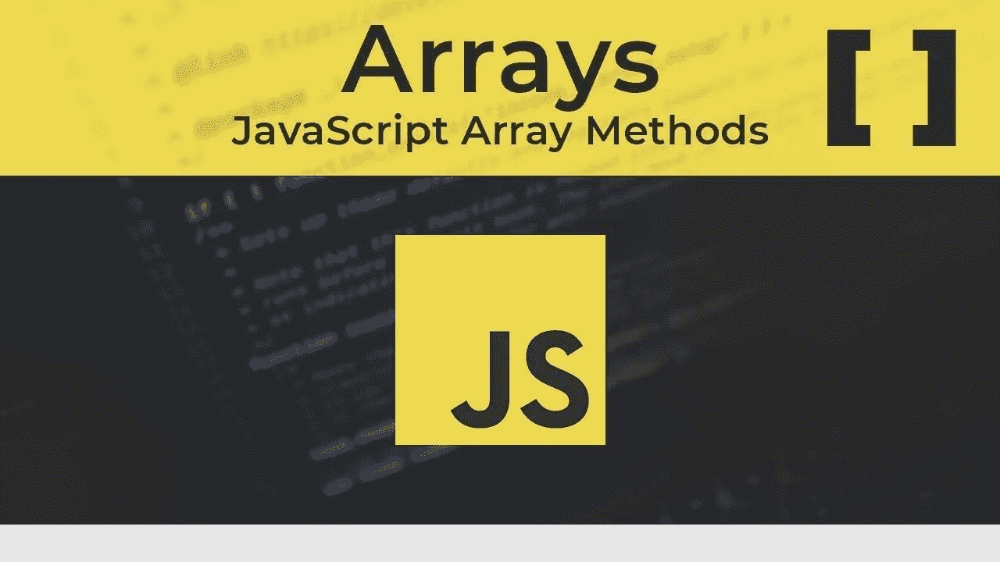

# JavaScript 数组初学者指南

> 原文：<https://javascript.plainenglish.io/array-data-type-and-array-methods-in-javascript-50a29af0c49b?source=collection_archive---------14----------------------->



JavaScript 数组用于在单个变量中存储多个值。数组是一个特殊的变量，它一次可以保存多个值。

# **创建数组**

## ***1。使用数组文字是创建 JavaScript 数组最简单的方法***

`Syntax:`

var array_name = [item1，item2，…]；

空格和换行符并不重要。一个声明可以跨多行:

```
var cities= [
  "Moscow",
  "Berlin",
  "München"
];
```

## **②*。使用 JavaScript 关键字*** `new`

```
var cities = new Array("Moscow", "Berlin", "München");
```

上面的两个例子做的完全一样。没有必要使用`new Array()` 。为了简单、可读性和执行速度，使用第一种方法(数组文字方法)。

# 数组方法

JavaScript 数组的优势在于数组方法。数组方法是 JavaScript 中内置的函数，我们可以将它们应用到我们的数组中——每个方法都有一个独特的函数，可以对我们的数组进行更改或计算，使我们不必从头开始编写常见的函数。

## **1。到达数组**的元素

如上所述，数组是几个元素的组合。如果我们想要打印这些元素中的一个:

```
const myArray = ["USA", "Russia", "Turkey", "Israel"];console.log(myArray);
```

如果我们“运行”上面的代码，我们会看到整个数组被打印在屏幕上。


如果我们想在屏幕上打印数组的任何元素:

```
const myArray = ["USA", "Russia", "Turkey", "Israel"];console.log(myArray[2]);
```


对于 JavaScript 初学者来说，可能会出现这样的问题:“毕竟，数组中的第二个元素是`Russia`。为什么`Turkey`会被印在屏幕上？这是因为数组中的元素从零索引开始排序。，继续为`0, 1, 2 ...`，不为`1, 2, 3…`。

## **2。的方法。长度()**

作为 Array 类型实例的对象的`length()`属性设置或返回该数组中元素的数量。该值是一个无符号的 32 位整数，在数值上总是大于数组中的最高索引。`length()`属性的值是一个带正号的整数，其值小于 2 的 32 次方(232)。您可以随时设置`length()`属性来截断数组。当您通过更改数组的`length()`属性来扩展数组时，实际元素的数量会增加；例如，如果您将当前为 2 的 `length`设置为 3，则数组现在包含 3 个元素，这将导致第三个元素成为不可迭代的空槽。


我们的输出是:


## **3。Array.isArray()的方法**

`Array.isArray()`方法确定传递的值是否为数组。语法:`Array.isArray(value)` 。如果值为数组，则返回`true`；否则，`false`为。


我们的输出是:


我们的输出:


## **4 .方法。indexOf()**

`indexOf()`方法返回数组中给定元素的第一个索引，如果不存在，则返回-1。语法:`**arr.indexOf(searchElement[, fromIndex])**`。

`indexOf()`使用严格的等式(与`===`或三重等式运算符使用的方法相同)将`searchElement`与数组的元素进行比较。


我们的输出:


*如上所述，在第二个索引中打印* `*Berlin*` *的原因是数组的元素从零索引开始计数*。

## **5。方法。推送()**

`push()`方法将一个或多个元素添加到数组的末尾，并返回数组的新长度。语法:

`**arr.push([element1[, ...[, elementN]]]).**` 使用该方法后，数组的长度、索引随着每个添加元素的个数而增加。


我们的输出是:


*如您所见，屏幕上会显示数组的元素个数。如果我们想打印阵列本身，我们必须首先为阵列增加价值，然后将其打印到屏幕上:*


我们的输出是:


第二部分在此:`[link](https://medium.com/javascript-in-plain-english/a-beginners-guide-to-arrays-in-javascript-part-2-4fe0665bd2a3)`