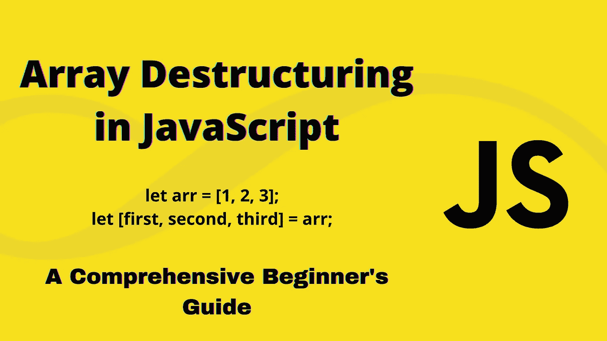
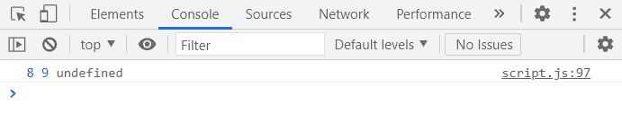

# JavaScript 中的数组析构:初学者综合指南

> 原文：<https://javascript.plainenglish.io/array-destructuring-in-javascript-a-comprehensive-beginners-guide-77a710166ca9?source=collection_archive---------1----------------------->



根据官方 MDN [文档](https://developer.mozilla.org/en-US/docs/Web/JavaScript/Reference/Operators/Destructuring_assignment)，析构赋值语法*“是一个 JavaScript 表达式，它可以将数组中的值或对象中的属性解包到不同的变量中。”*

在我们深入研究这些例子之前，让我们从概念上理解数组析构是如何工作的。

析构是 ECMAScript 6 (ES6/ECMAScript 2015)的一项功能。就数组而言，析构基本上是一种将数组中的值解包到单独的变量中的方法。换句话说，析构就是将一个复杂的数据结构(本例中是一个数组)分解成一个更小(因此也更简单)的数据结构，比如一个变量。

对于数组，析构的主要好处是我们可以从数组中检索元素，并以一种非常简单的方式将它们存储到变量中。让我们从一个非常简单的数组开始，使用析构来从中提取元素。

## 提取元素

```
let arr = ['Soumadri', 'Sunil', 'John'];
```

现在，这是我们传统的检索每个元素的方法。

```
let name1 = arr[0];let name2 = arr[1];let name3 = arr[2];console.log(name1, name2, name3);
```

这将为我们提供以下输出:


现在，让我们看看如何使用析构来做同样的事情。为了析构一个数组，我们在赋值操作符的左边使用了一个“[]”。每当 JavaScript 看到这个，它就会知道它需要执行析构。

现在，使用析构，我们可以同时声明所有三个变量。让我们看看我们将如何做:

```
let [name1, name2, name3] = arr;
```

就是这样。现在让我们在控制台中检查结果。

```
console.log(name1, name2, name3);
```


事实上，正如我们所看到的，我们的代码产生了完全相同的结果，但是只有一行代码。

我们还可以看到，原始数组没有受到影响。

```
console.log(arr);
```


## 提取选定的元素

我们也不需要从数组中取出所有的元素。让我们来看一个例子，在这个例子中，我们执行析构来从数组中检索选定的元素。我们将再次使用 arr 数组。

```
let arr = ['Soumadri', 'Sunil', 'John'];let [name1, ,name2] = arr;
```

name1 和 name2 之间的双逗号确保跳过相应索引位置的元素。因此 **name1** 检索第**个索引**(“Soumadri”)处的元素， **name2** 检索第**个索引**(“John”)处的元素，而中间的元素，即第**个索引位置(“Sunil”)处的元素被跳过。**

让我们看看结果。

```
console.log(name1, name2);
```


事实上，我们得到了预期的 Soumadri 和约翰。

## 交换变量

让我们看看如何使用析构来交换变量。让我们声明两个变量 name1 和 name2，并给它们赋值。

```
let name1 = 'Sunil';let name2 = 'Soumadri';
```

传统上，这是我们执行交换的方式。

```
let tmp = name1;name1 =name2;name2 = tmp;console.log(name1, name2);
```


现在，有了析构，我们可以在一行中完成。重置 name1 和 name2 的值，以防您使用相同的文件和/或没有注释掉上面的代码。

```
let name1 = 'Sunil';let name2 = 'Soumadri';[name2, name1] = [name1, name2];
```

现在我们来看看结果。

```
console.log(name1, name2);
```


事实上，我们得到了 name1 和 name2 的交换值。

因此，让我们在下面的 library 对象中的一些数组上尝试这些技术(随意创建一个带有自己值的数组)。这将有助于您对析构在实际应用中的工作原理有一个简单的了解。

## 从对象中析构数组值

首先，让我们创建我们的库对象。

```
const library = { name: "Soumadri’s Fiction Book Shelf", location: '1234 Fiction Palace, Calcutta, India', genres: [ 'Mystery', 'Horror', 'Fantasy', 'Sci-Fi', 'Literary Fiction', 'Historical Fiction', ], titles: [ 'The Inugami Clan', 'The Three Coffins', 'In Search of Lost Time', 'Sandman', 'The Left Hand of Darkness', 'The Complete Works of H.P. Lovecraft', 'Do Androids Dream of Electric Sheep?', 'In the Woods', 'In a Glass Darkly', 'Fingersmith', ], authors: [ 'Neil Gaiman', 'Ursula Le Guin', 'Sheridan Le Fanu', 'H.P. Lovecraft', 'Marcel Proust', 'Tana French', 'John Dickson Carr', 'Seishi Yokomizo', 'Philip K. Dick', 'Sarah Waters', ],};
```

如果你是初学者，请不要被物体的大小吓倒。我简单解释一下键和值。

*   **名称:**我的个人书架/图书馆的名称。
*   **地址:**图书馆的地址。
*   **流派:**存储图书馆中所有书籍流派的数组。
*   **titles:** 存储图书馆中所有书籍名称的数组。
*   **authors:** 一个数组，存储图书馆中所有作者的名字。

现在，假设我们只想从`library.titles`数组中检索第一个和第二个元素(即两本书的名称)。因此，这就是我们写的代码。

```
let [firstBook, secondBook] = library.titles;
```

这里，变量`firstBook`对应于`library.titles`数组中的**第 0 个索引**(‘犬猫族’)，变量`secondBook`对应于`library.titles`数组中的**第 1 个索引**(‘三口棺材’)。

结果是:

```
console.log(firstBook, secondBook);
```


但是现在，假设我们想要选取两个标题，但是这次，从数组中选取第一个标题(索引 0)和第三个标题(索引 2)。换句话说，我们希望像前面一样提取选定的元素，并跳过某个索引位置。您可以自己尝试一下，然后回来检查解决方案。

那么，让我们来看看我们如何做到这一点。

```
let [firstBook, ,secondBook] = library.titles;
```

就像前面一样，`firstBook`和`secondBook`中间的双逗号意味着**对应于空元素的索引被跳过**，因此我们的第二个标题(secondBook)现在将是`library.titles`数组中的第二个索引位置(“寻找失去的时间”)。

然后我们检查结果:

```
console.log(firstBook, secondBook);
```


如你所见，这真的很强大。析构可以用来做很多很酷的事情。

所以，现在，假设我们想选择第一个索引的标题(“三口棺材”)作为我们的第一个标题，第 0 个索引的标题(“犬神部落”)作为我们的第二个标题(基本上，我们想交换第一个和第二个标题的状态)。

正如你从`library.titles`数组中看到的，现在，没有交换，我们选择的第一个标题是“犬神部落”，而我们选择的第二个标题是“三口棺材”。现在，我们想换一下。

同样，要在不破坏结构的情况下做到这一点，我们必须这样做:

```
let [firstBook, secondBook] = library.titles;console.log(‘First pick: ‘+firstBook+’, Second pick: ‘+secondBook);
```

首先，我们要用我们最初的选择。我们可以通过将结果记录到控制台来检查第一次和第二次选择的初始状态:


然后我们进行传统的交换。

```
const tmp = firstBook;firstBook = secondBook;secondBook = tmp;console.log(‘First pick: ‘+firstBook+’, Second pick: ‘+secondBook);
```


但是有了析构，整个过程可以变得容易得多。

我们是这样做的:

```
let [firstBook, secondBook] = library.titles;[firstBook, secondBook] = [secondBook, firstBook];console.log(‘First pick: ‘+firstBook+’, Second pick: ‘+secondBook);
```


我们开始吧。

## 从函数返回的数组中提取元素

现在，一些新的东西。析构的另一个漂亮的特性是我们可以让一个函数返回一个数组，然后我们可以立即在不同的变量中析构结果。这允许我们从一个函数中返回多个值。为了验证这一点，让我们向库对象添加一个函数。

这是添加了 lend()函数(借 2 本书)的更新后的图书馆对象的样子。

```
const library = { name: "Soumadri’s Fiction Book Shelf", location: '1234 Fiction Palace, Calcutta, India', genres: [ 'Mystery', 'Horror', 'Fantasy', 'Sci-Fi', 'Literary Fiction', 'Historical Fiction', ], titles: [ 'The Inugami Clan', 'The Three Coffins', 'In Search of Lost Time', 'Sandman', 'The Left Hand of Darkness', 'The Complete Works of H.P. Lovecraft', 'Do Androids Dream of Electric Sheep?', 'In the Woods', 'In a Glass Darkly', 'Fingersmith', ], authors: [ 'Neil Gaiman', 'Ursula Le Guin', 'Sheridan Le Fanu', 'H.P. Lovecraft', 'Marcel Proust', 'Tana French', 'John Dickson Carr', 'Seishi Yokomizo', 'Philip K. Dick', 'Sarah Waters', ], lend: function (firstBookIndex, secondBookIndex) { return [this.titles[firstBookIndex], this.titles[secondBookIndex]]; },};
```

我们已经向库对象添加了函数`lend()`。这是一个接受两个参数的函数——第一个标题的**索引位置和第二个标题**的**索引位置。**

用户通过提供每个标题的索引号来借两本书。我们从`library.titles`数组中的相应位置返回值(以数组的形式)，这是基于作为参数传递的位置。

所以现在，让我们借我们的书。

```
console.log(library.lend(2,6));
```

我们的结果:


我们从 `library.titles`数组中选取了**索引位置 2 和 6** ，这些对应的标题就是我们以数组形式返回的结果。

现在，让我们来破坏这个数组。

```
let [firstBook, secondBook] = library.lend(2, 6);
```

让我们记录这些值。

```
console.log(firstBook, secondBook);
```


事实上，我们得到了“寻找失去的时间”和“机器人会梦见电子羊吗？”。

这就是我们如何从一个函数中得到两个或更多的返回值。这也可以在没有析构的情况下完成，但是这是一个非常简洁和方便的方法，可以在一个函数调用中立即创建两个或更多的变量。

## **嵌套析构**

让我们来看看如果你有一个嵌套数组(数组中的数组)会发生什么。

```
const nested = [1, 3, [2, 4]];
```

所以现在，基于我们目前所学的，让我们尝试得到值 1(第 0 个索引)和嵌套数组[2，4](第 2 个索引)。我们将跳过第一个索引位置(3)的值。我建议在找到解决方案之前，自己先试一试。

好吧，我希望你能成功。如果你不是，别担心。下面是我们将如何着手做这件事。

```
const [i, ,j] = nested;console.log(i, j);
```

是的，我们得到了我们想要的结果。

这很棒，但是如果我们想要所有的单个值，而不是整个嵌套数组呢？如果你从逻辑上考虑，这其实很简单。然后，我们只需要在析构中进行析构。因此，让我们尝试分别检索 3 个值— 1、2、4。我们将再次跳过第一个索引。

```
const [i, ,[j, k]] = nested;
```

我们正在数组析构中执行数组析构(在=运算符的左侧用[]表示)。因此，j 和 k 将分别获得值 2 和 4。

```
console.log(i, j, k);
```

是的，我们做到了。

## **设置默认值**

最后，我们还可以在提取变量时为它们设置默认值。当我们不知道从中检索值的数组的长度时(这在现实世界的应用程序和项目中很常见)，这将非常有帮助。

假设我们有一个数组(右手边),它的值我们不知道(当然，我会在这里设置值，但为了这节课，我们假装不知道长度和值)。

```
const [p, q, r] = [8, 9];
```

现在，如果我们尝试记录这些值:

```
console.log(p, q, r);
```



没错。我们得到未定义的 r 值，解决这个问题的方法是设置默认值。我们只需将 p、q 和 r 的默认值设置为 1。如果在相应的索引位置有可用的值，默认值将被覆盖。如果右侧没有相应的索引位置，那么将保持默认值。让我们试试这个。

```
const [p=1, q=1, r=1] = [8, 9];console.log(p, q, r);
```


如您所见，p 和 q 的值分别为 8 和 9，而 r 现在有了默认值 1。

## 结论

就这些了，恭喜你到达本文结尾。我要感谢 Jonas Schmedtmann 和他出色而全面的 Udemy [课程](https://www.udemy.com/course/the-complete-javascript-course/)，让我对这些话题有了清晰而恰当的理解。我希望这个小指南对你也有用。如果您有任何疑问或意见，请随时发表评论。

在我的下一篇文章中，我将介绍 JavaScript 中对象的**析构。享受你的一天，并有一个美好的一天。回头见。**

*更多内容请看*[*plain English . io*](http://plainenglish.io/)