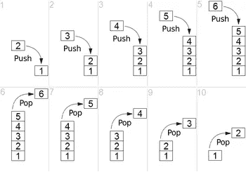

# JavaScript Array.push()是深拷贝还是浅拷贝？

> 原文：<https://javascript.plainenglish.io/array-push-in-javascript-is-it-deep-or-shallow-copy-90cd195ec5b7?source=collection_archive---------3----------------------->

今天让我们讨论一个有趣的 JavaScript 话题。即使是 JavaScript 的初学者也会知道 array 以及在其中添加和删除值。但是我们大多数人并不试图理解所有数组函数的内部实现(有时也不可能理解每个函数的实现！！).

所以今天我们来讨论一下 array.push 方法。如果你不知道 array.push 是如何工作的，这里是它的官方[链接](https://developer.mozilla.org/en-US/docs/Web/JavaScript/Reference/Global_Objects/Array/push)。



Source — Wikipedia

让我们从简单的例子开始:你能猜出下面代码片段的输出吗？

```
let arr = [];
let x = 10;
arr.push(x);
x = 20;
console.log(arr); 
console.log(x);
```

很简单，`arr`将打印 10，`x`将打印为 20。

现在让我们稍微复杂一点。在不执行代码的情况下尝试猜测代码。

```
var array = [];
var y = {name: "test", type: "data", data: "2-27-2009"};
array.push(y);
y.name = "foo";
console.log(array);
```

如果你来自 Java，c#背景你会猜测输出会是:

`[{name: “test”, type: “data”, data: “2–27–2009”}]`

但实际输出是:

`[ { name: “foo”, type: “data”, data: “2–27–2009” } ]`

现在让我们再调整一下，猜测一下不执行的输出，

```
var array = [];
var y = {name: "test", type: "data", data: "2-27-2009"};
array.push(y);
array[0].name = "foo";
console.log(y);
console.log(array);
```

因此，输出是:

```
*// y
{ name: ‘foo’, type: ‘data’, data: ‘2–27–2009’ }**// array
[{ name: ‘foo’, type: ‘data’, data: ‘2–27–2009’ }]*
```

到现在为止，你可能已经理解了当我们把一个对象放入一个数组中，而不是添加对象的内容，引用被复制。因此，如果您更改了对象或数组，它将修改相同的引用。所以数组和对象同时得到更新。

现在下一个问题:**array . push()是深度复制还是浅层复制？**

对于那些不知道什么是深度和浅度复制的人，这里有一个快速定义。

## 浅拷贝

浅层拷贝是对象的逐位拷贝。创建一个新对象，该对象具有原始对象中值的精确副本。如果对象的任何字段是对其他对象的引用，则仅复制引用地址，即仅复制存储器地址。所以，如果你改变任何一个对象，由于共享公共引用，两个对象都会改变。

## 深层拷贝

深度复制复制所有字段，并复制这些字段所指向的动态分配的内存。当对象与其引用的对象一起被复制时，就会发生深度复制。所以，如果你改变任何一个对象，只有那个对象会被改变，因为两者都有不同的引用。

所以回答上面的问题，取决于你在推动什么。对象和数组作为指向原始对象的指针被推入。像数字或布尔这样的内置基本类型作为一个副本被推送。

现在让我们进一步扩展上面的例子，

```
var array = [];
var y = {name: "test", type: "data", data: "2-27-2009"};
array.push(y);
y = {}; 
y.name = 'bar';
console.log(array);
console.log(y);
```

输出是:

```
// array 
[ { name: ‘test’, type: ‘data’, data: ‘2–27–2009’ } ]// y
{ name: ‘bar’ }
```

这里，数组值在改变“y.name”后没有改变，因为当我们初始化时

```
y = {}
```

`y`指向新的引用，现在之前复制到数组的引用只被数组指向。所以，通过改变`y`的值，数组值不会改变。

**深度复制变量的最佳实践是什么，这样我们就不会面临这个问题？**

我将在下一篇文章中讨论这个问题。在那之前，祝你阅读愉快。

**同一作者的更多文章:**

1.  [JavaScript 中的一切都是对象吗？](https://mevasanth.medium.com/how-everything-is-object-in-javascript-a4164d7e6a2d)
2.  [异步 Await 函数返回值的问题](/problem-with-returning-values-from-async-await-function-javascript-e99c94a47ca5)
3.  [JavaScript 中的提升:面试热门话题](https://mevasanth.medium.com/hoisting-in-javascript-hot-topic-for-interview-43b463a6a77?source=follow_footer---------0----------------------------)
4.  [JavaScript 中的记忆化——采访热门话题](https://mevasanth.medium.com/memoization-in-javascript-hot-topic-for-interview-815475544ab0)

在这里阅读作者[的所有文章。](https://mevasanth.medium.com/)

*更多内容请看*[***plain English . io***](http://plainenglish.io)