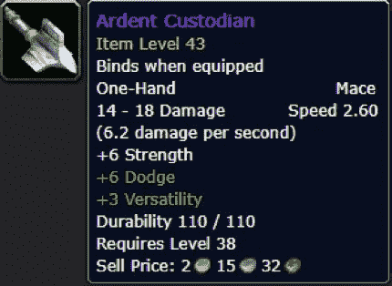
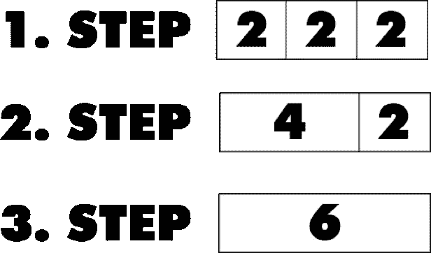

# 数组。JavaScript 中的 reduce():3 分钟指南#02

> 原文：<https://javascript.plainenglish.io/array-reduce-in-javascript-b196353a5f6d?source=collection_archive---------15----------------------->

## JavaScript 的 **reduce 方法**是函数式编程的基石之一


Illustration made by [Author](http://www.arnoldcode.com) with ❤️

那是一个工作日，一个同事走过来问我:“你为什么要这样编码？”我已经有点不高兴了，因为他在最后一天默默地纠正并重新提交了我的最后一次 git 提交。

无论如何，笑一笑，勇往直前——我心想。“什么意思？”我问了他，他向我介绍了`Array.prototype.reduce()`,虽然我仍然对他最后一天的行为感到不安，但我很高兴有一个人向我解释并展示了一个在 JavaScript 中用于数组的很好的函数。

我想对你做同样的事，但不拿走你最后的承诺，默默为你改正。让我们开始定义吧。

# 定义

`Array.prototype.reduce()`用于迭代一个数组并将其简化为一个元素，就像基本的算法将给定的值相加得到一个和。

```
array.reduce((accumulator, currentValue, currentIndex, array) =>
                                        accumulator + currentValue);
```

如果你调用`reduce()`函数，你传入你的旧数组并且不改变它的状态，因为 reduce 创建了一个新的并返回新的。这意味着使用`reduce()`使您的代码坚持函数式编程范式，同时也保持了不变性原则。

## 例子

想象你正从一个农场或一次冒险中回来，你的角色在你最喜欢的 RPG 中。现在你回到镇上，想批量出售新掠夺的物品；你已经收集了 3 件相同类型的史诗物品，并且想要一次全部卖掉。例如，这是项目:



Figure 1 — WoW Epic Item Ardent Custodian

(我希望你能从一个著名的游戏中认出这个物品)无论如何，你的库存中现在有三个相同的物品，你想一次卖掉它们(不是单独点击每一个)。


Figure 2 — Three times Ardent Custodian in your inventory

`Array.reduce()`帮助你积累所有三者的总和。每个都有价值 **2 金 15 银**和 **32 铜**。

此示例为您提供了累计总售价所需的行。`Array.reduce()`的 lambda 表达式需要两个输入变量。因此，它遍历数组，每两个值对累加一次。想象一下:



Figure 3: Step by Step Process of Array.Reduce

## 具有默认的起始值

您还可以添加一个默认的起始值作为第二个参数。例如，你有一个最喜欢的商人，就像**黑暗之魂**中的铁匠，他总是很高兴见到你，并为你的每笔交易额外支付一枚黄金(或 1000 灵魂)。研究下面的列表，找出额外的 1 金。

## 从后面开始！

如果想从终点迭代到起点(向后)，可以使用`reduceRight()`。这在这里没有多大意义。因此，我把这个例子保存在这个地方。

# 老式的方法

为了完成这项工作，我将向您展示不用调用 reduce 函数就能获得累计值的老式方法。

# 外卖食品

*   使用`Array.Prototype.Reduce()`编写功能性代码，并坚持不变性原则
*   使用`Array.Prototype.Reduce()`从数组中获取一个累计值
*   您可以为累计过程设置默认起始值
*   使用`Array.prototype.reduceRight()`从后向前开始累积过程
*   [](https://arnoldcodeacademy.ck.page/26-web-dev-cheat-sheets)


Arnold Code Academy 26 Web Developer Cheatsheets

# 参考

MDN WebDocs Reduce-Function:[https://developer . Mozilla . org/en-US/docs/Web/JavaScript/Reference/Global _ Objects/Array/Reduce](https://developer.mozilla.org/en-US/docs/Web/JavaScript/Reference/Global_Objects/Array/Reduce)

# 继续读

[](/array-map-in-javascript-3-minute-guide-5b2ce5123d8a) [## 数组。JavaScript 中的 map():3 分钟指南

### 踏入函数式编程和不变性的大门

javascript.plainenglish.io](/array-map-in-javascript-3-minute-guide-5b2ce5123d8a) [](/profit-from-typescript-in-pure-javascript-projects-5208a2f5c9b0) [## 从纯 JavaScript 项目的 TypeScript 中获利

### 将 TypeScript 链接到 JavaScript 并启用类型检查

javascript.plainenglish.io](/profit-from-typescript-in-pure-javascript-projects-5208a2f5c9b0)