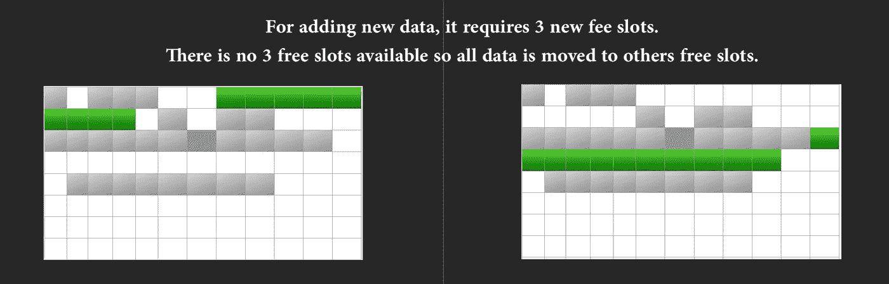
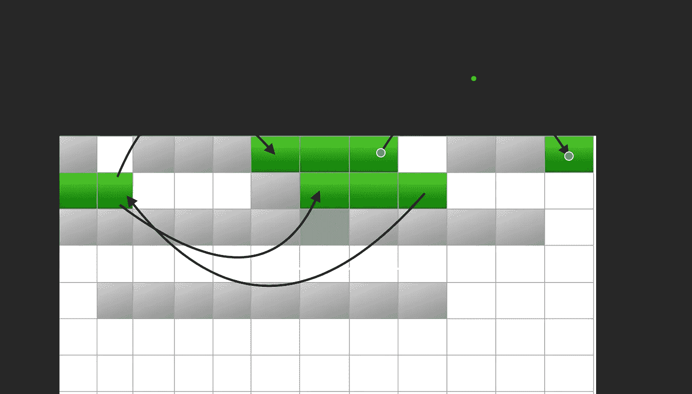

# JavaScript 中的数组与链表

> 原文：<https://javascript.plainenglish.io/arrays-vs-linkedlist-in-javascript-8c9e38578537?source=collection_archive---------3----------------------->

处理元素列表是编程中很常见的问题。我们如何解决问题可能会产生影响，这取决于我们选择的解决方案。

在这里，我们将看到处理元素列表的两种不同的解决方案及其优缺点，以及我们在这两者之间进行选择时应该注意的要求(总是考虑 JavaScript 实现)

首先让我们了解每个解决方案。

## **数组**

*   在 JavaScript 中，数组*总是动态的*，不管我们用固定的大小或元素初始化它们，我们总是会可以添加更多的元素并且大小会增加
*   每次数组大小改变时，内存中用于保存的空间可能需要改变，并且因为所有信息都应该保存在一起(内存中的连续插槽)，所以可能需要找到所有数组数据并将其移动到另一个空闲内存插槽中(如果这种情况发生得太频繁，可能会出现性能问题)

*   数组是用 javascript 构建的 it 数据结构，有很多有用的方法，并且易于处理
*   直接访问数组的任何位置都很简单快捷
*   从其中读取添加新元素的元素更“便宜”(因为前面提到的内存分配)

## **链表**

*   链表只是一个具有固定结构的对象，它允许对象相互链接
*   JavaScript 中没有内置的链表，但是有很多例子
*   在内存中，每个对象保存在可用内存的不同部分，对象之间通过指针关联。对于单链表，链接是从一个元素到另一个元素，而在双链表中，两个元素都有指向彼此的指针

*   添加读取元素的新元素更便宜。不可能直接访问一个元素，总是需要在列表中循环搜索想要的元素

因此，要决定哪种结构使用最重要的功能，我们需要考虑:

*   元素添加的频率是多少
*   我们怎样才能接触到这些元素？总是最后/第一？总是所有元素？或者我们是否需要过于频繁地访问具体的元素？

我想向你们展示用一个数组和一个链表解决的同样的问题。栈的经典问题(队列在这个例子中也是有效的)。

下面是使用数组保存数据的解决方案:

下面是使用对象链表的解决方案:

第一个更容易实现，更容易阅读，也许更容易理解。我们需要明确的是，如果堆栈增加太多太频繁，我们可能会面临性能问题，甚至一些内存问题。

总的来说，我们总是在顶部添加和删除元素，链表似乎更适合这个问题。

还有其他结构，如映射或集合，也可以用来保存数据，而不是数组来解决不同类型的问题。内部实现将是从性能角度决定它们是否对我们的问题有效的关键。

你觉得这个话题怎么样？有什么需要改进或补充的吗？请随时在评论中告诉我！

*更多内容看*[***plain English . io***](http://plainenglish.io)