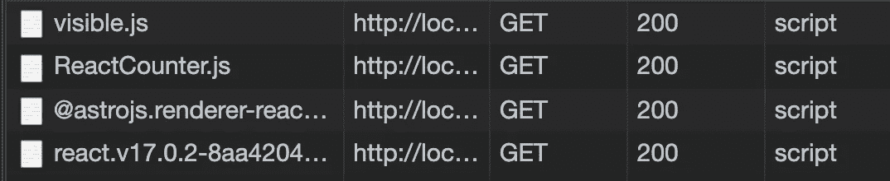

# Astro 入门——创新的静态站点生成器

> 原文：<https://javascript.plainenglish.io/astro-cec429f049d?source=collection_archive---------3----------------------->

## 多框架的 SSG，最小化我们发布的 JS


Image Credits: [CSS-tricks.com](https://css-tricks.com/wp-content/uploads/2021/05/astro-homepage.png)

我们钟爱的框架，如 React.js、Angular 和 Vue.js，有一个小问题:通过 JavaScript 在客户端呈现 HTML 非常昂贵——除此之外，据说它对 SEO 不友好。

静态站点生成器提供了一个补救方法。在构建产品版本时，他们尽可能多地直接呈现为 HTML，然后静态地提供 HTML。

重要的是要理解框架及其所有特性，比如 React 中的钩子，仍然包括在内。静态站点生成器(从现在开始，只是“SSG”)呈现我们站点的外观。仍然包含了大量的 JS 代码。

这就是 *Astro* 的用武之地，只有一个目标:尽可能少用 JavaScript。
事实上，根本没有默认。但首先要做的是。

阿童木实际上只是一个 SSG。但是我们可以在不同的框架下使用它——不像 VuePress 或 Gatsby，它不局限于一个框架。

我们用我们选择的框架/库中的 UI 组件来构建我们的站点——React、Vue 或 Svelte，这都没关系。然后 Astro 会将生产版本构建为一个静态页面，其中根本没有 JavaScript。消除客户端渲染和成百上千字节的框架代码对网站的性能有非常积极的影响。

但是一个有用的 app 没有任何 JavaScript 能存在吗？

当然不是。甚至对于一个网络请求，一些动画，或者更复杂的表单，我们都需要 JavaScript。这就是它真正有趣的地方:如果一个组件需要 JS，Astro 加载必要的代码及其依赖项——但仅此而已。这意味着只加载必要的 JS，并且页面保持快速。

炒作够了吧？我们来试试吧！

# Astro 入门

开始很容易。让我们创建一个新项目:

首先，为项目创建一个新的空目录。然后，跑

```
npm init astro 
```

选择“初学者工具包”作为框架/库，我将使用 React.js —因此请确保选择 React 并按下空格键，然后输入。

最后运行`npm install`。

# 了解文件结构

目前，唯一重要的目录是“src”目录。在中，您应该看到“components”和“pages”目录。

对于应用程序的各个页面，pages 文件夹类似于 Next.js 或 Gatsby。这些页面中的每一个都有自己的基于文件名的 URL，所以`index.astro`是针对主页的“/”。

“components”目录中有两个文件——一个是 React.js 组件的典型 JSX 文件。另一个是静态成分，以“，”结尾。阿童木”。它用于分割 HTML 代码，并将其作为可以导入页面的组件来处理。如果您愿意，可以在。astro 文件——简单地使用一个脚本标签。

但是要记住，这个 JS 是要运到前端的。如果你想写 JS 代码，有一个符合 Astro 哲学的方法。也许你注意到了顶部奇怪的破折号。astro 文件，像这样:

```
------
```

您在这些行中编写的每一个 JS 代码都是在构建时执行的，但不会发布到最终的包中。例如，下面的代码:

```
*---* console.log(“hello world”)
---<h1>A new component</h1>
```

会在终端中记录“hello world”，但不会在浏览器中记录。JS 代码不是在浏览器中发布和执行的。这让我想起了可以在 Gatsby 中编写的 GraphQL 查询。

但是为什么我们还要编写 JS 代码，而这些代码不是在浏览器中执行的呢？为了建立我们的静态页面。假设您想要托管一个静态博客。多亏了 Astro，你可以在破折号内从博客的 API 中获取内容，并将其呈现到静态页面上。最后，你只发布了一个静态页面，如果你的博客服务器只在你的机器上运行，甚至保护你的博客。

但是我们不要把它停留在理论上——这里有一个例子。

首先，创建一个新的。组件文件夹中的 astro 文件。我给它取名`Operation.astro`。然后，用以下代码填充它:

```
*---* function add(a, b) {
  return a + b 
}
*---*<p>The result is:</p>
<p>{add(2,2)}</p>
```

现在，进入 pages 文件夹中的`index.astro`,并导入我们的组件:

```
*import* Operation *from* “../components/Operation.astro”
```

最后，我们可以用`<Operation />`在页面的某个地方渲染它。当您运行`npm start`并打开页面时，您将看到“4”，并且计算不是在浏览器中完成的:


我想你明白了。让我们进一步了解 Astro 以及它是如何处理组件的！

# 成分的水合

当您在默认的 index.astro 中向下滚动时，您会看到呈现了一个 React 组件:

```
<ReactCounter client:visible />
```

组件隐藏在 src/components 中，是一个基本的计数器，使用 React 钩子。当然，这需要 JavaScript——所以当你运行`npm run build`并打开生产版本时(你可以在`npm install -g serve`之后用`serve -s dist/`来做这件事),你会看到一个有效的 React.js 计数器组件。

在 network 选项卡中，我们看到这依赖于 JS，它被加载:



原因很简单:我们是这么说的。

`client:visible`意味着一旦 JS 代码对用户可见，组件就应该加载必要的 JS 代码——基本上是延迟加载。

如果你想看到它的运行，重新加载页面，但是不要让计数器出现。当您打开 Network 选项卡，然后向下滚动直到拖动计数器时，JS 代码被动态加载。

很酷，对吧？

除了`client:visible`之外，加载组件的 JS 部分还有很多选项。如果只在 index.astro 文件中呈现`<ReactCounter />`,那么整个 JS 代码将被删除——并且永远不会被加载。

因此，计数器在页面上是可见的，但是当我们按下按钮时却不工作。然而，如果你只有一个静态组件，这是一个有用的特性。

如果你想了解更多关于补水成分的知识，一定要查看一下[官方文档](https://docs.astro.build/core-concepts/component-hydration)——里面有很好的解释。

感谢您的阅读！

如果您想阅读更多关于框架的内容:

[](/javascript-frameworks-performance-60f71d321693) [## 框架永远不会像普通 JavaScript 那样快

### 在大多数情况下——这很好

javascript.plainenglish.io](/javascript-frameworks-performance-60f71d321693) 

*更多内容尽在*[***plain English . io***](http://plainenglish.io)