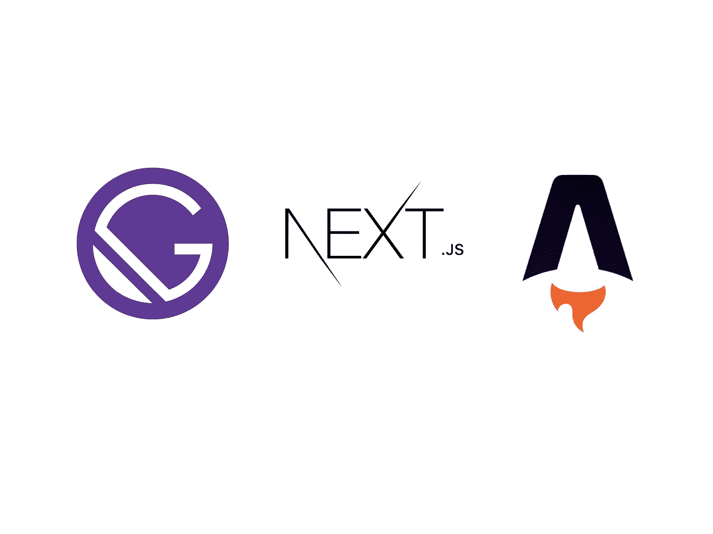

# 我使用 Astro、Next.js 和 Gatsby 构建了相同的应用程序——区别如下

> 原文：<https://javascript.plainenglish.io/astro-next-js-gatsby-3517e0dc884?source=collection_archive---------2----------------------->

## 管束尺寸、结构和特征



Gatsby 和 Next.js——可能是 React.js 最著名的框架。虽然 Gatsby 只是一个静态站点生成器，但 next . js 是一个多才多艺的网站。但是最后，我们也可以很好地使用 Next.js 作为 React 的静态站点生成器。

除了这两个老大，静态站点生成器领域还有一颗新星:Astro。我之前称赞 SSG 的创新和年轻，主要是因为它的独特之处。而 Next 和 Gatsby 是 React.js 独占，Astro 可以用于 Vue，React，Svelte 等等。当谈到包大小和加载组件的不同选项时，新的 SSG 大放异彩。

但这一次，这不是与众不同的问题，而是在与顶级公司的直接比较中变得更好或更差。

为此，我在 Gatsby、Next.js 和 Astro 中构建了相同的小应用程序——以下是差异、性能等方面的结果。

# 小“应用”

我们的项目将由两个 React.js 组件组成。

这两个组件都被设置为直接加载——不使用按需加载形式的延迟加载，也不使用一旦主线程空闲就加载的方式。因此，这是一场公平的比赛。

第一个组件是一个简单的计数器，使用 useState:

第二个是一个呈现的简单列表:

我知道你想先看看包的尺寸，这就对了。之后我们会看看其他的。

# 捆绑尺寸

让我们来看看最有趣的部分:包的大小，这在很大程度上决定了你的网站的性能。尽管所有三个静态站点生成器都使用相同的 React 代码，但是包的大小有所不同。尤其是阿童木在这里有所作为。

它的哲学是部分水合，意味着页面由孤立的组件组成。这些组件导致只运送将它们呈现给浏览器所需的代码。另一方面，Next 和 Gatsby 是以反应为中心的框架。换句话说:

> Next.js、Gatsby 和其他 JavaScript 框架不支持部分水合，因为它们将整个网站/页面想象成一个 JavaScript 应用程序。
> — [*天文文献*](https://docs.astro.build/core-concepts/component-hydration)

我不想在这里长篇大论。以下是提供给浏览器的必要代码的结果:

```
Next.js:    206 kilobytes 
Gatsby:     185 kilobytes
Astro:      134 kilobytes
```

正如你所看到的，Astro 发布了更少的代码，导致页面整体速度更快。

所以，为了这个福利，你能把你的 Next.js 或 Gatsby 应用程序移到 Astro 吗？让我们看看一个天文项目的结构，与顶级狗相比，是否与此相符。

# 应用程序的结构

实际上，在我看来，这三个静态站点生成器更像是不同的。具有唯一 URL 的页面基于 *pages* 目录中的组件。组件及其所有物的最佳实践是将它们存储在*组件*目录中。将整个应用程序从一个静态站点生成器转移到另一个应该不会太难，只要不使用专有功能。

一开始，我觉得 Astro 手柄对组件的反应有所不同。它们不允许像《盖茨比》或《下一个》那样存储在`.js`文件中。相反，我们需要使用`.jsx`或`.tsx`文件——但这已经够了。

Astro 是一个通用的静态站点生成器，而不是 React 独有的，这一点可以在运行产品包时获取数据时看到。是的，我的意思是获取数据并静态地呈现在页面上——例如，托管一个静态博客并用一个无头 CMS 来填充它。

这些特征需要在每个静态站点生成器中有单独的解决方案。虽然 Next.js 和 Gatsby 采用了更为 React 的方式，但 Astro 依靠其特殊的`.astro`文件/组件来实现这一点。使用 Astro 时，

# 技术特性表

当选择静态站点生成器时，性能并不是我们应该考虑的一切。因为 Next 和 Gatsby 已经为社区所熟知，所以我想更多地关注 Astro——当然是相对于其他人而言。

正如我提到的，Astro 并不特别遵循事物的反应方式。我不认为这是个问题，因为

我已经介绍了如何[将 Next.js 切换到 Preact](/want-to-make-your-next-js-app-faster-enable-preact-support-heres-how-f993c95a3f93) 。然而，据我所知，没有办法进行部分转换。如果你切换到 Preact，你的整个应用程序使用 Preact。这似乎也适用于盖茨比。

另一方面，Astro 从它的哲学中受益匪浅。对于不同的组件同时使用 React.js 和 Preact 是没有问题的。因此，完全不需要一个完整的开关。使用 Preact，如果您无法将此组件切换到 Preact，请使用 React.js 来加速您的应用程序。

当在 Next 中切换到轻量级 React 替代方案并且 Gatsby 需要一些配置时，如果您选择用这两个库来初始化您的项目，Astro 支持 Preact 开箱即用(CLI 允许您选择这一点)。你需要改变的只是你的`.jsx`文件上面的导入。

此外，如果不对 Astro 在客户端构建中加载组件的不同方式表示敬意，我就无法写这篇文章。虽然 Next.js 和 Gatsby 确实提供了延迟加载，但是 Astro 支持更多的加载方式，因为您的组件需要它。这使得编写高性能和组件驱动的 ui 变得非常容易。

因为我不想只表扬阿童木，所以让我们给每只冠军狗一个好的分数。

我真正喜欢 Gatsby 的是它对 GraphQL 和大量无头 CMS 的默认支持。如果我想把我的 WordPress 博客迁移到一个静态网站，Gatsby 将是我的首选。然而，很难将这一优势与其他优势进行比较，因为 Next.js 不仅仅是为静态页面而设计的，而且 Astro 还非常年轻。

说到 Next.js，当涉及到一个特殊的场景时，该框架是明显的赢家:希望让您的页面尽可能静态，但仍然需要在服务器上主动呈现一些页面。

Next.js 的亮点在于它可以在服务器上呈现一些页面，出于性能和服务器负载的原因，它还可以静态地为其他页面提供服务。此外，像[静态再生](/static-regeneration-next-js-fca80134991a)这样的复杂特性有助于结合两个世界的优点——静态页面和服务器端主动呈现的页面。

感谢您的阅读！

关于 Next.js & Astro 的更多信息:

[](/next-js-tricks-6dd97ee66c7c) [## 添加到工具箱中的 5 个有用的 Next.js 技巧

### 构建脚本、加载外部 JavaScript、重定向等等。

javascript.plainenglish.io](/next-js-tricks-6dd97ee66c7c) [](/astro-906b03f63ab8) [## Astro 将成为您最喜爱的静态网站生成器

### 用它构建下一个项目的 4 个理由

javascript.plainenglish.io](/astro-906b03f63ab8) [](/next-js-webassembly-77df3537690) [## 用 Next.js 构建您的第一个 WebAssembly 组件

### 而不必首先设置编译器

javascript.plainenglish.io](/next-js-webassembly-77df3537690) 

*更多内容尽在*[***plain English . io***](http://plainenglish.io/)