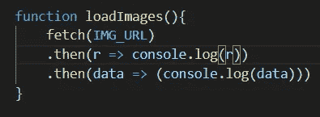
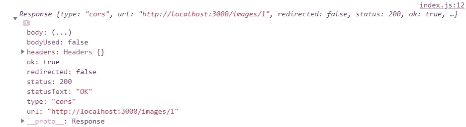
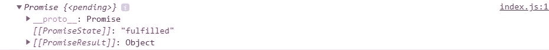
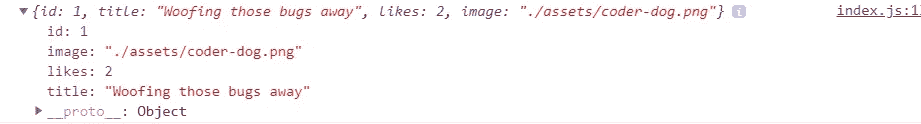
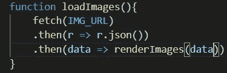
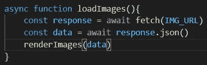

# Async/Await:简单的获取方式

> 原文：<https://javascript.plainenglish.io/async-await-the-easy-way-to-fetch-e490efd2e298?source=collection_archive---------5----------------------->

Photo by [Tudor Baciu](https://unsplash.com/@baciutudor?utm_source=medium&utm_medium=referral) on [Unsplash](https://unsplash.com?utm_source=medium&utm_medium=referral)

要理解 Async/Await，您首先必须理解承诺是什么以及它们是如何工作的:

> *JavaScript 是单线程的，意味着两个位的脚本不能同时运行；他们不得不一个接一个地跑。承诺是表示异步操作的最终完成(或失败)及其结果值的对象。—freecodecamp.org*

首先，把承诺想象成一个回调函数，它在 JavaScript 代码中异步运行。它不必等待其他代码，其他代码也不必等待它。它自己独立执行。它用于当你需要在后台做一些需要很长时间的事情，并且你想在事情完成后马上做一些事情，而不是让其他事情等待。

我认为最好从实际意义上解释承诺，而不是像大多数教程那样:

这里我们有一个函数，通过从一个赋给变量(IMG URL)的 URL 获取图像来“加载图像”。在“获取”这些图像后，它返回一个包含响应的承诺。棘手的部分是弄清楚`.then()`是如何工作的。

`.then()`还一个承诺。它需要两个参数:针对承诺成功和失败情况的回调函数。标记为`r`的变量是最初获取的响应，这是之前完成的承诺。

如下所示:

让我们把`console.log(r)`改成`console.log(r.json())`。如果刷新页面，您会在控制台中看到以下内容:

意识到上面写着“承诺{ <pending>}”。现在让我们从`console.log(r.json())`中移除`console.log`并再次刷新页面。我们实现了承诺，现在我们得到了一个我们标记为“数据”的对象</pending>

在这里，您可以实现一个回调函数，通过使用“data”作为参数来操纵数据:

现在我们已经对承诺和响应有所了解，让我们用 Async/Await 语法重构相同的代码块:

关键字`async`让 javaScript 知道函数应该异步运行。`await`关键字基本上是在说“等到下面的代码完成后再执行下一件事”。这和我们之前做的完全一样，只是增加了一点语法上的东西。在深入研究 Async/Await 之前，对`fetch`和`.then()`有一个基本的了解是很重要的。

希望这有所帮助。

*更多内容看*[***plain English . io***](http://plainenglish.io/)