# 15 分钟异步 JavaScript:全面解释

> 原文：<https://javascript.plainenglish.io/asynchronous-javascript-in-15-minutes-all-the-basics-you-need-to-know-including-callbacks-858eee42813b?source=collection_archive---------6----------------------->

## 您需要知道的所有基础知识，包括回调、承诺和异步/等待

当您第一次开始学习 JavaScript 时，您编写的第一个代码很可能是同步 JavaScript。然而，当您开始开发必须同时执行多个功能的应用程序时，您可能会希望使用一种叫做异步 JavaScript 的东西。


当开始编写必须在后端执行一些功能的 web 应用程序时，尤其如此，比如从服务器获取数据以呈现给用户。简而言之，异步 JavaScript 允许您执行可能花费不确定时间的功能，同时保持应用程序的其余部分运行。这样做的一个主要好处是，现在您可以在等待后端服务器响应的同时，保持应用程序的前端正常运行。如果您尝试使用同步 JavaScript，所有前端 UI(用户界面)将会冻结，直到您从后端服务器获得成功的响应。使用异步 js 的另一个主要好处是，它还允许您更顺利地处理失败的响应。这样，你不仅为用户提供了更流畅的体验，而且你在编写代码时也考虑到了失败。

谈到异步 JavaScript，有三种主要方法可以实现。这三种方式被臭名昭著地称为:

1.  复试
2.  承诺
3.  异步/等待

在本教程中，你会发现所有你需要知道的关于这三种方式的基础知识。这也是为什么我建议将这份完整的教程加入书签，供你将来参考。

如果您想通过成为中级会员来从这些教程中获得更多，以便无限制地访问所有基于文章的教程以及行业更新，您可以通过下面的链接成为中级会员。如果你通过下面的链接成为会员，一部分会员费也将支持像这样的教程，对你没有额外的费用。对于感兴趣的人，以下是成为中级会员的链接:

[](https://dogaozgon.medium.com/membership) [## 通过我的推荐链接加入媒体

### 作为一个媒体会员，你的会员费的一部分会给你阅读的作家，你可以完全接触到每一个故事…

dogaozgon.medium.com](https://dogaozgon.medium.com/membership) 

# 编码环境设置(可选)

如果您想通过自己输入本教程中的所有内容来获得额外的练习，您当然可以这样做。对于没有现成的 JavaScript 运行环境的人，可以使用 Codeply 进行练习。它本质上是一个在线编码环境，通常用于运行和共享 JavaScript 代码。为了方便起见，这里有一个 Codeply 的链接:

[](https://www.codeply.com/) [## 共铺

### 一个 HTML，CSS，JavaScript 编辑器平台，供设计者和开发者比较，原型化和测试前端框架

www.codeply.com](https://www.codeply.com/) 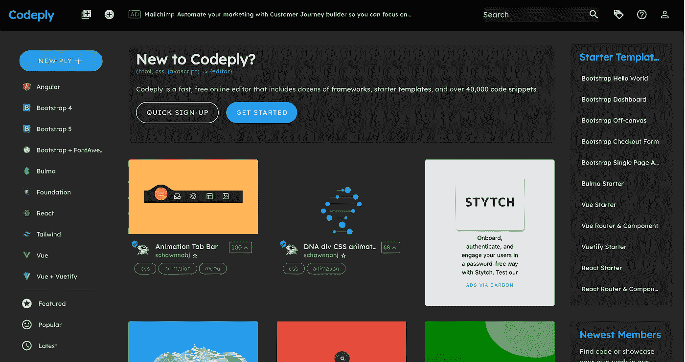

Screenshot by author.

一旦到了那里，您应该会看到这样的屏幕。你可以点击屏幕左上方的“NEW PLY +”，为 JavaScript 创建一个新的编码环境。注意，要开始编写和执行代码，您不需要登录或安装任何东西。这样，即使你正在通过手机学习本教程，你仍然可以练习本教程中的所有内容。

一旦你点击“新 PLY+”，它将为你打开一个新的编码环境。我们要做的第一件事是将视图从“水平”改为“垂直”。这样，我们将使所有的编码窗口在屏幕的左侧对齐。您可以点击屏幕左上方的以下图标，将视图更改为“垂直”。

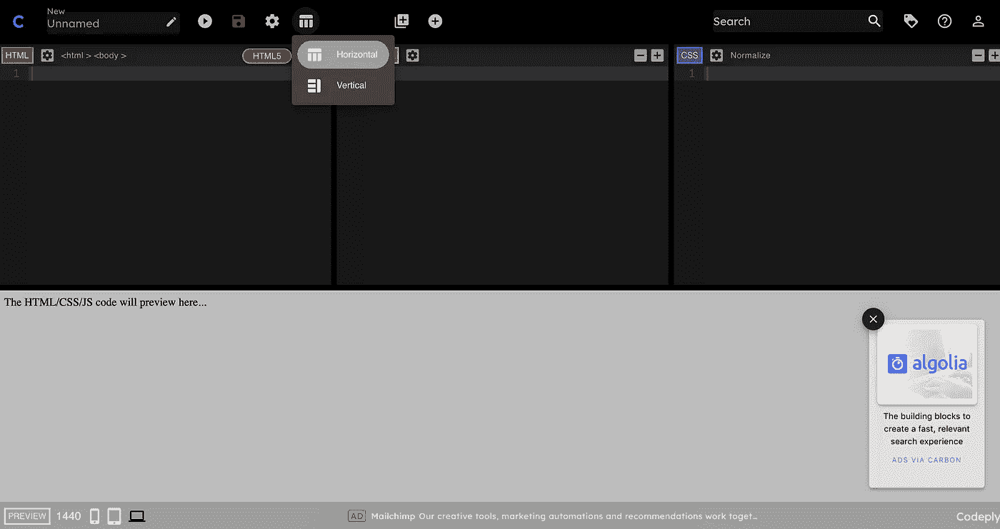

Screenshot by author.

单击后，您应该会看到这样的屏幕:

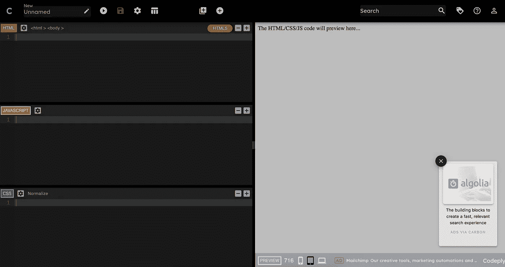

Screenshot by author.

接下来，我们将打开 JavaScript 控制台。如果你在 Mac 上，你可以使用快捷键“Command + Option + j”来打开 JavaScript 控制台。如果在 Windows 设备上，可以使用:“Control + Shift+ j”。或者，您也可以通过点击:查看->开发人员-> JavaScript 控制台来打开它。

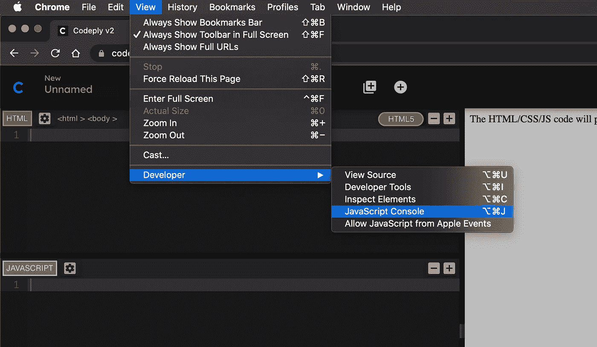

无论您选择哪种方式，您都应该打开 JavaScript 控制台。现在，您应该会看到类似这样的内容:

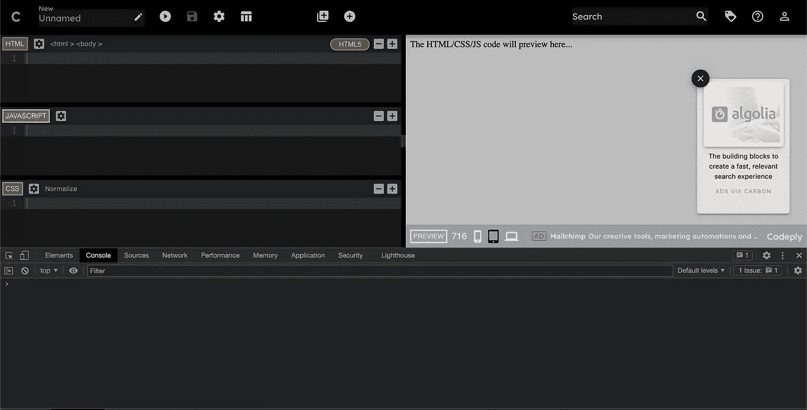

到目前为止，正如你已经注意到的，除了 JavaScript，我们还有 HTML 和 CSS 的代码编辑窗口。对于本教程，我们将只使用编辑器的 JavaScript 部分，所以我们可以安全地最小化其他两个以获得更大的屏幕空间。我们可以通过点击 HTML 和 CSS 窗口顶部的减号按钮来最小化它们，或者我们也可以通过按住并拖动它们来最小化它们。

现在，您应该会看到类似这样的内容:

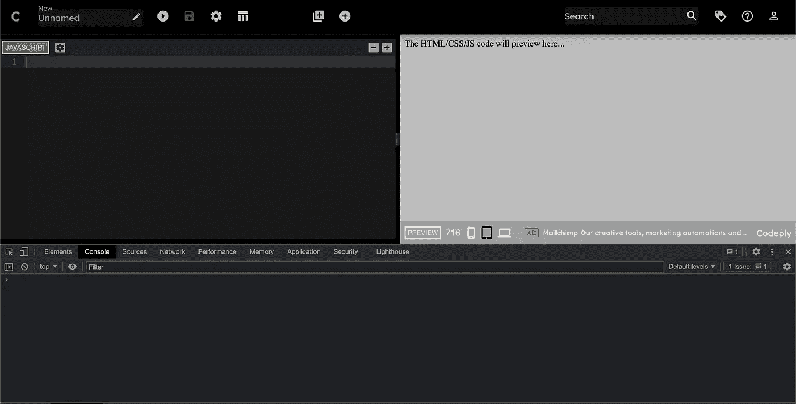

如果您之前没有设置任何代码，现在您已经设置好了！您可以使用教程中提供的步骤来编写完整的代码，并亲自查看结果。

如果您之前已经有了一个编码环境，那么也可以在所有实践中随意使用它。现在，事不宜迟，让我们从用 JavaScript 实现异步代码的第一种方法开始。

# 1.复试

## 同步回调

回调或回调函数是作为参数传递给其他函数的函数。这样我们就能以模块化的方式执行越来越复杂的任务。关于回调函数，您应该知道的第一件事是，它们可以用于执行同步和异步任务。同步任务像往常一样逐行执行。以下代码是回调函数的一个示例:

```
function greet() {
    console.log("Hi there!");
}function greetUser(callback){
    callback();
    console.log("Performing additional functionality...");
}greetUser();
```

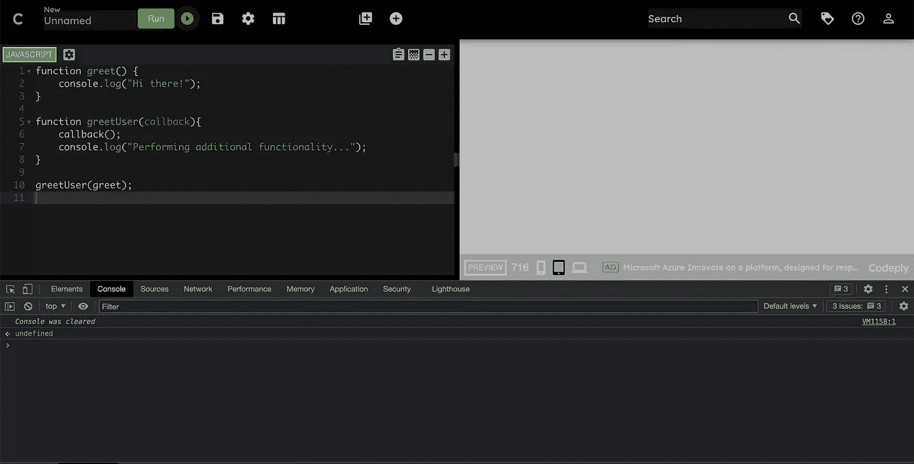

在上面的代码中，我们只是将 greet 函数作为参数传递给了 greetUser 函数。这里的回调功能让我们可以灵活地执行任何传递给它的函数，而无需明确确定哪个函数应该在 greetUser 函数中运行。除了运行回调函数，我们当然可以继续在我们的 greetUser 函数中执行其他功能。让我们点击屏幕左上角的播放按钮，运行我们的代码来获得结果。

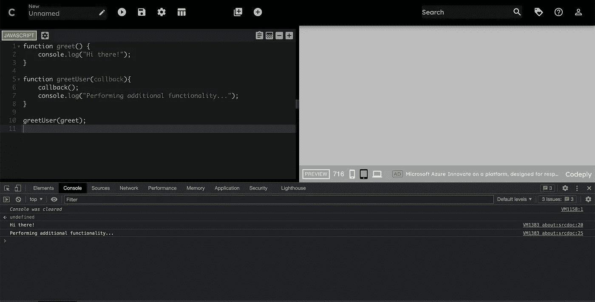

正如预期，我们首先看到回调函数的结果，控制台记录“嗨！”，然后我们可以看到在 greetUser 函数中其他功能的结果。我们只是以同步方式使用回调函数，但是回调函数也可以用于执行异步代码执行。

## 异步回调

JavaScript 中通常使用许多异步回调函数。使用它们的主要原因是当某个事件发生时执行异步任务。这样，我们可以根据事件运行代码。这可以是点击一个按钮，等待一段时间或一个时间间隔过去，向服务器发出一个获取请求并期待结果，这是 web 开发中异步任务的一些常见例子。最简单的例子可能是“setTimeout()”函数。让我们通过下面的一个例子来看看到底是怎么回事。

首先，如果我们要编写一堆 console.log 语句，预期的事情会发生，我们会得到所有的 console.log 语句，它们会按顺序执行，并打印到控制台上。让我们把下面的代码写到 JavaScript 编辑区，然后点击屏幕左上方的“播放”按钮来运行我们的代码。

```
console.log("First Line");
console.log("Second Line");
console.log("Third Line");
```

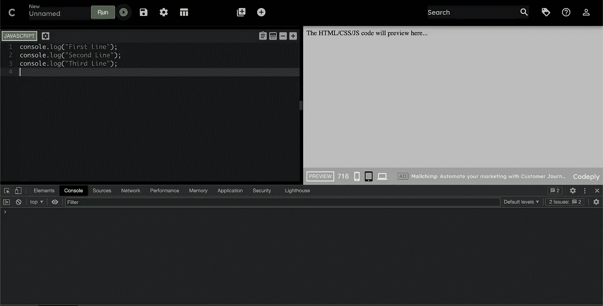

运行代码后，我们可以在 JavaScript 控制台区域看到打印的结果:

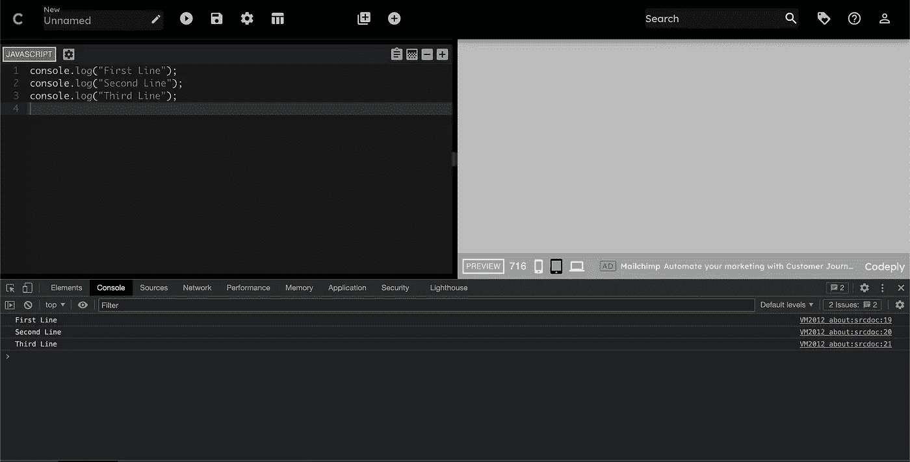

在这个例子中，我们的代码从上到下一行一行地被顺序执行。由于这是 JavaScript 中的默认行为，这里没有什么意外。

现在我们已经看到了 JavaScript 中的默认行为，让我们通过使用 setTimeout 函数来引入异步 JavaScript。我们可以通过以下代码来实现:

```
console.log("First Line");
setTimeout(()=>{console.log("Async Second Line")} ,2000);
console.log("Third Line");
```

这里的 setTimeout 函数，像许多其他异步回调函数一样，期望发生特定的事情，并且只在特定条件发生时执行给定的函数。在这种情况下，我们传递给 setTimeout 函数的函数将在 2000 毫秒(2 秒)后执行。这也是我们运行代码时出现以下情况的原因:

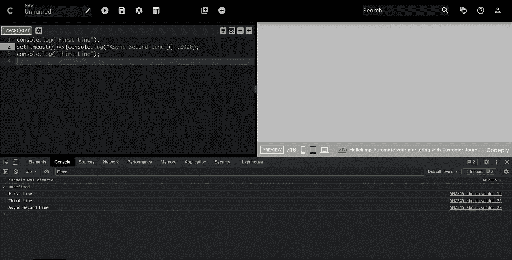

当我们的代码运行时，第一行被执行,“第一行”被写入控制台日志。当第二行被执行时，一个 2 秒的定时器被启动，我们传递给 setTimeout 函数的函数被等待执行，直到经过了预定的时间量(2 秒)。然而，与此同时，其余的代码将按照给定的顺序继续执行。这就是为什么，在启动定时器 2 秒钟后，第三行被读取并执行。这也是为什么我们几乎立即得到“第一行”和“第三行”的输出，但是“异步第二行”的输出在延迟 2 秒后才打印到控制台。

如果您不熟悉我们在使用 setTimeout 函数时使用的语法，我强烈推荐您查看“JavaScript 中的箭头函数”。箭头功能是 ES6 的一个特性，在野外经常使用。箭头函数本质上允许我们以最简单和最短的方式编写无名函数。有多种方法可以编写箭头函数，但它们通常采用以下格式:

```
(input) => {functionBody}
```

在我们使用的例子中，我们没有输入，所以最初的括号是空的，在花括号里面是我们写函数体的地方。因为我们只有一条语句，所以我们只在 arrow 函数体中编写了 console.log 语句。

在高层次上，我们首先提供一个函数作为 setTimeout 函数的第一个参数运行，并提供必须经过的毫秒数作为第二个参数。这样，我们使用回调函数实现了异步行为。接下来，我们将看到 JavaScript 中的承诺以及它们提供的主要优势。

# 2.承诺

JavaScript 中的承诺就像现实生活中的承诺一样。作出承诺时，主要意图是希望承诺能够成功实现，然而，所有的承诺都是从一种叫做**待定**的状态开始的。如果一个承诺被成功地“**”实现了**，它就被解析，相应的代码被执行。如果承诺的结果失败，我们定义一个代码来处理“**拒绝**”状态的场景。

承诺还允许您定义一组无论如何都要执行的功能。这最后一部分是可选的，在承诺结束时执行。现在让我们用一些真实的代码例子来看看承诺是怎么回事。

首先，我们可以清除 JavaScript 代码窗口来编写新代码，或者在新的 Codeply 中自由编写所有代码，将所有代码示例放在单独的选项卡中。

一旦你有了一个清晰的编码区域，让我们编写下面的代码:

```
// Create a promise
const somePromise = new Promise((resolve, reject)=>{
    const requestFulfilled = true;
    if (requestFulfilled){
        resolve("ExpectedValue");
    } else {
        reject("Something went wrong.");
    }
});// Consume a promise
somePromise.then((value)=>{
    console.log("Returned result successfully: " + value);
})
.catch((error)=>{
    console.log(error)

})
.finally(()=>{
    console.log("End of promise.");

})
```

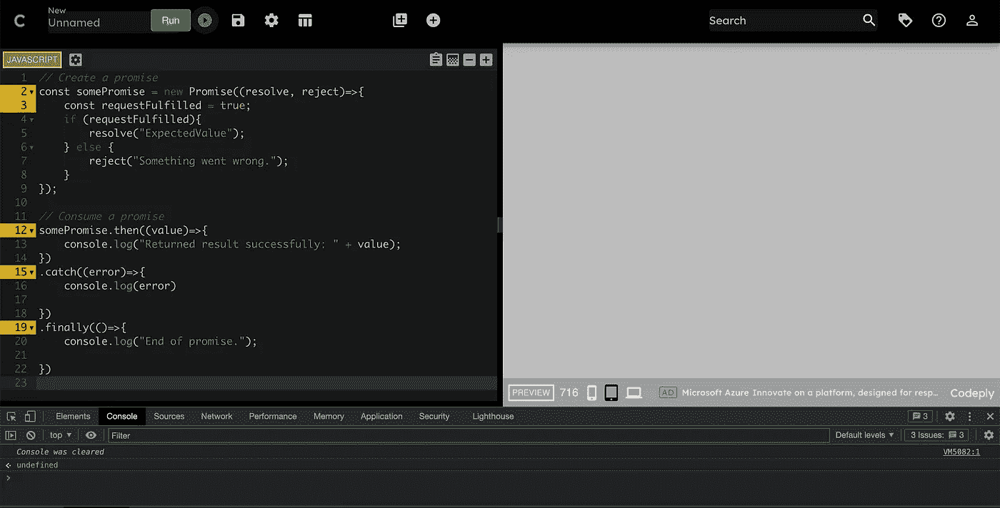

一开始可能看起来代码很多，但是让我们来分解一下。

有两种主要的承诺行为，创造一个承诺，和消费一个承诺。

在第一部分，我们创建一个承诺，在代码的第二部分，我们消费这个承诺。我们首先创建一个新的 promise 实例，并传递给它一个 arrow 函数，它将定义在这个 Promise 中会发生什么。我们主要关注两种情况。第一个是“解决”，第二个是“拒绝”。如果某个任务可以成功完成，那么我们将解析承诺并传递一个最终值。这个任务可以是我们期望发生的任何事情，例如从 web 服务器获取一些文件，等待用户上传图像以及本质上类似的事情。我们知道这些事情可能需要一点时间来完成，而且很有可能会失败，我们应该为此做好准备。在上面的代码示例中，我们用名为 requestFulfilled 的变量来表示这个条件。如果这种情况是真的，那么我们解析承诺并传递结果值。这个期望值实际上是我们请求的结果。然而，如果手头的任务失败了，我们将返回一条错误消息，说:“出错了。”。现在让我们来看看消费承诺的代码。

首先，我们得到承诺并加上”。然后()"到它的结尾。在那里面。然后()我们定义如果承诺成功，我们将采取的一系列行动。在本例中，我们在控制台记录“成功返回的结果”以及实际返回的结果。要查看这段代码的运行情况，让我们运行我们的代码。

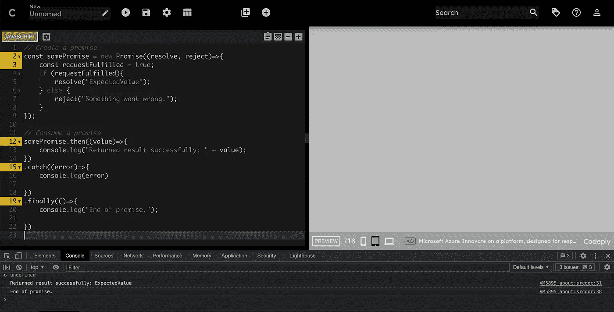

因为我们设置 requestFulfilled = true，所以。然后()方法被执行，我们得到了成功消息以及请求的期望值。还有另一个消息说“承诺的结束”，我们将在教程的后面谈到这一点。

为了检查另一个场景，让我们将 requestFulfilled 的值更改为“false”，并再次运行我们的代码。

```
// Create a promise
const somePromise = new Promise((resolve, reject)=>{
    const requestFulfilled = false;
    if (requestFulfilled){
        resolve("ExpectedValue");
    } else {
        reject("Something went wrong.");
    }
});// Consume a promise
somePromise.then((value)=>{
    console.log("Returned result successfully: " + value);
})
.catch((error)=>{
    console.log(error)

})
.finally(()=>{
    console.log("End of promise.");

})
```


在这种情况下，我们首先获得值“出错”，然后获得“承诺结束”。发生这种情况的原因是，因为我们的 requestFulfilled 被设置为 false，就好像我们的请求出错了一样，所以在承诺创建部分执行“else”块，并且将“reject”中的值传递给承诺消费者。为了“捕捉”错误，我们附加了一个“.catch()"块到的末尾"。then()"方法。因此，如果请求失败，而不是执行。然后()，我们将使用. catch()捕获错误，现在我们可以处理错误了。在这种情况下，我们在控制台记录错误消息，内容是:“出错了。”。

这一部分是可选的，但是如果我们想在任一情况下执行某个操作，我们可以使用一个"。最后()“法末我们的诺言。无论请求是完成还是失败，我们在这里提供的代码都会被执行。在上面的代码示例中，我们简单地在控制台记录一条消息，上面写着“承诺结束”。

根据我们的需要，我们可能需要在请求结束时执行多个操作。在这种情况下，我们可以附加多个”。然后()"块到每个块的末尾，就像我们在上面的代码中附加到我们的承诺一样，看起来像这样:

```
somePromise.then().then().then().catch().finally()
```

ES2015 或所谓的 ES6 向 JavaScript 引入了承诺，以更好地处理异步功能，但在几次迭代中，ES2017 引入了另一种处理异步功能的方法，以更好地处理 JavaScript 中的异步功能。这种新方式通常被称为:“异步/等待”。这已经被社区广泛采用，并且已经成为许多开发人员处理异步 JavaScript 的方法。说了这么多，让我们看看 Async/Await 是怎么回事。

# 3.异步/等待

目前，async/await 提供了 JavaScript 中处理异步功能的最清晰、最简洁的方式。了解其他类型真的很有帮助，它会让你成为一个更好的开发人员，知道该语言中可用的工具，以防你需要根据条件实现它们(例如，如果由于某种原因 ES2017 在你的环境中不可用，那么你只能使用回调或承诺)。了解 async /await 上的其他类型也可以帮助您更新一些遗留代码，并可能将它们转换为 async /await 以便于阅读。

使用 async/await，每当我们想要执行一些异步功能时，我们就在函数定义的开头添加关键字“async”。对于我们希望等待答案的每个任务，我们在函数的开头添加“await”关键字。让我们通过一些代码示例来看看。

```
function firstTask(){
    console.log("First task successfully complete.");
}function secondTask(){
    console.log("Second task successfully complete.");
}async function performAsyncFunctions(){
    const firstRequest = await firstTask();
    const secondRequest = await secondTask();
    console.log("All tasks complete.");
}performAsyncFunctions();
```

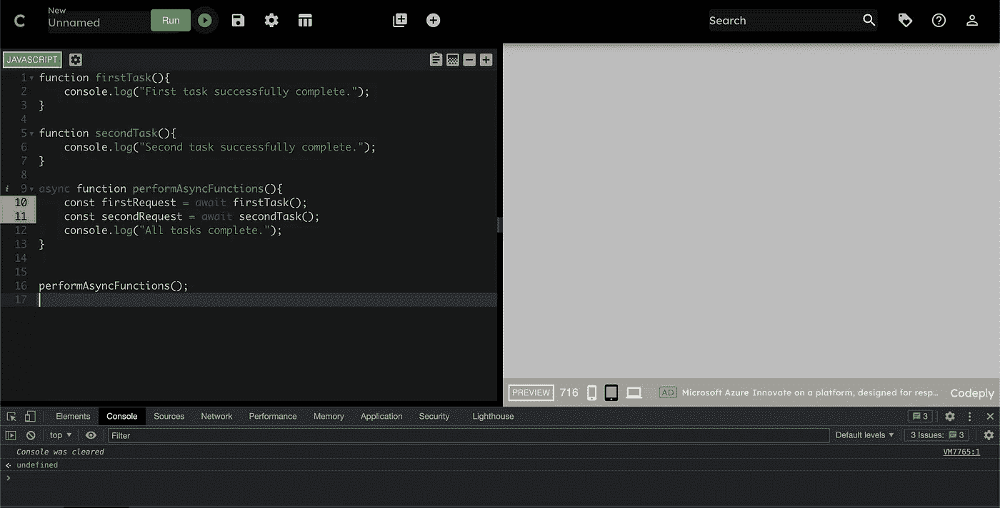

要了解 async/await 的强大功能，定义多个必须执行的异步函数会有所帮助。在这个例子中，我们称它们为 firstTask 和 secondTask。这些任务可以是我们可以执行的任何异步任务，例如从用户或 web 服务器获取数据，或者任何其他可能需要我们等待一段未知时间的任务。就在 function 关键字之前，我们向处理这些任务的主函数添加了“async”关键字，对于每个函数调用，我们在调用它们之前添加了“await”关键字。现在让我们运行这段代码来看看它的运行情况。

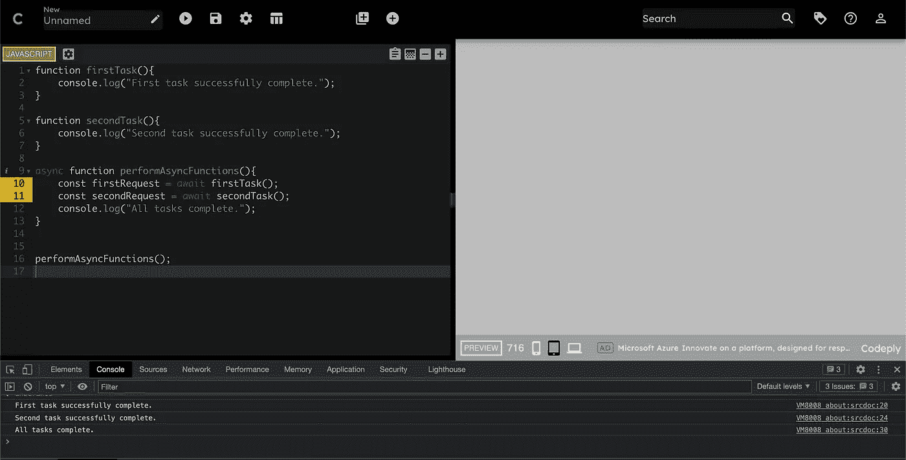

正如您在控制台日志中看到的，我们确实按照预期的顺序执行了所有可能的异步任务。在这些结束时，我们还能够控制台日志“所有任务完成”。这样，即使单个功能可能花费未知的时间，我们仍然可以异步执行它们，而不会阻塞其他进程，例如网站中的功能 UI。

Async /await 可以做任何承诺可以做的事情，但是更干净，整体上更优雅，这也是为什么 async/await 是许多开发人员处理 async JavaScript 功能的首选方式。

在本文中，您已经看到了 JavaScript 中处理异步功能的 3 种方式，以及可用的代码示例。我希望你能从这个实践教程中获得一些价值。如果你想要更多这样的教程，你可以在这里关注我。如果你想在这里获得我所有的教程，你可以成为中级会员。如果你通过下面的链接成为会员，一部分会员费也将支持像这样的教程，对你没有额外的费用。对于感兴趣的人，以下是成为中级会员的链接:

[](https://dogaozgon.medium.com/membership) [## 通过我的推荐链接加入媒体

### 作为一个媒体会员，你的会员费的一部分会给你阅读的作家，你可以完全接触到每一个故事…

dogaozgon.medium.com](https://dogaozgon.medium.com/membership) 

如果你对本教程有任何问题，请随时联系我们，或者在这里留言，我会尽快给你答复。带着这样的希望，你从这篇文章中获得了一些价值，我们将在下一篇文章中再见。如果你通过观看学得更好，顺便说一句，你也可以在 YouTube 上找到这个视频格式的教程:

*更多内容看* [*说白了. io*](http://plainenglish.io/) *。报名参加我们的* [*免费每周简讯*](http://newsletter.plainenglish.io/) *。在我们的* [*社区*](https://discord.gg/GtDtUAvyhW) *获得独家写作机会和建议。*